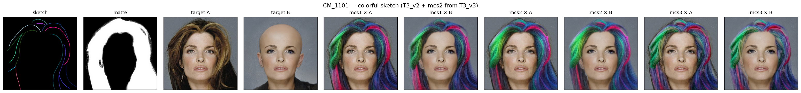
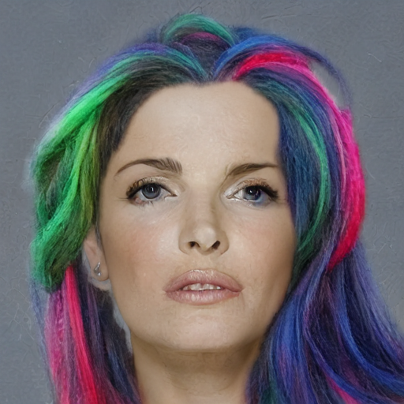
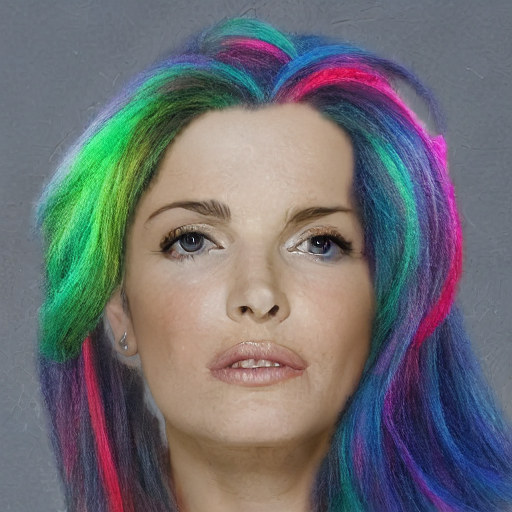
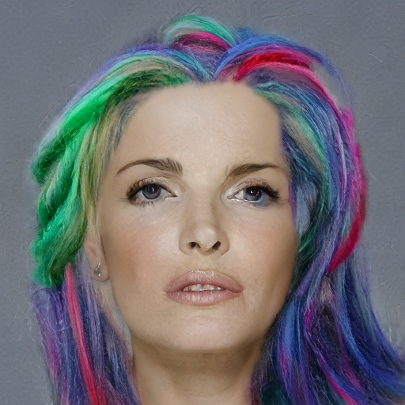
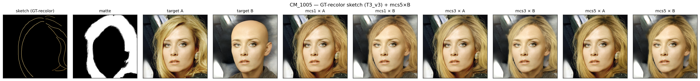

# T3 테스트

원래 의도는 GT 컬러까지 그대로
matte 는 머리카락 전체 덮음 (가급적 머리 전체 덮는 스케치 사용)
즉 대상 이미지 재선정 필수
정량 테스트 LPIPS · region IoU 필수 (matte 영역)

> **측정 정의**
> - **LPIPS(A, B)** = `LPIPS(pred_A, pred_B)`, matte 영역 alpha-composite 후 비교 → 외형 누설 의존도 직접 지표 (작을수록 A↔B 출력이 유사 = 누설 영향 적음)
> - **region IoU (B, matte 영역)** = `|pred_hair ∩ matte| / |pred_hair ∪ matte|`, pred_hair = pred_B 와 face_B 간 Lab ΔE > 10 (BLD pixel-diff 기반)

---

## CM_1101 이미지에 대해 colorful sketch 로 mcs2 결과

*각 셀: sketch / matte / GT(face_A) / mcs1 × A / mcs1 × B / mcs2 × A / mcs2 × B / mcs3 × A / mcs3 × B*

| 모델 | LPIPS(A, B) ↓ | region IoU (B) ↑ |
|------|:---:|:---:|
| mcs1 (Ours)         | 0.0677 | 0.8988 |
| **mcs2 (Ours+Gate)** | **0.0652** | **0.9071** |
| mcs3 (Sketch-only)  | 0.0704 | 0.8567 |

#### CM_1101

| Ours × A | Ours × B | Ours+Gate × A | Ours+Gate × B | Sketch-only × A | Sketch-only × B |
|:---:|:---:|:---:|:---:|:---:|:---:|
|  |  |  |  |  |  |

---

## matte control 이 제대로 먹고 있는가에 대한 근본적인 질문
matte control 이 제대로 먹고 있는가를 설명하기 위한 실험 + GT image로 재실험
**CM_1005 이미지에 대해 동일 matte 로 결과 (GT-recolor sketch)**

*각 셀: sketch / matte / GT(face_A) / mcs1 × A / mcs1 × B / mcs3 × A / mcs3 × B / mcs5 × A / mcs5 × B*

| 모델 | LPIPS(A, B) ↓ | region IoU (B) ↑ |
|------|:---:|:---:|
| **mcs1 (Ours)**     | **0.0761** | 0.8294 |
| mcs3 (Sketch-only)  | 0.0856 | 0.8048 |
| **mcs5 (Raw-only)** | 0.0784 | **0.8516** |

#### CM_1005

| Ours × A | Ours × B | Sketch-only × A | Sketch-only × B | Raw-only × A | Raw-only × B |
|:---:|:---:|:---:|:---:|:---:|:---:|
|  |  |  |  |  |  |
