# T3 테스트

원래 의도는 GT 컬러까지 그대로
matte 는 머리카락 전체 덮음 (가급적 머리 전체 덮는 스케치 사용)
즉 대상 이미지 재선정 필수
정량 테스트 LPIPS · region IoU 필수 (matte 영역)

> **측정 정의**
> - **LPIPS(A, B)** = `LPIPS(pred_A, pred_B)`, matte 영역 alpha-composite 후 비교 → 외형 누설 의존도 직접 지표 (작을수록 A↔B 출력이 유사 = 누설 영향 적음)
> - **region IoU (B, matte 영역)** = `|pred_hair ∩ matte| / |pred_hair ∪ matte|`, pred_hair = pred_B 와 face_B 간 Lab ΔE > 10 (BLD pixel-diff 기반)

## 모델 정의 (mcs1 ~ mcs6 전체)

| 명칭 | 내부 코드 | MatteCNN | matte_raw | gate | ControlNet 입력 (17ch) |
|------|-----------|:---:|:---:|:---:|---|
| **Ours**              | mcs1 | ✅ ON  | ✅ ON  | ❌ OFF | `cat([sketch_lat + MatteCNN_feat, matte_raw])` |
| **Ours+Gate**         | mcs2 | ✅ ON  | ✅ ON  | ✅ ON  | mcs1 + gate (all blocks) |
| **Sketch-only**       | mcs3 | ❌ OFF | ❌ OFF | ❌ OFF | `cat([sketch_lat + zeros, zeros])` — floor |
| **Sketch-only+Gate**  | mcs4 | ❌ OFF | ❌ OFF | ✅ ON  | mcs3 + gate (all blocks) |
| **Raw-only**          | mcs5 | ❌ OFF | ✅ ON  | ❌ OFF | `cat([sketch_lat + zeros, matte_raw])` |
| **Matte-CNN-only**    | mcs6 | ✅ ON  | ❌ OFF | ❌ OFF | `cat([sketch_lat + MatteCNN_feat, zeros])` |

---

## CM_1101 이미지에 대해 colorful sketch 로 mcs2 결과

*각 셀: sketch / matte / target A / target B / mcs1 × A / mcs1 × B / mcs2 × A / mcs2 × B / mcs3 × A / mcs3 × B*

| 모델 | LPIPS(A, B) ↓ | region IoU (B) ↑ |
|------|:---:|:---:|
| mcs1 (Ours)         | 0.0677 | 0.8988 |
| **mcs2 (Ours+Gate)** | **0.0652** | **0.9071** |
| mcs3 (Sketch-only)  | 0.0704 | 0.8567 |

### CM_1101

| mcs1 × A | mcs1 × B | mcs2 × A | mcs2 × B | mcs3 × A | mcs3 × B |
|:---:|:---:|:---:|:---:|:---:|:---:|
|  |  |  |  |  |  |

---

## matte control 이 제대로 먹고 있는가에 대한 근본적인 질문
matte control 이 제대로 먹고 있는가를 설명하기 위한 실험 + GT image로 재실험
**CM_1005 이미지에 대해 동일 matte 로 결과 (GT-recolor sketch)**

*각 셀: sketch / matte / target A / target B / mcs1 × A / mcs1 × B / mcs3 × A / mcs3 × B / mcs5 × A / mcs5 × B*

| 모델 | LPIPS(A, B) ↓ | region IoU (B) ↑ |
|------|:---:|:---:|
| **mcs1 (Ours)**     | **0.0761** | 0.8294 |
| mcs3 (Sketch-only)  | 0.0856 | 0.8048 |
| **mcs5 (Raw-only)** | 0.0784 | **0.8516** |

### CM_1005

| mcs1 × A | mcs1 × B | mcs3 × A | mcs3 × B | mcs5 × A | mcs5 × B |
|:---:|:---:|:---:|:---:|:---:|:---:|
|  |  |  |  |  |  |

---

## T3 재실행 — 8 stems × GT-recolor sketch + 재선정 매트 풍성 이미지 (T3_v4, mcs 1~6 전체)

대상: CM_1005, CM_1033, CM_1067, CM_1068, CM_1077, CM_1082, CM_1101, CM_1106 (총 8장)
SHS 데이터에서 matte coverage 풍성 + portrait 깔끔 + B 품질 양호 기준으로 재선정.

### 종합 측정 — 모델별 평균 (8 stems)

| 모델 | LPIPS(A,B) ↓ | region IoU(B) ↑ |
|------|:---:|:---:|
| mcs1 (Ours)              | 0.0648 | 0.8872 |
| **mcs2 (Ours+Gate)**     | 0.0653 | **0.8943** |
| mcs3 (Sketch-only)       | 0.0668 | 0.8573 |
| mcs4 (Sketch-only+Gate)  | **0.0646** | 0.8774 |
| mcs5 (Raw-only)          | **0.0644** | 0.8852 |
| mcs6 (Matte-CNN-only)    | 0.0660 | 0.8900 |

방향성:
- region IoU 순위: **mcs2 (0.894) > mcs6 (0.890) > mcs1 (0.887) > mcs5 (0.885) > mcs4 (0.877) > mcs3 (0.857)**
- matte 활용 4구성 (mcs1/mcs2/mcs5/mcs6) 모두 0.885+ ≫ Sketch-only(mcs3, 0.857) — design.md 예측 확인
- **Gate 효과 명확**: mcs2 > mcs1, mcs4 > mcs3 — 양쪽 모두 +0.005~0.020 향상
- LPIPS(A,B)는 모든 모델 0.064~0.067 범위 — 외형 누설 의존도 격차 미미

### Overview

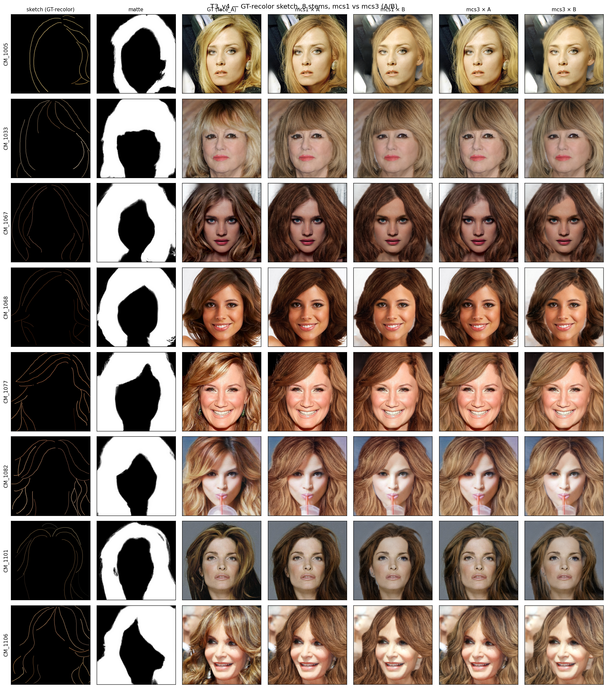

*각 행: 8 stems · 각 열: sketch / matte / target A / target B / mcs1×A / mcs1×B / mcs2×A / mcs2×B / mcs3×A / mcs3×B / mcs4×A / mcs4×B / mcs5×A / mcs5×B / mcs6×A / mcs6×B (mcs 1~6 모두)*

---

#### CM_1005

| mcs1 × A | mcs1 × B | mcs2 × A | mcs2 × B | mcs3 × A | mcs3 × B | mcs4 × A | mcs4 × B | mcs5 × A | mcs5 × B | mcs6 × A | mcs6 × B |
|:---:|:---:|:---:|:---:|:---:|:---:|:---:|:---:|:---:|:---:|:---:|:---:|
| 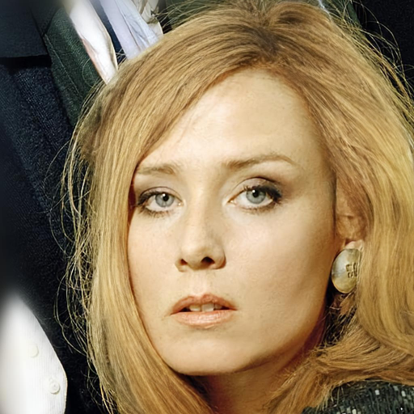 | 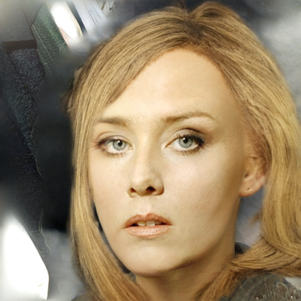 |  | 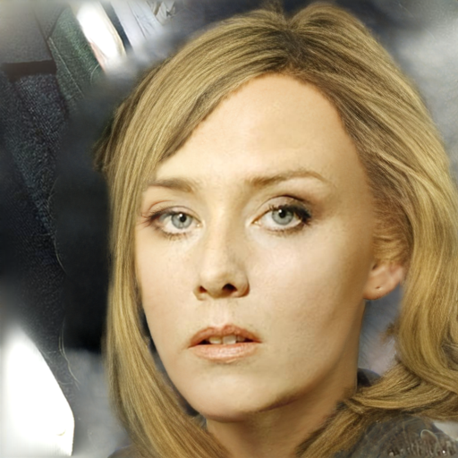 | 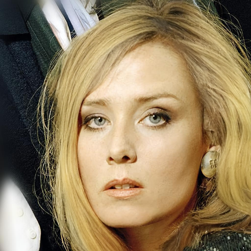 | 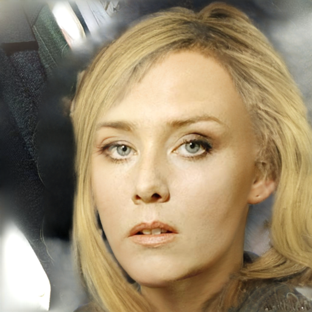 |  | 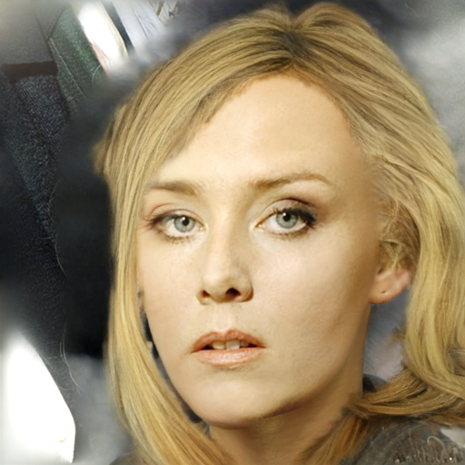 |  | 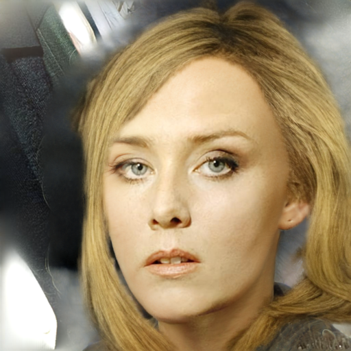 | 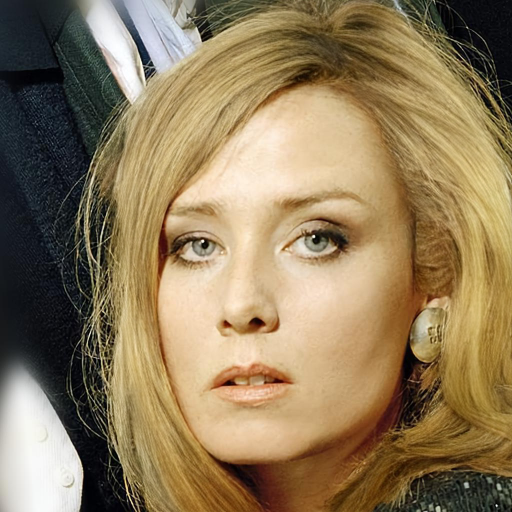 | 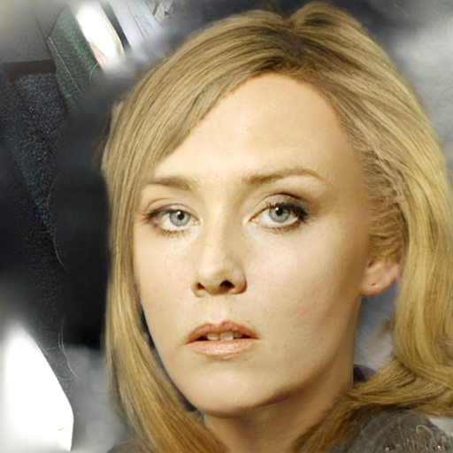 |

| 모델 | LPIPS(A, B) ↓ | region IoU (B) ↑ |
|------|:---:|:---:|
| mcs1 (Ours)             | **0.0761** | 0.8294 |
| mcs2 (Ours+Gate)        | 0.0796 | **0.8568** |
| mcs3 (Sketch-only)      | 0.0856 | 0.8048 |
| mcs4 (Sketch-only+Gate) | 0.0796 | 0.8381 |
| mcs5 (Raw-only)         | 0.0784 | 0.8516 |
| mcs6 (Matte-CNN-only)   | 0.0807 | 0.8378 |

#### CM_1033

| mcs1 × A | mcs1 × B | mcs2 × A | mcs2 × B | mcs3 × A | mcs3 × B | mcs4 × A | mcs4 × B | mcs5 × A | mcs5 × B | mcs6 × A | mcs6 × B |
|:---:|:---:|:---:|:---:|:---:|:---:|:---:|:---:|:---:|:---:|:---:|:---:|
|  |  | 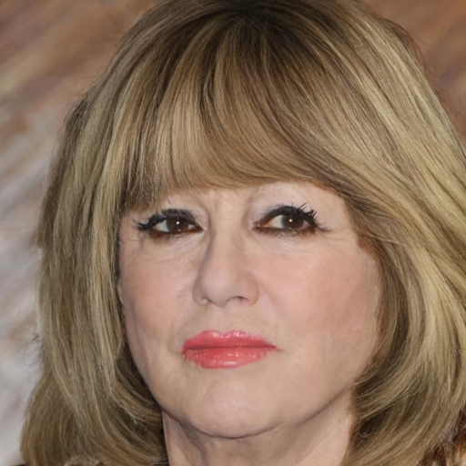 |  |  |  |  |  |  |  | 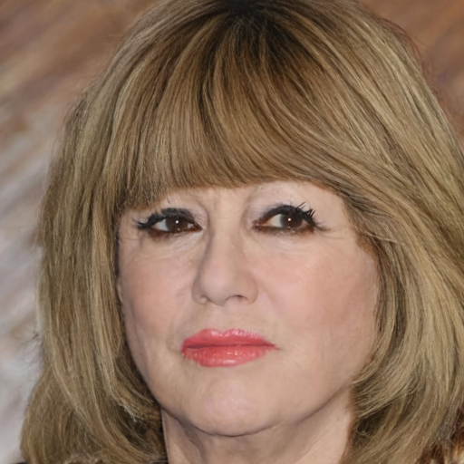 |  |

| 모델 | LPIPS(A, B) ↓ | region IoU (B) ↑ |
|------|:---:|:---:|
| mcs1 (Ours)             | 0.0277 | 0.7785 |
| mcs2 (Ours+Gate)        | 0.0277 | **0.8113** |
| mcs3 (Sketch-only)      | 0.0313 | 0.7660 |
| mcs4 (Sketch-only+Gate) | **0.0267** | 0.7779 |
| mcs5 (Raw-only)         | 0.0279 | 0.7811 |
| mcs6 (Matte-CNN-only)   | 0.0291 | 0.7896 |

#### CM_1067

| mcs1 × A | mcs1 × B | mcs2 × A | mcs2 × B | mcs3 × A | mcs3 × B | mcs4 × A | mcs4 × B | mcs5 × A | mcs5 × B | mcs6 × A | mcs6 × B |
|:---:|:---:|:---:|:---:|:---:|:---:|:---:|:---:|:---:|:---:|:---:|:---:|
|  | 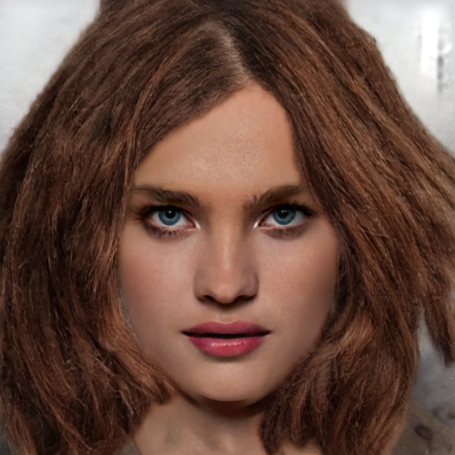 |  | 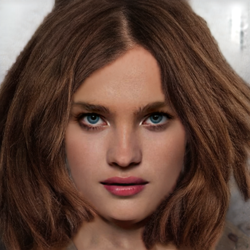 |  | 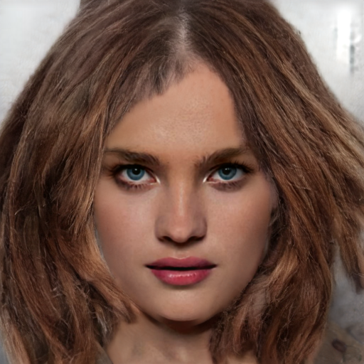 |  | 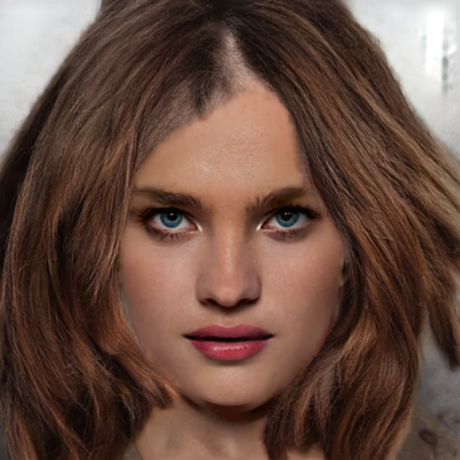 |  | 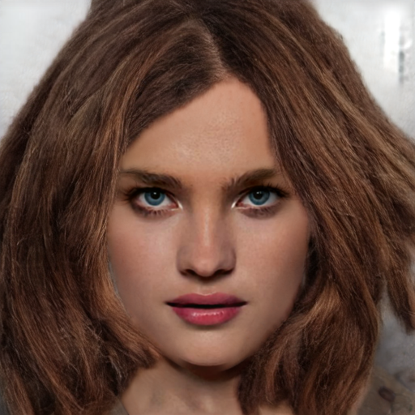 |  | 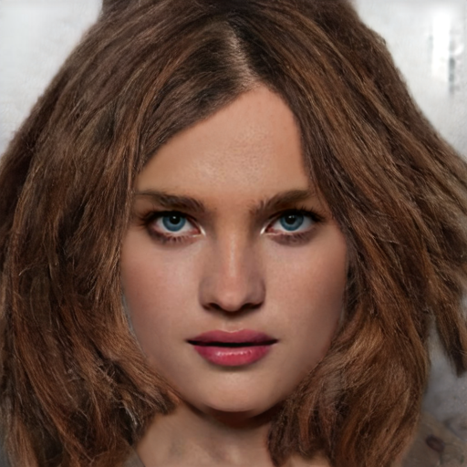 |

| 모델 | LPIPS(A, B) ↓ | region IoU (B) ↑ |
|------|:---:|:---:|
| mcs1 (Ours)             | 0.0727 | 0.9208 |
| mcs2 (Ours+Gate)        | 0.0744 | **0.9308** |
| mcs3 (Sketch-only)      | 0.0773 | 0.8945 |
| mcs4 (Sketch-only+Gate) | 0.0725 | 0.9088 |
| mcs5 (Raw-only)         | **0.0702** | 0.9157 |
| mcs6 (Matte-CNN-only)   | 0.0745 | 0.9178 |

#### CM_1068

| mcs1 × A | mcs1 × B | mcs2 × A | mcs2 × B | mcs3 × A | mcs3 × B | mcs4 × A | mcs4 × B | mcs5 × A | mcs5 × B | mcs6 × A | mcs6 × B |
|:---:|:---:|:---:|:---:|:---:|:---:|:---:|:---:|:---:|:---:|:---:|:---:|
|  |  |  |  |  | 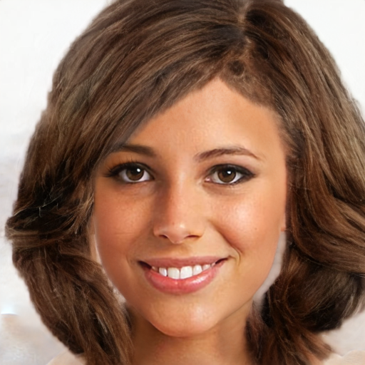 |  | 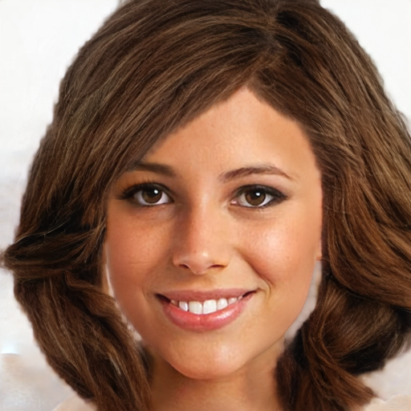 |  |  |  |  |

| 모델 | LPIPS(A, B) ↓ | region IoU (B) ↑ |
|------|:---:|:---:|
| mcs1 (Ours)             | 0.1017 | 0.9417 |
| mcs2 (Ours+Gate)        | 0.1028 | **0.9439** |
| mcs3 (Sketch-only)      | **0.0980** | 0.9292 |
| mcs4 (Sketch-only+Gate) | 0.0992 | 0.9363 |
| mcs5 (Raw-only)         | 0.0989 | 0.9404 |
| mcs6 (Matte-CNN-only)   | 0.1033 | 0.9378 |

#### CM_1077

| mcs1 × A | mcs1 × B | mcs2 × A | mcs2 × B | mcs3 × A | mcs3 × B | mcs4 × A | mcs4 × B | mcs5 × A | mcs5 × B | mcs6 × A | mcs6 × B |
|:---:|:---:|:---:|:---:|:---:|:---:|:---:|:---:|:---:|:---:|:---:|:---:|
|  | 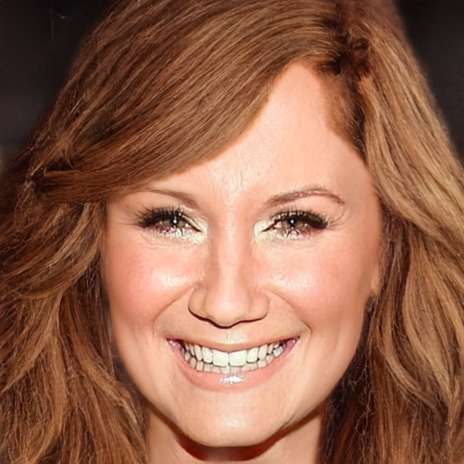 | 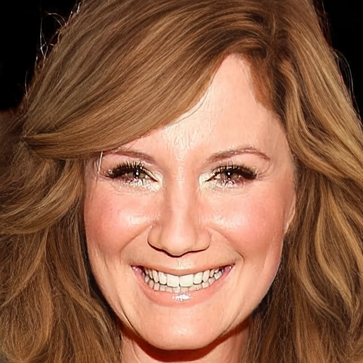 | 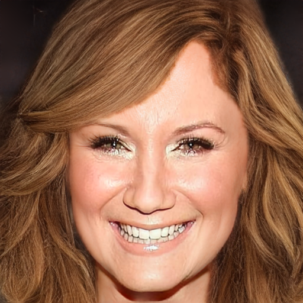 |  | 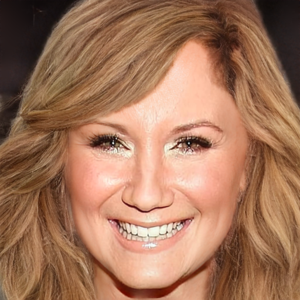 |  | 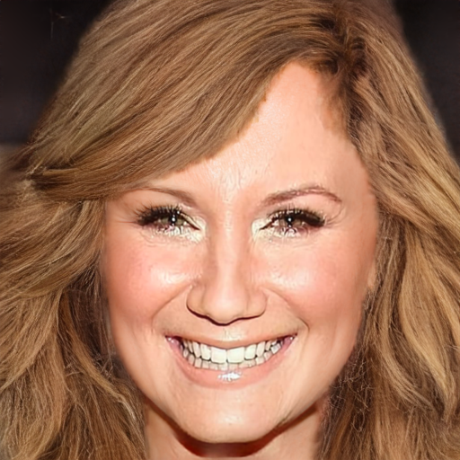 |  | 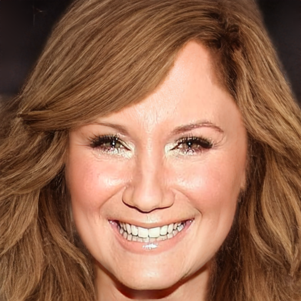 | 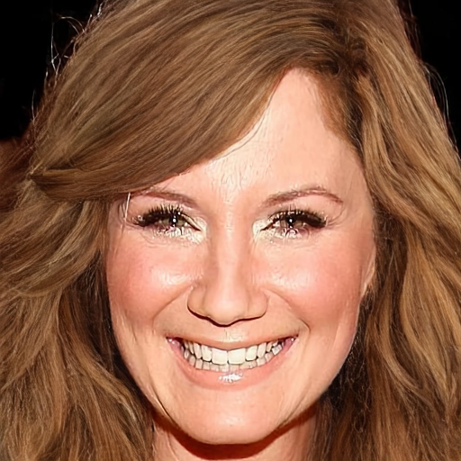 | 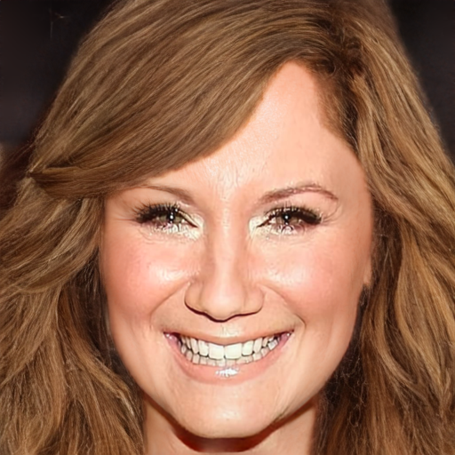 |

| 모델 | LPIPS(A, B) ↓ | region IoU (B) ↑ |
|------|:---:|:---:|
| mcs1 (Ours)             | 0.0528 | 0.9280 |
| mcs2 (Ours+Gate)        | 0.0522 | 0.9186 |
| mcs3 (Sketch-only)      | 0.0582 | 0.8956 |
| mcs4 (Sketch-only+Gate) | 0.0527 | 0.9189 |
| mcs5 (Raw-only)         | **0.0504** | **0.9328** |
| mcs6 (Matte-CNN-only)   | 0.0533 | 0.9322 |

#### CM_1082

| mcs1 × A | mcs1 × B | mcs2 × A | mcs2 × B | mcs3 × A | mcs3 × B | mcs4 × A | mcs4 × B | mcs5 × A | mcs5 × B | mcs6 × A | mcs6 × B |
|:---:|:---:|:---:|:---:|:---:|:---:|:---:|:---:|:---:|:---:|:---:|:---:|
|  | 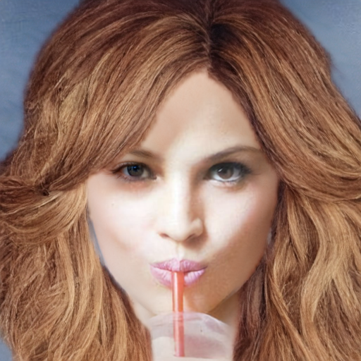 |  | 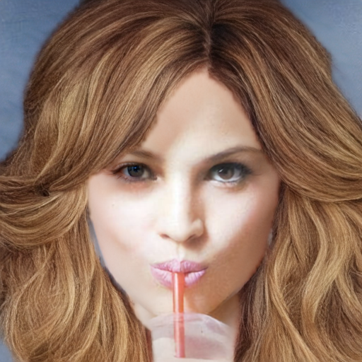 |  | 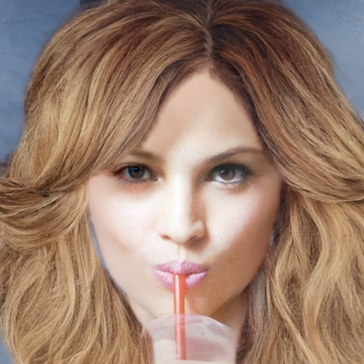 |  | 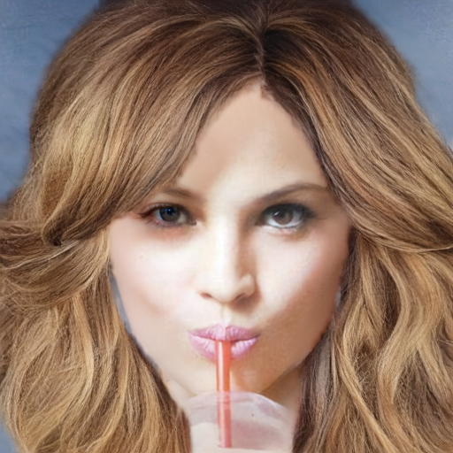 |  | 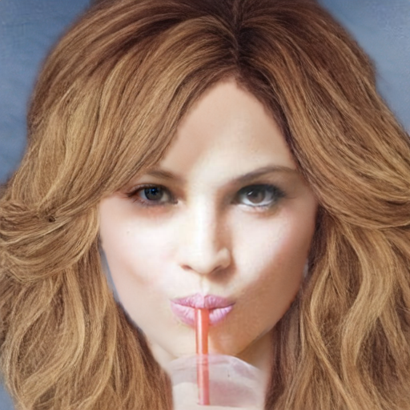 |  | 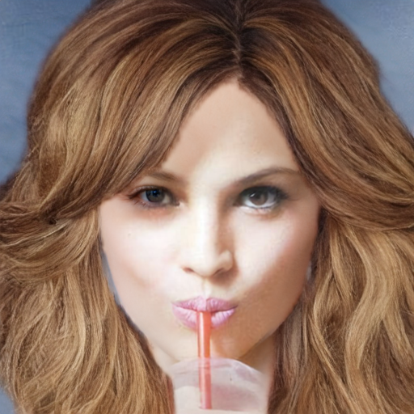 |

| 모델 | LPIPS(A, B) ↓ | region IoU (B) ↑ |
|------|:---:|:---:|
| mcs1 (Ours)             | 0.0394 | 0.9375 |
| mcs2 (Ours+Gate)        | **0.0391** | **0.9421** |
| mcs3 (Sketch-only)      | 0.0429 | 0.9235 |
| mcs4 (Sketch-only+Gate) | 0.0415 | 0.9271 |
| mcs5 (Raw-only)         | 0.0400 | 0.9337 |
| mcs6 (Matte-CNN-only)   | 0.0408 | 0.9379 |

#### CM_1101

| mcs1 × A | mcs1 × B | mcs2 × A | mcs2 × B | mcs3 × A | mcs3 × B | mcs4 × A | mcs4 × B | mcs5 × A | mcs5 × B | mcs6 × A | mcs6 × B |
|:---:|:---:|:---:|:---:|:---:|:---:|:---:|:---:|:---:|:---:|:---:|:---:|
|  | 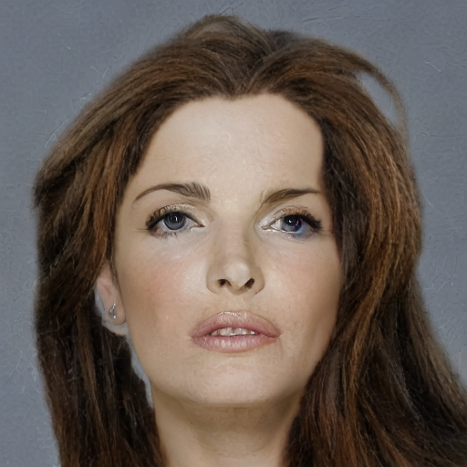 |  | 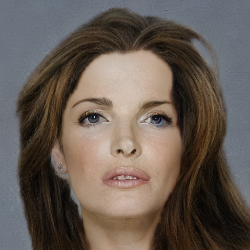 |  | 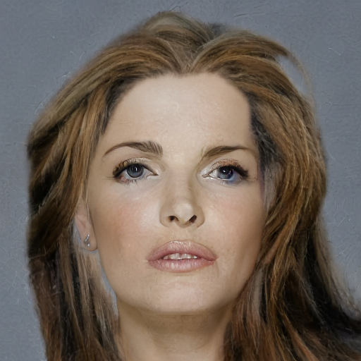 |  | 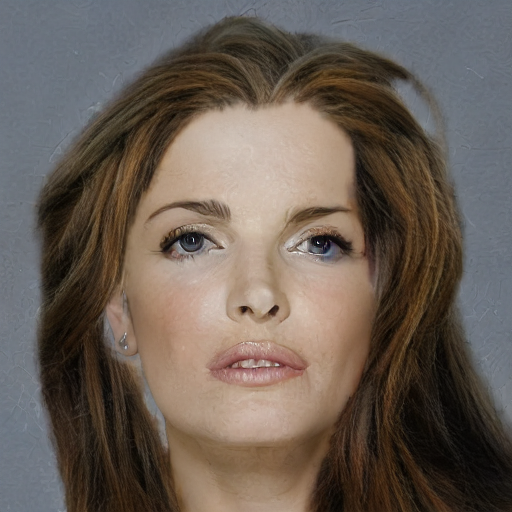 |  | 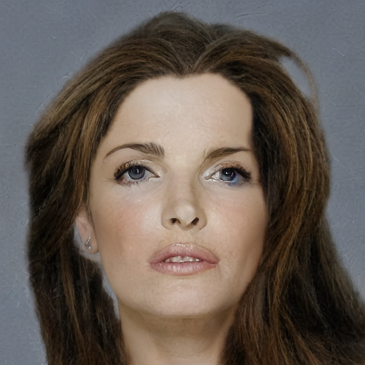 |  | 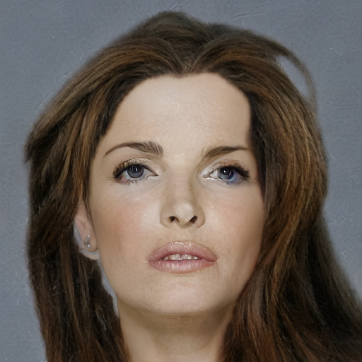 |

| 모델 | LPIPS(A, B) ↓ | region IoU (B) ↑ |
|------|:---:|:---:|
| mcs1 (Ours)             | 0.0967 | **0.8699** |
| mcs2 (Ours+Gate)        | 0.0933 | 0.8695 |
| mcs3 (Sketch-only)      | **0.0839** | 0.8348 |
| mcs4 (Sketch-only+Gate) | 0.0920 | 0.8575 |
| mcs5 (Raw-only)         | 0.0991 | 0.8672 |
| mcs6 (Matte-CNN-only)   | 0.0950 | 0.8691 |

#### CM_1106

| mcs1 × A | mcs1 × B | mcs2 × A | mcs2 × B | mcs3 × A | mcs3 × B | mcs4 × A | mcs4 × B | mcs5 × A | mcs5 × B | mcs6 × A | mcs6 × B |
|:---:|:---:|:---:|:---:|:---:|:---:|:---:|:---:|:---:|:---:|:---:|:---:|
|  |  |  |  |  |  |  |  |  |  |  |  |

| 모델 | LPIPS(A, B) ↓ | region IoU (B) ↑ |
|------|:---:|:---:|
| mcs1 (Ours)             | 0.0511 | 0.8917 |
| mcs2 (Ours+Gate)        | 0.0532 | 0.8816 |
| mcs3 (Sketch-only)      | 0.0568 | 0.8098 |
| mcs4 (Sketch-only+Gate) | 0.0526 | 0.8544 |
| mcs5 (Raw-only)         | **0.0503** | 0.8593 |
| mcs6 (Matte-CNN-only)   | 0.0511 | **0.8975** |
