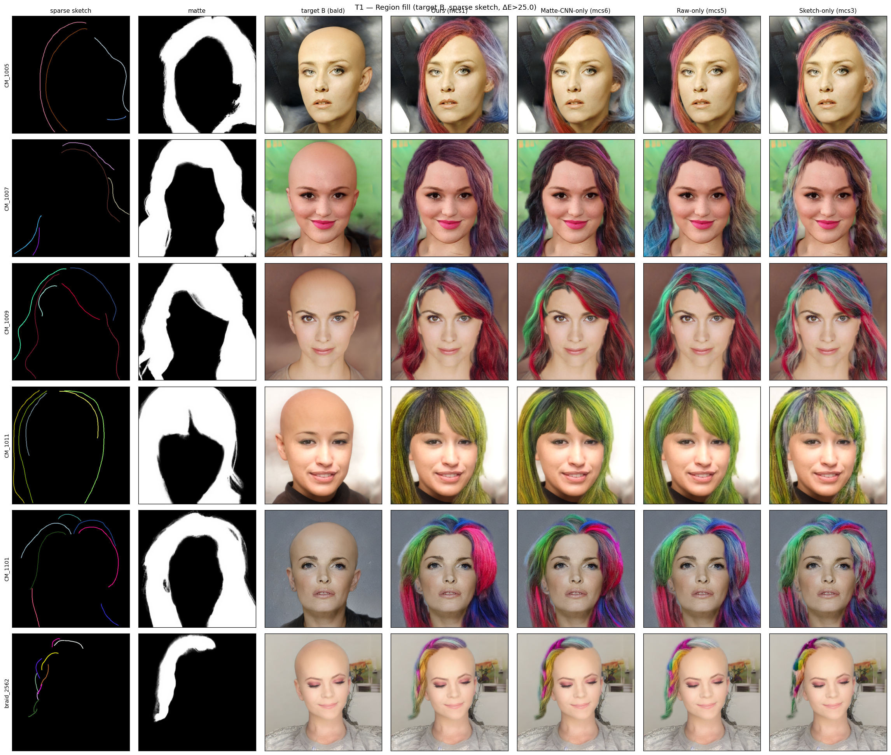
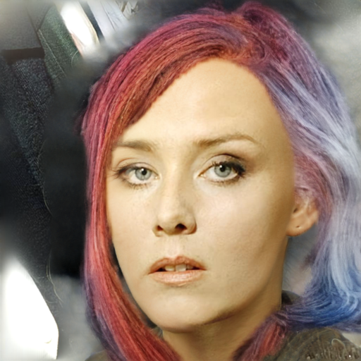
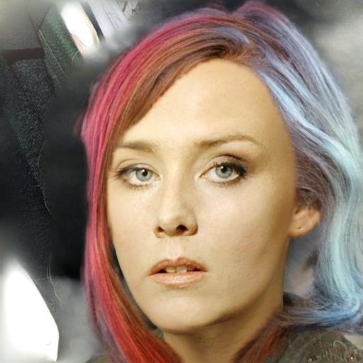
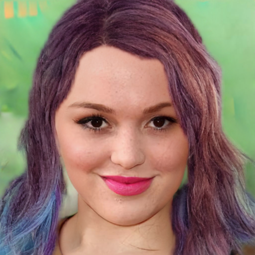
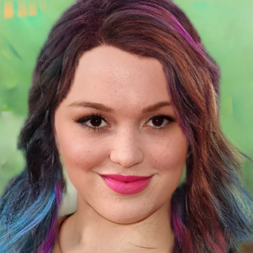
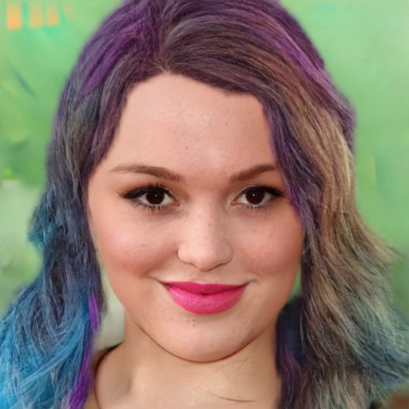
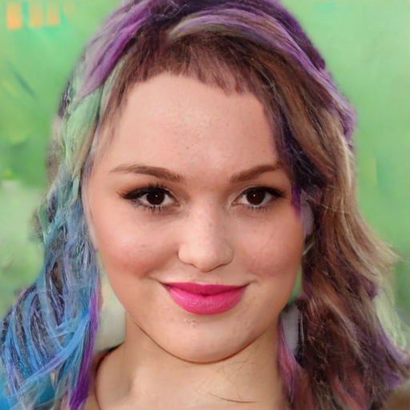
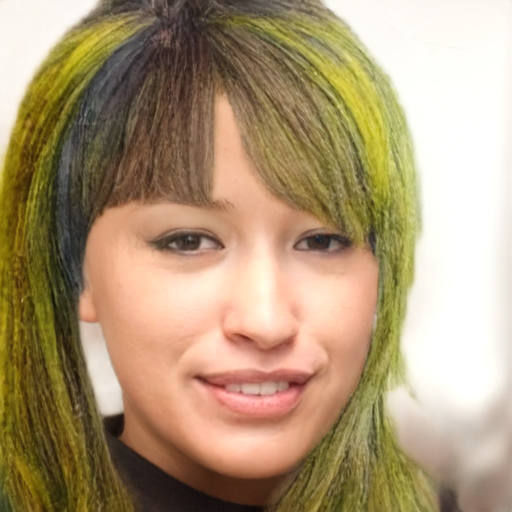
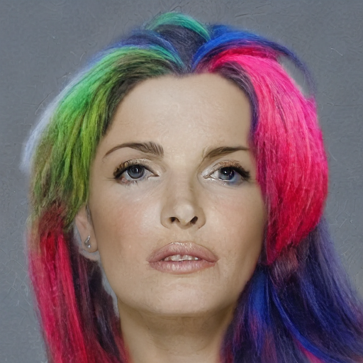
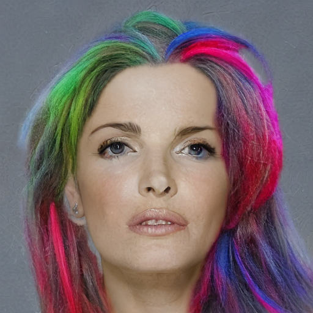

# T1 Sanity-Test — Region Fill (raw-matte 역할)

---

## 1. 실험 개요

| 항목 | 내용 |
|------|------|
| 목적 | matte conditioning의 영역 채움(region fill) 기여도 측정 |
| 비교 모델 | Ours / Matte-CNN-only / Raw-only / Sketch-only (floor) — 4구성 |
| 입력 고정 | sparse 스케치 + GT matte (전 조건 동일) |
| 변수 | 모델 구성 (matte conditioning 유무 및 종류) |
| 타겟 조건 | **B** — HairMapper bald + 원본 장면 (배경 헤어 도움 0 → 순수 fill 능력만 측정) |
| 이미지 | CM_1005 / CM_1007 / CM_1009 / CM_1011 / CM_1101 / braid_2562 (6장) |
| 측정 지표 | **region IoU** (헤어 영역 채움 완성도) |
| seed / steps | 고정 |

> **핵심 질문**: matte conditioning이 없는 Sketch-only 대비, MatteCNN·matte_raw가 각각 / 합쳐서 얼마나 영역을 채우는가?  
> **예측**: matte 있는 3구성(Ours / Matte-CNN-only / Raw-only) ≫ Sketch-only

---

## 2. 모델 정의

| 명칭 | 내부 코드 | MatteCNN | matte_raw | gate | ControlNet 입력 (17ch) |
|------|-----------|:---:|:---:|:---:|---|
| **Ours** | mcs1 | ✅ ON | ✅ ON | ❌ OFF | `cat([sketch_lat + MatteCNN_feat, matte_raw])` |
| **Matte-CNN-only** | mcs6 | ✅ ON | ❌ OFF | ❌ OFF | `cat([sketch_lat + MatteCNN_feat, zeros])` |
| **Raw-only** | mcs5 | ❌ OFF | ✅ ON | ❌ OFF | `cat([sketch_lat + zeros, matte_raw])` |
| **Sketch-only** | mcs3 | ❌ OFF | ❌ OFF | ❌ OFF | `cat([sketch_lat + zeros, zeros])` — floor |

> **해석 주의**: 타겟 B는 학습 분포 밖(OOD) → **절대 품질 해석 금지, 4구성 간 상대 비교만** ("controlled diagnostic")

## 4. Figure

*각 행: Ours / Matte-CNN-only / Raw-only / Sketch-only*

#### Overview

---

#### CM_1005

| Ours | Matte-CNN-only | Raw-only | Sketch-only |
|:---:|:---:|:---:|:---:|
|  |  |  |  |

#### CM_1007

| Ours | Matte-CNN-only | Raw-only | Sketch-only |
|:---:|:---:|:---:|:---:|
|  |  |  |  |

#### CM_1009

| Ours | Matte-CNN-only | Raw-only | Sketch-only |
|:---:|:---:|:---:|:---:|
|  |  |  |  |

#### CM_1011

| Ours | Matte-CNN-only | Raw-only | Sketch-only |
|:---:|:---:|:---:|:---:|
|  |  |  |  |

#### CM_1101

| Ours | Matte-CNN-only | Raw-only | Sketch-only |
|:---:|:---:|:---:|:---:|
|  |  |  |  |

#### braid_2562

| Ours | Matte-CNN-only | Raw-only | Sketch-only |
|:---:|:---:|:---:|:---:|
|  |  |  |  |
