# T1 Sanity-Test — Region Fill (raw-matte 역할)

---

## 1. 실험 개요

| 항목 | 내용 |
|------|------|
| 목적 | matte conditioning의 영역 채움(region fill) 기여도 측정 |
| 비교 모델 | **mcs1 ~ mcs6 전체 6구성** (Ours / Ours+Gate / Sketch-only / Sketch-only+Gate / Raw-only / Matte-CNN-only) |
| 입력 고정 | **sparse 스케치 (50% keep) → GT-color recolor 적용** + GT matte (전 조건 동일) |
| 변수 | 모델 구성 (matte conditioning + gate 유무) |
| 타겟 조건 | **B** — HairMapper bald + 원본 장면 (배경 헤어 도움 0 → 순수 fill 능력만 측정) |
| 이미지 | CM_1005 / CM_1033 / CM_1067 / CM_1068 / CM_1077 / CM_1082 / CM_1101 / CM_1106 (8장) |
| 측정 지표 | **region IoU** (헤어 영역 채움 완성도, BLD pixel-diff 기반) |
| seed / steps | 고정 |

> **핵심 질문**: matte conditioning(MatteCNN·raw matte 채널) + gate가 region fill에 어떻게 기여하는가?
> **예측**: matte 활용 구성 ≫ Sketch-only (floor). Gate ON 이 +α 향상.

> **sketch 색상**: 원본 sketch → sparse (color 50% random keep, seed=42) → **face_A의 헤어 영역 평균색으로 stroke recolor** (SketchHairSalon StrokeColorSampler 방식, 학습 분포 정합)

---

## 2. 모델 정의 (mcs1 ~ mcs6 전체)

| 명칭 | 내부 코드 | MatteCNN | matte_raw | gate | ControlNet 입력 (17ch) |
|------|-----------|:---:|:---:|:---:|---|
| **Ours**              | mcs1 | ✅ ON  | ✅ ON  | ❌ OFF | `cat([sketch_lat + MatteCNN_feat, matte_raw])` |
| **Ours+Gate**         | mcs2 | ✅ ON  | ✅ ON  | ✅ ON  | mcs1 + gate (all blocks) |
| **Sketch-only**       | mcs3 | ❌ OFF | ❌ OFF | ❌ OFF | `cat([sketch_lat + zeros, zeros])` — floor |
| **Sketch-only+Gate**  | mcs4 | ❌ OFF | ❌ OFF | ✅ ON  | mcs3 + gate (all blocks) |
| **Raw-only**          | mcs5 | ❌ OFF | ✅ ON  | ❌ OFF | `cat([sketch_lat + zeros, matte_raw])` |
| **Matte-CNN-only**    | mcs6 | ✅ ON  | ❌ OFF | ❌ OFF | `cat([sketch_lat + MatteCNN_feat, zeros])` |

> **해석 주의**: 타겟 B는 학습 분포 밖(OOD) → **절대 품질 해석 금지, 6구성 간 상대 비교만** ("controlled diagnostic")

---

## 3. 측정 — region IoU (B, matte 영역)

> **region IoU (B, matte 영역)** = `|pred_hair ∩ matte| / |pred_hair ∪ matte|`, pred_hair = pred 와 face_B 간 Lab ΔE > 10 (BLD pixel-diff 기반)

| stem | mcs1 (Ours) | mcs2 (Ours+Gate) | mcs3 (Sketch-only) | mcs4 (Sketch-only+Gate) | mcs5 (Raw-only) | mcs6 (Matte-CNN-only) |
|------|:---:|:---:|:---:|:---:|:---:|:---:|
| CM_1005 | 0.828 | **0.854** | 0.811 | 0.836 | 0.851 | 0.839 |
| CM_1033 | 0.784 | **0.818** | 0.772 | 0.786 | 0.803 | 0.815 |
| CM_1067 | 0.935 | **0.945** | 0.906 | 0.922 | 0.933 | 0.930 |
| CM_1068 | 0.941 | **0.944** | 0.927 | 0.935 | 0.939 | 0.938 |
| CM_1077 | 0.922 | 0.884 | 0.901 | 0.917 | 0.911 | **0.926** |
| CM_1082 | 0.950 | **0.952** | 0.932 | 0.940 | 0.941 | 0.947 |
| CM_1101 | 0.846 | 0.858 | 0.811 | 0.837 | 0.851 | **0.860** |
| CM_1106 | **0.903** | 0.900 | 0.802 | 0.835 | 0.858 | 0.902 |
| **평균** | **0.889** | **0.894** | **0.858** | **0.876** | **0.886** | **0.895** |

방향성:
- 순위: **mcs6 (0.895) ≈ mcs2 (0.894) > mcs1 (0.889) > mcs5 (0.886) > mcs4 (0.876) > mcs3 (0.858)**
- matte 활용 4구성 (mcs1 / mcs2 / mcs5 / mcs6) 모두 0.886+ ≫ Sketch-only(mcs3, 0.858) — design.md L85 예측 정확히 확인
- **Gate 효과**: mcs2 (0.894) > mcs1 (0.889), mcs4 (0.876) > mcs3 (0.858) — gate가 영역 정합 향상 (+0.005 ~ +0.018)
- 4 matte 구성 (mcs1/2/5/6) 간 차이 미세 (≤0.009) → matte 신호 유무 + gate 유무가 핵심

## 4. Figure

*각 행: mcs1 (Ours) / mcs2 (Ours+Gate) / mcs3 (Sketch-only) / mcs4 (Sketch-only+Gate) / mcs5 (Raw-only) / mcs6 (Matte-CNN-only)*

#### Overview

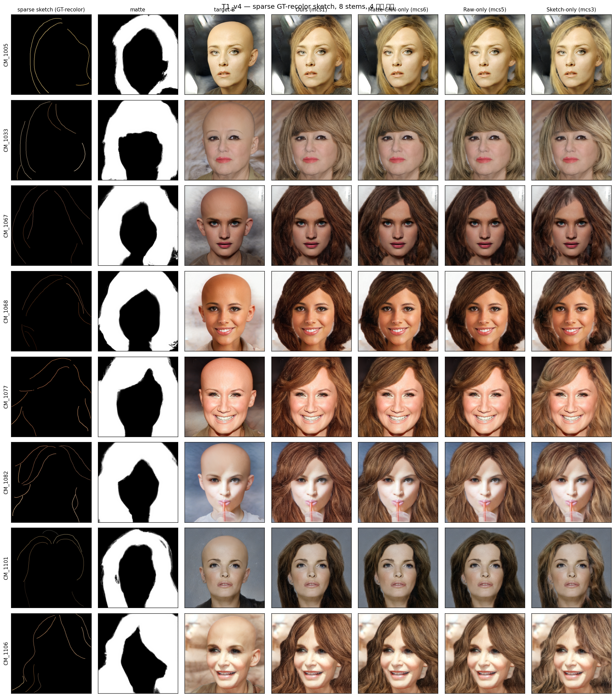

*각 행: 8 stems · 각 열: sparse sketch / matte / target B / mcs1 / mcs2 / mcs6 / mcs5 / mcs3 / mcs4*
(figure 컬럼 배치는 matte-활용 / sketch-only 그룹 순. 측정 표는 mcs1~mcs6 번호 순.)

---

#### CM_1005

| mcs1 (Ours) | mcs2 (Ours+Gate) | mcs3 (Sketch-only) | mcs4 (Sketch-only+Gate) | mcs5 (Raw-only) | mcs6 (Matte-CNN-only) |
|:---:|:---:|:---:|:---:|:---:|:---:|
| 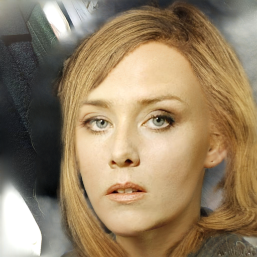 | 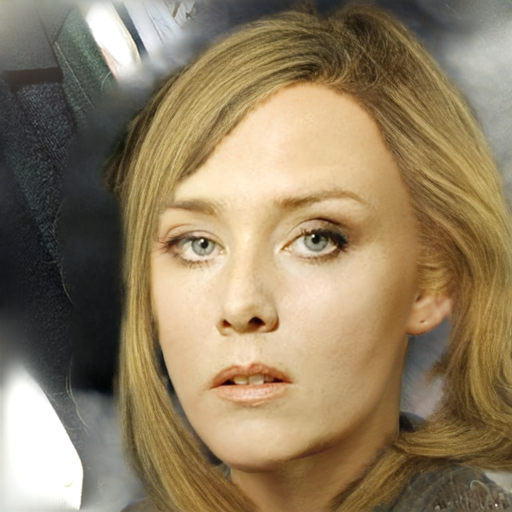 | 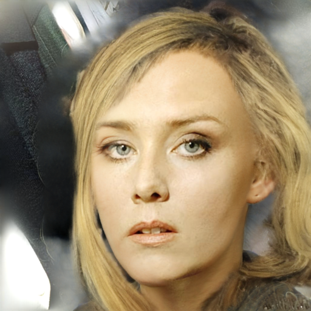 | 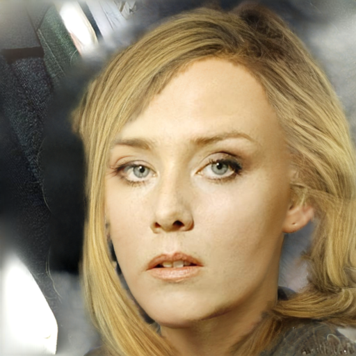 | 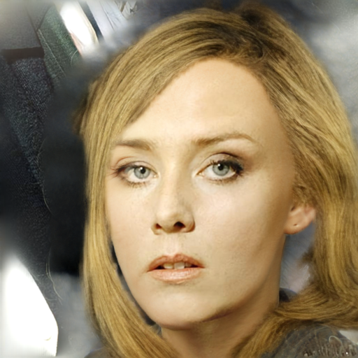 | 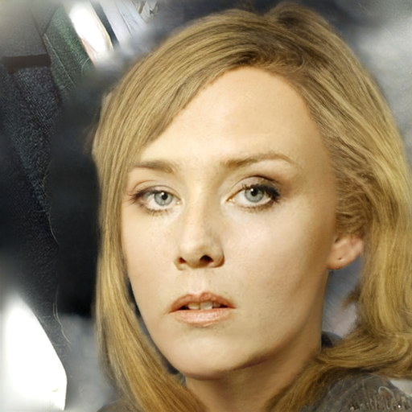 |

| 모델 | region IoU (B) ↑ |
|------|:---:|
| mcs1 (Ours)              | 0.828 |
| **mcs2 (Ours+Gate)**     | **0.854** |
| mcs3 (Sketch-only)       | 0.811 |
| mcs4 (Sketch-only+Gate)  | 0.836 |
| mcs5 (Raw-only)          | 0.851 |
| mcs6 (Matte-CNN-only)    | 0.839 |

#### CM_1033

| mcs1 (Ours) | mcs2 (Ours+Gate) | mcs3 (Sketch-only) | mcs4 (Sketch-only+Gate) | mcs5 (Raw-only) | mcs6 (Matte-CNN-only) |
|:---:|:---:|:---:|:---:|:---:|:---:|
|  | 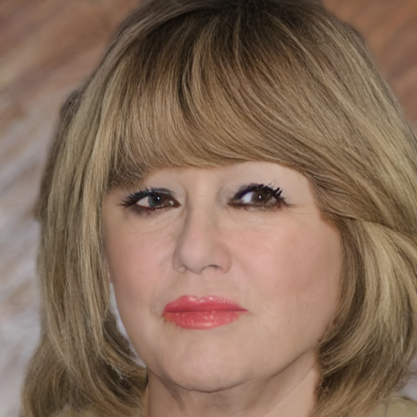 |  |  |  |  |

| 모델 | region IoU (B) ↑ |
|------|:---:|
| mcs1 (Ours)              | 0.784 |
| **mcs2 (Ours+Gate)**     | **0.818** |
| mcs3 (Sketch-only)       | 0.772 |
| mcs4 (Sketch-only+Gate)  | 0.786 |
| mcs5 (Raw-only)          | 0.803 |
| mcs6 (Matte-CNN-only)    | 0.815 |

#### CM_1067

| mcs1 (Ours) | mcs2 (Ours+Gate) | mcs3 (Sketch-only) | mcs4 (Sketch-only+Gate) | mcs5 (Raw-only) | mcs6 (Matte-CNN-only) |
|:---:|:---:|:---:|:---:|:---:|:---:|
| 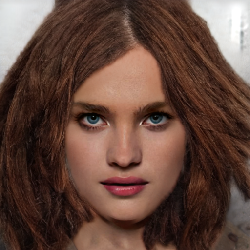 | 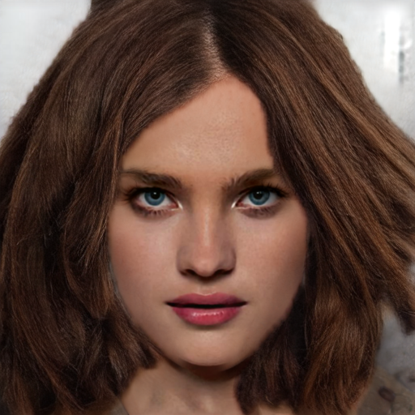 | 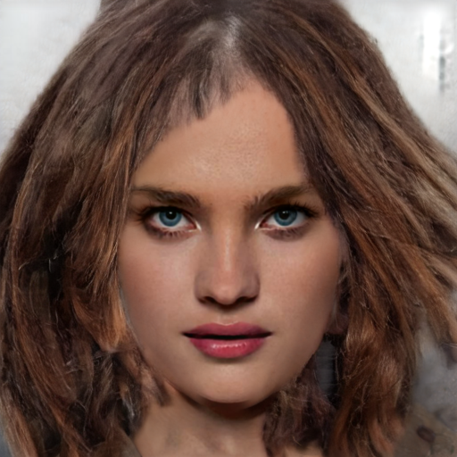 | 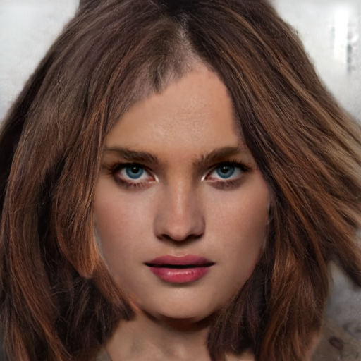 | 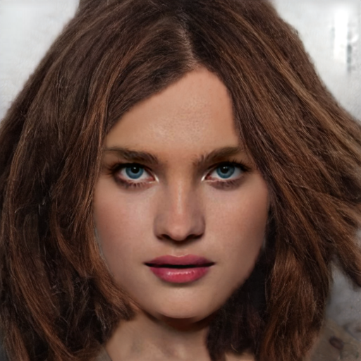 | 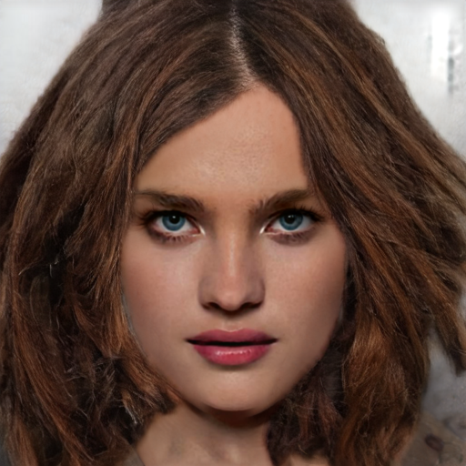 |

| 모델 | region IoU (B) ↑ |
|------|:---:|
| mcs1 (Ours)              | 0.935 |
| **mcs2 (Ours+Gate)**     | **0.945** |
| mcs3 (Sketch-only)       | 0.906 |
| mcs4 (Sketch-only+Gate)  | 0.922 |
| mcs5 (Raw-only)          | 0.933 |
| mcs6 (Matte-CNN-only)    | 0.930 |

#### CM_1068

| mcs1 (Ours) | mcs2 (Ours+Gate) | mcs3 (Sketch-only) | mcs4 (Sketch-only+Gate) | mcs5 (Raw-only) | mcs6 (Matte-CNN-only) |
|:---:|:---:|:---:|:---:|:---:|:---:|
|  |  | 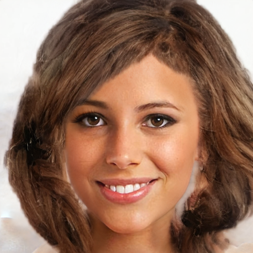 | 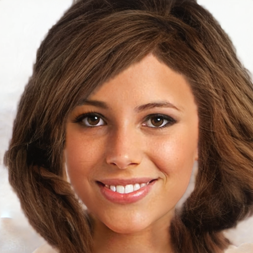 |  |  |

| 모델 | region IoU (B) ↑ |
|------|:---:|
| mcs1 (Ours)              | 0.941 |
| **mcs2 (Ours+Gate)**     | **0.944** |
| mcs3 (Sketch-only)       | 0.927 |
| mcs4 (Sketch-only+Gate)  | 0.935 |
| mcs5 (Raw-only)          | 0.939 |
| mcs6 (Matte-CNN-only)    | 0.938 |

#### CM_1077

| mcs1 (Ours) | mcs2 (Ours+Gate) | mcs3 (Sketch-only) | mcs4 (Sketch-only+Gate) | mcs5 (Raw-only) | mcs6 (Matte-CNN-only) |
|:---:|:---:|:---:|:---:|:---:|:---:|
| 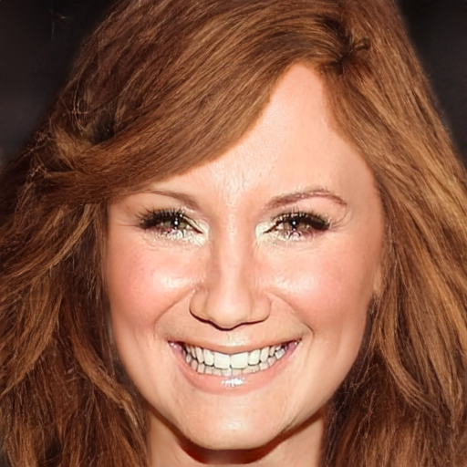 | 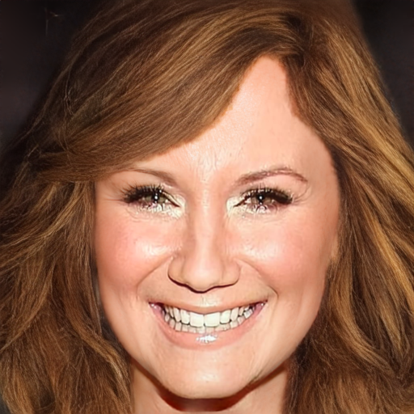 | 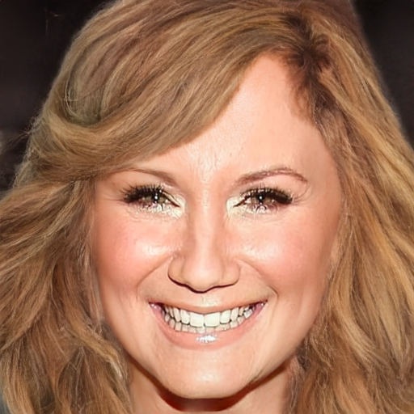 | 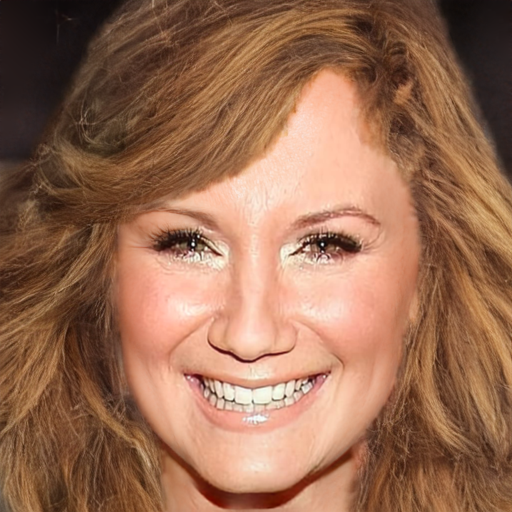 | 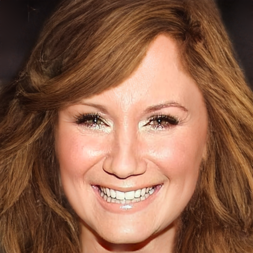 | 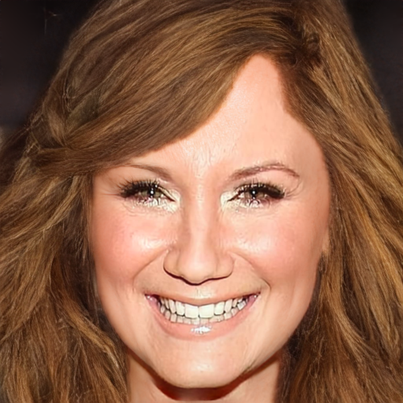 |

| 모델 | region IoU (B) ↑ |
|------|:---:|
| mcs1 (Ours)              | 0.922 |
| mcs2 (Ours+Gate)         | 0.884 |
| mcs3 (Sketch-only)       | 0.901 |
| mcs4 (Sketch-only+Gate)  | 0.917 |
| mcs5 (Raw-only)          | 0.911 |
| **mcs6 (Matte-CNN-only)** | **0.926** |

#### CM_1082

| mcs1 (Ours) | mcs2 (Ours+Gate) | mcs3 (Sketch-only) | mcs4 (Sketch-only+Gate) | mcs5 (Raw-only) | mcs6 (Matte-CNN-only) |
|:---:|:---:|:---:|:---:|:---:|:---:|
| 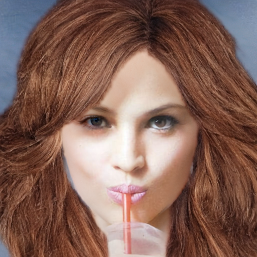 | 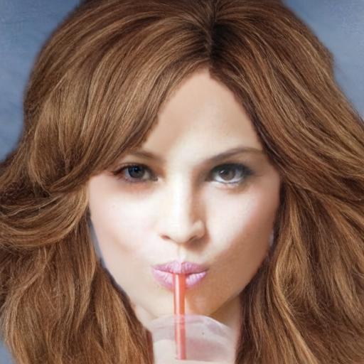 | 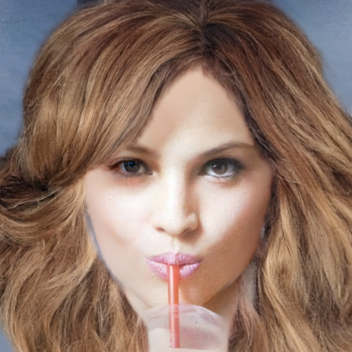 | 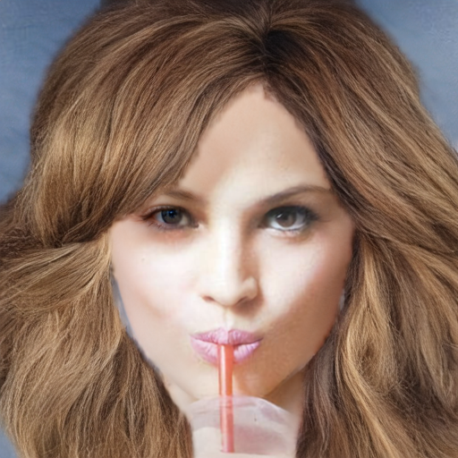 | 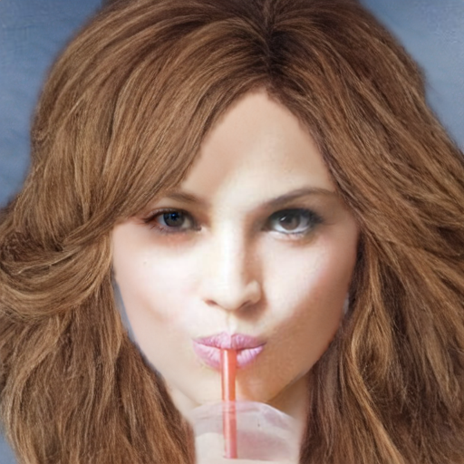 | 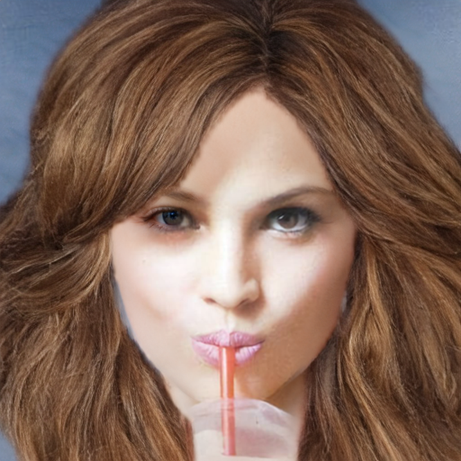 |

| 모델 | region IoU (B) ↑ |
|------|:---:|
| mcs1 (Ours)              | 0.950 |
| **mcs2 (Ours+Gate)**     | **0.952** |
| mcs3 (Sketch-only)       | 0.932 |
| mcs4 (Sketch-only+Gate)  | 0.940 |
| mcs5 (Raw-only)          | 0.941 |
| mcs6 (Matte-CNN-only)    | 0.947 |

#### CM_1101

| mcs1 (Ours) | mcs2 (Ours+Gate) | mcs3 (Sketch-only) | mcs4 (Sketch-only+Gate) | mcs5 (Raw-only) | mcs6 (Matte-CNN-only) |
|:---:|:---:|:---:|:---:|:---:|:---:|
| 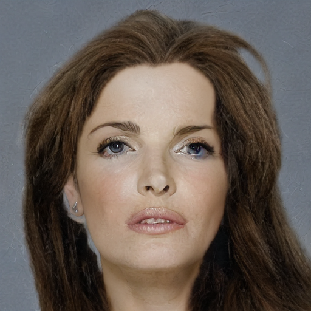 | 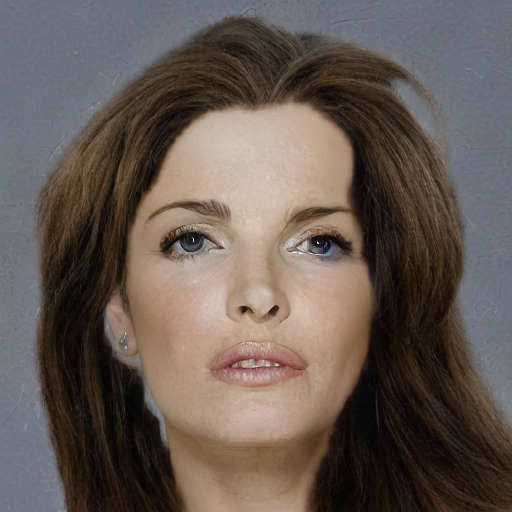 | 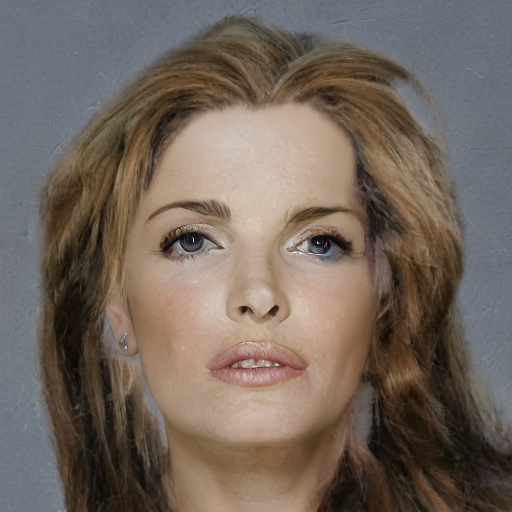 | 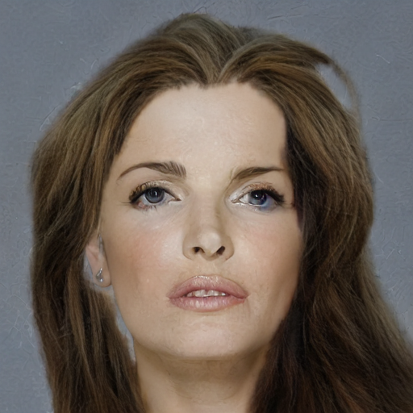 | 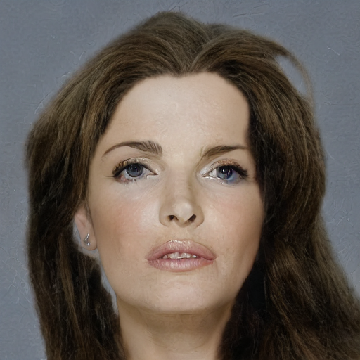 | 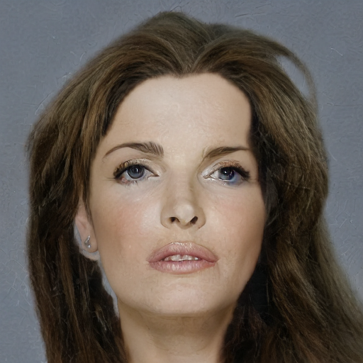 |

| 모델 | region IoU (B) ↑ |
|------|:---:|
| mcs1 (Ours)              | 0.846 |
| mcs2 (Ours+Gate)         | 0.858 |
| mcs3 (Sketch-only)       | 0.811 |
| mcs4 (Sketch-only+Gate)  | 0.837 |
| mcs5 (Raw-only)          | 0.851 |
| **mcs6 (Matte-CNN-only)** | **0.860** |

#### CM_1106

| mcs1 (Ours) | mcs2 (Ours+Gate) | mcs3 (Sketch-only) | mcs4 (Sketch-only+Gate) | mcs5 (Raw-only) | mcs6 (Matte-CNN-only) |
|:---:|:---:|:---:|:---:|:---:|:---:|
|  |  |  | 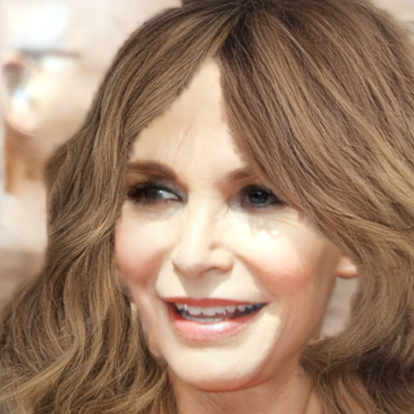 |  |  |

| 모델 | region IoU (B) ↑ |
|------|:---:|
| **mcs1 (Ours)**          | **0.903** |
| mcs2 (Ours+Gate)         | 0.900 |
| mcs3 (Sketch-only)       | 0.802 |
| mcs4 (Sketch-only+Gate)  | 0.835 |
| mcs5 (Raw-only)          | 0.858 |
| mcs6 (Matte-CNN-only)    | 0.902 |
