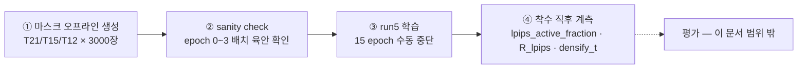
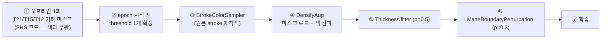

# [2026-08-05] run5 학습 지침 — 밀도 혼합 증강 (v2 · 코드 검증 반영판)

**대상**: JSH (장서현) — HairDiT 축 ②
**성격**: **학습 실행 지침만.** 평가 프로토콜·게이트·표본 확보는 이 문서 범위 밖(§9)
**대체 관계**: `2026-08-05-retrain-instructions-density-augmentation.md`(초판)를 대체한다. 초판 대비 정정 내역은 §0
**선행 근거**: `[0804]densified_sketch_shs.md` (dose-response 11점), `logs/lpips_low.log` · `logs/perceptual_lpips_low.log` (run4 as-run)
**마감 맥락**: WACV R2 마감 2026-08-28 AoE

---

## 약어

| 약어 | 의미 |
|------|------|
| run4 | 0730 체크포인트. `configs/lpips_low_phase1.yaml` as-run. 비교 기준(baseline) |
| **run5** | 이번 재학습. config `configs/densification_phase1.yaml`, 출력 `checkpoints/densification_phase1/` |
| mcs2 | 구 17ch 체크포인트 — 상한 참조 |
| A′ | stroke densification (SHS 공식 auto-completion + 색 전파) |
| SHS | SketchHairSalon (SIGGRAPH Asia 2021) |
| T / `threshold` | SHS `getSketchCompletion` 의 거리 임계 (EDT, L2 px). **클수록 약한** densification |
| ∞ | densification 미적용 = 원본 sketch |
| σ | flow matching noise level. σ=1 이 최대 노이즈 |
| R | LPIPS 실효 세기 = ‖∇lpips‖/‖∇flow‖. run4 실측 0.018~0.028 |

---

## 0. 초판 대비 정정 내역

초판을 이미 읽었다면 이 표만 보면 된다. 전부 코드·로그 대조로 확인한 사항이다.

| # | 초판 서술 | 실제 | 이 판의 조치 |
|---|---|---|---|
| 1 | "바꾸는 변수는 데이터 하나" / "코드 수정은 데이터 로더뿐" | LPIPS 게이트 변경이 이미 적용됨 → **데이터 + 손실 2변수**. trainer.py 도 수정 필요 | §2 에서 2변수임을 명시하고 as-run 대조표를 남김 |
| 2 | `lpips_noise_cutoff: 0.7` = "고노이즈 **샘플** 상위 30% 비활성" | **값 0.7 은 맞다** (PixelGen Eq.9 τ=0.3 ⟺ σ≤0.7). 틀린 것은 "30%" 의 기준 — 샘플이 아니라 **timestep 구간**. 실제 활성 샘플은 40.1% | 값 유지, 문구만 정정 (§2-2). 중간에 0.875 로 바꿨던 것은 되돌림 |
| 3 | "T9 이하 금지 — 반등 구간(밀도 >0.155)" | T9 는 CM_1082 의 **최적점**. T9 밀도 0.1547/0.1528 로 0.155 미만 | T9 배제는 유지, **사유를 "포화 구간"으로 정정** (§4-3) |
| 4 | `from autocompletion.unbraid_completion import ...` | 그런 패키지 없음 | 기존 검증 코드 `scripts/preprocess/densify_shs.py masks` 사용 (§5-1) |
| 5 | `SRC = "data/unbraid/sketch"` | 실제는 `dataset/unbraid/sketch/train` (H100 서버) | §5-1 |
| 6 | `sample['id']` | 데이터셋 키는 **`filename`** (확장자 없는 stem) | §5-2 |
| 7 | `stroke_mask_from_sketch(sketch)` / `propagate_color(...)` 직접 호출 | 두 함수는 numpy (H,W,3) BGR 용. 파이프라인 sketch 는 **torch (3,H,W) float RGB** | §5-2 에서 텐서 네이티브로 재작성 |
| 8 | "15 epoch" | `epochs: 15` 로 적으면 cosine LR T_max 가 15 로 압축돼 run4 비교가 깨짐 | **`epochs: 40` 유지 + epoch 15 수동 중단** (§6-2) |
| 9 | output_dir 미지정 | `lpips_low_phase1.yaml` 그대로 쓰면 서버의 **run4 체크포인트를 무경고 덮어씀** | 🔴 §6-1 |
| 10 | "15 epoch = 4 사이클 × 3 + 나머지 3" | 3 사이클 × 4 + 나머지 3 (결론 4/4/4/3 은 맞음) | §4-2 |
| 11 | `set_epoch(epoch)` — 어느 변수인지 미지정 | 0-based 루프 변수여야 표와 일치. `_current_epoch`(1-based) 넘기면 한 칸 밀림 | §5-4 |
| 12 | (언급 없음) | `num_workers=4`. `persistent_workers` 켜지면 threshold 가 epoch 0 에 고정된 채 조용히 굳음 | §5-4 ⚠️ |
| 13 | (언급 없음) | val 데이터셋에는 augmentation 이 안 붙음 — **오염 없음. 조치 불필요** | 확인 완료 |

---

## 1. 확정 사항 (PI 결정)

| 항목 | 결정 |
|---|---|
| LPIPS timestep 게이트 | **run5 에 포함.** run4 대비 2변수 변경임을 감수 |
| 밀도 전환 단위 | **epoch 단위 라운드로빈.** 샘플별 무작위 안 함 |
| threshold 세트 | **∞ / T21 / T15 / T12.** T9 이하 배제 |
| epoch | **`epochs: 40` 설정 + epoch 15 에서 수동 중단** |
| config | `configs/lpips_low_phase1.yaml` 복사 → **`configs/densification_phase1.yaml`** |
| 그 외 | run4 와 동일. 추가 수정 없음 |



---

## 2. 🔴 run5 는 2변수 변경이다 — 리포트에 반드시 명시

### 2-1. run4 as-run vs run5

`logs/perceptual_lpips_low.log` 에서 run4 의 `R_lpips` 로그는 **step 2244 = epoch 13** 부터 시작한다. 즉 run4 의 epoch 1~12 에는 LPIPS 기여가 전혀 없었다.

| | run4 (as-run) | run5 |
|---|---|---|
| 아키텍처 | 32ch (16 latent + 16 raw anchor) | **동일** |
| LR / batch / warmup | 1e-4 / 16 / 500 | **동일** |
| `w_lpips` | 0.002 | **동일** |
| scale_sync | on, s∈[20,120] | **동일** |
| flow matte 가중 | `m` (losses.py 반영 완료) | **동일** |
| `epochs` (LR T_max) | 40 | **동일** |
| 학습 데이터 | unbraid 3000, 원본 sketch | 🔴 **밀도 혼합 (∞/T21/T15/T12)** |
| LPIPS 활성 규칙 | `lpips_warmup_frac=0.3` → step 2244(ep13)부터 | 🔴 **`lpips_noise_cutoff=0.7` → step 1 부터** |
| LPIPS 있는 epoch | ep15 기준 3/15, ep30 기준 18/30 | **15/15** |

> **논문·리포트 문구**: "run5 는 run4 대비 학습 데이터(밀도 혼합)와 LPIPS 활성 규칙(epoch warmup → timestep gate) **두 가지**가 다르다. 따라서 run5 의 개선분을 밀도 증강 단독 효과로 귀속시키지 않는다."
> 이 문장을 빼면 리뷰어의 첫 질문이 된다. 밀도 단독 효과의 근거는 이미 **추론 검증(8/4~5, 재학습 없이 입력만 교체)** 이 제공하므로, run5 는 "학습 분포 흡수 후에도 효과가 유지되는가"를 보는 실험으로 위치시킨다.

### 2-2. `lpips_noise_cutoff: 0.7` — PixelGen 게이트와의 대응 (논문·코드 대조 완료)

**값은 `0.7`. 논문 원문과 공개 코드를 모두 대조해 확정했다.**

#### 규약 대응 — 여기서 부호가 뒤집힌다

| | 보간식 | 게이트 | 노이즈 계수 |
|---|---|---|---|
| PixelGen (논문 Eq. 2·9) | `x_t = t·x + (1−t)·ε` | `g(t) = 1[t ≥ τ]`, **τ = 0.3** | **1 − t** |
| HairDiT ([trainer.py:588](../src/training/trainer.py#L588)) | `noisy = (1−σ)·x + σ·noise` | `σ ≤ cutoff` | **σ** |

PixelGen 의 `t` 는 **데이터 계수**(t=1 이 clean, t=0 이 순수 노이즈)다. 따라서

```text
g(t)=1  ⟺  t ≥ 0.3  ⟺  (1 − t) ≤ 0.7  ⟺  σ ≤ 0.7
```

**σ 가 곧 PixelGen 의 노이즈 계수이므로 shift 를 다시 씌울 대상이 없다.** 두 가지 이유로 그렇다:

1. SD3.5 의 `shift=3.0` 은 스케줄러 init 에서 `self.scheduler.sigmas` 에 **이미 반영**되어 있고, `_sample_sigmas` 는 그 배열을 그대로 인덱싱한다 ([trainer.py:430-448](../src/training/trainer.py#L430-L448)). 즉 σ 는 실제 노이즈 혼합 계수다.
2. PixelGen 은 학습 시 `timeshift: 1.0` — `time_shift_fn(t,1.0)=t/(t+(1−t)·1)=t` 로 **항등**이다. 그쪽 0.3 은 "shift 이전 raw 값" 이 아니라 이미 물리적 노이즈 레벨이다.

> ⚠️ 한때 `0.875 = 3(0.7)/(1+2·0.7)` 로 교정하려 했으나 이는 성립하지 않는다. 그 유도는 "두 프로젝트의 base 분포가 같다" 를 전제하는데, PixelGen 은 `P_mean=-0.8, P_std=0.8` (`configs_c2i/PixelGen_Large.yaml`, `configs_t2i/*.yaml`), HairDiT 는 `sigmoid(N(0,1))` 로 다르다.

#### 논문 Table 5f 로 교차 검증

threshold sweep 결과가 0.7 을 직접 지지한다 (`τ` → 우리 cutoff `1−τ`):

| HairDiT cutoff | ↔ PixelGen τ | FID↓ | IS↑ | Prec.↑ | Rec.↑ | 논문 평가 |
|---|---|---|---|---|---|---|
| 1.0 (게이트 없음) | 0.0 | 7.46 | 137.95 | 0.73 | 0.58 | 게이트 없음 |
| 0.9 | 0.1 | 7.42 | 136.95 | 0.72 | 0.58 | *"limited effect"* |
| **0.7 (채택)** | **0.3** | 7.53 | 131.71 | 0.72 | **0.60** | **채택 — recall 개선** |
| 0.4 | 0.6 | 10.72 | 109.50 | 0.69 | 0.60 | *"substantially hurts"* |

폐기한 `0.875` 는 τ≈0.125 에 해당해 논문이 "효과 거의 없음" 으로 분류한 구간이다.

#### 다만 **샘플 비율**은 두 프로젝트가 다르다 (기록용)

게이트 정의는 같아도 σ 분포가 달라 실제 활성 샘플 비율은 일치하지 않는다.

| | σ(노이즈 계수) 분포 | 게이트 | **활성 샘플 비율** |
|---|---|---|---|
| PixelGen | `1 − sigmoid(N(−0.8, 0.8))` (shift 없음) | ≤ 0.7 | **52.4%** |
| HairDiT | `shift₃(1 − sigmoid(N(0,1)))` | ≤ 0.7 | **40.1%** |

HairDiT 샘플러의 σ 분위수: 10% 0.455 / 25% 0.605 / **50% 0.751** / 75% 0.855 / 90% 0.915. 중앙값이 0.7 보다 크므로 활성 비율은 50% 를 넘을 수 없다.

- **논문의 설계 파라미터는 구간 임계(τ)이지 샘플 비율이 아니므로 0.7 을 그대로 쓴다.** 손실 정의 자체의 진술("노이즈 계수 0.7 초과 구간에서는 perceptual 손실 비활성")이라 timestep 샘플링 방식과 무관하게 방어된다.
- 굳이 PixelGen 의 **샘플 비율 52.4%** 까지 맞추려면 cutoff ≈ 0.761 이 되지만, 이는 논문에 없는 임의 값이므로 채택하지 않는다.
- 리포트·논문에 쓸 문구: **"고노이즈 timestep 구간 상위 30% 에서 LPIPS 비활성 (PixelGen Eq. 9, τ=0.3 과 동일 조건). HairDiT 의 logit-normal + shift=3.0 샘플링에서는 배치의 약 40% 가 활성."** — "샘플의 70%" 로 쓰면 틀린다.

### 2-3. 착수 직후 계측 (필수)

run4 의 `R≈0.02` 는 "전 샘플 활성" 전제로 `w_lpips=0.002` 를 캘리브레이션한 값이다. 활성 샘플이 40% 로 줄고 정규화가 활성 부분집합 평균으로 바뀌었으므로 **R 유지는 가정이지 검증된 사실이 아니다.** `lpips_low_phase1.yaml` 이 원래 요구하던 검증 절차를 그대로 되살린다.

| 시점 | 확인 | 기준 | 벗어나면 |
|---|---|---|---|
| step ~10 | `lpips_active_fraction` (이미 로깅됨) | **0.40 ± 0.03** (§2-2) | 위 계산과 다름 → 스케줄러 `shift`·샘플러 재확인 |
| step ~100, ~200 | `R_lpips` | **0.015 ~ 0.030** (run4 실측 0.0178~0.0280) | 즉시 중단, `w_lpips` 만 재조정 후 재시작 |
| step ~10 | `densify_t` | epoch 0 이면 **0**(=∞) | 매핑 어긋남 → §5-4 재확인 |

---

## 3. 변경하지 않는 것

| 항목 | 상태 |
|---|---|
| 아키텍처 | **32ch 그대로.** 채널·모듈 수정 금지 (48ch 는 폐기된 구 경로) |
| 하이퍼파라미터 | §2-1 표의 "동일" 항목 전부 |
| 학습 범위 | phase1 · unbraid 3000 · 187 step/epoch |
| braid | **제외.** completion 은 unbraid 전용 (SHS 는 braid 에 절차적 3D 모델 사용) |
| phase2 | 이번 run 에서 안 함 |
| SHS auto-completion 코드 | `threshold` 인자화 외 수정 금지. `small_cc=240` · `matte>230` · `method='lee'` 유지 |
| val 데이터셋 | augmentation 없음 ([trainer.py:331-332](../src/training/trainer.py#L331-L332)) — 손대지 말 것 |

---

## 4. 밀도 혼합 증강 규칙

### 4-1. threshold 세트

| 값 | 의미 | 밀도 (CM_1067/CM_1082 실측) |
|---|------|:---:|
| **∞** | 원본 sketch (densification 없음) | .068 / .073 |
| **T21** | 약한 densification | .098 / .102 |
| **T15** | SHS 기본값 — **추론 작동점** | .122 / .129 |
| **T12** | 유효 구간 상한 | .140 / .142 |

| 제약 | 이유 |
|------|------|
| **∞ 반드시 포함** | 빠지면 "densified 로 학습했으니 densified 입력에서 잘하는 건 당연" 공격 성립 + 원본 입력 성능 붕괴 위험 |
| **원본 stroke 항상 보존** | 자동 stroke 는 **추가**만, 대체 금지. SHS §6.4: 수동 annotation 이 hair wisp junction 형성에 필수 |

### 4-2. epoch ↔ threshold 매핑

**epoch 마다 threshold 하나를 확정해 그 epoch 의 전 샘플에 동일 적용한다.** 순환 순서 ∞ → T21 → T15 → T12 → 반복.

15 epoch = **3 사이클(12) + 나머지 3**:

| epoch (1-based) | 1 | 2 | 3 | 4 | 5 | 6 | 7 | 8 | 9 | 10 | 11 | 12 | 13 | 14 | 15 |
|---|---|---|---|---|---|---|---|---|---|---|---|---|---|---|---|
| threshold | ∞ | T21 | T15 | T12 | ∞ | T21 | T15 | T12 | ∞ | T21 | T15 | T12 | ∞ | T21 | **T15** |

∞ · T21 · T15 각 4회, **T12 만 3회**. 완전 균등은 아니지만 `epochs: 40` 설정 + 수동 중단 구조이므로 **16 에서 끊으면 4/4/4/4 로 균등해진다** — LR 스케줄에 아무 영향이 없으므로 15 냐 16 이냐는 자유롭게 고를 수 있다. 기본은 15.

#### ⚠️ 저장 체크포인트가 밀도 편향을 갖는다 — 리포트에 적을 것

**`save_every: 5` 를 유지한다 (확정).** run4 와 같은 저장 격자(5/10/15/20)가 되어 epoch 매칭 비교가 가능하기 때문이다. 그 결과 저장 시점의 밀도는 다음과 같이 갈린다:

| 저장 epoch | 그 epoch 의 밀도 |
|---|---|
| 5 | ∞ |
| 10 | T21 |
| **15 (채택 예정)** | **T15** |

epoch 당 187 step 뿐이고 EMA decay 0.9999(유효 지평 ~10k step ≫ 총 2805 step)라 완충이 안 되므로, **최종 가중치는 직전 187 step 이 본 밀도에 치우친다.** epoch_15 는 "마지막으로 T15 를 187 step 본 상태"다.

- 채택 작동점이 T15 이므로 실용적으로는 유리한 방향이다. 숨길 필요 없다.
- 다만 "밀도 강건성" · "원본 입력도 개선" 류의 주장을 할 때는 **"최종 epoch 의 밀도가 T15 였다"** 를 함께 적어야 한다. epoch_5(∞ 종료) · epoch_10(T21 종료) 이 이미 저장되므로, 이 셋을 같은 입력으로 비교하면 편향 크기를 사후에 그대로 측정할 수 있다 — 별도 저장 설정 없이 가능하다.
- `save_every` 를 1 로 낮춰 epoch 13~16 을 전부 남기는 안은 **채택하지 않는다** (저장 1회당 full ~20GB + infer 6.1GB 로 디스크 부담이 크고, 위의 5/10/15 비교로 같은 질문에 답할 수 있다).

### 4-3. T9 이하를 배제하는 사유 (정정)

초판의 "반등 구간이라서" 는 `[0804]densified_sketch_shs.md` §4 실측과 배치된다. 실제 값:

| | T12 (.140/.142) | T9 (.155/.153) | T6 (.162/.163) |
|---|---|---|---|
| CM_1067 seed 불일치 | 10.55 | **10.55** (동률 최저) | 11.01 |
| CM_1082 seed 불일치 | 11.47 | **11.16** (단독 최저) | 11.17 |

원 리포트 §4.3 의 표현도 "반등" 이 아니라 "10.5~11.3 사이에서 **완만하게 등락** … 진짜 포화 지점은 여기부터" 이고, §5 는 "CM_1082 는 최저 11.16(SHS_T9)" 이라고 적고 있다. T9 밀도(0.1547/0.1528)는 초판이 정한 경계 0.155 보다 아래이기도 하다.

> **정정 문구**: "T9 이하는 dose-response 가 **포화**되는 구간(밀도 0.14 이후 개선폭이 잡음 수준)이라 추가 학습 신호로서의 가치가 낮고, 자동 stroke 비중이 커져 '수동 annotation 이 필수' 라는 SHS §6.4 논지와 충돌할 소지가 있어 제외한다."

배제 자체는 유지. 사유만 바꾼다.

### 4-4. 증강 순서 — 색 전파는 재착색 **이후**

`StrokeColorSampler` 는 sketch 의 **exact RGB 그룹 단위**로 색을 다시 뽑는다 ([augmentation.py:76-118](../src/data/augmentation.py#L76-L118)). 색 전파가 재착색보다 먼저 돌면 **추가 stroke 만 옛 색을 갖는 불일치**가 생긴다.



부수 확인 사항 (조치 불필요, 알고만 있을 것):
- `StrokeColorSampler` 는 matte 밖 stroke 픽셀을 0 으로, 유효 픽셀 10개 미만 그룹을 통째로 0 으로 만든다. 따라서 학습 시점의 `src` 는 오프라인 마스크를 만들 때의 stroke 집합보다 작다. SHS 마스크는 원본 stroke 로부터 `threshold` px 이상 떨어진 영역이라 **겹침은 발생하지 않고**, 색 전파 시드가 조금 멀어질 뿐이다.
- `ThicknessJitter` 는 원본·추가 stroke 를 함께 팽창시킨다. 추론 경로(`infer_custom.py`)에는 ThicknessJitter 가 없다 — run4 와 동일한 조건이므로 새로 생기는 불일치는 아니다.

---

## 5. 구현

### 5-1. 오프라인 마스크 생성 (H100 서버에서 실행)

**새 스크립트를 만들지 말 것.** 8/4~5 검증에 쓴 코드가 이미 이 기능을 갖고 있다: [scripts/preprocess/densify_shs.py](../scripts/preprocess/densify_shs.py) 의 `masks` 모드.

```bash
python scripts/preprocess/densify_shs.py masks \
    --sketch dataset/unbraid/sketch/train \
    --matte  dataset/unbraid/matte/train \
    --out    data/densify_masks \
    --thresholds 21 15 12
```

- 학습 데이터 루트는 `DATASET_ROOT = <repo>/../dataset` ([dataset.py:23](../src/data/dataset.py#L23)) → `dataset/unbraid/{sketch,matte}/train`. 이 디렉토리는 **H100 서버에만 있다.**
- 출력: `data/densify_masks/T{21,15,12}/{stem}.png` (0/255 이진, 3000장 × 3 = 9000장)
- 소요 수 분. 기하는 색과 무관하므로 1회만 구우면 된다.

#### 🔴 이 스크립트의 출력 로그를 반드시 기록할 것

종료 시 threshold 별 **밀도 평균·std** 를 출력한다. §4-1 의 밀도 수치(.098/.122/.140)는 **테스트 이미지 2장**에서 나온 값이므로, 학습 sketch 3000장의 원본 밀도가 다르면 같은 threshold 가 다른 밀도에 착지한다. 마스크 굽는 김에 확인하면 공짜다.

| 확인 | 기대 | 어긋나면 |
|---|---|---|
| T21 / T15 / T12 평균 밀도 | 대략 0.10 / 0.12 / 0.14 | 학습·추론 밀도가 다른 것이므로 **리포트에 그대로 기록.** threshold 값은 바꾸지 말 것(작동점 T15 를 흔들면 추론 검증과 끊긴다) |
| `[SKIP] 읽기 실패` 건수 | 0 | sketch/matte 파일명 짝 확인 |
| 생성 장수 | 3000 × 3 | 누락분 확인 |

### 5-2. `DensifyAug` — `src/data/augmentation.py` 에 추가

파이프라인의 `sample["sketch"]` 는 **torch (3,H,W) float32 [0,1] RGB** 다. numpy BGR 용 헬퍼를 그대로 부르면 안 되므로 텐서 네이티브로 쓴다. 기하(최근접 라벨)만 cv2 로 얻고 색은 float 텐서에서 gather 하므로 uint8 양자화 손실이 없다.

```python
from pathlib import Path

import cv2
import numpy as np
from PIL import Image


class DensifyAug:
    """④: 사전 생성 기하 마스크 로드 + 색 전파.

    반드시 StrokeColorSampler '뒤에' 배치한다 (§4-4). 순차 라운드로빈이며 샘플별
    무작위가 아니다 — epoch 하나당 threshold 하나를 그 epoch 전체 샘플에 동일 적용한다.
    트레이너가 매 epoch 시작 시 set_epoch(epoch) 을 호출해야 한다 (0-based).
    """

    def __init__(self, mask_root="data/densify_masks", thresholds=(None, 21, 15, 12)):
        self.mask_root = Path(mask_root)
        self.thresholds = list(thresholds)
        self.epoch = 0

    def set_epoch(self, epoch: int):
        self.epoch = epoch

    def __call__(self, sample: dict) -> dict:
        t = self.thresholds[self.epoch % len(self.thresholds)]
        if t is None:                                   # ∞ = 원본. 0 으로 로깅
            return {**sample, "densify_t": 0}

        sketch = sample["sketch"]                       # (3,H,W) float32 [0,1], 재착색 완료
        path = self.mask_root / f"T{t}" / f"{sample['filename']}.png"
        mask = torch.from_numpy(np.array(Image.open(path))) > 0     # (H,W) bool
        if mask.shape != sketch.shape[1:]:
            raise ValueError(f"mask/sketch 해상도 불일치: {path} {tuple(mask.shape)}")

        src = sketch.max(dim=0).values > 0              # SHS 내부 기준 sk_gray>0 과 동일
        add = mask & (~src)                             # 원본과 겹치면 원본 우선
        if not src.any() or not add.any():
            return {**sample, "densify_t": t}

        # 최근접 원본 stroke 픽셀의 인덱스 (기하만 cv2 로 계산)
        src_np, add_np = src.numpy(), add.numpy()
        _, labels = cv2.distanceTransformWithLabels(
            (~src_np).astype(np.uint8), cv2.DIST_L2, 3,
            labelType=cv2.DIST_LABEL_PIXEL)             # 0 = stroke(시드)
        ys, xs = np.nonzero(src_np)
        lut = np.zeros(labels.max() + 1, dtype=np.int64)
        lut[labels[ys, xs]] = np.arange(len(ys))        # label → 시드 인덱스
        ny, nx = np.nonzero(add_np)
        seed = lut[labels[ny, nx]]

        out = sketch.clone()                            # 원본 stroke 는 건드리지 않는다
        out[:, torch.from_numpy(ny), torch.from_numpy(nx)] = \
            sketch[:, torch.from_numpy(ys[seed]), torch.from_numpy(xs[seed])]
        return {**sample, "sketch": out, "densify_t": t}
```

- `sample['filename']` 은 확장자 없는 stem 이다 ([dataset.py:123](../src/data/dataset.py#L123)). `id` 키는 없다.
- `out = sketch.clone()` 에서 시작해 추가 픽셀만 덮으므로 "원본 stroke 보존" 이 구조적으로 보장된다. 별도의 `out[src] = sketch[src]` 줄이 필요 없다.
- 비용: 512² `distanceTransformWithLabels` 가 샘플당 수 ms. `num_workers=4` · 3.16 s/it 대비 무시할 수준이다.

### 5-3. `ComposeAug` 에 `set_epoch` 전파 추가

```python
class ComposeAug:
    def __init__(self, transforms: list):
        self.transforms = transforms

    def set_epoch(self, epoch: int):
        for t in self.transforms:
            if hasattr(t, "set_epoch"):
                t.set_epoch(epoch)

    def __call__(self, sample: dict) -> dict:
        for t in self.transforms:
            sample = t(sample)
        return sample
```

`build_augmentation_pipeline` 시그니처 확장:

```python
def build_augmentation_pipeline(phase: str = "pretrain", densify: dict | None = None) -> ComposeAug:
    dens = []
    if densify and densify.get("enabled", False):
        dens = [DensifyAug(mask_root=densify["mask_root"],
                           thresholds=tuple(densify["thresholds"]))]

    if phase == "pretrain":
        return ComposeAug([
            StrokeColorSampler(p=1.0),
            *dens,                                   # ← StrokeColorSampler 바로 뒤 (§4-4)
            ThicknessJitter(p=0.5),
            MatteBoundaryPerturbation(p=0.3),
        ])
    elif phase == "finetune":
        ...  # 변경 없음. densify 는 unbraid 전용이므로 여기엔 넣지 않는다
```

### 5-4. `trainer.py` 연결 — 3곳

**① `_setup_data` ([trainer.py:299](../src/training/trainer.py#L299))**

```python
aug = build_augmentation_pipeline(self.phase, cfg.get("densify"))
self._aug = aug          # epoch 전환용으로 트레이너가 직접 들고 있는다
```

**② epoch 루프 ([trainer.py:475-476](../src/training/trainer.py#L475-L476))**

```python
for epoch in range(self.start_epoch, epochs):
    self._current_epoch = epoch + 1
    self._aug.set_epoch(epoch)          # ← 0-based. tqdm/iterator 생성 '전'이어야 한다
    self.controlnet.train()
```

> ⚠️ **0-based 를 넘길 것.** `self._current_epoch`(1-based)를 넘기면 §4-2 매핑 전체가 한 칸 밀려 epoch 1 이 T21 로 시작한다.
> ⚠️ **`set_epoch` 은 `for batch in progress:` 보다 위여야 한다.** DataLoader 는 `num_workers=4` ([trainer.py:339](../src/training/trainer.py#L339))로 매 epoch iterator 생성 시점에 worker 를 재fork 하므로, 그 전에 상태를 바꿔야 자식 프로세스에 전달된다.
> ⚠️ **`persistent_workers` 를 켜지 말 것.** 켜는 순간 worker 가 재fork 되지 않아 threshold 가 epoch 0 값에 고정된 채 조용히 굳는다. 이 사고의 유일한 탐지 수단이 아래 `densify_t` 로그다.

**③ `_train_step` 반환 직전 ([trainer.py:712](../src/training/trainer.py#L712))**

```python
        if "densify_t" in batch:
            log_dict["densify_t"] = float(batch["densify_t"][0])

        return total_loss, log_dict
```

`_train_step` 은 batch 키를 명시적으로만 읽으므로 키를 추가해도 안전하다. `log_dict` 은 tqdm postfix 와 `accelerator.log` 로 모두 나간다 ([trainer.py:501-503](../src/training/trainer.py#L501-L503)) — 사후에 "epoch↔threshold 매핑이 설계대로였는가" 를 검증하는 유일한 기록이다.

### 5-5. `configs/densification_phase1.yaml`

`configs/lpips_low_phase1.yaml` 을 복사한 뒤 아래만 바꾼다. **원본 파일은 편집하지 말 것** — 그 파일의 커밋 버전이 run4 의 as-run 기록이다.

```yaml
# configs/densification_phase1.yaml — run5: 밀도 혼합 증강 phase1
# 근거: reports/2026-08-05-run5-density-training-instructions.md
#
# run4(configs/lpips_low_phase1.yaml) 대비 변경점은 두 가지다 (§2-1):
#   ① 학습 데이터: 밀도 혼합 증강 (∞/T21/T15/T12 epoch 라운드로빈)
#   ② LPIPS 활성: epoch 30% warmup → PixelGen noise gate (논문 Eq.9, τ=0.3 ⟺ σ≤0.7)
# 그 외 하이퍼파라미터·아키텍처는 run4 와 완전 동일하게 유지한다.
#
# ⚠️ epochs 를 15 로 줄이지 말 것 — cosine LR T_max 가 이 값에 묶여 있어
#    (trainer.py:393-403) run4 와의 LR 궤적 비교가 깨진다. 40 으로 두고 수동 중단한다.

# --- lpips_low_phase1.yaml 에서 그대로 승계 ---
#   model 블록(32ch), phase/dataset, batch_size 16, learning_rate 1.0e-4,
#   warmup_steps 500, mode/schedule/gate_alpha, resume: null,
#   loss_weights: flow 1.0 / lpips 0.002 / edge 0.0 / scale_sync true / s_min 20 / s_max 120,
#   eval_every 10, perceptual_every 1, save_every 5

training:
  epochs: 40                  # ← 15 로 바꾸지 말 것. epoch 15 에서 수동 중단

  loss_weights:
    # PixelGen noise gate (논문 Eq.9, τ=0.3). PixelGen 의 t 는 데이터 계수라
    # 게이트는 노이즈 계수 (1-t) <= 0.7 이고, 우리 sigma 가 곧 그 노이즈 계수다.
    # shift 재변환 대상이 아니다 (지침서 §2-2).
    lpips_noise_cutoff: 0.7

  # 신규: 밀도 혼합 증강
  densify:
    enabled: true
    mask_root: data/densify_masks
    thresholds: [null, 21, 15, 12]    # null = ∞(원본). epoch 라운드로빈 순서

checkpointing:
  output_dir: checkpoints/densification_phase1/   # 🔴 lpips_low_phase1 로 두면 run4 를 덮어쓴다
```

---

## 6. 🔴 착수 전 필수 확인 2가지

### 6-1. `output_dir` — run4 덮어쓰기 방지

`lpips_low_phase1.yaml` 의 `output_dir: checkpoints/lpips_low_phase1/` 은 **run4 가 실제로 쓴 디렉토리**다. run4 로그 실측:

```
Saved checkpoint:       checkpoints/lpips_low_phase1/epoch_5.pth  epoch_10.pth  epoch_15.pth  epoch_20.pth  final.pth
Saved infer checkpoint: checkpoints/lpips_low_phase1/epoch_5_infer.pth ... final_infer.pth
```

서버 경로는 `/lambda/nfs/hairDiT/checkpoints/lpips_low_phase1` ([sync_checkpoints.sh:16](../scripts/sync_checkpoints.sh#L16)). `save_every: 5` 로 run5 를 돌리면 **정확히 같은 파일명**을 쓰고, 트레이너는 `mkdir(parents=True, exist_ok=True)` 뿐 존재 검사가 없어 ([trainer.py:154](../src/training/trainer.py#L154)) **경고 없이 덮어쓴다.**

- 로컬 `checkpoints/run4_phase1/` 에 `_infer.pth`(epoch 5~40) 는 백업돼 있어 추론용 가중치는 살아남는다.
- 그러나 서버의 full `epoch_N.pth`(optimizer+EMA, 개당 ~20GB) 는 **사본이 없다.** 덮어쓰면 run4 재개·EMA 복원 경로가 영구 소실된다.
- `output_dir` 은 accelerate `project_dir` 로도 쓰이므로 ([trainer.py:126](../src/training/trainer.py#L126)) tensorboard 로그도 섞인다.

**→ `output_dir: checkpoints/densification_phase1/` 로 반드시 바꿀 것. 서버의 기존 파일은 어떤 경우에도 지우거나 옮기지 않는다.**

### 6-2. 디스크 여유

`save_every: 5` × epoch 15 = 3회 저장. 회당 full ~20GB + infer 6.1GB → **약 78GB**. run4 파일을 지워 공간을 만드는 일이 없도록 착수 전에 확인할 것.

---

## 7. sanity check — 학습 시작 전 (필수)

마스크 생성 후, 본학습 전에 짧은 스크립트로 확인한다. `HairRegionDataset(split="unbraid_train", augmentation=aug)` 를 만들고 `aug.set_epoch(e)` 를 e=0,1,2,3 으로 바꿔가며 각 8장씩 sketch 를 저장해 육안 확인.

| # | 확인 | 실패 시 의미 |
|---|---|---|
| 1 | 한 epoch 안의 8장이 **전부 같은 밀도 단계**인가 | 샘플별로 어긋남 → `set_epoch` 이 안 걸렸거나 무작위로 구현됨 |
| 2 | e=0→1→2→3 이 **원본 → T21 → T15 → T12** 순인가 | 매핑이 밀림 → 1-based 를 넘긴 것 (§5-4) |
| 3 | 추가 stroke 색이 **재착색된 원본과 이어지는가** | 순서 뒤집힘 → DensifyAug 가 StrokeColorSampler 앞에 있음 (§4-4) |
| 4 | 원본 stroke 가 **한 픽셀도 지워지지 않았는가** | 원본 우선 규칙 위반 |
| 5 | e=0 결과가 **run4 의 입력과 픽셀 단위로 동일**한가 | ∞ 경로에 부작용이 있음 |

5번은 자동으로 확인할 수 있다 — 같은 seed 로 densify 를 끈 파이프라인과 e=0 파이프라인의 출력을 비교해 최대 차이가 0 이면 통과.

---

## 8. 실행과 모니터링

```bash
# H100
python scripts/train.py --config configs/densification_phase1.yaml
```

| 시점 | 볼 것 | 기준 |
|---|---|---|
| step ~10 | `lpips_active_fraction` | 0.40 ± 0.03 (§2-2) — "샘플의 70%" 가 아니다 |
| step ~10 | `densify_t` | 0 (epoch 0 = ∞) |
| step ~100, ~200 | `R_lpips` | 0.015~0.030. 벗어나면 **즉시 중단** |
| 전 구간 | `s_raw` / `clamp_hi` / `clamp_lo` | 28~51 / 0% / 0% (run4 실측 밴드) |
| 매 epoch | `densify_t` 전환 | §4-2 표와 일치 |
| 매 epoch | `dE_unbraid`, `lpips_unbraid` (perceptual val) | run4 대비 궤적 확인 |
| **epoch 15 종료 후** | — | **수동 중단.** `epoch_15.pth` / `epoch_15_infer.pth` 확보 |

소요: run4 실측 기준 LPIPS 활성 시 3.16 s/it × 187 step ≈ **10분/epoch**. 게이트로 1 epoch 부터 상시 활성이므로 15 epoch ≈ **2.5h + 매 epoch perceptual val 오버헤드**. 초판의 "2~3h" 는 LPIPS 가 12 epoch 동안 꺼져 있던 run4(2.20 s/it) 기준이라 하한이 사라졌다.

중단 후 로컬 동기화:

```bash
scripts/sync_checkpoints.sh densification_phase1 5
```

---

## 9. 이 문서 범위 밖 (학습 완료 후 별도 결정)

의도적으로 뺐다. 학습에만 집중한다.

| 항목 | 상태 |
|---|---|
| 평가 프로토콜 (4셀, seed, 지표) | 미확정 |
| **표본 30~50장 확보** | 🔴 **현재 자산으로 불가.** 로컬 실측: `data/test` 8장 + `data/unbraid_new` 21장(sketch_gt+matt+ori_image 교집합) = 중복 제거 **26장**. `sketch` 기준으로 넓혀도 31장. `unbraid_new` 는 img 34 / matt 33 / sketch 33 / sketch_gt 26 / ori_image 31 로 짝이 안 맞는다. 서버에서 unbraid test split 을 추가로 가져올지 결정 필요 |
| run4 baseline 의 **epoch 지정** | 미확정. 기존 dose-response 데이터는 전부 **run4 phase1 epoch30** 기준(`[0804]densified_sketch_shs.md` §2). run5 를 ep15 에서 끊으면 ep30 vs ep15 비교가 된다 |
| 사전 등록 예측표 | 평가 착수 전에 작성 |
| 8/8 게이트 판정 기준 | PI 확정 예정 |
| 선행 문서 `2026-08-05-doseresponse-verdict-and-gate-priority.md` | **저장소에 존재하지 않는다.** 8/5 표본 확장(8장) 결과는 `scripts/eval/orientation_0805_expanded.py` 에만 있고 리포트로 쓰이지 않았다 |

**하지 말 것**: sweep 추가 · 새 loss 항 · phase2 · braid · 아키텍처 수정 · `lpips_noise_cutoff` 값 변경 · threshold 값 변경.

---

## 10. 학생 전달 요약 (그대로 전달 가능)

> **run5 학습 지침입니다. 평가는 이 문서에 없습니다 — 학습만 끝내면 됩니다.**
>
> 1. 🔴 **config 는 `configs/lpips_low_phase1.yaml` 을 복사해 `configs/densification_phase1.yaml` 로 만드세요. 원본은 편집하지 마세요** (run4 의 as-run 기록입니다). 복사본에서 **`output_dir` 을 `checkpoints/densification_phase1/` 로 반드시 바꾸세요** — 안 바꾸면 서버의 run4 체크포인트를 경고 없이 덮어씁니다.
> 2. **`epochs: 40` 그대로 두고 epoch 15 에서 수동 중단**하세요. 15 로 바꾸면 LR 스케줄이 압축돼 run4 와 비교가 깨집니다.
> 3. **마스크는 새로 짜지 말고 기존 스크립트를 쓰세요**: `python scripts/preprocess/densify_shs.py masks --sketch dataset/unbraid/sketch/train --matte dataset/unbraid/matte/train --out data/densify_masks --thresholds 21 15 12`. 끝날 때 나오는 **threshold 별 평균 밀도를 반드시 기록**하세요 (학습 데이터 밀도가 테스트와 다를 수 있습니다).
> 4. **밀도 혼합**: `∞(원본) → T21 → T15 → T12` 를 **epoch 마다 하나씩** 순서대로. 같은 epoch 안 모든 샘플은 동일 threshold, 샘플별 무작위 아닙니다. `set_epoch` 에는 **0-based epoch** 을 넘기고, `for batch in ...` **위에서** 호출하세요. `persistent_workers` 는 켜지 마세요.
> 5. 🔴 **순서**: `StrokeColorSampler` 재착색 → `DensifyAug` 색 전파 → `ThicknessJitter`. 뒤집히면 추가 stroke 색만 어긋납니다. 학습 전 epoch 0~3 배치를 저장해 **육안 확인**(§7 체크리스트 5개).
> 6. **`densify_t` 를 로그에 남기세요.** epoch↔밀도 매핑이 설계대로였는지 사후에 검증할 유일한 기록입니다.
> 7. 🔴 **착수 직후 3개만 확인하고 이상하면 즉시 중단**하세요: `lpips_active_fraction` ≈ 0.40, `R_lpips` 0.015~0.030, `densify_t` = 0. `R_lpips` 가 벗어나면 `w_lpips` 만 재조정해 재시작합니다.
> 8. **run5 는 run4 대비 데이터와 LPIPS 활성 규칙 두 가지가 다릅니다.** 결과를 밀도 증강 단독 효과로 쓰지 마세요 — 리포트에 2변수임을 명시합니다.
> 9. 소요 ≈ 2.5h + 매 epoch perceptual val. 저장은 epoch 5/10/15 (약 78GB). **서버 파일은 무엇도 지우지 마세요.**
