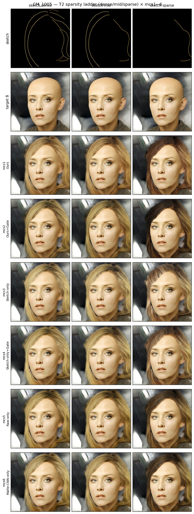
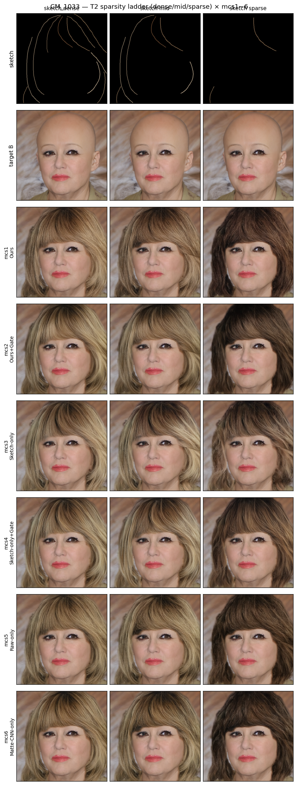
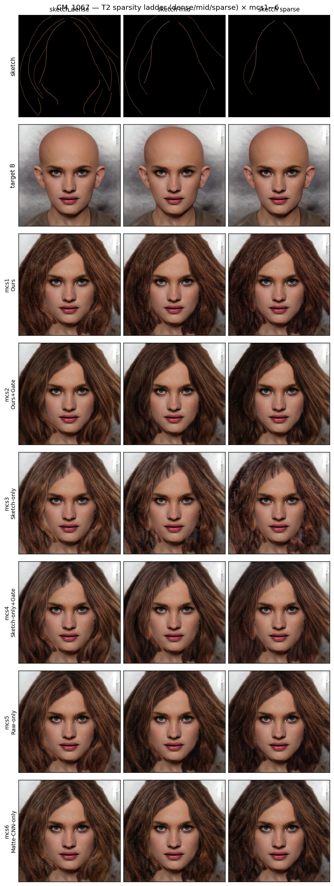
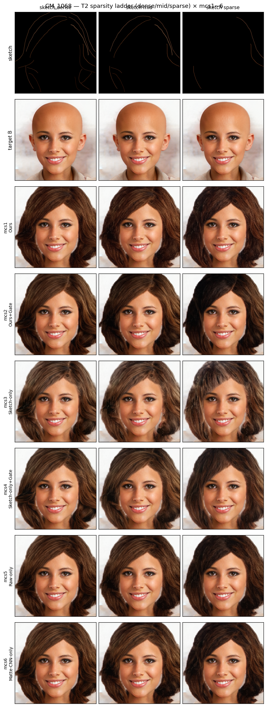
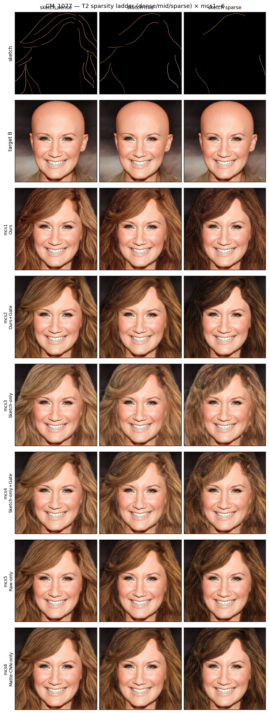
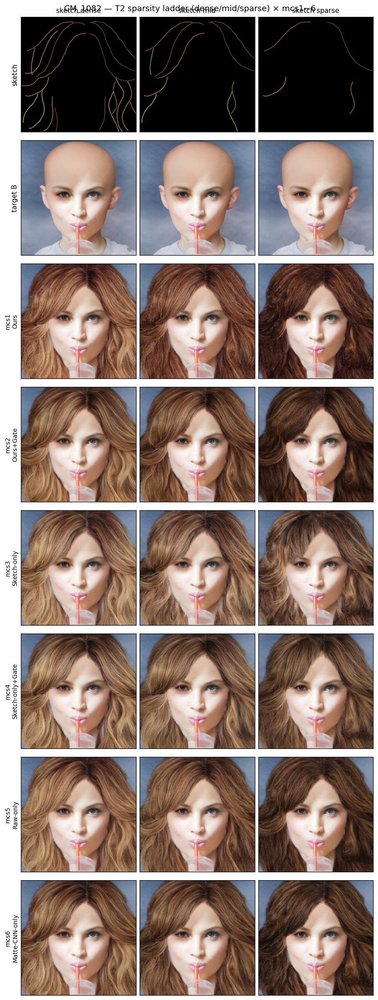
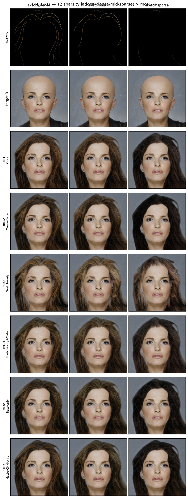
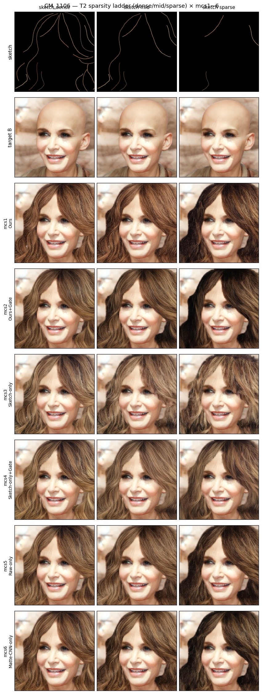

# T2 Sanity-Test — Sparsity Ladder (MatteCNN 역할)

---

## 1. 실험 개요

| 항목 | 내용 |
|------|------|
| 목적 | sparsity가 증가할 때 MatteCNN의 기여 — sparse에서 CNN 이득 확대 여부 검증 |
| 비교 모델 | **mcs1 ~ mcs6 전체 6구성** (핵심 쌍: Ours vs Raw-only) |
| 입력 고정 | **GT-recolor sketch (3 sparsity)** + GT matte + face_B (전 조건 동일 image 셋) |
| 변수 | **스트로크 수 sparsity 3단계** (dense / mid / sparse) |
| 타겟 조건 | **B** — HairMapper bald + 원본 장면 |
| 이미지 | CM_1005 / CM_1033 / CM_1067 / CM_1068 / CM_1077 / CM_1082 / CM_1101 / CM_1106 (8장) |
| 측정 지표 | **Edge IoU (vs sketch, matte 영역)** + **hair 영역 Chroma 평균** (낮으면 muddy) |
| seed / steps | 고정 |

> **예측 (design.md L104)**: sparse할수록 CNN 이득 확대 (mcs1 > mcs5). Raw-only(mcs5)는 색 탁하고 결 뭉개짐.

### Sparsity 정의

| 단계 | keep ratio | 비고 |
|---|---|---|
| **dense** | 100% (원본 색 모두 keep) | T3_v4 sketch_recolor와 동일 |
| **mid** | 50% | T1_v4 sketch_recolor와 동일 |
| **sparse** | 20% (random color subsample) | 본 실험에서 새로 생성 |

모든 sketch는 **GT-recolor (face_A 헤어 영역 평균색)** 적용 — 학습 분포 일치.

---

## 2. 모델 정의 (mcs1 ~ mcs6 전체)

| 명칭 | 내부 코드 | MatteCNN | matte_raw | gate | ControlNet 입력 (17ch) |
|------|-----------|:---:|:---:|:---:|---|
| **Ours**              | mcs1 | ✅ ON  | ✅ ON  | ❌ OFF | `cat([sketch_lat + MatteCNN_feat, matte_raw])` |
| **Ours+Gate**         | mcs2 | ✅ ON  | ✅ ON  | ✅ ON  | mcs1 + gate (all blocks) |
| **Sketch-only**       | mcs3 | ❌ OFF | ❌ OFF | ❌ OFF | `cat([sketch_lat + zeros, zeros])` — floor |
| **Sketch-only+Gate**  | mcs4 | ❌ OFF | ❌ OFF | ✅ ON  | mcs3 + gate (all blocks) |
| **Raw-only**          | mcs5 | ❌ OFF | ✅ ON  | ❌ OFF | `cat([sketch_lat + zeros, matte_raw])` |
| **Matte-CNN-only**    | mcs6 | ✅ ON  | ❌ OFF | ❌ OFF | `cat([sketch_lat + MatteCNN_feat, zeros])` |

---

## 3. 측정 결과 (8 stems 평균)

### Edge IoU (matte 영역 ∩ canny edges, sketch vs pred)

| sparsity | mcs1 (Ours) | mcs2 (Ours+Gate) | mcs3 (Sketch-only) | mcs4 (Sketch-only+Gate) | mcs5 (Raw-only) | mcs6 (Matte-CNN-only) |
|---|:---:|:---:|:---:|:---:|:---:|:---:|
| dense  | 0.0473 | 0.0475 | 0.0451 | **0.0478** | 0.0462 | 0.0464 |
| mid    | 0.0297 | 0.0300 | 0.0272 | 0.0292 | **0.0304** | 0.0302 |
| sparse | 0.0117 | 0.0134 | 0.0096 | 0.0120 | 0.0132 | **0.0135** |

### Chroma 평균 (Lab √(a²+b²), hair 영역, ↑ 자연 / ↓ muddy)

| sparsity | mcs1 (Ours) | mcs2 (Ours+Gate) | mcs3 (Sketch-only) | mcs4 (Sketch-only+Gate) | mcs5 (Raw-only) | mcs6 (Matte-CNN-only) |
|---|:---:|:---:|:---:|:---:|:---:|:---:|
| dense  | **21.24** | 19.74 | 19.73 | 19.83 | 20.19 | 20.01 |
| mid    | **20.33** | 18.30 | 18.85 | 18.69 | 18.91 | 18.77 |
| sparse | 15.24 | 12.19 | **17.04** | 16.18 | 14.36 | 13.35 |

### 방향성

**Sparsity ladder 효과 (모든 모델 공통)**:
- Edge IoU: dense (~0.047) → mid (~0.029) → sparse (~0.012) — **명확한 ladder** ✓
- Chroma: dense (~20.1) → mid (~18.9) → sparse (~14.7) — sparse에서 **muddy 경향**, 모델 간 차이 ↑

**design.md 예측 vs 결과**:

| 예측 | 실제 |
|---|---|
| sparse할수록 CNN 이득 확대 (mcs1 > mcs5) | **sparse Edge IoU: mcs5 (0.0132) > mcs1 (0.0117)** → 예측 ✗, Raw-only가 살짝 우위 |
| Raw-only는 색 탁(muddy)·결 뭉개짐 | **sparse Chroma: mcs5 (14.36) < mcs1 (15.24)** → mcs5가 약간 muddy ✓ 부분 일치 |

### 모델별 sparse Finding

- **sparse Edge IoU 1위 = mcs6 (0.0135)** ≈ mcs2 (0.0134) ≈ mcs5 (0.0132). Matte-CNN-only가 sparse에서 가장 sketch 구조 보존.
- **sparse Chroma 1위 = mcs3 (17.04)** > mcs4 (16.18) > mcs1 (15.24). Sketch-only가 가장 채도 유지 — matte 컨디션이 없으니 sketch 색 그대로 출력.
- **sparse Chroma 최하 = mcs2 (12.19)**. Ours+Gate가 sparse에서 가장 muddy — gate가 색 정보 제한.
- **mcs5 (Raw-only)**는 Edge IoU 양호 + Chroma 약간 muddy — design.md 예측 일부 부합.

### dense·mid 모델 간 차이는 매우 미세 (≤ 0.005 IoU, ≤ 2 Chroma) — sparsity가 충분히 약해야 모델 차이 드러남.

---

## 4. Figure (per-stem)

*각 행: sketch / target B / mcs1 / mcs2 / mcs3 / mcs4 / mcs5 / mcs6*
*각 열: dense (100% keep) / mid (50% keep) / sparse (20% keep)*

#### CM_1005

#### CM_1033

#### CM_1067

#### CM_1068

#### CM_1077

#### CM_1082

#### CM_1101

#### CM_1106

