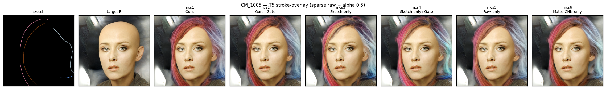
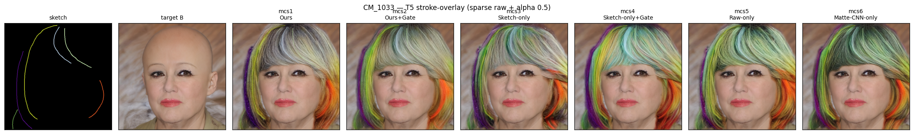
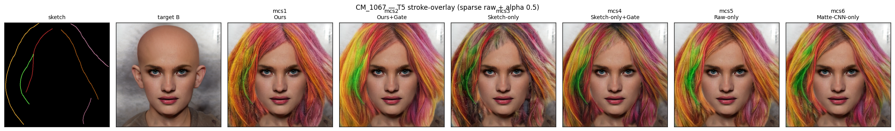
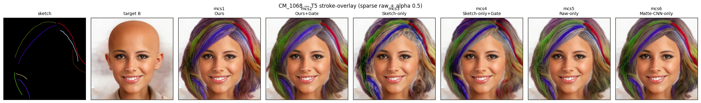
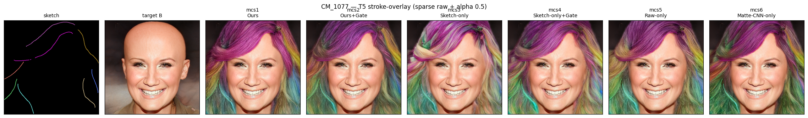
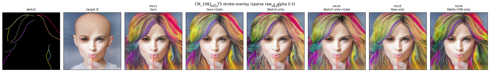
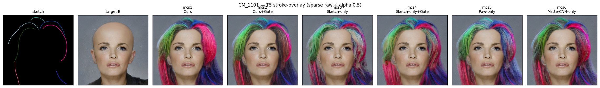
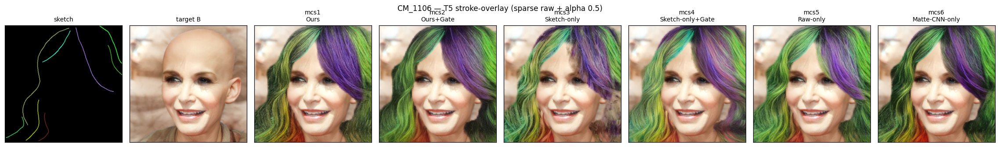

# T5 Sanity-Test — Stroke 배치 대응 (gate 백업, 내부 확인용)

> design.md L106-108: "여유 시", "**내부 확인용 — 논문 표에 넣지 않음**". 정성 stroke-overlay 중심.

---

## 1. 실험 개요

| 항목 | 내용 |
|------|------|
| 목적 | Stroke 색 지시에 대한 모델 대응 (각 stroke 색에 맞춰 그 위치 hair 색을 그리는지) |
| 비교 모델 | **mcs1 ~ mcs6 전체 6구성** (핵심: Ours vs Ours+Gate) |
| 입력 | **raw colored sparse sketch (50% keep, recolor X — "뚜렷한 다색" 의도)** + GT matte + face_B |
| 타겟 | **B** — bald + 원본 장면 |
| 이미지 | CM_1005 / 1033 / 1067 / 1068 / 1077 / 1082 / 1101 / 1106 (8장) |
| 측정 | **stroke-overlay** (sketch 반투명 alpha=0.5 over output, 정성) + **stroke 주변 \|Δhue°\| 평균** (내부 확인용) |

> design.md L107 강조: **sketch는 GT-recolor 적용 X** — 원본 dataset의 다색 stroke 그대로 사용. 그래야 "각 stroke 색이 그 위치 hair 색이 되는지"가 측정 의미 가짐.

---

## 2. 내부 확인용 측정 — stroke 주변 \|Δhue°\| (낮을수록 stroke 색 지시 잘 따름)

| 모델 | \|Δhue°\| ↓ | 순위 |
|---|:---:|:---:|
| mcs1 (Ours)              | 20.02 | 6 |
| mcs2 (Ours+Gate)         | 14.71 | 3 |
| mcs3 (Sketch-only)       | 13.63 | 2 |
| **mcs4 (Sketch-only+Gate)** | **12.89** | **1** |
| mcs5 (Raw-only)          | 15.05 | 5 |
| mcs6 (Matte-CNN-only)    | 14.98 | 4 |

방향성 (내부 확인):
- **Sketch-only 계열 (mcs3, mcs4) 이 stroke 색 가장 충실** — matte 없으니 sketch 색 그대로 출력
- **Gate가 sketch 지시 ↑ 도움**: mcs2 (14.71) < mcs1 (20.02), mcs4 (12.89) < mcs3 (13.63)
- **mcs1 (Ours) 이 가장 stroke 색 안 따름** (|Δhue°| 20.02) — matte+CNN+raw 모든 신호 조합이 sketch 색 가장 약화
- T6 결과(mcs2 hue ratio > mcs1)와 일관 → **gate가 색 정보(sketch albedo / scene 조명)에 더 민감하게 만드는 패턴**

> 단, design.md "내부 확인용" 명시이고 논문 표에는 안 들어가는 메트릭.

---

## 3. Stroke-overlay (per-stem, 정성)

*각 stem 별 한 줄: sketch / target B / mcs1+overlay / mcs2+overlay / mcs3+overlay / mcs4+overlay / mcs5+overlay / mcs6+overlay (alpha=0.5)*

#### CM_1005

#### CM_1033

#### CM_1067

#### CM_1068

#### CM_1077

#### CM_1082

#### CM_1101

#### CM_1106

