# T6 Sanity-Test — Harmony Tracking (gate trade-off 정량) [PI 강도]

---

## 1. 실험 개요

| 항목 | 내용 |
|------|------|
| 목적 | 장면 톤 변화(warm/cool/dim)에 대한 헤어 색 추종 정도 측정 — gate trade-off 정량화 |
| 비교 모델 | **mcs1 ~ mcs6 전체 6구성** (핵심 쌍: Ours vs Ours+Gate) |
| 입력 고정 | **GT-recolor sketch** + GT matte (전 변형 동일, design.md L89 "스케치 색 = 원본 그대로 전 변형 고정") |
| 변수 | 타겟 face — origin / warm / cool / dim |
| 타겟 base | **A (face_A)** — bald(B)는 머리 없음, harmony 측정 의미 X |
| 이미지 | CM_1005 / CM_1033 / CM_1067 / CM_1068 / CM_1077 / CM_1082 / CM_1101 / CM_1106 (8장) |
| 측정 지표 | **tracking ratio** = (pred Δ in matte) ÷ (face Δ in matte) — L·b·C 3축 |
| seed / steps | 고정 |

> **핵심 질문**: 모델이 장면 톤(face의 warm/cool/dim 변화)에 따라 헤어 색을 얼마나 추종(harmonize)하는가, sketch가 지시한 albedo를 얼마나 고정(독립)하는가?
> **예측 (design.md L92)**: Ours(mcs1) ≈ 1 (scene harmonize) / Ours+Gate(mcs2) 낮음 (배경 독립)

---

## 2. 모델 정의 (mcs1 ~ mcs6 전체)

| 명칭 | 내부 코드 | MatteCNN | matte_raw | gate | ControlNet 입력 (17ch) |
|------|-----------|:---:|:---:|:---:|---|
| **Ours**              | mcs1 | ✅ ON  | ✅ ON  | ❌ OFF | `cat([sketch_lat + MatteCNN_feat, matte_raw])` |
| **Ours+Gate**         | mcs2 | ✅ ON  | ✅ ON  | ✅ ON  | mcs1 + gate (all blocks) |
| **Sketch-only**       | mcs3 | ❌ OFF | ❌ OFF | ❌ OFF | `cat([sketch_lat + zeros, zeros])` — floor |
| **Sketch-only+Gate**  | mcs4 | ❌ OFF | ❌ OFF | ✅ ON  | mcs3 + gate (all blocks) |
| **Raw-only**          | mcs5 | ❌ OFF | ✅ ON  | ❌ OFF | `cat([sketch_lat + zeros, matte_raw])` |
| **Matte-CNN-only**    | mcs6 | ✅ ON  | ❌ OFF | ❌ OFF | `cat([sketch_lat + MatteCNN_feat, zeros])` |

---

## 3. C″ 리라이팅 (PI 확정 표, design.md L53-59 그대로)

| 변형 | sRGB gain (R, G, B) | 등가 느낌 | 목표 시프트 | **실측 (8 stems 평균, 헤어 영역)** |
|------|---|---|---|---|
| Warm | ×1.18, ×1.03, ×0.82 | 6500K → 4300K | Δb ≈ +12~15 | Δb = **+4.78** |
| Cool | ×0.84, ×0.98, ×1.18 | 6500K → 9500K | Δb ≈ −12~15 | Δb = **−5.03** |
| Dim  | 전 채널 ×0.55       | 어두운 실내   | ΔL ≈ −20~25 | ΔL = **−10.63** |

> 구현: sRGB→linear→gain→sRGB, pre-scale ×0.95 (warm R 클리핑 방지).
> **caveat**: 실측 T가 design.md "목표 시프트"의 **약 1/3~1/2 수준**. T6_v2 (Strong gain) 별도 보고서 참고.

---

## 4. 종합 측정 (8 stems × 3 variants = 24 samples)

> **tracking ratio**: 출력 헤어 영역의 Lab 변화량을 face 변화량으로 나눈 값
> - **L ratio** = (pred ΔL) / (face ΔL) — luminance 추종
> - **b ratio** = (pred Δb) / (face Δb) — hue (yellow-blue) 추종
> - **C ratio** = (pred ΔChroma) / (face ΔChroma) — chroma 추종

| 모델 | L ratio | b ratio (hue) | C ratio |
|------|:---:|:---:|:---:|
| mcs1 (Ours)              | −0.101 | 0.029 | 0.054 |
| mcs2 (Ours+Gate)         | −0.102 | 0.056 | 0.061 |
| mcs3 (Sketch-only)       | **0.122** | **0.148** | **0.144** |
| mcs4 (Sketch-only+Gate)  | 0.123 | 0.128 | 0.116 |
| mcs5 (Raw-only)          | −0.149 | 0.050 | 0.055 |
| mcs6 (Matte-CNN-only)    | −0.080 | 0.077 | 0.091 |

방향성:
- **모든 모델 tracking ratio ≈ 0** (절대값 < 0.2). design.md 예측 "Ours ≈ 1" 부합 ✗
- 순위: **mcs3 ≈ mcs4 (sketch-only) > mcs6 > mcs2 ≈ mcs5 ≈ mcs1**
- **Ours vs Ours+Gate 차이 미세** (gate trade-off 효과 명확히 안 드러남)
- L ratio 음수 (mcs1/2/5/6): 측정 noise floor or sketch 색 dominant

원인 추정 (T6_v2 결과로 검증됨):
- GT-recolor sketch가 강한 albedo 지시 → 모델이 sketch 색에 강하게 의존
- Matte conditioning이 BLD source(face) 영향 효과적 차단

---

## 5. 개별 결과 (per-stem)

*각 stem 별로: 행 = target/모델, 열 = variant (origin/warm/cool/dim) · 측정 = tracking ratio L/b/C*

#### CM_1005

|  | target | **mcs1 (Ours)** | **mcs2 (Ours+Gate)** | **mcs3 (Sketch-only)** | **mcs4 (Sketch-only+Gate)** | **mcs5 (Raw-only)** | **mcs6 (Matte-CNN-only)** |
| --- | :---: | :---: | :---: | :---: | :---: | :---: | :---: |
| origin |  |  |  |  |  |  |  |
| warm |  |  | 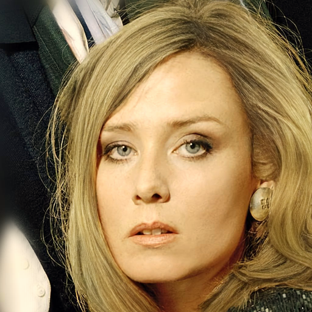 | 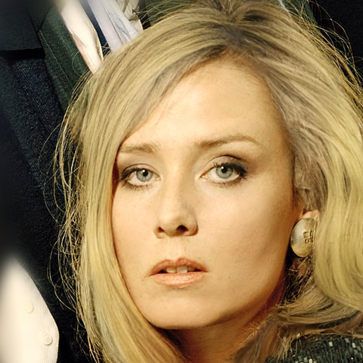 | 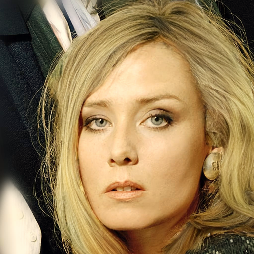 |  | 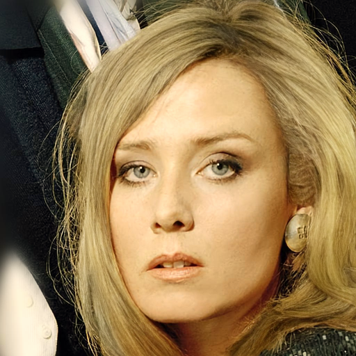 |
| cool |  |  |  |  |  |  |  |
| dim |  |  |  |  |  |  |  |

| 모델 | mcs1 (Ours) | mcs2 (Ours+Gate) | mcs3 (Sketch-only) | mcs4 (Sketch-only+Gate) | mcs5 (Raw-only) | mcs6 (Matte-CNN-only) |
| --- | :---: | :---: | :---: | :---: | :---: | :---: |
| warm L/b/C | -0.12 / +0.13 / +0.14 | +0.09 / +0.16 / +0.16 | +0.16 / +0.22 / +0.22 | +1.08 / +0.21 / +0.20 | -0.13 / +0.16 / +0.16 | -0.46 / +0.15 / +0.15 |
| cool L/b/C | +0.13 / +0.11 / +0.13 | +0.12 / +0.16 / +0.16 | +0.43 / +0.19 / +0.20 | +0.30 / +0.21 / +0.22 | +0.10 / +0.16 / +0.16 | +0.06 / +0.13 / +0.14 |
| dim L/b/C | +0.14 / +0.18 / +0.19 | +0.12 / +0.20 / +0.21 | +0.39 / +0.27 / +0.28 | +0.21 / +0.25 / +0.25 | +0.11 / +0.21 / +0.21 | +0.12 / +0.19 / +0.19 |

#### CM_1033

|  | target | **mcs1 (Ours)** | **mcs2 (Ours+Gate)** | **mcs3 (Sketch-only)** | **mcs4 (Sketch-only+Gate)** | **mcs5 (Raw-only)** | **mcs6 (Matte-CNN-only)** |
| --- | :---: | :---: | :---: | :---: | :---: | :---: | :---: |
| origin |  |  |  |  | 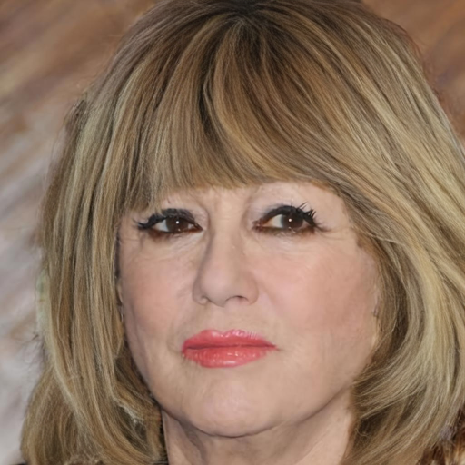 |  |  |
| warm |  |  |  |  |  |  |  |
| cool | 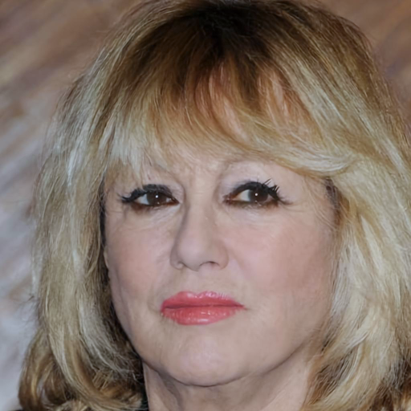 | 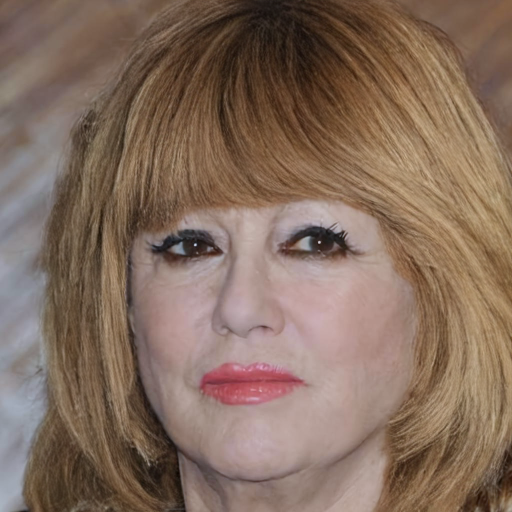 | 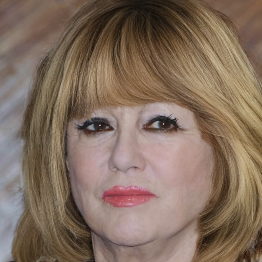 | 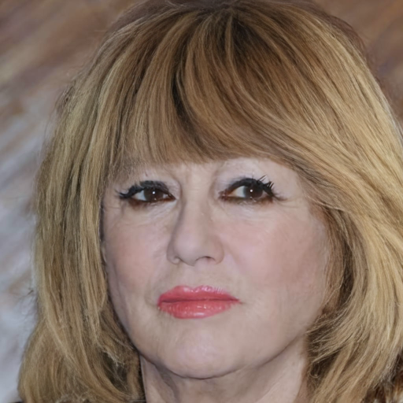 | 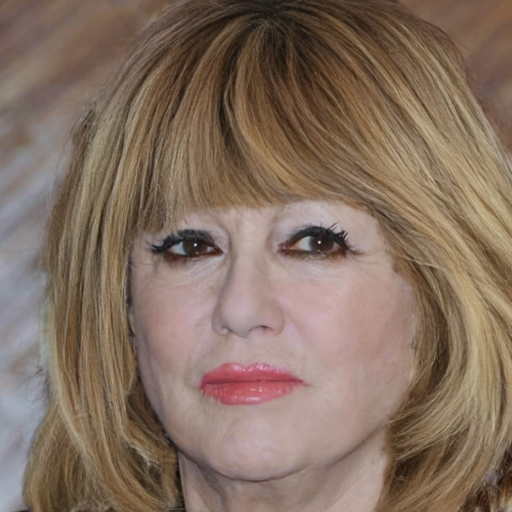 | 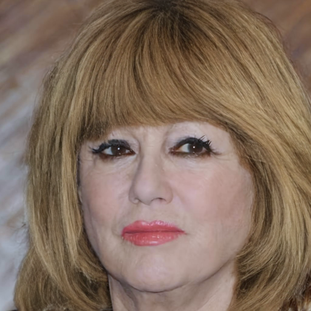 | 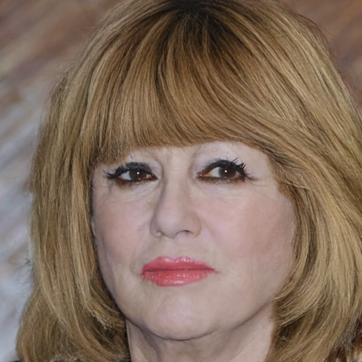 |
| dim |  |  |  |  |  |  |  |

| 모델 | mcs1 (Ours) | mcs2 (Ours+Gate) | mcs3 (Sketch-only) | mcs4 (Sketch-only+Gate) | mcs5 (Raw-only) | mcs6 (Matte-CNN-only) |
| --- | :---: | :---: | :---: | :---: | :---: | :---: |
| warm L/b/C | -1.10 / +0.04 / +0.04 | -0.86 / +0.09 / +0.09 | -0.85 / +0.13 / +0.13 | -0.25 / +0.09 / +0.09 | -2.93 / +0.05 / +0.05 | -1.51 / +0.08 / +0.08 |
| cool L/b/C | -0.07 / +0.06 / +0.06 | -0.04 / +0.09 / +0.09 | +0.32 / +0.10 / +0.11 | +0.15 / +0.12 / +0.11 | -0.10 / +0.07 / +0.07 | -0.11 / +0.11 / +0.11 |
| dim L/b/C | -0.06 / +0.04 / +0.11 | -0.06 / +0.08 / +0.11 | +0.25 / +0.09 / +0.11 | +0.08 / +0.11 / +0.10 | -0.05 / +0.07 / +0.08 | -0.05 / +0.14 / +0.16 |

#### CM_1067

|  | target | **mcs1 (Ours)** | **mcs2 (Ours+Gate)** | **mcs3 (Sketch-only)** | **mcs4 (Sketch-only+Gate)** | **mcs5 (Raw-only)** | **mcs6 (Matte-CNN-only)** |
| --- | :---: | :---: | :---: | :---: | :---: | :---: | :---: |
| origin |  |  |  |  |  |  |  |
| warm |  |  |  |  |  |  |  |
| cool |  |  |  |  |  |  |  |
| dim |  |  |  |  |  |  |  |

| 모델 | mcs1 (Ours) | mcs2 (Ours+Gate) | mcs3 (Sketch-only) | mcs4 (Sketch-only+Gate) | mcs5 (Raw-only) | mcs6 (Matte-CNN-only) |
| --- | :---: | :---: | :---: | :---: | :---: | :---: |
| warm L/b/C | -0.76 / +0.01 / -0.00 | -0.41 / +0.07 / +0.06 | -0.94 / +0.09 / +0.07 | -0.34 / +0.05 / +0.04 | -0.73 / +0.08 / +0.09 | -0.91 / +0.08 / +0.07 |
| cool L/b/C | -0.02 / -0.03 / -0.02 | -0.07 / +0.03 / +0.00 | +0.24 / +0.12 / +0.09 | +0.12 / +0.10 / +0.09 | -0.10 / +0.05 / +0.02 | -0.06 / +0.05 / +0.04 |
| dim L/b/C | -0.07 / -0.04 / +0.05 | -0.09 / -0.11 / -0.07 | +0.19 / +0.15 / +0.16 | +0.13 / +0.09 / +0.10 | -0.08 / -0.08 / -0.07 | -0.05 / -0.03 / +0.03 |

#### CM_1068

|  | target | **mcs1 (Ours)** | **mcs2 (Ours+Gate)** | **mcs3 (Sketch-only)** | **mcs4 (Sketch-only+Gate)** | **mcs5 (Raw-only)** | **mcs6 (Matte-CNN-only)** |
| --- | :---: | :---: | :---: | :---: | :---: | :---: | :---: |
| origin |  |  |  |  |  |  |  |
| warm |  |  |  |  |  |  |  |
| cool |  |  |  |  |  |  |  |
| dim |  |  |  |  |  |  |  |

| 모델 | mcs1 (Ours) | mcs2 (Ours+Gate) | mcs3 (Sketch-only) | mcs4 (Sketch-only+Gate) | mcs5 (Raw-only) | mcs6 (Matte-CNN-only) |
| --- | :---: | :---: | :---: | :---: | :---: | :---: |
| warm L/b/C | -1.28 / +0.05 / +0.01 | -1.12 / +0.08 / +0.07 | -0.16 / +0.14 / +0.10 | -0.52 / +0.17 / +0.16 | -0.69 / +0.09 / +0.07 | -0.55 / +0.12 / +0.08 |
| cool L/b/C | +0.01 / +0.05 / +0.01 | -0.01 / +0.05 / +0.01 | +0.47 / +0.20 / +0.16 | +0.22 / +0.15 / +0.12 | -0.07 / +0.05 / +0.05 | -0.03 / +0.08 / +0.10 |
| dim L/b/C | -0.01 / -0.04 / +0.05 | -0.03 / -0.06 / -0.04 | +0.41 / +0.25 / +0.26 | +0.25 / +0.18 / +0.15 | -0.04 / -0.11 / -0.05 | +0.01 / +0.03 / +0.11 |

#### CM_1077

|  | target | **mcs1 (Ours)** | **mcs2 (Ours+Gate)** | **mcs3 (Sketch-only)** | **mcs4 (Sketch-only+Gate)** | **mcs5 (Raw-only)** | **mcs6 (Matte-CNN-only)** |
| --- | :---: | :---: | :---: | :---: | :---: | :---: | :---: |
| origin |  |  |  | 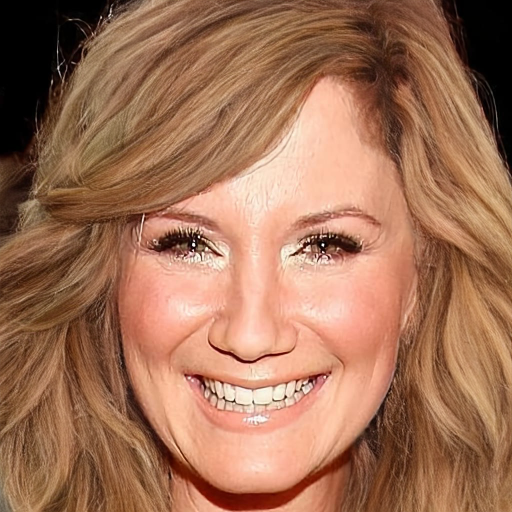 | 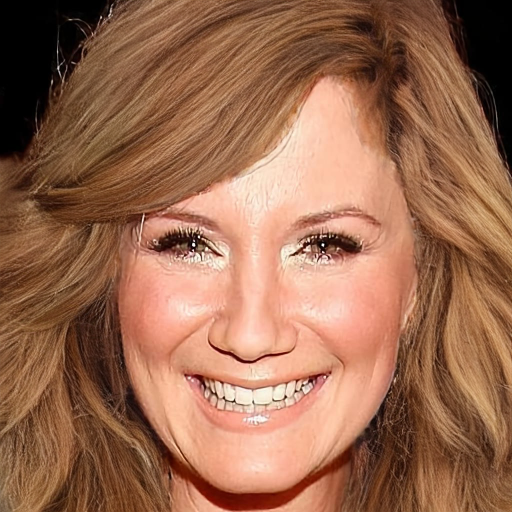 |  |  |
| warm | 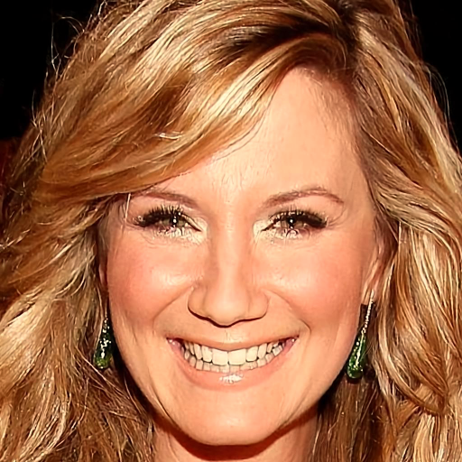 | 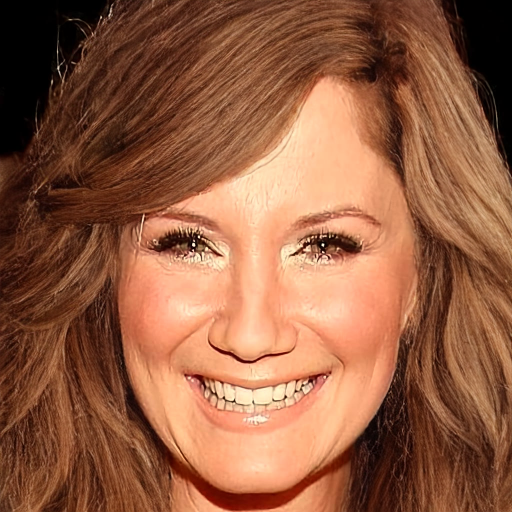 | 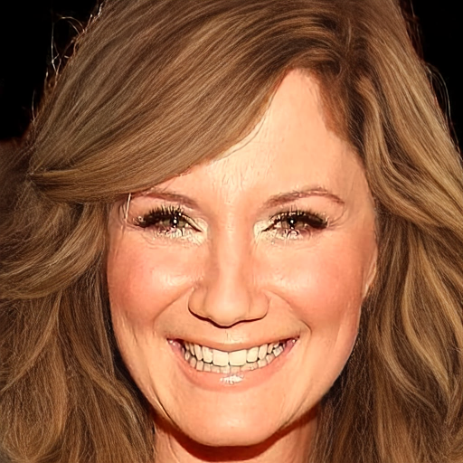 | 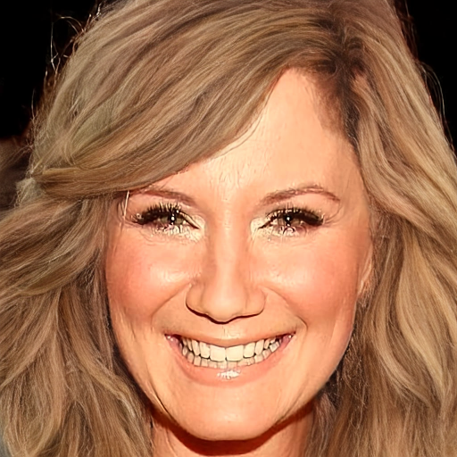 | 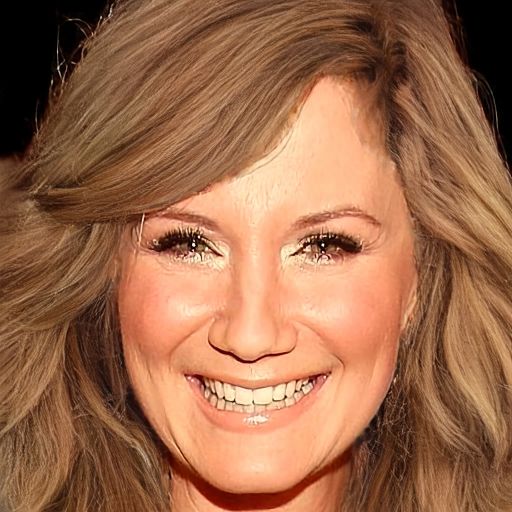 | 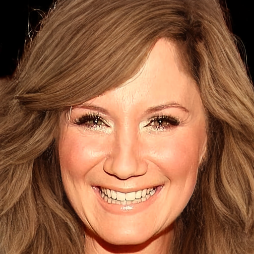 | 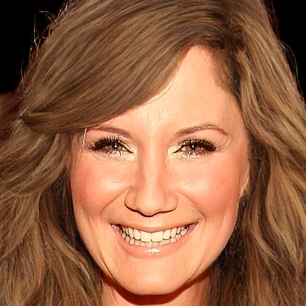 |
| cool | 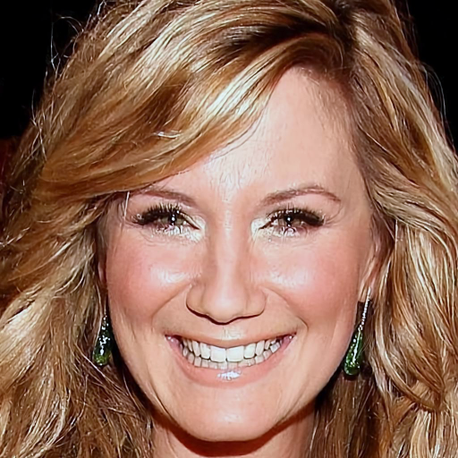 | 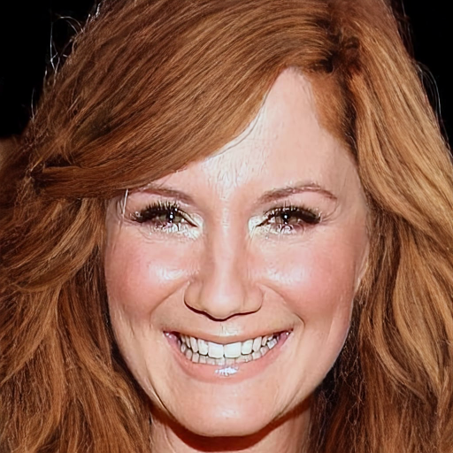 | 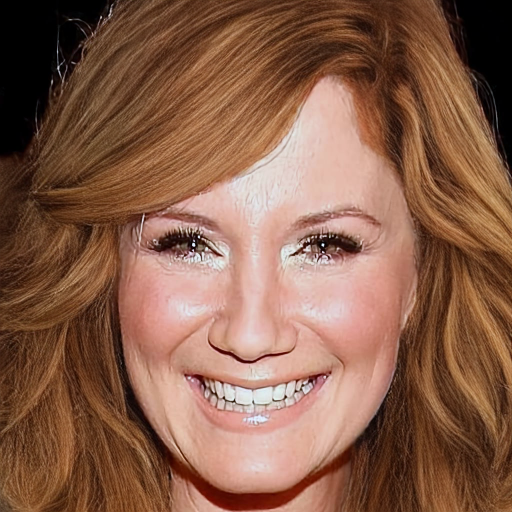 | 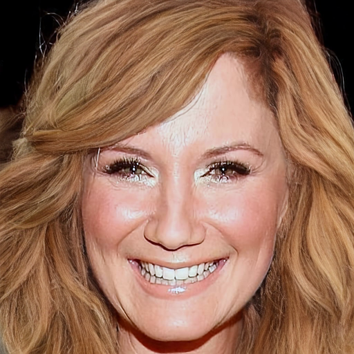 | 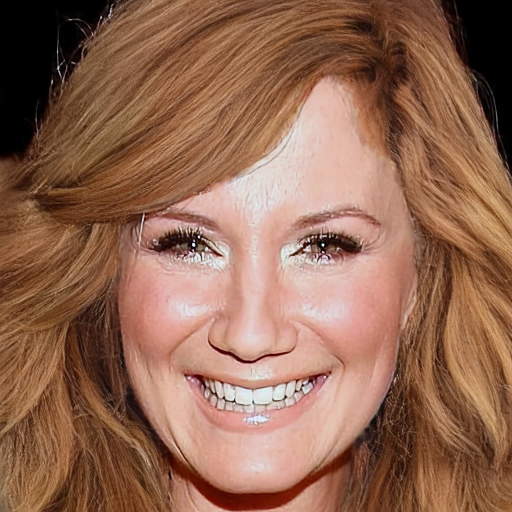 | 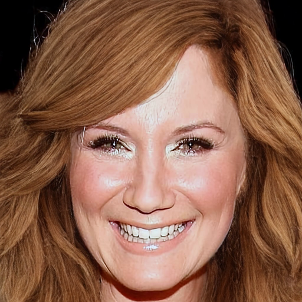 | 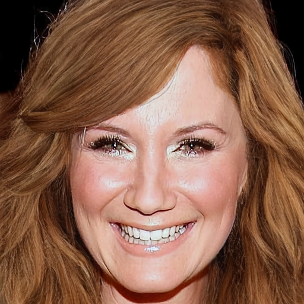 |
| dim | 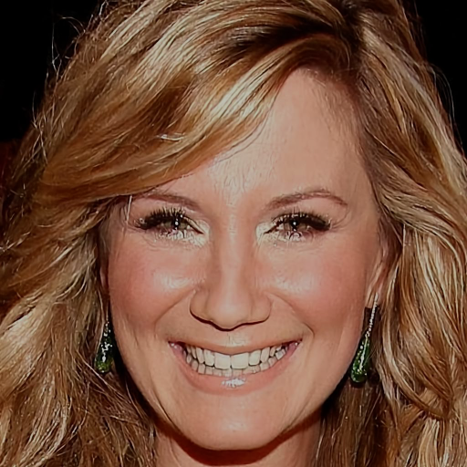 | 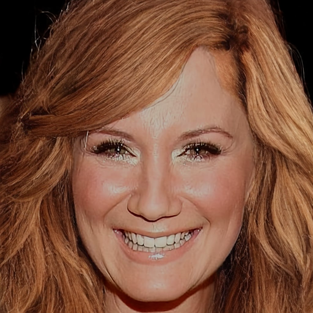 | 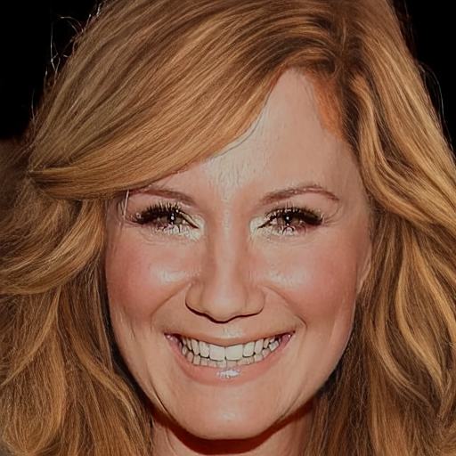 | 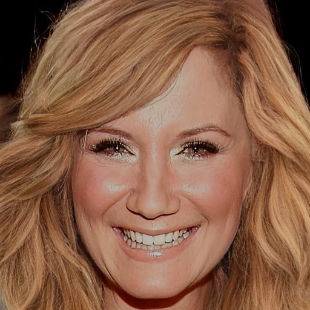 | 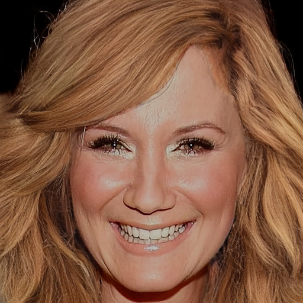 | 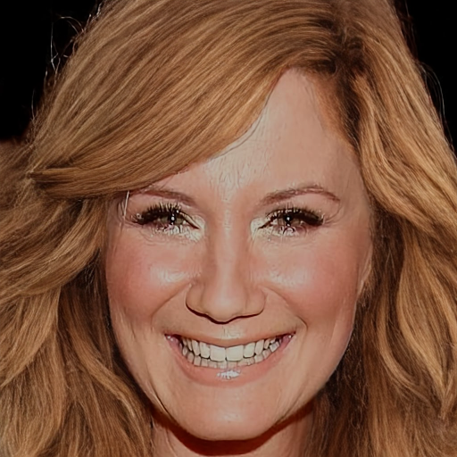 | 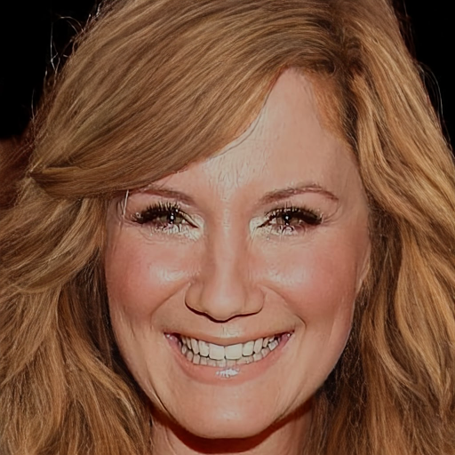 |

| 모델 | mcs1 (Ours) | mcs2 (Ours+Gate) | mcs3 (Sketch-only) | mcs4 (Sketch-only+Gate) | mcs5 (Raw-only) | mcs6 (Matte-CNN-only) |
| --- | :---: | :---: | :---: | :---: | :---: | :---: |
| warm L/b/C | +0.18 / +0.00 / -0.01 | -0.17 / +0.03 / +0.04 | -0.06 / +0.09 / +0.07 | +0.03 / +0.05 / +0.03 | +0.04 / +0.02 / +0.01 | +0.11 / +0.06 / +0.04 |
| cool L/b/C | +0.01 / +0.01 / +0.02 | -0.04 / +0.05 / +0.05 | +0.14 / +0.07 / +0.07 | +0.10 / +0.07 / +0.05 | -0.03 / +0.02 / +0.01 | -0.00 / +0.02 / +0.03 |
| dim L/b/C | -0.03 / +0.05 / +0.13 | -0.03 / +0.05 / +0.08 | +0.22 / +0.11 / +0.10 | +0.11 / +0.11 / +0.11 | -0.03 / +0.07 / +0.08 | -0.01 / +0.08 / +0.12 |

#### CM_1082

|  | target | **mcs1 (Ours)** | **mcs2 (Ours+Gate)** | **mcs3 (Sketch-only)** | **mcs4 (Sketch-only+Gate)** | **mcs5 (Raw-only)** | **mcs6 (Matte-CNN-only)** |
| --- | :---: | :---: | :---: | :---: | :---: | :---: | :---: |
| origin |  |  |  |  |  |  |  |
| warm |  |  |  |  |  |  |  |
| cool |  |  |  |  |  |  |  |
| dim |  |  |  |  |  |  |  |

| 모델 | mcs1 (Ours) | mcs2 (Ours+Gate) | mcs3 (Sketch-only) | mcs4 (Sketch-only+Gate) | mcs5 (Raw-only) | mcs6 (Matte-CNN-only) |
| --- | :---: | :---: | :---: | :---: | :---: | :---: |
| warm L/b/C | -0.01 / -0.02 / -0.03 | -0.61 / +0.04 / +0.03 | -1.08 / +0.07 / +0.07 | +0.00 / +0.06 / +0.06 | -0.60 / +0.04 / +0.04 | -0.21 / +0.05 / +0.04 |
| cool L/b/C | -0.10 / -0.02 / -0.01 | -0.08 / +0.02 / +0.02 | +0.08 / +0.04 / +0.03 | +0.13 / +0.06 / +0.04 | -0.06 / +0.02 / +0.01 | -0.06 / +0.05 / +0.05 |
| dim L/b/C | -0.09 / -0.06 / +0.13 | -0.05 / +0.00 / +0.06 | +0.14 / -0.01 / -0.00 | +0.08 / +0.02 / +0.04 | -0.06 / -0.01 / +0.03 | -0.05 / +0.03 / +0.10 |

#### CM_1101

|  | target | **mcs1 (Ours)** | **mcs2 (Ours+Gate)** | **mcs3 (Sketch-only)** | **mcs4 (Sketch-only+Gate)** | **mcs5 (Raw-only)** | **mcs6 (Matte-CNN-only)** |
| --- | :---: | :---: | :---: | :---: | :---: | :---: | :---: |
| origin |  |  |  |  |  |  |  |
| warm |  |  |  |  |  |  |  |
| cool |  |  |  |  |  |  |  |
| dim |  |  |  |  |  |  |  |

| 모델 | mcs1 (Ours) | mcs2 (Ours+Gate) | mcs3 (Sketch-only) | mcs4 (Sketch-only+Gate) | mcs5 (Raw-only) | mcs6 (Matte-CNN-only) |
| --- | :---: | :---: | :---: | :---: | :---: | :---: |
| warm L/b/C | +1.03 / +0.15 / +0.13 | +1.29 / +0.21 / +0.18 | +2.27 / +0.27 / +0.25 | +0.38 / +0.20 / +0.17 | +2.44 / +0.17 / +0.14 | +2.21 / +0.16 / +0.15 |
| cool L/b/C | +0.03 / +0.12 / +0.13 | -0.01 / +0.16 / +0.16 | +0.40 / +0.30 / +0.29 | +0.27 / +0.24 / +0.21 | -0.03 / +0.13 / +0.14 | -0.07 / +0.16 / +0.17 |
| dim L/b/C | -0.00 / -0.06 / -0.02 | +0.00 / -0.13 / -0.11 | +0.48 / +0.46 / +0.48 | +0.26 / +0.28 / +0.25 | +0.01 / -0.12 / -0.09 | +0.00 / -0.04 / +0.01 |

#### CM_1106

|  | target | **mcs1 (Ours)** | **mcs2 (Ours+Gate)** | **mcs3 (Sketch-only)** | **mcs4 (Sketch-only+Gate)** | **mcs5 (Raw-only)** | **mcs6 (Matte-CNN-only)** |
| --- | :---: | :---: | :---: | :---: | :---: | :---: | :---: |
| origin |  |  |  |  |  |  |  |
| warm |  |  |  |  |  |  |  |
| cool |  |  |  |  |  |  |  |
| dim |  |  |  |  |  |  |  |

| 모델 | mcs1 (Ours) | mcs2 (Ours+Gate) | mcs3 (Sketch-only) | mcs4 (Sketch-only+Gate) | mcs5 (Raw-only) | mcs6 (Matte-CNN-only) |
| --- | :---: | :---: | :---: | :---: | :---: | :---: |
| warm L/b/C | -0.04 / -0.01 / -0.02 | -0.23 / +0.05 / +0.04 | -1.04 / +0.05 / +0.05 | -0.13 / +0.04 / +0.04 | -0.34 / +0.02 / +0.03 | -0.15 / +0.02 / +0.02 |
| cool L/b/C | -0.12 / -0.01 / +0.00 | -0.09 / +0.05 / +0.04 | +0.25 / +0.04 / +0.03 | +0.17 / +0.08 / +0.06 | -0.15 / +0.03 / +0.02 | -0.09 / +0.06 / +0.06 |
| dim L/b/C | -0.09 / -0.01 / +0.08 | -0.07 / -0.03 / +0.01 | +0.24 / +0.11 / +0.13 | +0.13 / +0.12 / +0.10 | -0.07 / +0.02 / +0.04 | -0.07 / +0.08 / +0.13 |

