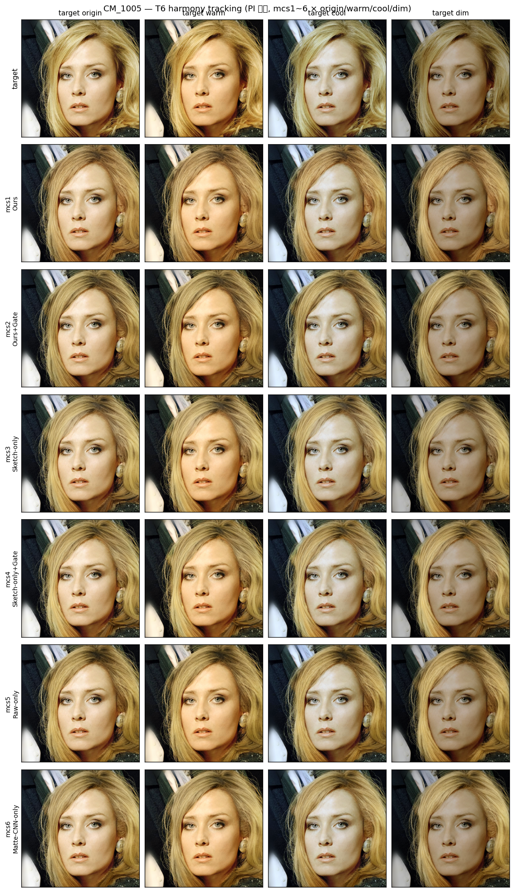
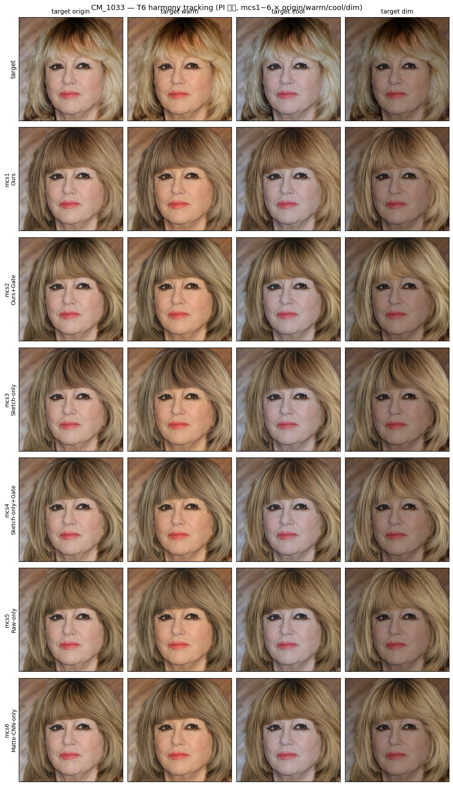
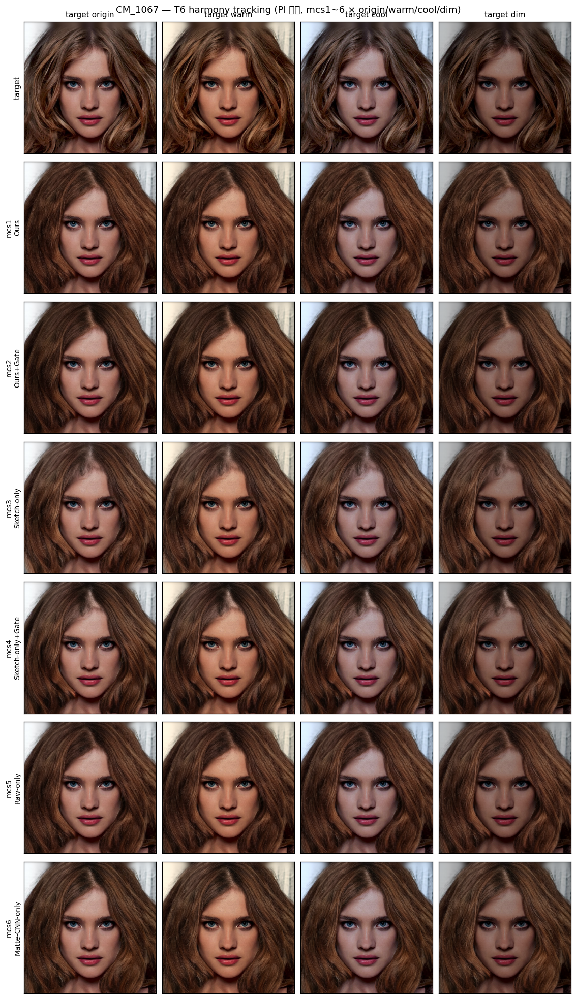
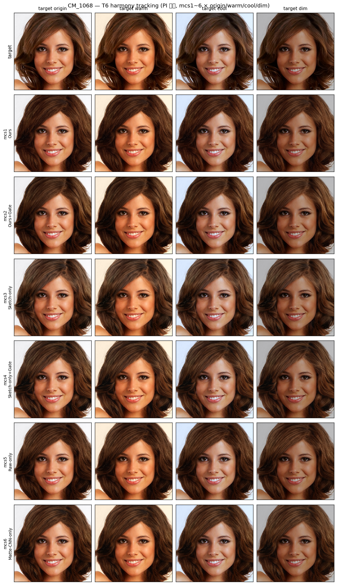
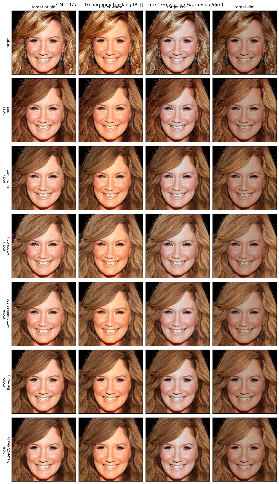
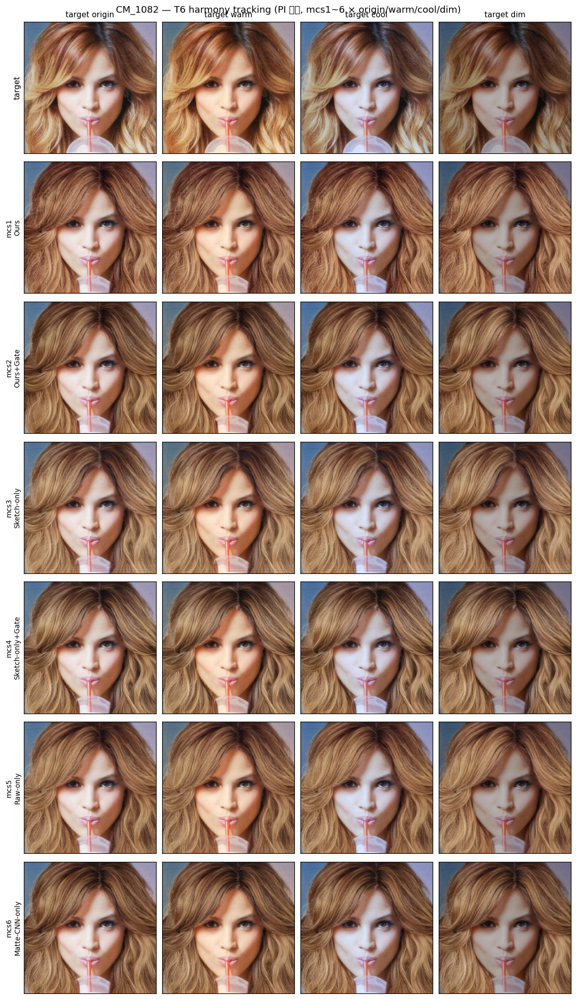
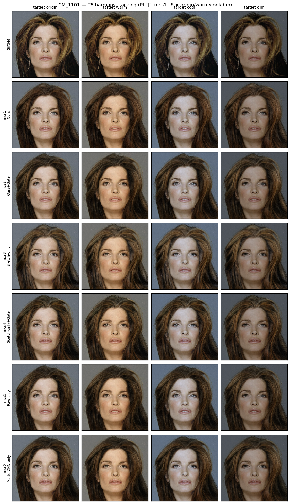
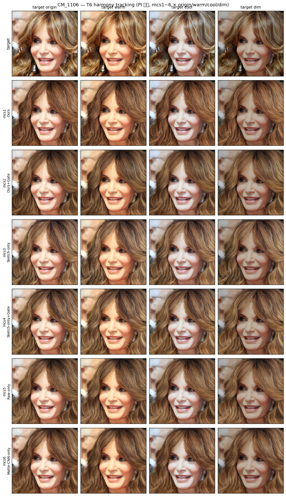

# T6 Sanity-Test — Harmony Tracking (gate trade-off 정량)

---

## 1. 실험 개요

| 항목 | 내용 |
|------|------|
| 목적 | 장면 톤 변화(warm/cool/dim)에 대한 헤어 색 추종 정도 측정 — gate trade-off 정량화 |
| 비교 모델 | **mcs1 ~ mcs6 전체 6구성** (핵심 쌍: Ours vs Ours+Gate) |
| 입력 고정 | **GT-recolor sketch** + GT matte (전 변형 동일, design.md L89 "스케치 색 = 원본 그대로 전 변형 고정") |
| 변수 | 타겟 face — origin / warm / cool / dim |
| 타겟 base | **A (face_A)** — bald(B)는 머리 없음, harmony tracking 측정 의미 X |
| 이미지 | CM_1005 / CM_1033 / CM_1067 / CM_1068 / CM_1077 / CM_1082 / CM_1101 / CM_1106 (8장) |
| 측정 지표 | **tracking ratio** = (pred Δ in matte) ÷ (face Δ in matte) — L·b·C 3축 |
| seed / steps | 고정 |

> **핵심 질문**: 모델이 장면 톤(face의 warm/cool/dim 변화)에 따라 헤어 색을 얼마나 추종(harmonize)하는가, 또는 sketch가 지시한 albedo를 얼마나 고정(독립)하는가?
> **예측 (design.md L92)**: Ours(mcs1) ≈ 1 (scene harmonize) / Ours+Gate(mcs2) 낮음 (배경 독립)

---

## 2. 모델 정의 (mcs1 ~ mcs6 전체)

| 명칭 | 내부 코드 | MatteCNN | matte_raw | gate | ControlNet 입력 (17ch) |
|------|-----------|:---:|:---:|:---:|---|
| **Ours**              | mcs1 | ✅ ON  | ✅ ON  | ❌ OFF | `cat([sketch_lat + MatteCNN_feat, matte_raw])` |
| **Ours+Gate**         | mcs2 | ✅ ON  | ✅ ON  | ✅ ON  | mcs1 + gate (all blocks) |
| **Sketch-only**       | mcs3 | ❌ OFF | ❌ OFF | ❌ OFF | `cat([sketch_lat + zeros, zeros])` — floor |
| **Sketch-only+Gate**  | mcs4 | ❌ OFF | ❌ OFF | ✅ ON  | mcs3 + gate (all blocks) |
| **Raw-only**          | mcs5 | ❌ OFF | ✅ ON  | ❌ OFF | `cat([sketch_lat + zeros, matte_raw])` |
| **Matte-CNN-only**    | mcs6 | ✅ ON  | ❌ OFF | ❌ OFF | `cat([sketch_lat + MatteCNN_feat, zeros])` |

---

## 3. C″ 리라이팅 (PI 확정 표, design.md L53-59 그대로)

| 변형 | sRGB gain (R, G, B) | 등가 느낌 | 목표 시프트 | **실측 (8 stems 평균, 헤어 영역)** |
|------|---------------------|----------|------------|---|
| Warm | ×1.18, ×1.03, ×0.82 | 6500K → 4300K | Δb ≈ +12~15 | **Δb = +4.8, ΔL = +0.2** |
| Cool | ×0.84, ×0.98, ×1.18 | 6500K → 9500K | Δb ≈ −12~15 | **Δb = −5.0, ΔL = −2.3** |
| Dim  | 전 채널 ×0.55       | 어두운 실내   | ΔL ≈ −20~25 | **ΔL = −10.6, ΔC = −4.6** |

> 구현: sRGB→linear→gain→sRGB, pre-scale ×0.95 (warm R 클리핑 방지)
> **caveat**: 실측 T가 design.md "목표 시프트"의 **약 1/3~1/2 수준**. 분모 약함 → tracking ratio 측정 noise dominant 가능.

---

## 4. 측정 — tracking ratio (L · b · C, design.md L91)

> **tracking ratio**: 출력 헤어 영역의 Lab 변화량을 face 변화량으로 나눈 값
> - **L ratio** = (pred ΔL) / (face ΔL) — luminance 추종
> - **b ratio** = (pred Δb) / (face Δb) — hue (yellow-blue) 추종
> - **C ratio** = (pred ΔChroma) / (face ΔChroma) — chroma 추종

### 종합 측정 — 모델별 평균 (8 stems × 3 변형 = 24 samples)

| 모델 | L ratio | b ratio (hue) | C ratio |
|------|:---:|:---:|:---:|
| mcs1 (Ours)              | −0.101 | 0.029 | 0.054 |
| mcs2 (Ours+Gate)         | −0.102 | 0.056 | 0.061 |
| mcs3 (Sketch-only)       | **0.122** | **0.148** | **0.144** |
| mcs4 (Sketch-only+Gate)  | 0.123 | 0.128 | 0.116 |
| mcs5 (Raw-only)          | −0.149 | 0.050 | 0.055 |
| mcs6 (Matte-CNN-only)    | −0.080 | 0.077 | 0.091 |

### 결과 해석

- **모든 모델 tracking ratio ≈ 0** (절대값 < 0.2) — design.md 예측 "Ours ≈ 1" **부합 X**.
- 순위: **mcs3 ≈ mcs4 (sketch-only 계열) > mcs6 > mcs2 ≈ mcs5 ≈ mcs1** (b/C ratio 기준)
- **모든 모델이 "tracking ↓ = 색 고정 (배경-독립)"** 쪽 (design.md L93 해석 프레임).
- **Ours(mcs1) vs Ours+Gate(mcs2)** 차이 미세 (L 0.001, b 0.027, C 0.007) — gate trade-off 효과 명확히 나타나지 않음.
- L ratio 음수 (mcs1/2/5/6): 모델 출력 luminance가 face 변화와 반대 방향 → 측정 noise floor or sketch 색 dominant.

### 원인 추정 (caveat)

1. **C″ 강도 약함** — design.md 목표 시프트의 1/3~1/2 수준 → tracking ratio 분모 작음 → noise 비율 큼
2. **GT-recolor sketch가 강한 albedo 지시** — 학습 분포에 sketch 색 = 평균 GT 헤어 색이 정착돼, 모델이 sketch 색에 강하게 의존, face 톤 변화 무시
3. 둘 다 작용 → 모든 모델이 "albedo 고정" 쪽으로 수렴

### 모델 별 finding

- **mcs3/4 (sketch-only 계열)** 이 가장 큰 양의 tracking ratio (0.12~0.18) — matte 없으니 face(BLD source) 영향 약간 받음
- **mcs1/2/5/6 (matte 활용 계열)** 은 모두 0 근처 — matte conditioning이 face 영향 효과적으로 차단
- **Gate 효과**: mcs1↔mcs2 거의 동일 (L −0.101 vs −0.102), mcs3↔mcs4도 미세. gate가 추종/독립을 의미 있게 분리 못 함

> design.md 예측("Ours ≈ 1 추종 / Ours+Gate ↓ 독립")이 **현재 setup(약한 T + GT-recolor sketch)에서는 안 나타남**. 강한 T (PI 표보다 ×1.5~2배) + 다른 sketch 색 전략 (예: 흑백 단색)으로 재실험하면 분리 가능성.

---

## 5. Figure (per-stem)

*각 행: target faces / mcs1 / mcs2 / mcs3 / mcs4 / mcs5 / mcs6*
*각 열: origin / warm / cool / dim*

#### CM_1005

#### CM_1033

#### CM_1067

#### CM_1068

#### CM_1077

#### CM_1082

#### CM_1101

#### CM_1106

