# T6 Sanity-Test v2 — Strong gain (design.md 목표 시프트 ~70% 달성)

> T6_v1(PI 표) 대비 gain 강도 ×2 키워 design.md "목표 시프트" 달성 시도한 후속 실험.

---

## 1. 변경 사항 vs T6_v1

| 항목 | T6_v1 (PI) | **T6_v2 (Strong)** |
|------|------|------|
| Warm gain | (1.18, 1.03, 0.82) | **(1.40, 1.05, 0.65)** |
| Cool gain | (0.84, 0.98, 1.18) | **(0.65, 0.97, 1.40)** |
| Dim gain  | (0.55) | **(0.40)** |
| pre-scale | 0.95 | **0.92** |

### 분모 T 실측 비교 (8 stems 평균, 헤어 영역)

| 변형 | design.md 목표 | T6_v1 (PI) | **T6_v2 (Strong)** | Strong 달성률 |
|------|---|---|---|---|
| Warm Δb | +12~15 | +4.78 | **+8.37** | ~65% |
| Cool Δb | −12~15 | −5.03 | **−9.56** | ~76% |
| Dim ΔL  | −20~25 | −10.63 | **−15.34** | ~70% |

---

## 2. 모델 정의 (mcs1 ~ mcs6 전체)

| 명칭 | 내부 코드 | MatteCNN | matte_raw | gate |
|------|-----------|:---:|:---:|:---:|
| **Ours**              | mcs1 | ✅ ON  | ✅ ON  | ❌ OFF |
| **Ours+Gate**         | mcs2 | ✅ ON  | ✅ ON  | ✅ ON  |
| **Sketch-only**       | mcs3 | ❌ OFF | ❌ OFF | ❌ OFF |
| **Sketch-only+Gate**  | mcs4 | ❌ OFF | ❌ OFF | ✅ ON  |
| **Raw-only**          | mcs5 | ❌ OFF | ✅ ON  | ❌ OFF |
| **Matte-CNN-only**    | mcs6 | ✅ ON  | ❌ OFF | ❌ OFF |

---

## 3. 종합 측정 — PI vs Strong (모델별 평균)

| 모델 | T6_v1 (PI) L / hue / b / C | **T6_v2 (Strong) L / hue / b / C** |
|------|:---:|:---:|
| mcs1 (Ours)              | −0.101 / 0.056 / 0.029 / 0.054 | **−0.043 / −0.008 / 0.032 / 0.060** |
| mcs2 (Ours+Gate)         | −0.102 / 0.115 / 0.056 / 0.061 | **−0.093 / 0.075 / 0.060 / 0.064** |
| mcs3 (Sketch-only)       | 0.122 / 0.153 / 0.148 / 0.144 | **0.102 / 0.142 / 0.135 / 0.132** |
| mcs4 (Sketch-only+Gate)  | 0.123 / 0.071 / 0.128 / 0.116 | **0.124 / 0.133 / 0.120 / 0.112** |
| mcs5 (Raw-only)          | −0.149 / 0.102 / 0.050 / 0.055 | **−0.126 / 0.002 / 0.056 / 0.059** |
| mcs6 (Matte-CNN-only)    | −0.080 / 0.132 / 0.077 / 0.091 | **−0.075 / 0.012 / 0.082 / 0.093** |

### 🔴 핵심 발견 — PI vs Strong 거의 동일

T 강도 ×2 키웠는데 tracking ratio는 모든 metric에서 거의 변화 없음 (특히 L·b·C). **"T 강도 약함"이 원인 X**.

(hue 각도 ratio는 일부 모델에서 ↓ — Strong 강도에서 hue 추종이 약화 — mcs1 0.056→−0.008, mcs5 0.102→0.002, mcs6 0.132→0.012. 이는 sketch 색 dominance가 더 강하게 작용한 결과로 해석)

### design.md 예측 vs 결과

| design.md L92 | 실제 |
|---|---|
| Ours ≈ 1 (harmonize) | mcs1 ≈ **0** (배경 독립) ✗ |
| Ours+Gate 낮음 (독립) | **mcs2 > mcs1** (gate가 오히려 약하게 추종) ✗ |

mcs3 (Sketch-only)이 가장 큰 양의 ratio (0.10~0.14) — matte 없으니 face(BLD) 영향 약간 받음.

---

## 4. 개별 결과 (per-stem, Strong 강도)

*각 stem 별로: 행 = target/모델, 열 = variant · 측정 = tracking ratio L/hue/b/C*

#### CM_1005

| | origin | warm | cool | dim |
|---|:---:|:---:|:---:|:---:|
| target |  |  |  |  |
| **mcs1 (Ours)** |  |  |  |  |
| **mcs2 (Ours+Gate)** |  |  |  |  |
| **mcs3 (Sketch-only)** |  | 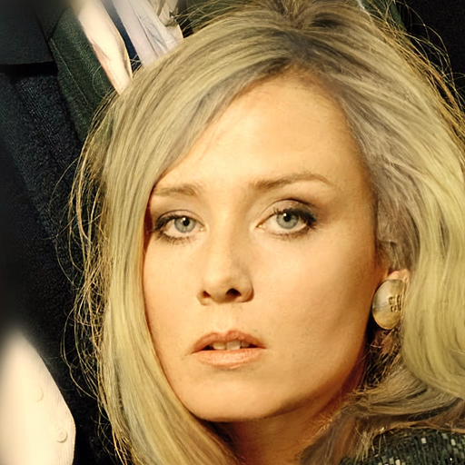 |  |  |
| **mcs4 (Sketch-only+Gate)** |  | 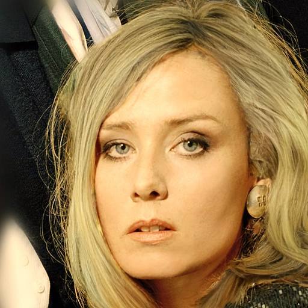 |  |  |
| **mcs5 (Raw-only)** |  |  |  |  |
| **mcs6 (Matte-CNN-only)** |  | 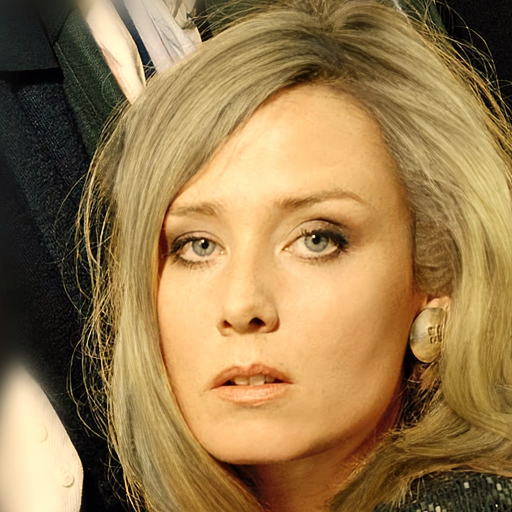 |  |  |

| 모델 | warm L/hue/b/C | cool L/hue/b/C | dim L/hue/b/C |
|------|:---:|:---:|:---:|
| mcs1 (Ours) | +0.14 / +0.15 / +0.14 / +0.14 | +0.14 / +0.13 / +0.12 / +0.15 | +0.14 / +nan / +0.19 / +0.20 |
| mcs2 (Ours+Gate) | +0.14 / +0.18 / +0.18 / +0.18 | +0.12 / +0.13 / +0.15 / +0.17 | +0.12 / +nan / +0.20 / +0.21 |
| mcs3 (Sketch-only) | +0.14 / +0.21 / +0.23 / +0.22 | +0.45 / +0.14 / +0.19 / +0.20 | +0.36 / +nan / +0.28 / +0.28 |
| mcs4 (Sketch-only+Gate) | +0.52 / +0.11 / +0.21 / +0.20 | +0.30 / +0.08 / +0.20 / +0.21 | +0.20 / +nan / +0.25 / +0.25 |
| mcs5 (Raw-only) | +0.10 / +0.11 / +0.18 / +0.17 | +0.09 / +0.08 / +0.17 / +0.18 | +0.11 / +nan / +0.23 / +0.23 |
| mcs6 (Matte-CNN-only) | +0.07 / +0.12 / +0.16 / +0.16 | +0.06 / +0.11 / +0.13 / +0.15 | +0.12 / +nan / +0.20 / +0.21 |

#### CM_1033

| | origin | warm | cool | dim |
|---|:---:|:---:|:---:|:---:|
| target |  |  |  |  |
| **mcs1 (Ours)** |  |  |  |  |
| **mcs2 (Ours+Gate)** |  |  |  |  |
| **mcs3 (Sketch-only)** |  |  |  |  |
| **mcs4 (Sketch-only+Gate)** |  |  |  |  |
| **mcs5 (Raw-only)** |  |  |  |  |
| **mcs6 (Matte-CNN-only)** |  |  |  |  |

| 모델 | warm L/hue/b/C | cool L/hue/b/C | dim L/hue/b/C |
|------|:---:|:---:|:---:|
| mcs1 (Ours) | -0.15 / +0.21 / +0.03 / +0.04 | -0.07 / +0.11 / +0.05 / +0.06 | -0.06 / +nan / +0.04 / +0.12 |
| mcs2 (Ours+Gate) | -0.29 / +0.17 / +0.08 / +0.08 | -0.07 / +0.10 / +0.09 / +0.09 | -0.06 / +nan / +0.08 / +0.10 |
| mcs3 (Sketch-only) | -0.08 / +0.34 / +0.11 / +0.12 | +0.34 / +0.05 / +0.10 / +0.10 | +0.18 / +nan / +0.03 / +0.05 |
| mcs4 (Sketch-only+Gate) | +0.01 / +0.14 / +0.08 / +0.08 | +0.15 / -0.01 / +0.11 / +0.10 | +0.06 / +nan / +0.07 / +0.07 |
| mcs5 (Raw-only) | -0.67 / +0.33 / +0.05 / +0.05 | -0.11 / +0.03 / +0.08 / +0.07 | -0.06 / +nan / +0.05 / +0.06 |
| mcs6 (Matte-CNN-only) | -0.39 / +0.28 / +0.07 / +0.08 | -0.08 / +0.10 / +0.11 / +0.11 | -0.05 / +nan / +0.14 / +0.16 |

#### CM_1067

| | origin | warm | cool | dim |
|---|:---:|:---:|:---:|:---:|
| target |  |  |  |  |
| **mcs1 (Ours)** |  |  |  |  |
| **mcs2 (Ours+Gate)** |  |  |  |  |
| **mcs3 (Sketch-only)** |  |  |  |  |
| **mcs4 (Sketch-only+Gate)** |  |  |  |  |
| **mcs5 (Raw-only)** |  |  |  |  |
| **mcs6 (Matte-CNN-only)** |  |  |  |  |

| 모델 | warm L/hue/b/C | cool L/hue/b/C | dim L/hue/b/C |
|------|:---:|:---:|:---:|
| mcs1 (Ours) | -0.31 / -0.04 / -0.01 / -0.00 | -0.04 / +0.01 / +0.01 / +0.01 | -0.08 / +nan / -0.04 / +0.06 |
| mcs2 (Ours+Gate) | -0.28 / +0.18 / +0.06 / +0.05 | -0.09 / +0.07 / +0.03 / +0.00 | -0.10 / +nan / -0.09 / -0.05 |
| mcs3 (Sketch-only) | -0.18 / +0.16 / +0.08 / +0.07 | +0.18 / +0.10 / +0.12 / +0.11 | +0.16 / +nan / +0.09 / +0.10 |
| mcs4 (Sketch-only+Gate) | -0.10 / +0.12 / +0.07 / +0.07 | +0.12 / +0.10 / +0.11 / +0.09 | +0.11 / +nan / +0.10 / +0.13 |
| mcs5 (Raw-only) | -0.22 / +0.02 / +0.05 / +0.06 | -0.09 / +0.08 / +0.04 / +0.02 | -0.09 / +nan / -0.07 / -0.06 |
| mcs6 (Matte-CNN-only) | -0.24 / +0.27 / +0.10 / +0.08 | -0.05 / +0.06 / +0.08 / +0.07 | -0.06 / +nan / -0.06 / +0.01 |

#### CM_1068

| | origin | warm | cool | dim |
|---|:---:|:---:|:---:|:---:|
| target |  |  |  |  |
| **mcs1 (Ours)** |  |  |  |  |
| **mcs2 (Ours+Gate)** |  |  |  |  |
| **mcs3 (Sketch-only)** |  |  |  |  |
| **mcs4 (Sketch-only+Gate)** |  |  |  |  |
| **mcs5 (Raw-only)** |  |  |  |  |
| **mcs6 (Matte-CNN-only)** |  |  |  |  |

| 모델 | warm L/hue/b/C | cool L/hue/b/C | dim L/hue/b/C |
|------|:---:|:---:|:---:|
| mcs1 (Ours) | -0.46 / +nan / +0.04 / +0.03 | -0.00 / +0.23 / +0.06 / +0.04 | -0.03 / -1.00 / -0.06 / +0.02 |
| mcs2 (Ours+Gate) | -0.40 / +nan / +0.11 / +0.09 | -0.02 / +0.53 / +0.08 / +0.04 | -0.04 / -0.31 / -0.08 / -0.06 |
| mcs3 (Sketch-only) | -0.18 / +nan / +0.13 / +0.11 | +0.43 / +0.50 / +0.17 / +0.13 | +0.36 / +0.19 / +0.20 / +0.20 |
| mcs4 (Sketch-only+Gate) | -0.26 / +nan / +0.17 / +0.15 | +0.26 / +0.65 / +0.16 / +0.12 | +0.23 / +0.56 / +0.16 / +0.12 |
| mcs5 (Raw-only) | -0.26 / +nan / +0.12 / +0.09 | -0.07 / +0.22 / +0.06 / +0.05 | -0.05 / -0.61 / -0.09 / -0.05 |
| mcs6 (Matte-CNN-only) | -0.22 / +nan / +0.11 / +0.09 | -0.03 / +0.05 / +0.10 / +0.11 | -0.00 / -0.98 / +0.02 / +0.09 |

#### CM_1077

| | origin | warm | cool | dim |
|---|:---:|:---:|:---:|:---:|
| target | 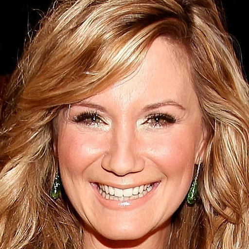 | 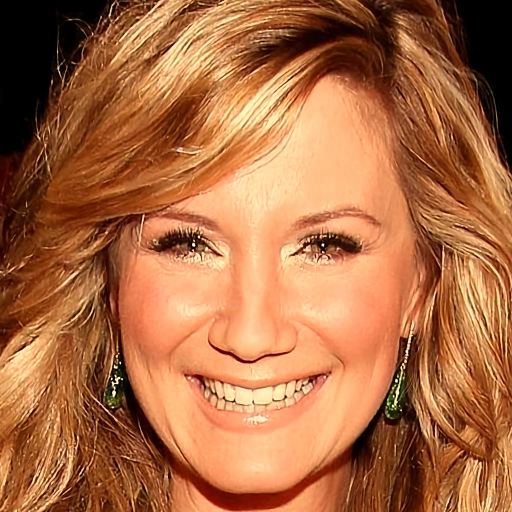 | 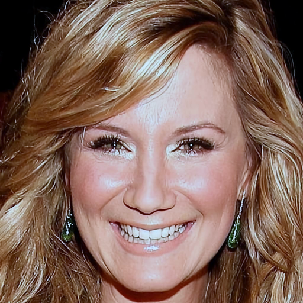 | 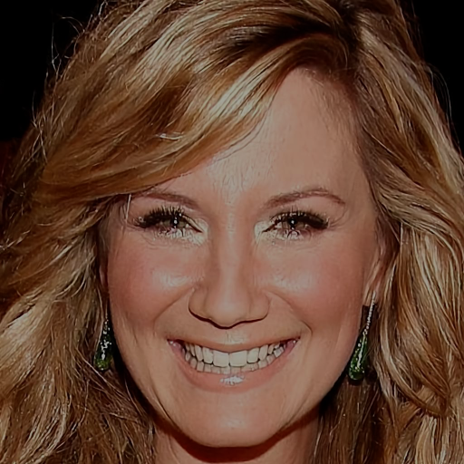 |
| **mcs1 (Ours)** |  | 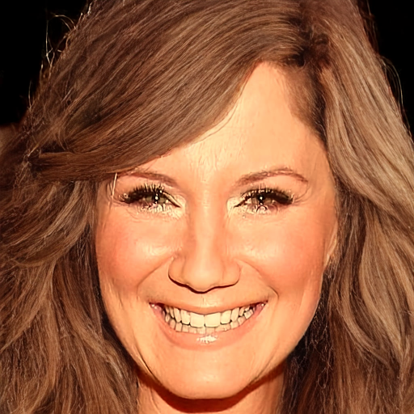 | 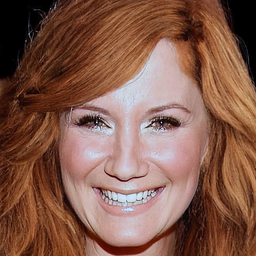 | 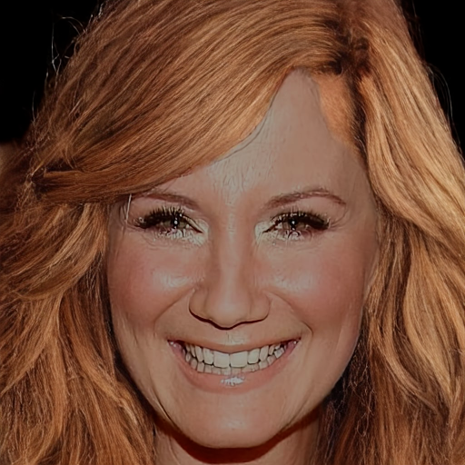 |
| **mcs2 (Ours+Gate)** |  | 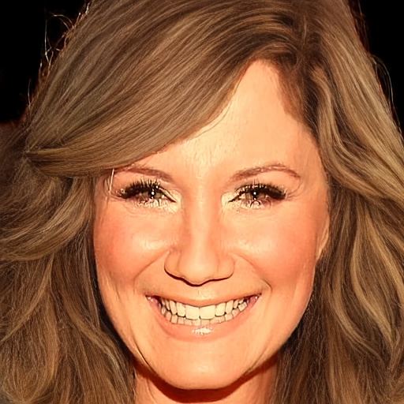 | 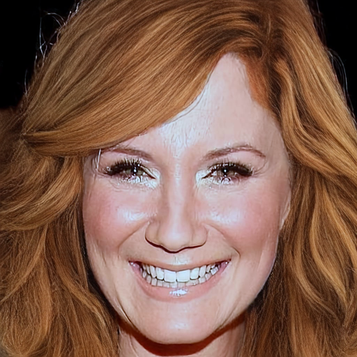 | 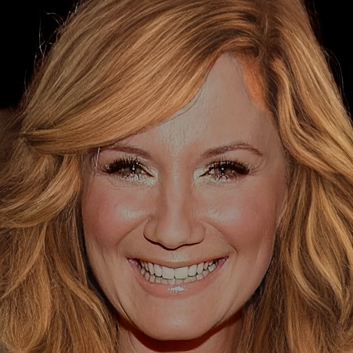 |
| **mcs3 (Sketch-only)** |  | 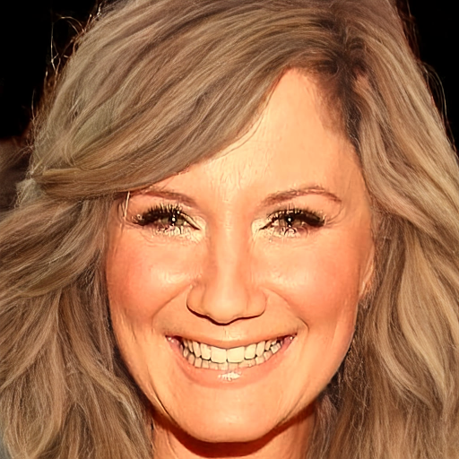 | 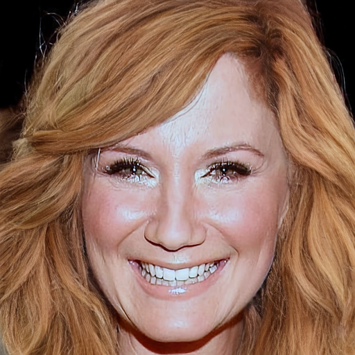 | 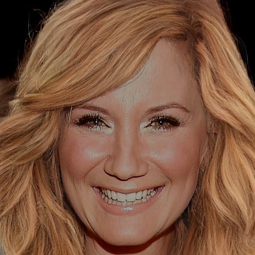 |
| **mcs4 (Sketch-only+Gate)** |  | 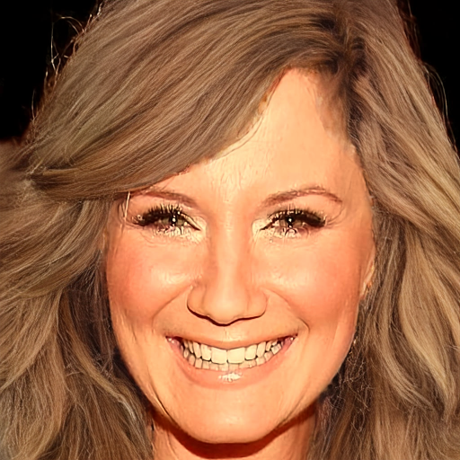 | 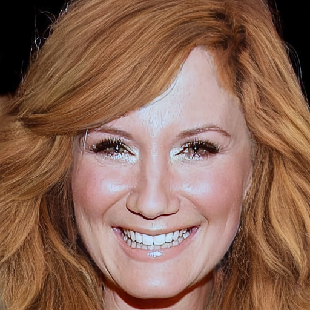 | 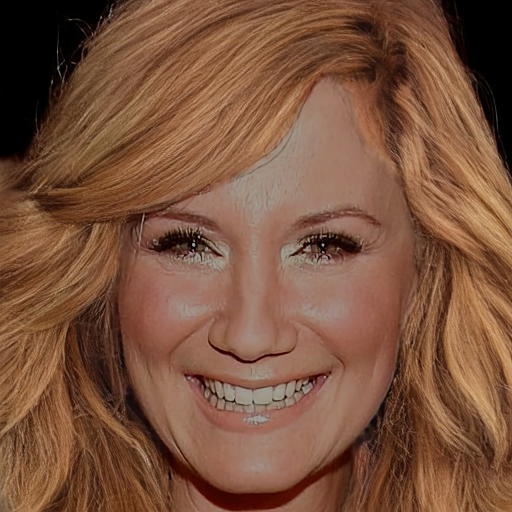 |
| **mcs5 (Raw-only)** |  | 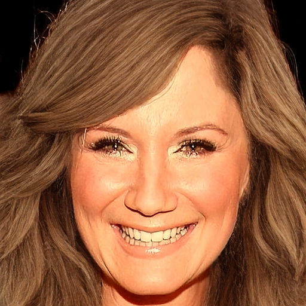 | 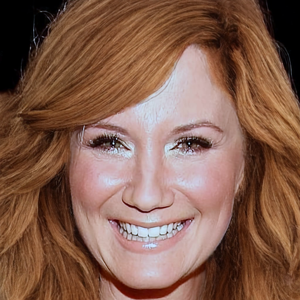 | 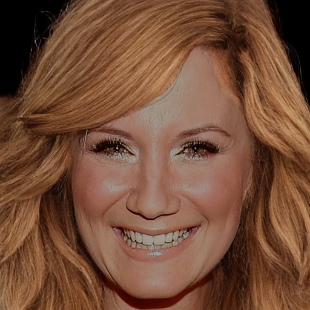 |
| **mcs6 (Matte-CNN-only)** |  | 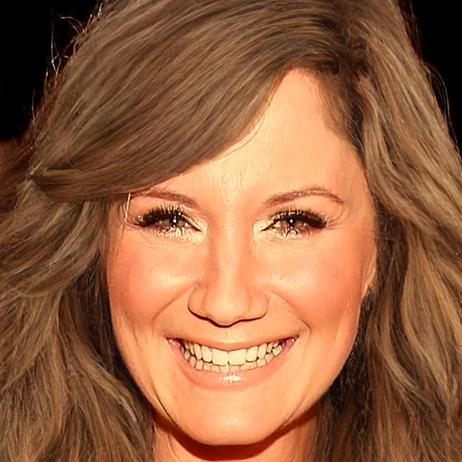 | 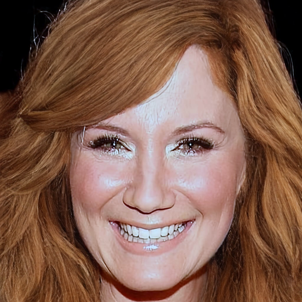 | 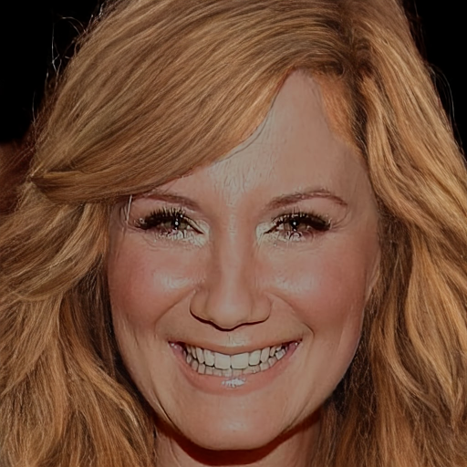 |

| 모델 | warm L/hue/b/C | cool L/hue/b/C | dim L/hue/b/C |
|------|:---:|:---:|:---:|
| mcs1 (Ours) | +0.15 / +nan / +0.00 / +0.01 | -0.00 / +nan / +0.00 / +0.01 | -0.04 / +nan / +0.05 / +0.12 |
| mcs2 (Ours+Gate) | -0.05 / +nan / +0.05 / +0.04 | -0.05 / +nan / +0.05 / +0.04 | -0.03 / +nan / +0.04 / +0.07 |
| mcs3 (Sketch-only) | -0.08 / +nan / +0.09 / +0.08 | +0.18 / +nan / +0.07 / +0.07 | +0.23 / +nan / +0.12 / +0.11 |
| mcs4 (Sketch-only+Gate) | -0.01 / +nan / +0.05 / +0.04 | +0.11 / +nan / +0.06 / +0.05 | +0.12 / +nan / +0.10 / +0.10 |
| mcs5 (Raw-only) | +0.03 / +nan / +0.03 / +0.03 | -0.04 / +nan / +0.03 / +0.02 | -0.03 / +nan / +0.06 / +0.08 |
| mcs6 (Matte-CNN-only) | +0.15 / +nan / +0.05 / +0.03 | +0.00 / +nan / +0.05 / +0.04 | -0.02 / +nan / +0.09 / +0.13 |

#### CM_1082

| | origin | warm | cool | dim |
|---|:---:|:---:|:---:|:---:|
| target |  |  |  |  |
| **mcs1 (Ours)** |  |  |  |  |
| **mcs2 (Ours+Gate)** |  |  |  |  |
| **mcs3 (Sketch-only)** |  |  |  |  |
| **mcs4 (Sketch-only+Gate)** |  |  |  |  |
| **mcs5 (Raw-only)** |  |  |  |  |
| **mcs6 (Matte-CNN-only)** |  |  |  |  |

| 모델 | warm L/hue/b/C | cool L/hue/b/C | dim L/hue/b/C |
|------|:---:|:---:|:---:|
| mcs1 (Ours) | +0.12 / +0.33 / -0.01 / -0.03 | -0.10 / -0.08 / -0.02 / -0.00 | -0.09 / +nan / -0.05 / +0.12 |
| mcs2 (Ours+Gate) | -0.28 / +0.23 / +0.04 / +0.03 | -0.08 / +0.04 / +0.02 / +0.02 | -0.06 / +nan / +0.01 / +0.07 |
| mcs3 (Sketch-only) | -0.37 / +0.11 / +0.06 / +0.05 | +0.09 / +0.07 / +0.05 / +0.04 | +0.11 / +nan / +0.02 / +0.02 |
| mcs4 (Sketch-only+Gate) | +0.15 / +0.22 / +0.05 / +0.04 | +0.12 / +0.10 / +0.06 / +0.04 | +0.07 / +nan / +0.00 / +0.02 |
| mcs5 (Raw-only) | -0.23 / +0.01 / +0.03 / +0.04 | -0.06 / +0.05 / +0.04 / +0.03 | -0.06 / +nan / +0.00 / +0.06 |
| mcs6 (Matte-CNN-only) | -0.01 / +0.22 / +0.05 / +0.04 | -0.05 / +0.00 / +0.05 / +0.05 | -0.06 / +nan / +0.05 / +0.11 |

#### CM_1101

| | origin | warm | cool | dim |
|---|:---:|:---:|:---:|:---:|
| target |  |  |  |  |
| **mcs1 (Ours)** |  |  |  |  |
| **mcs2 (Ours+Gate)** |  |  |  |  |
| **mcs3 (Sketch-only)** |  |  |  |  |
| **mcs4 (Sketch-only+Gate)** |  |  |  |  |
| **mcs5 (Raw-only)** |  |  |  |  |
| **mcs6 (Matte-CNN-only)** |  |  |  |  |

| 모델 | warm L/hue/b/C | cool L/hue/b/C | dim L/hue/b/C |
|------|:---:|:---:|:---:|
| mcs1 (Ours) | -0.15 / -0.16 / +0.15 / +0.14 | +0.02 / -0.06 / +0.14 / +0.14 | -0.01 / +nan / -0.06 / -0.02 |
| mcs2 (Ours+Gate) | -0.36 / -0.31 / +0.20 / +0.18 | -0.03 / +0.01 / +0.15 / +0.14 | +0.00 / +nan / -0.09 / -0.09 |
| mcs3 (Sketch-only) | -0.83 / +0.16 / +0.23 / +0.23 | +0.49 / -0.03 / +0.29 / +0.28 | +0.47 / +nan / +0.42 / +0.44 |
| mcs4 (Sketch-only+Gate) | -0.08 / +0.07 / +0.18 / +0.17 | +0.32 / -0.12 / +0.24 / +0.22 | +0.26 / +nan / +0.28 / +0.26 |
| mcs5 (Raw-only) | -0.98 / -0.22 / +0.18 / +0.16 | -0.04 / +0.04 / +0.13 / +0.14 | +0.00 / +nan / -0.11 / -0.10 |
| mcs6 (Matte-CNN-only) | -0.69 / -0.18 / +0.18 / +0.17 | -0.04 / +0.08 / +0.16 / +0.17 | -0.01 / +nan / -0.04 / -0.00 |

#### CM_1106

| | origin | warm | cool | dim |
|---|:---:|:---:|:---:|:---:|
| target |  |  |  |  |
| **mcs1 (Ours)** |  |  |  |  |
| **mcs2 (Ours+Gate)** |  |  |  |  |
| **mcs3 (Sketch-only)** |  |  |  |  |
| **mcs4 (Sketch-only+Gate)** |  |  |  |  |
| **mcs5 (Raw-only)** |  |  |  |  |
| **mcs6 (Matte-CNN-only)** |  |  |  |  |

| 모델 | warm L/hue/b/C | cool L/hue/b/C | dim L/hue/b/C |
|------|:---:|:---:|:---:|
| mcs1 (Ours) | +0.08 / +nan / +0.00 / -0.00 | -0.14 / +0.07 / -0.01 / -0.00 | -0.10 / +nan / -0.01 / +0.08 |
| mcs2 (Ours+Gate) | -0.15 / +nan / +0.05 / +0.05 | -0.10 / -0.03 / +0.04 / +0.04 | -0.07 / +nan / +0.01 / +0.04 |
| mcs3 (Sketch-only) | -0.46 / +nan / +0.04 / +0.04 | +0.27 / -0.18 / +0.05 / +0.04 | +0.20 / +nan / +0.08 / +0.10 |
| mcs4 (Sketch-only+Gate) | +0.05 / +nan / +0.03 / +0.03 | +0.17 / -0.29 / +0.06 / +0.05 | +0.10 / +nan / +0.09 / +0.07 |
| mcs5 (Raw-only) | -0.11 / +nan / +0.03 / +0.04 | -0.14 / -0.10 / +0.04 / +0.03 | -0.06 / +nan / +0.02 / +0.05 |
| mcs6 (Matte-CNN-only) | +0.00 / +nan / +0.02 / +0.03 | -0.12 / +0.02 / +0.05 / +0.05 | -0.07 / +nan / +0.08 / +0.12 |

