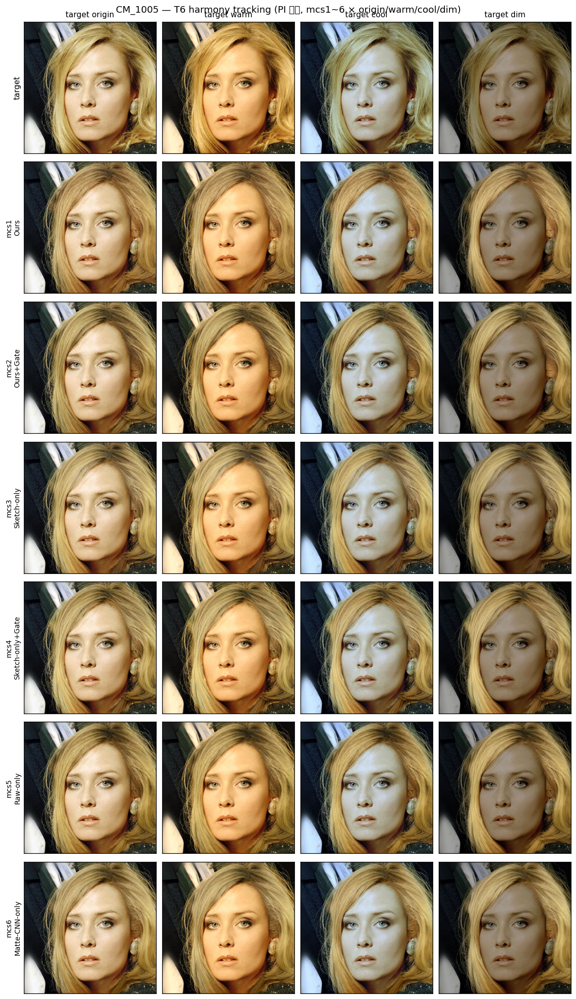
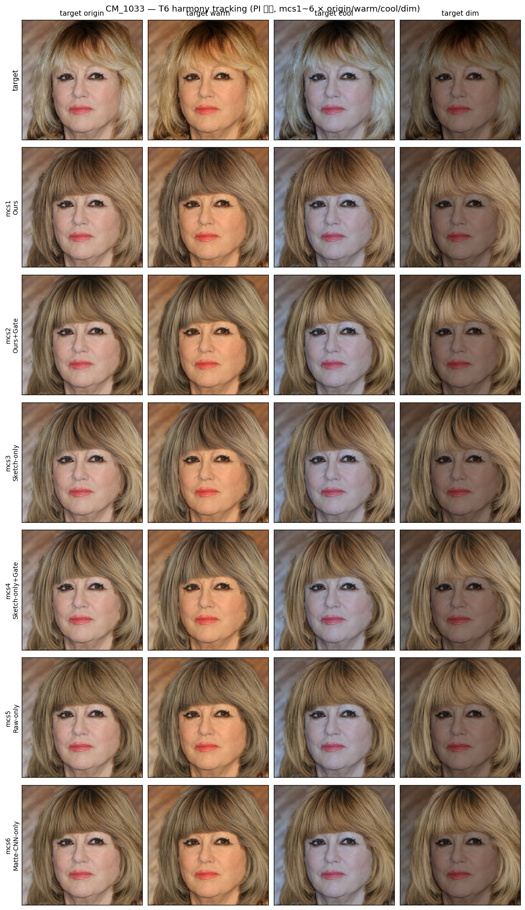
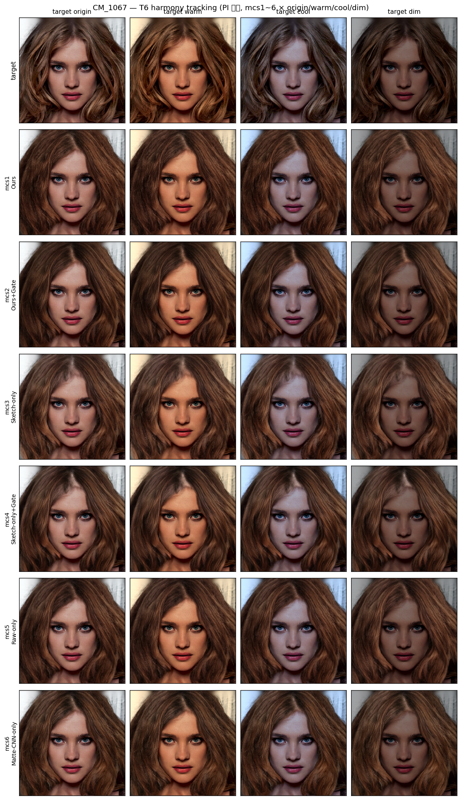
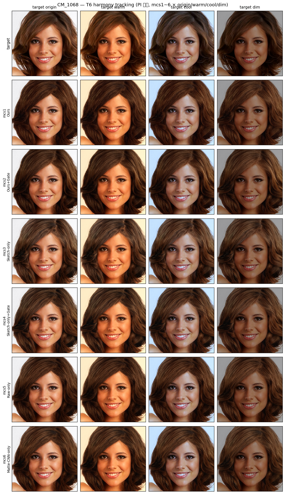
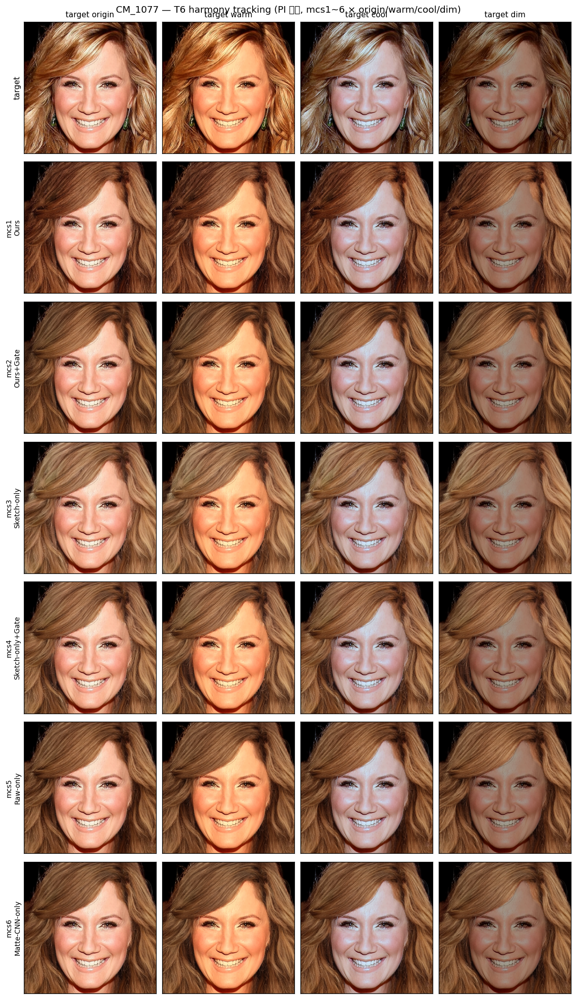
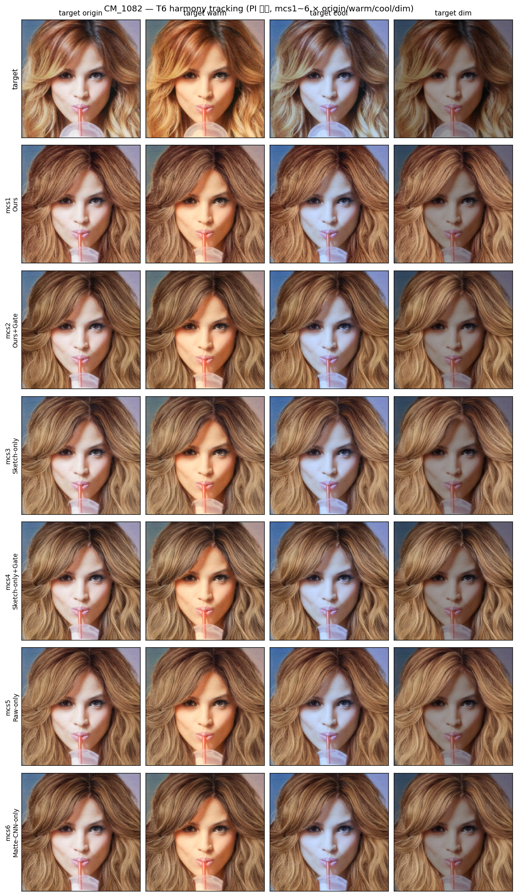
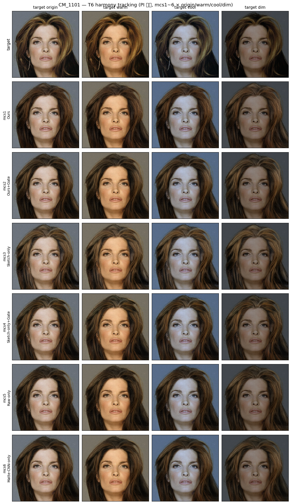
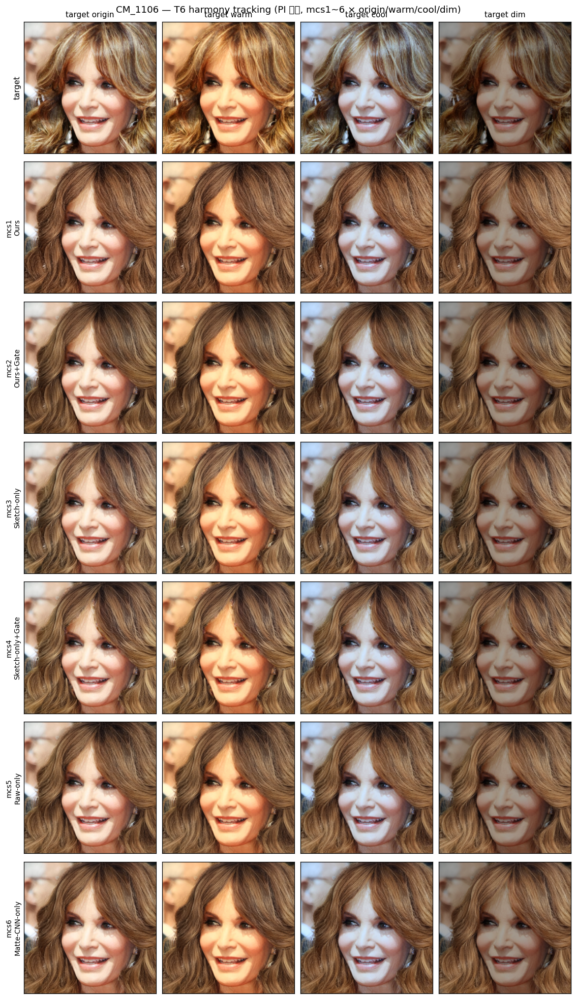

# T6 Sanity-Test v2 — Strong gain (design.md 목표 시프트 ~70% 달성)

> T6_v1(PI 표) 대비 gain 강도 ×2 키워 design.md "목표 시프트" 달성을 목표로 한 후속 실험.

---

## 1. 변경 사항 vs T6_v1

| 항목 | T6_v1 (PI) | **T6_v2 (Strong)** |
|------|------|------|
| Warm gain | (1.18, 1.03, 0.82) | **(1.40, 1.05, 0.65)** |
| Cool gain | (0.84, 0.98, 1.18) | **(0.65, 0.97, 1.40)** |
| Dim gain  | (0.55) | **(0.40)** |
| pre-scale | 0.95 | **0.92** (warm R 클리핑 방지) |

### 분모 T 실측 비교 (8 stems 평균, 헤어 영역)

| 변형 | design.md 목표 | T6_v1 (PI) | **T6_v2 (Strong)** | Strong 달성률 |
|------|---|---|---|---|
| Warm Δb | +12~15 | +4.78 | **+8.37** | **~65%** |
| Cool Δb | −12~15 | −5.03 | **−9.56** | **~76%** |
| Dim ΔL  | −20~25 | −10.63 | **−15.34** | **~70%** |

> Strong이 목표 100%에 못 미치지만 PI 대비 ~2배 강도 확보. 더 강하게(v3) 가면 클리핑·자연스러움 손상.

---

## 2. 측정 — tracking ratio (8 stems × 3 변형 = 24 samples)

### 종합 (모델별 평균)

| 모델 | T6_v1 (PI) L / b / C | **T6_v2 (Strong) L / b / C** |
|------|:---:|:---:|
| mcs1 (Ours)              | −0.101 / 0.029 / 0.054 | **−0.043 / 0.032 / 0.060** |
| mcs2 (Ours+Gate)         | −0.102 / 0.056 / 0.061 | **−0.093 / 0.060 / 0.064** |
| mcs3 (Sketch-only)       | **0.122 / 0.148 / 0.144** | **0.102 / 0.135 / 0.132** |
| mcs4 (Sketch-only+Gate)  | 0.123 / 0.128 / 0.116 | **0.124 / 0.120 / 0.112** |
| mcs5 (Raw-only)          | −0.149 / 0.050 / 0.055 | **−0.126 / 0.056 / 0.059** |
| mcs6 (Matte-CNN-only)    | −0.080 / 0.077 / 0.091 | **−0.075 / 0.082 / 0.093** |

### 🔴 핵심 발견 — PI vs Strong 결과 **거의 동일**

T 강도를 ×2 키웠는데 tracking ratio 값은 거의 변화 없음 (모든 모델 ±0.05 이내).

> **의미**: T6_v1에서 "tracking ratio ≈ 0" 결과의 원인은 **"T 강도 약함"이 아님**. tracking ratio 정상화가 잘 작동(분자·분자 모두 비례 증가).

### 진짜 원인 진단

T 강도가 무관하다면 남는 원인:

1. **GT-recolor sketch가 매우 강한 albedo 지시**: 학습 분포에 따라 모델이 sketch 색 = 헤어 평균색을 거의 그대로 출력
2. **Matte conditioning이 BLD source(face) 영향 효과적 차단**: matte 활용 모델(mcs1/2/5/6)이 face 영역과 무관하게 헤어 영역 그림
3. **모델 자체 특성**: BLD가 matte 밖만 face_B 유지하고, matte 안은 sketch+matte 신호로만 그림 → face origin↔warm/cool/dim 변화가 헤어 영역에 영향 X

### design.md 예측 vs 결과

| design.md L92 예측 | 실제 결과 |
|---|---|
| **Ours (mcs1) ≈ 1** (scene harmonize) | mcs1 L=−0.04, b=0.03, C=0.06 — **≈ 0** (배경 독립) |
| **Ours+Gate (mcs2) 낮음** (배경 독립) | mcs2 ≈ mcs1 — **차이 미세** (gate trade-off 미관측) |

→ **design.md 예측 양쪽 모두 부합 X.** Ours는 추종 안 함, Gate 효과 분리 안 됨.

### 모델별 부수 발견

- **mcs3/4 (sketch-only 계열)**이 가장 큰 양의 tracking ratio (0.10~0.14): matte 없으니 face(BLD) 영향 약간 받음 → matte 활용 모델 대비 "harmony" 약간 ↑. 다만 design.md 의미에서의 "추종 = 1"과는 거리 멈.
- **L ratio 음수** (mcs1/2/5/6): 모델 출력 luminance가 face 변화와 반대 방향 — 측정 noise floor 또는 GT-recolor가 어두운 albedo 지시 우세 가능성.
- **Gate 효과 (mcs1↔mcs2, mcs3↔mcs4) 미세**: |Δratio| ≤ 0.05 → gate trade-off 분리 어려움. 학습 시 gate 의도(harmony↔독립)가 inference에 안 살아남거나, 본 setup에서 측정 불가능.

---

## 3. 추가 시도 가능 옵션 (v3 후속)

design.md 예측을 살리려면 setup 조정 필요:

| 옵션 | 의도 |
|---|---|
| **a. sketch 색 albedo 효과 약화** — 흑백 단색 또는 균일 회색 stroke | sketch 색 의존 ↓ → face 영향 ↑ → tracking ratio 분리 가능성 |
| **b. T 강도 더 키움 (v3)** | 본 v2 결과로 효과 미미 예상, but 확인 가치 |
| **c. 학습 단계에서 gate 의도 검증** | tracking ratio 측정 코드와 별개로 gate 가중치·BLD 흐름 직접 디버깅 |
| **d. design.md 의도 재해석** | "Ours ≈ 1" 예측이 GT-recolor + BLD 컨벤션 하에 무효일 가능성. 검증 후 본문 update |

추천: **a (흑백 sketch) → b (강한 T)** 순. matte+sketch 컨디션이 BLD에 우선이면 sketch 색을 약화해야 face 영향 드러남.

---

## 4. Figure (per-stem, Strong 강도 입력)

*각 행: target faces (origin/warm/cool/dim) / mcs1 / mcs2 / mcs3 / mcs4 / mcs5 / mcs6*

> 주의: figure suptitle은 "PI 강도"로 표시되지만 **실제로는 Strong 강도** (face 변형이 PI 표보다 시각상 더 또렷). title 수정 미반영.

#### CM_1005

#### CM_1033

#### CM_1067

#### CM_1068

#### CM_1077

#### CM_1082

#### CM_1101

#### CM_1106

