# T2 Sanity-Test v2 — Sparsity Ladder (raw colored sketch, recolor X)

> v1과 동일 setup, 단 sketch는 GT-recolor 적용 X — 원본 dataset의 다색(알록달록) stroke 그대로 사용.

---

## 1. 실험 개요

| 항목 | 내용 |
|------|------|
| 목적 | sparsity가 증가할 때 MatteCNN의 기여 — sparse에서 CNN 이득 확대 여부 검증 (raw color 조건) |
| 비교 모델 | **mcs1 ~ mcs6 전체 6구성** (핵심 쌍: Ours vs Raw-only) |
| 입력 고정 | **raw colored sketch (3 sparsity, recolor X)** + GT matte + face_B |
| 변수 | **스트로크 수 sparsity 3단계** (dense / mid / sparse) |
| 타겟 조건 | **B** — HairMapper bald + 원본 장면 |
| 이미지 | CM_1005 / CM_1033 / CM_1067 / CM_1068 / CM_1077 / CM_1082 / CM_1101 / CM_1106 (8장) |
| 측정 지표 | **Edge IoU (vs sketch, matte 영역)** + **hair 영역 Chroma 평균** |
| seed / steps | T2_v1과 동일 |

> **예측 (design.md L104)**: sparse할수록 CNN 이득 확대 (mcs1 > mcs5). Raw-only(mcs5) muddy.

### Sparsity 정의

| 단계 | keep ratio | 비고 |
|---|---|---|
| **dense**  | 100% (원본 색 모두 keep) | 원본 sketch 그대로 |
| **mid**    | 50% | random color subsample, seed=42 |
| **sparse** | 20% | random color subsample, seed=42 |

> **v1과의 차이**: sketch는 **GT-recolor 적용 X**. 원본 dataset(SketchHairSalon paired) 의 다색 stroke 그대로.

---

## 2. 모델 정의 (mcs1 ~ mcs6 전체)

(T2_v1과 동일 — 생략)

---

## 3. 종합 측정 (8 stems 평균)

### Edge IoU

| sparsity | mcs1 (Ours) | mcs2 (Ours+Gate) | mcs3 (Sketch-only) | mcs4 (Sketch-only+Gate) | mcs5 (Raw-only) | mcs6 (Matte-CNN-only) |
|---|:---:|:---:|:---:|:---:|:---:|:---:|
| dense | 0.0460 | 0.0457 | **0.0462** | 0.0446 | 0.0450 | 0.0442 |
| mid | **0.0275** | 0.0260 | 0.0271 | 0.0261 | 0.0257 | 0.0253 |
| sparse | 0.0096 | **0.0127** | 0.0087 | 0.0090 | 0.0086 | 0.0117 |

### Chroma 평균 (Lab √(a²+b²), hair 영역, ↑ 자연 / ↓ muddy)

| sparsity | mcs1 (Ours) | mcs2 (Ours+Gate) | mcs3 (Sketch-only) | mcs4 (Sketch-only+Gate) | mcs5 (Raw-only) | mcs6 (Matte-CNN-only) |
|---|:---:|:---:|:---:|:---:|:---:|:---:|
| dense | 27.32 | 29.56 | 26.03 | 29.63 | **30.07** | 28.57 |
| mid | **29.32** | 27.03 | 23.67 | 27.83 | 28.88 | 27.20 |
| sparse | 17.67 | 14.22 | 17.49 | **20.18** | 19.79 | 14.99 |

방향성:
- **Sparsity ladder 효과**: Edge IoU 명확 감소 (0.045 → 0.027 → 0.010), Chroma도 감소.
- **design.md "sparse → mcs1 > mcs5" 예측 ✓ (v1과 반대로 v2에서 부분 성립)**: sparse Edge IoU mcs1(0.0096) > mcs5(0.0086) — 격차 0.0010 미세하지만 방향 일치.
- **design.md "Raw-only 색 탁(muddy)" 예측 ✗ (반대)**: sparse Chroma mcs5(19.79) > mcs1(17.67) — raw colored 입력에서는 mcs5가 matte raw로 색 더 잘 유지.
- **Chroma 절대값** v1보다 v2가 dense 영역에서 5~8 더 높음 (raw colored → 채도 그대로 전달, GT-recolor의 평균색 감쇠 효과 부재 확인).
- **Gate (mcs2) sparse Edge IoU 1위** (0.0127) — sparse 입력에서 gate가 sketch 정보 증폭에 기여, 단 Chroma는 mcs2(14.22)가 6모델 중 최저로 muddy 경향.

---

## 4. 개별 결과 (per-stem)

*각 stem 별로: 행 = sparsity, 열 = 모델 (sketch / mcs1 / mcs2 / mcs3 / mcs4 / mcs5 / mcs6)*

#### CM_1005

| 모델 | sketch | **mcs1 (Ours)** | **mcs2 (Ours+Gate)** | **mcs3 (Sketch-only)** | **mcs4 (Sketch-only+Gate)** | **mcs5 (Raw-only)** | **mcs6 (Matte-CNN-only)** |
| --- | :---: | :---: | :---: | :---: | :---: | :---: | :---: |
| dense |  | 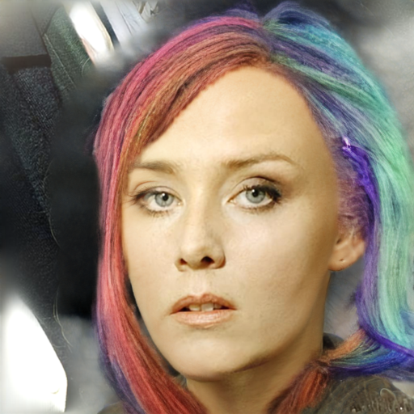 | 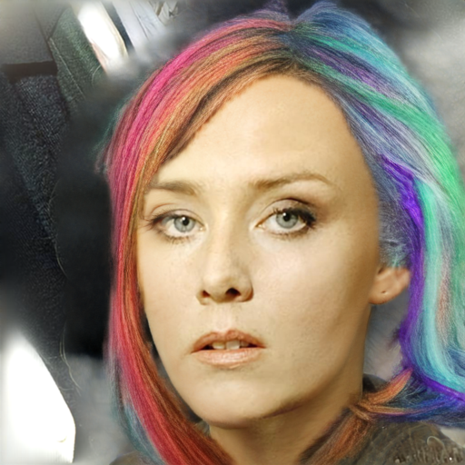 | 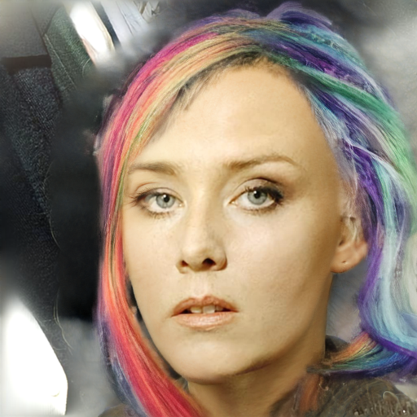 | 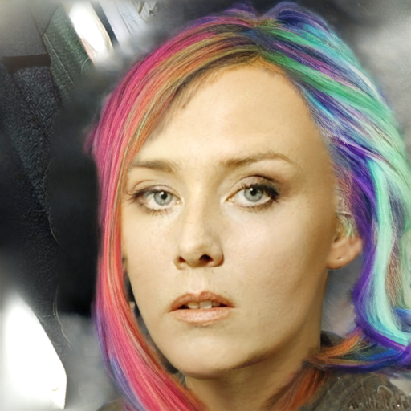 | 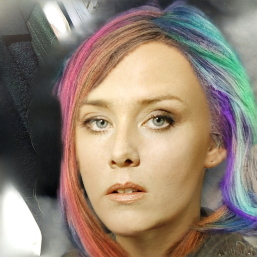 | 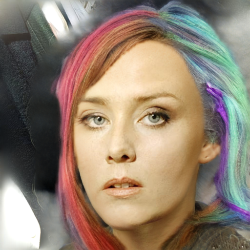 |
| mid | 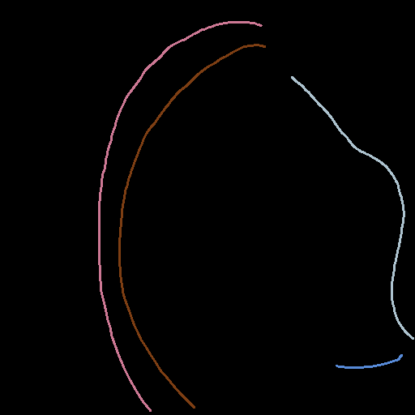 |  | 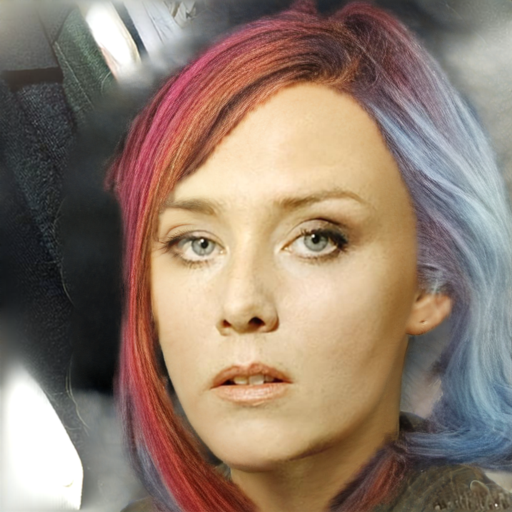 | 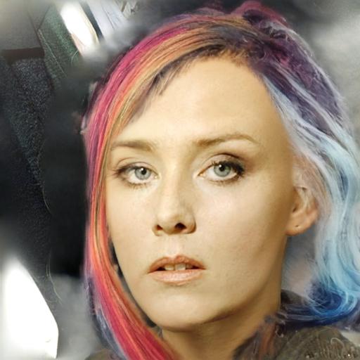 | 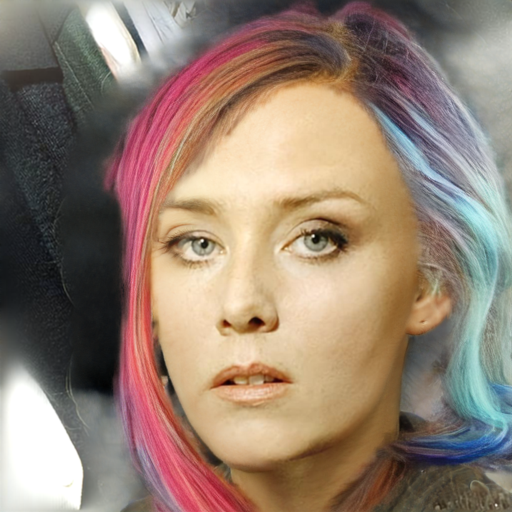 | 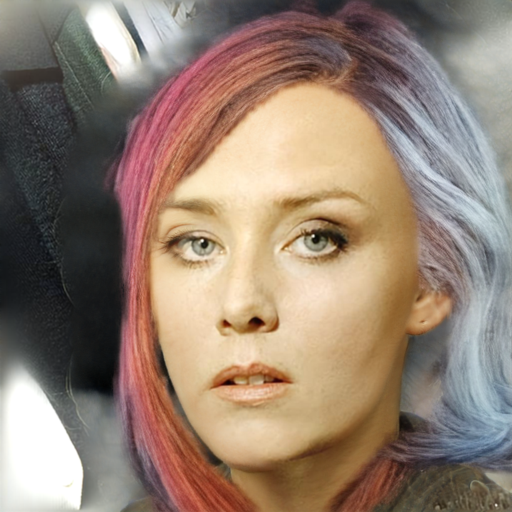 |  |
| sparse | 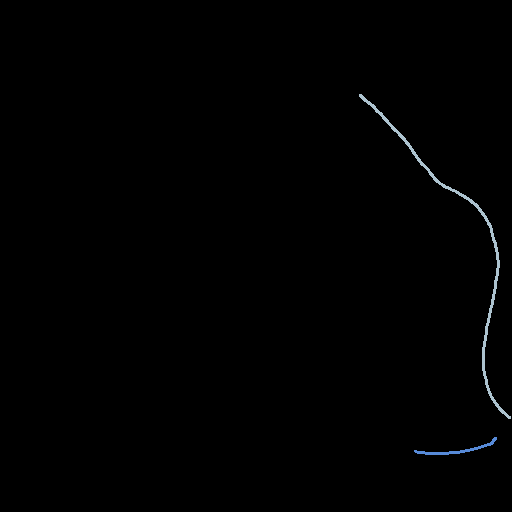 | 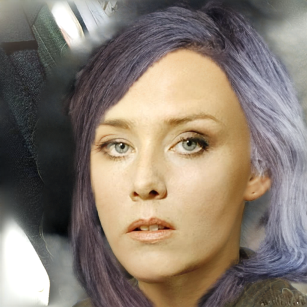 | 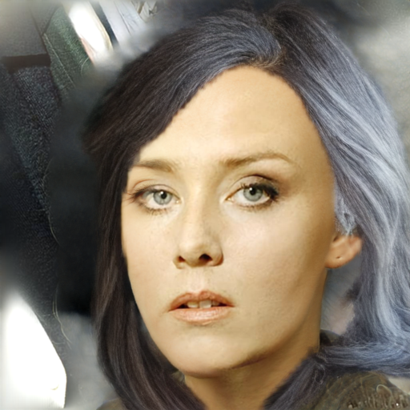 | 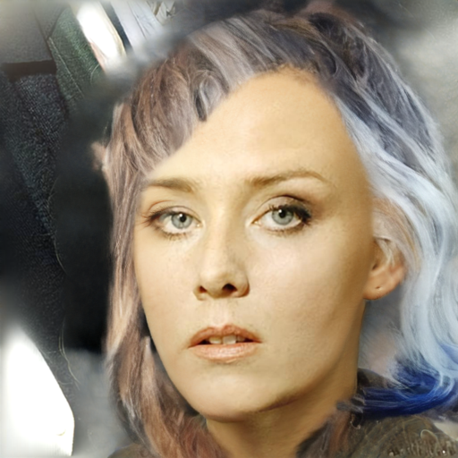 | 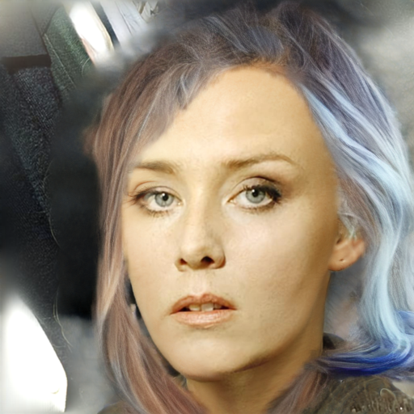 | 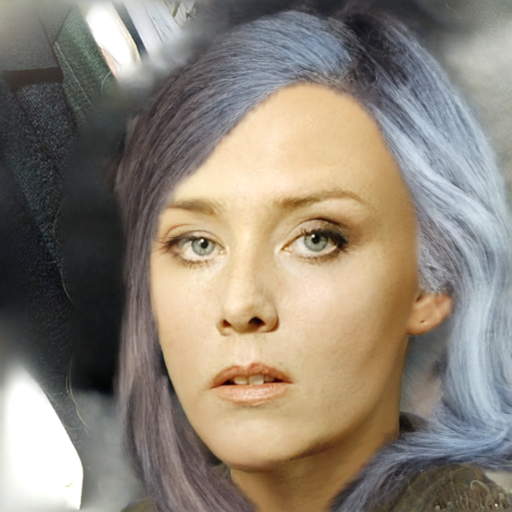 | 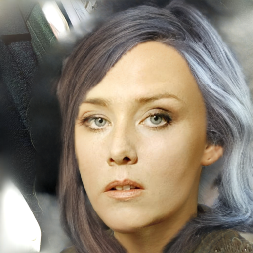 |

| 모델 | mcs1 (Ours) | mcs2 (Ours+Gate) | mcs3 (Sketch-only) | mcs4 (Sketch-only+Gate) | mcs5 (Raw-only) | mcs6 (Matte-CNN-only) |
| --- | :---: | :---: | :---: | :---: | :---: | :---: |
| dense (IoU / Chroma) | 0.0498 / 24.95 | 0.0518 / 26.04 | 0.0513 / 21.28 | 0.0539 / 26.37 | 0.0480 / 22.93 | 0.0507 / 24.34 |
| mid (IoU / Chroma) | 0.0357 / 22.71 | 0.0338 / 19.71 | 0.0356 / 18.59 | 0.0369 / 21.69 | 0.0355 / 17.78 | 0.0339 / 19.88 |
| sparse (IoU / Chroma) | 0.0107 / 8.05 | 0.0186 / 5.93 | 0.0108 / 10.68 | 0.0144 / 10.99 | 0.0101 / 7.04 | 0.0152 / 6.68 |

#### CM_1033

| 모델 | sketch | **mcs1 (Ours)** | **mcs2 (Ours+Gate)** | **mcs3 (Sketch-only)** | **mcs4 (Sketch-only+Gate)** | **mcs5 (Raw-only)** | **mcs6 (Matte-CNN-only)** |
| --- | :---: | :---: | :---: | :---: | :---: | :---: | :---: |
| dense | 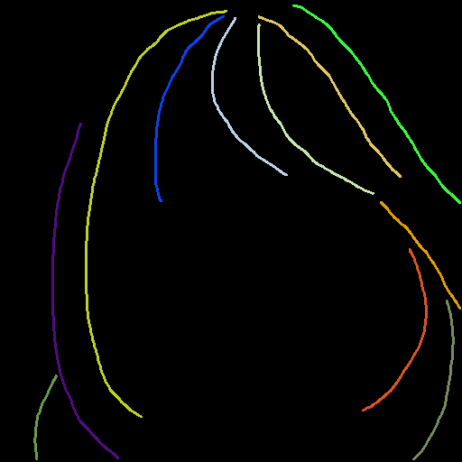 |  |  |  |  |  |  |
| mid |  |  |  |  |  |  |  |
| sparse | 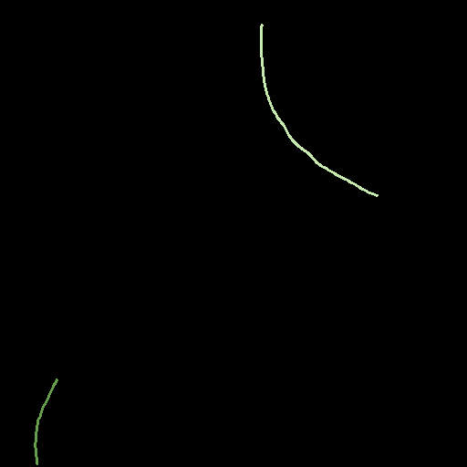 |  |  |  |  |  |  |

| 모델 | mcs1 (Ours) | mcs2 (Ours+Gate) | mcs3 (Sketch-only) | mcs4 (Sketch-only+Gate) | mcs5 (Raw-only) | mcs6 (Matte-CNN-only) |
| --- | :---: | :---: | :---: | :---: | :---: | :---: |
| dense (IoU / Chroma) | 0.0405 / 28.53 | 0.0364 / 31.41 | 0.0412 / 24.49 | 0.0362 / 29.81 | 0.0395 / 32.85 | 0.0374 / 30.76 |
| mid (IoU / Chroma) | 0.0214 / 20.50 | 0.0179 / 24.04 | 0.0246 / 19.28 | 0.0188 / 27.71 | 0.0212 / 27.66 | 0.0197 / 23.92 |
| sparse (IoU / Chroma) | 0.0045 / 12.90 | 0.0060 / 15.18 | 0.0053 / 14.59 | 0.0050 / 17.58 | 0.0046 / 19.48 | 0.0060 / 14.10 |

#### CM_1067

| 모델 | sketch | **mcs1 (Ours)** | **mcs2 (Ours+Gate)** | **mcs3 (Sketch-only)** | **mcs4 (Sketch-only+Gate)** | **mcs5 (Raw-only)** | **mcs6 (Matte-CNN-only)** |
| --- | :---: | :---: | :---: | :---: | :---: | :---: | :---: |
| dense |  | 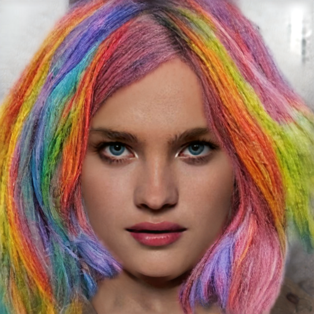 |  |  |  |  |  |
| mid | 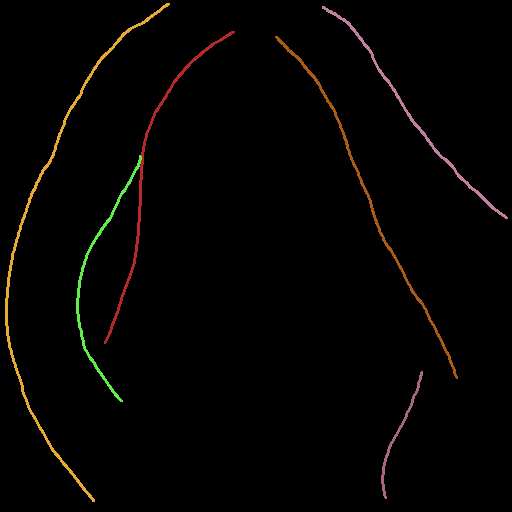 |  |  | 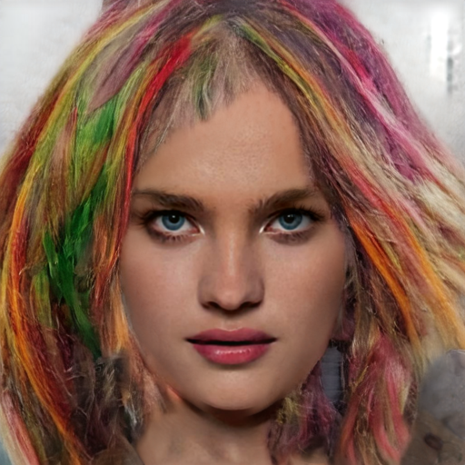 | 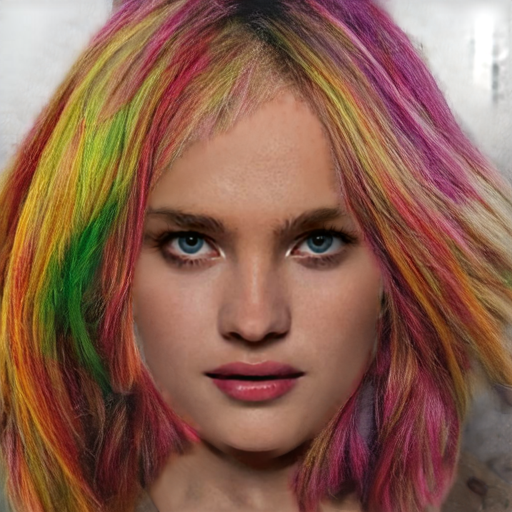 |  |  |
| sparse | 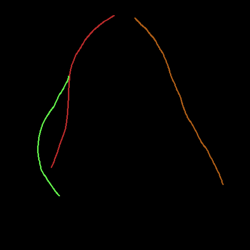 |  | 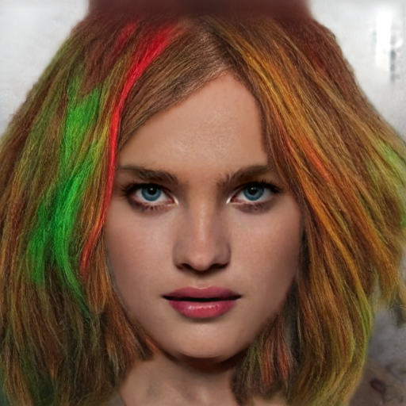 | 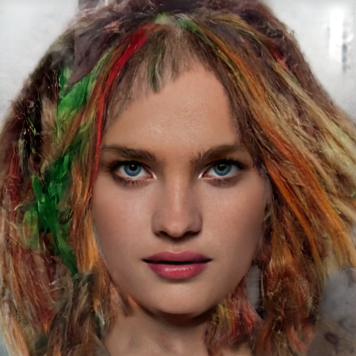 | 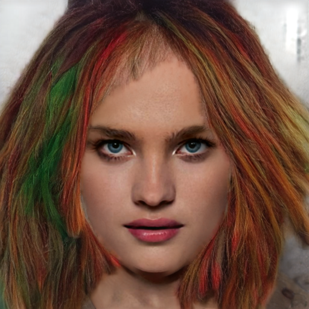 | 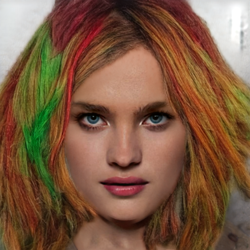 | 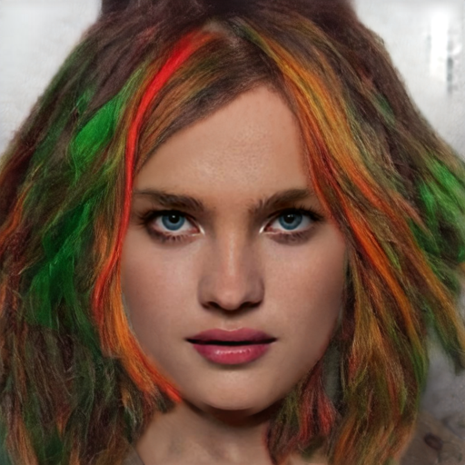 |

| 모델 | mcs1 (Ours) | mcs2 (Ours+Gate) | mcs3 (Sketch-only) | mcs4 (Sketch-only+Gate) | mcs5 (Raw-only) | mcs6 (Matte-CNN-only) |
| --- | :---: | :---: | :---: | :---: | :---: | :---: |
| dense (IoU / Chroma) | 0.0443 / 34.83 | 0.0435 / 36.85 | 0.0429 / 31.27 | 0.0424 / 29.97 | 0.0418 / 35.23 | 0.0394 / 34.43 |
| mid (IoU / Chroma) | 0.0245 / 39.70 | 0.0236 / 41.25 | 0.0259 / 25.33 | 0.0256 / 31.06 | 0.0250 / 39.30 | 0.0238 / 36.51 |
| sparse (IoU / Chroma) | 0.0148 / 25.72 | 0.0136 / 27.51 | 0.0136 / 21.79 | 0.0141 / 22.94 | 0.0125 / 31.26 | 0.0168 / 22.62 |

#### CM_1068

| 모델 | sketch | **mcs1 (Ours)** | **mcs2 (Ours+Gate)** | **mcs3 (Sketch-only)** | **mcs4 (Sketch-only+Gate)** | **mcs5 (Raw-only)** | **mcs6 (Matte-CNN-only)** |
| --- | :---: | :---: | :---: | :---: | :---: | :---: | :---: |
| dense |  |  |  |  |  |  |  |
| mid | 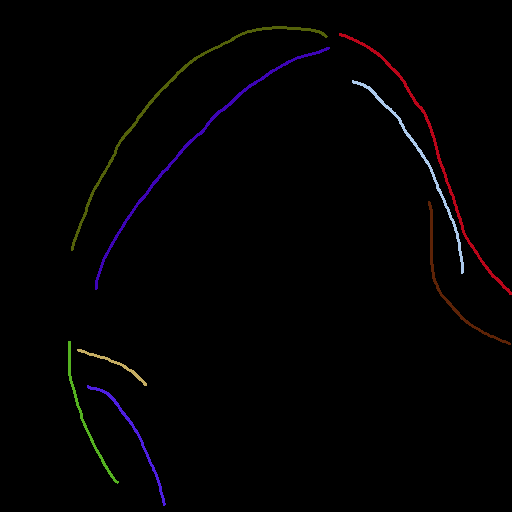 |  |  |  |  |  |  |
| sparse | 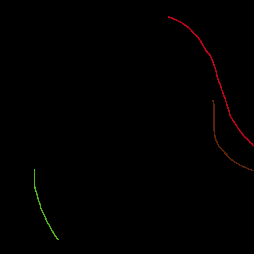 |  |  |  |  |  |  |

| 모델 | mcs1 (Ours) | mcs2 (Ours+Gate) | mcs3 (Sketch-only) | mcs4 (Sketch-only+Gate) | mcs5 (Raw-only) | mcs6 (Matte-CNN-only) |
| --- | :---: | :---: | :---: | :---: | :---: | :---: |
| dense (IoU / Chroma) | 0.0444 / 25.09 | 0.0401 / 27.29 | 0.0443 / 25.31 | 0.0423 / 29.03 | 0.0422 / 27.28 | 0.0415 / 26.83 |
| mid (IoU / Chroma) | 0.0272 / 26.94 | 0.0221 / 23.23 | 0.0251 / 23.16 | 0.0208 / 24.64 | 0.0218 / 23.96 | 0.0221 / 22.94 |
| sparse (IoU / Chroma) | 0.0069 / 21.98 | 0.0065 / 14.02 | 0.0051 / 18.95 | 0.0065 / 20.79 | 0.0066 / 20.16 | 0.0065 / 15.91 |

#### CM_1077

| 모델 | sketch | **mcs1 (Ours)** | **mcs2 (Ours+Gate)** | **mcs3 (Sketch-only)** | **mcs4 (Sketch-only+Gate)** | **mcs5 (Raw-only)** | **mcs6 (Matte-CNN-only)** |
| --- | :---: | :---: | :---: | :---: | :---: | :---: | :---: |
| dense |  |  |  |  |  |  |  |
| mid | 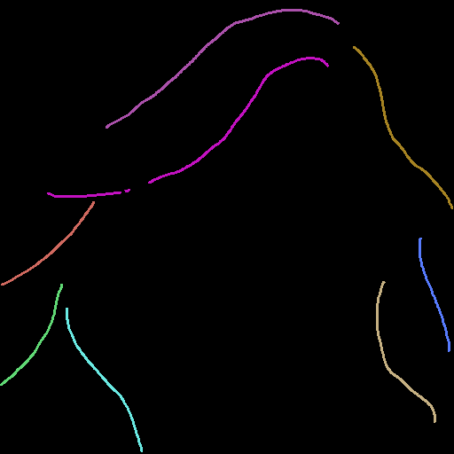 |  | 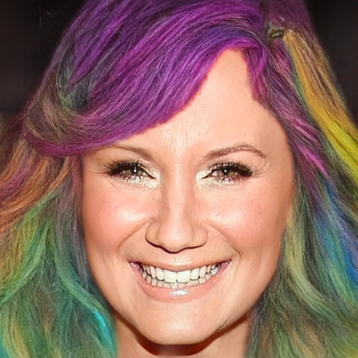 | 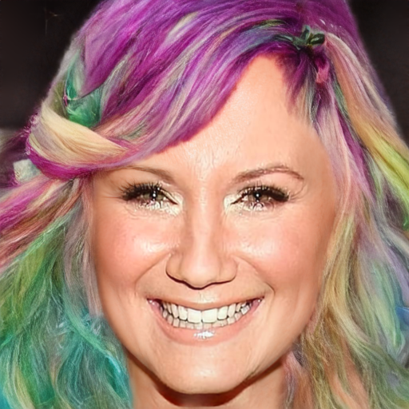 | 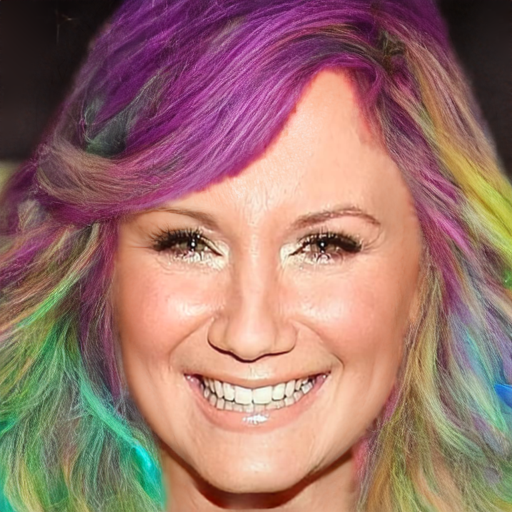 | 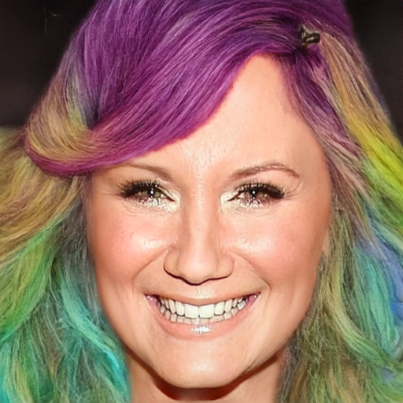 |  |
| sparse | 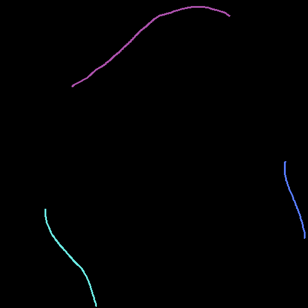 | 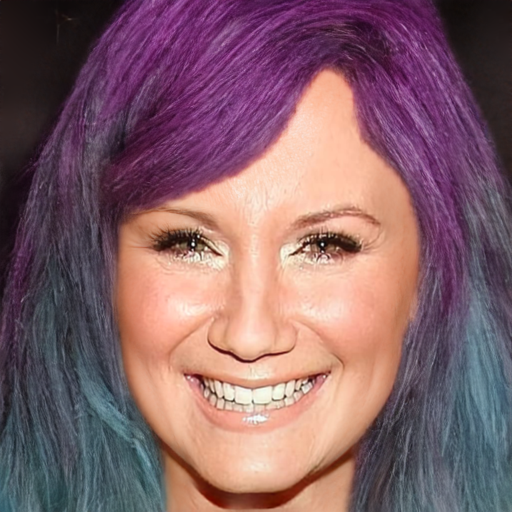 | 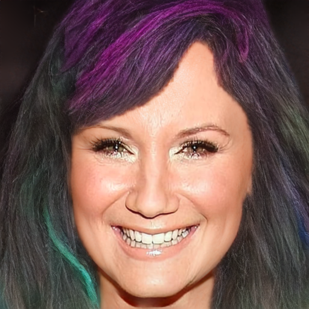 | 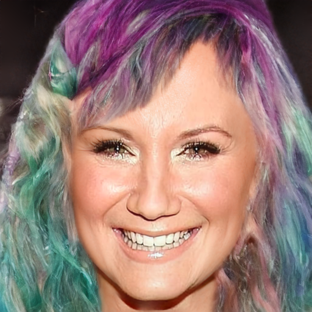 | 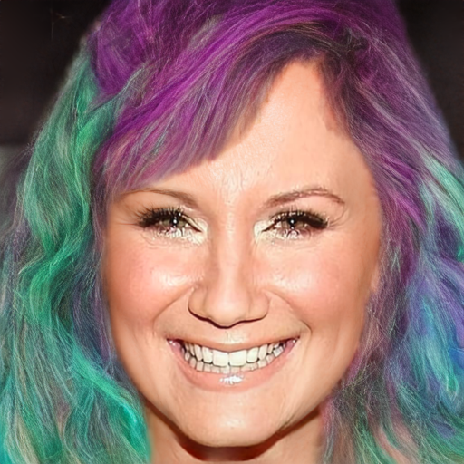 | 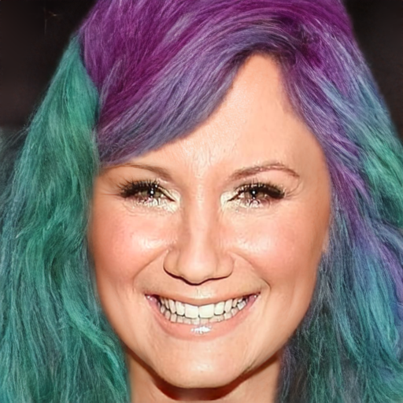 |  |

| 모델 | mcs1 (Ours) | mcs2 (Ours+Gate) | mcs3 (Sketch-only) | mcs4 (Sketch-only+Gate) | mcs5 (Raw-only) | mcs6 (Matte-CNN-only) |
| --- | :---: | :---: | :---: | :---: | :---: | :---: |
| dense (IoU / Chroma) | 0.0453 / 23.47 | 0.0476 / 25.69 | 0.0476 / 25.82 | 0.0483 / 27.66 | 0.0464 / 27.08 | 0.0465 / 26.35 |
| mid (IoU / Chroma) | 0.0234 / 30.90 | 0.0239 / 27.08 | 0.0246 / 27.18 | 0.0249 / 29.02 | 0.0220 / 30.32 | 0.0219 / 28.50 |
| sparse (IoU / Chroma) | 0.0104 / 21.91 | 0.0142 / 12.17 | 0.0107 / 18.60 | 0.0102 / 23.27 | 0.0088 / 22.82 | 0.0107 / 16.72 |

#### CM_1082

| 모델 | sketch | **mcs1 (Ours)** | **mcs2 (Ours+Gate)** | **mcs3 (Sketch-only)** | **mcs4 (Sketch-only+Gate)** | **mcs5 (Raw-only)** | **mcs6 (Matte-CNN-only)** |
| --- | :---: | :---: | :---: | :---: | :---: | :---: | :---: |
| dense |  |  |  |  |  |  |  |
| mid | 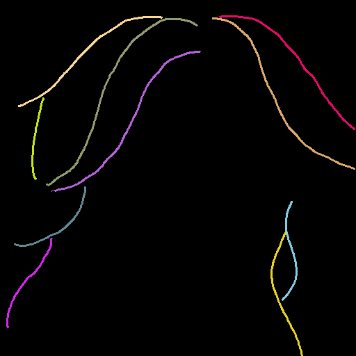 |  |  |  |  |  |  |
| sparse | 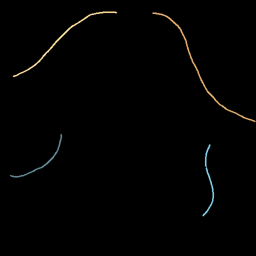 | 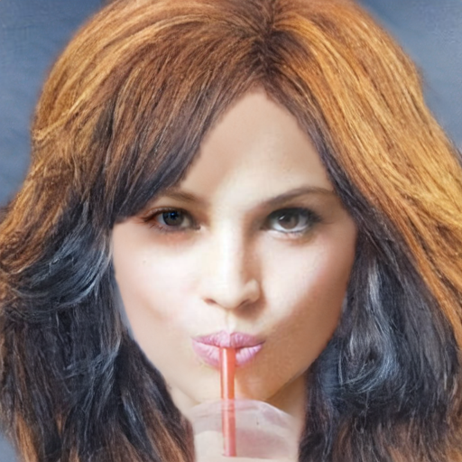 | 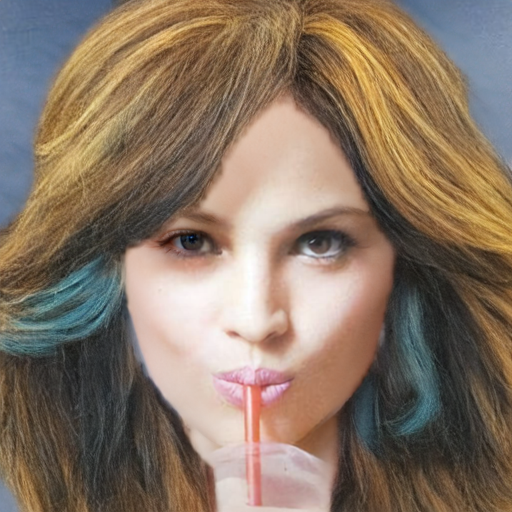 | 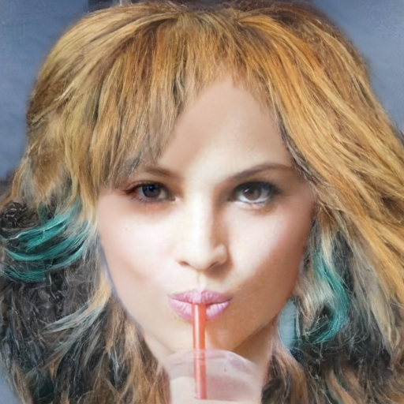 | 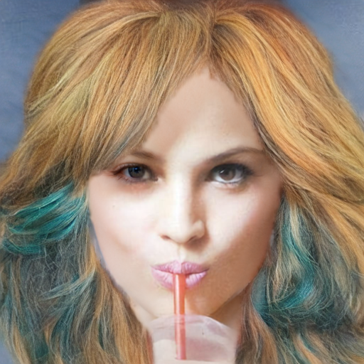 |  | 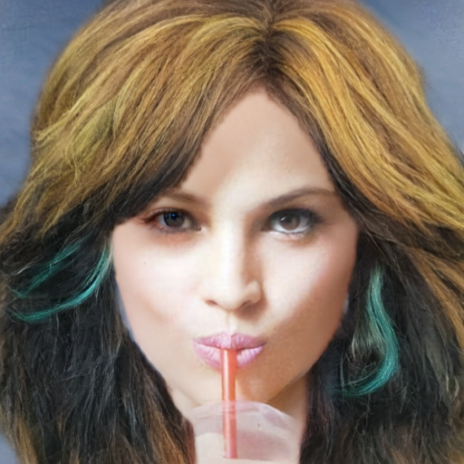 |

| 모델 | mcs1 (Ours) | mcs2 (Ours+Gate) | mcs3 (Sketch-only) | mcs4 (Sketch-only+Gate) | mcs5 (Raw-only) | mcs6 (Matte-CNN-only) |
| --- | :---: | :---: | :---: | :---: | :---: | :---: |
| dense (IoU / Chroma) | 0.0506 / 28.45 | 0.0484 / 30.38 | 0.0484 / 29.25 | 0.0477 / 31.32 | 0.0495 / 30.49 | 0.0462 / 32.02 |
| mid (IoU / Chroma) | 0.0295 / 30.58 | 0.0292 / 28.40 | 0.0297 / 26.35 | 0.0294 / 29.35 | 0.0281 / 30.69 | 0.0281 / 30.43 |
| sparse (IoU / Chroma) | 0.0133 / 18.49 | 0.0133 / 17.59 | 0.0132 / 18.07 | 0.0120 / 20.87 | 0.0135 / 22.27 | 0.0155 / 16.43 |

#### CM_1101

| 모델 | sketch | **mcs1 (Ours)** | **mcs2 (Ours+Gate)** | **mcs3 (Sketch-only)** | **mcs4 (Sketch-only+Gate)** | **mcs5 (Raw-only)** | **mcs6 (Matte-CNN-only)** |
| --- | :---: | :---: | :---: | :---: | :---: | :---: | :---: |
| dense |  |  |  |  |  |  |  |
| mid | 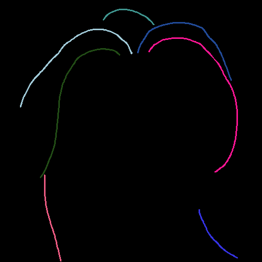 |  |  | 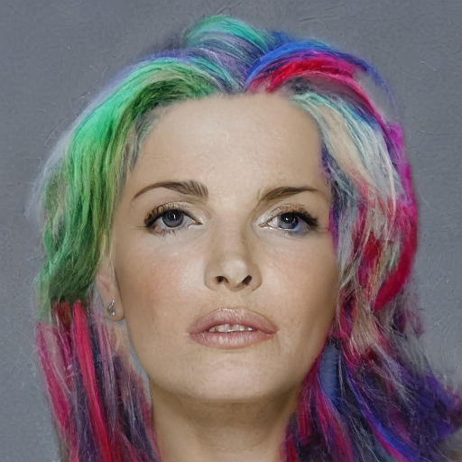 |  |  |  |
| sparse | 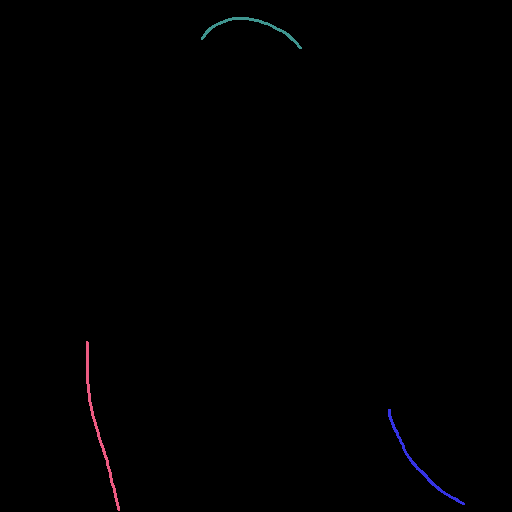 | 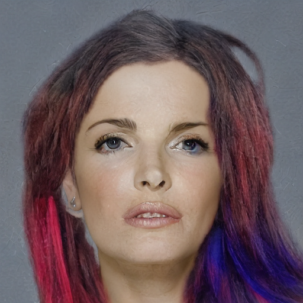 | 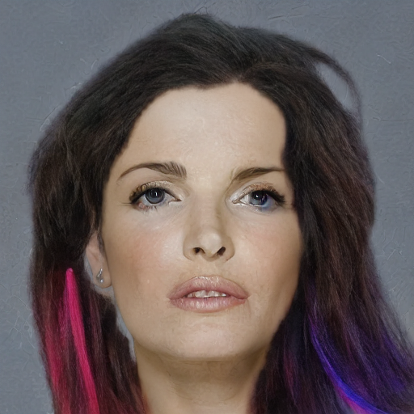 | 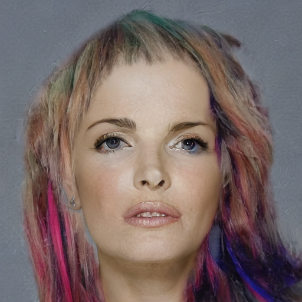 |  | 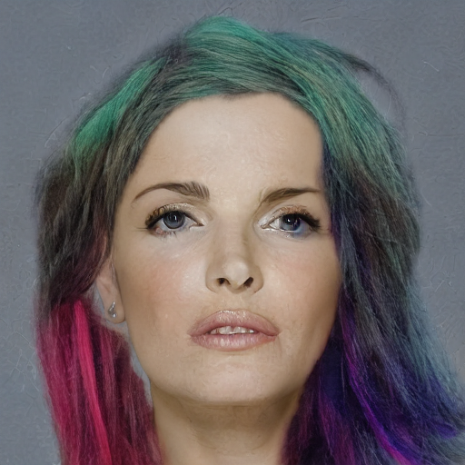 |  |

| 모델 | mcs1 (Ours) | mcs2 (Ours+Gate) | mcs3 (Sketch-only) | mcs4 (Sketch-only+Gate) | mcs5 (Raw-only) | mcs6 (Matte-CNN-only) |
| --- | :---: | :---: | :---: | :---: | :---: | :---: |
| dense (IoU / Chroma) | 0.0500 / 24.98 | 0.0546 / 28.15 | 0.0482 / 24.62 | 0.0425 / 32.46 | 0.0494 / 32.24 | 0.0484 / 26.34 |
| mid (IoU / Chroma) | 0.0323 / 32.58 | 0.0313 / 24.52 | 0.0253 / 22.00 | 0.0259 / 30.80 | 0.0269 / 28.60 | 0.0255 / 27.47 |
| sparse (IoU / Chroma) | 0.0080 / 19.01 | 0.0181 / 10.15 | 0.0051 / 14.84 | 0.0042 / 21.65 | 0.0063 / 15.07 | 0.0110 / 12.73 |

#### CM_1106

| 모델 | sketch | **mcs1 (Ours)** | **mcs2 (Ours+Gate)** | **mcs3 (Sketch-only)** | **mcs4 (Sketch-only+Gate)** | **mcs5 (Raw-only)** | **mcs6 (Matte-CNN-only)** |
| --- | :---: | :---: | :---: | :---: | :---: | :---: | :---: |
| dense |  |  |  |  |  |  |  |
| mid | 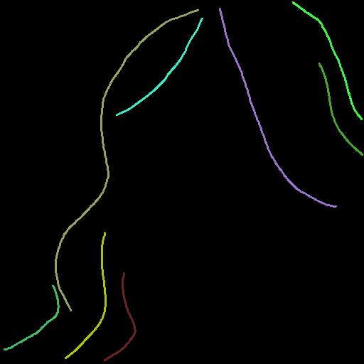 |  |  |  |  |  |  |
| sparse | 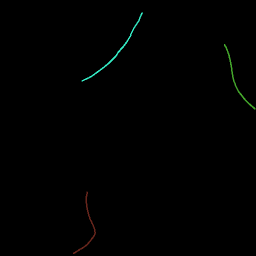 |  |  |  |  |  |  |

| 모델 | mcs1 (Ours) | mcs2 (Ours+Gate) | mcs3 (Sketch-only) | mcs4 (Sketch-only+Gate) | mcs5 (Raw-only) | mcs6 (Matte-CNN-only) |
| --- | :---: | :---: | :---: | :---: | :---: | :---: |
| dense (IoU / Chroma) | 0.0430 / 28.30 | 0.0435 / 30.67 | 0.0457 / 26.17 | 0.0433 / 30.40 | 0.0429 / 32.48 | 0.0434 / 27.45 |
| mid (IoU / Chroma) | 0.0261 / 30.69 | 0.0261 / 28.01 | 0.0260 / 27.50 | 0.0265 / 28.37 | 0.0248 / 32.70 | 0.0276 / 27.94 |
| sparse (IoU / Chroma) | 0.0079 / 13.29 | 0.0116 / 11.20 | 0.0059 / 22.40 | 0.0058 / 23.38 | 0.0062 / 20.22 | 0.0115 / 14.73 |

