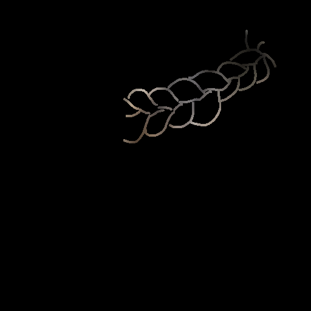
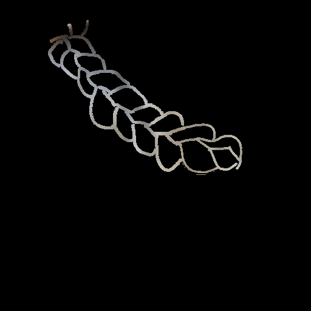
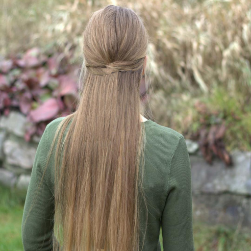
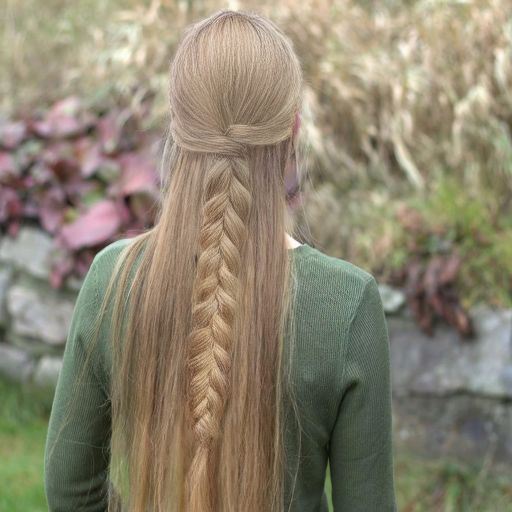
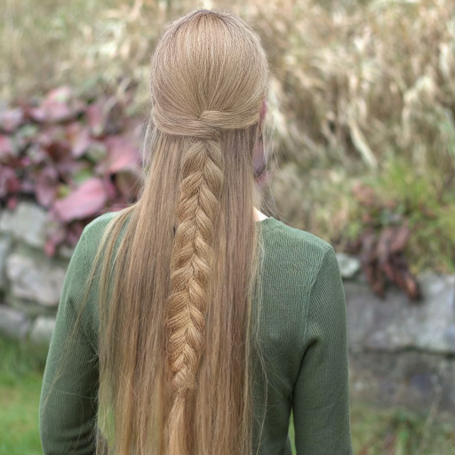
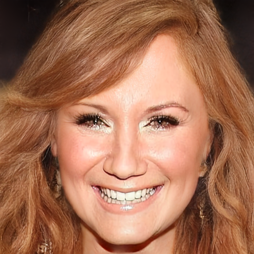

# [0718] Joint 재학습 결과 (GT / Colorful sketch)

기존 코드를 논문 방식대로 수정한 뒤 **joint 재학습**한 결과를 epoch별로 비교한다.
수정 내역은 [reports/[0713]training.md](%5B0713%5Dtraining.md) 참고.

## 개요

| 항목 | 내용 |
|------|------|
| 데이터 | 6,000장 (braid 3,000 + unbraid 3,000) |
| 학습 | phase1 30 epoch → phase2 20 epoch |
| seed | 42 고정 |
| 조건 비교 | **GT sketch** vs **Colorful sketch** 각각 추론 |
| 추론 시점 | phase1: e10 · e30 / phase2: e5 · e10 · e15 · e20 |
| 소스 이미지 | `data/paper`, `data/unbraid_new` 의 img · sketch(_gt) |
| 결과 이미지 | `outputs/results/joint_phase*_epoch*/` |

> 표 열: `img` (원본) · `sketch` (조건 입력) · `P1·eN` (phase1) · `P2·eN` (phase2). 모든 셀 동일 폭(130px).
> `—` 는 해당 조합의 결과 이미지가 없음(예: phase1 e10에는 unbraid_new 세트 미포함).

## 1. GT sketch

| img | sketch | P1·e10 | P1·e30 | P2·e5 | P2·e10 | P2·e15 | P2·e20 |
|---|---|---|---|---|---|---|---|
|  |  |  |  |  |  |  |  |
|  |  |  |  |  |  |  |  |
|  |  |  |  |  |  |  |  |
|  |  |  |  |  |  |  |  |
|  |  |  |  |  |  |  |  |
|  |  |  |  |  |  |  |  |
|  |  |  |  |  |  |  |  |
|  | — | — |  |  |  |  |  |
|  |  | — |  |  |  |  |  |
|  |  | — |  |  |  |  |  |
|  |  | — |  |  |  |  |  |
|  |  | — |  |  |  |  |  |

## 2. Colorful sketch

| img | sketch | P1·e10 | P1·e30 | P2·e5 | P2·e10 | P2·e15 | P2·e20 |
|---|---|---|---|---|---|---|---|
|  |  |  |  |  |  |  |  |
|  |  |  |  |  |  |  |  |
|  |  |  |  |  |  |  |  |
|  |  |  |  |  |  |  |  |
|  |  |  |  |  |  |  |  |
|  |  |  |  |  |  |  |  |
|  |  |  |  |  |  |  |  |
|  |  | — |  |  |  |  |  |
|  |  | — |  |  |  |  |  |
|  |  | — |  |  |  |  |  |
|  |  | — |  |  |  |  |  |

