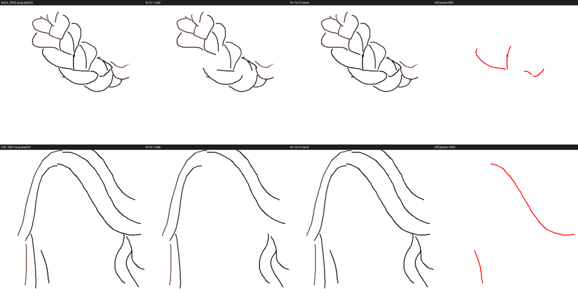

## 0. 요약
1. **phase2는 epoch가 갈수록 나빠짐** — 색 반영↓, 질감 푸석 (1절 그림).  
2. 그런데 **학습 loss는 계속 감소** → **loss ≠ 시각 품질** (2절).  
3. mcs 학습 이후 loss 코드를 2곳 바꿈: **edge threshold**·**flow 정규화** (3절).  
   - **edge loss 변경은 무해** (마스크 <0.2% 변화, 3-1절).  
   - **flow 정규화 변경이 진짜 원인** — flow gradient가 ~60배 커지며 **LPIPS/edge가 사실상 무력화**(flow/lpips 0.9×→55×, 3-2절).  
4. **재학습 제안: loss 밸런스 복원** (4절).  

---

## 1. phase2 epoch가 지날수록 나빠짐 (정성)

`P1·e30`(phase2 진입 직전) · `P2·e5`(joint학습 중 가장 좋음) · `P2·e20`(phase2 최종) · `이전학습`(mcs2) 비교.
**공통 패턴**: phase2 후반으로 갈수록 색의 **채도·정확도 저하**, 머리카락 **질감이 푸석**(고주파 노이즈↑). 이전학습(mcs2) 대비 색 재현이 약함.

### 1-1. GT sketch
| img | sketch | P1·e30 | P2·e5 | P2·e20 | 이전학습 |
|---|---|---|---|---|---|
|  |  |  |  |  |  |
|  |  |  |  |  |  |
|  |  |  |  |  |  |

### 1-2. Colorful sketch
| img | sketch | P1·e30 | P2·e5 | P2·e20 | 이전학습 |
|---|---|---|---|---|---|
|  |  |  |  |  |  |
|  |  |  |  |  |  |
|  |  |  |  |  |  |
|  |  |  |  |  |  |
|  |  |  |  |  |  |
|  |  |  |  |  |  |

---

## 2. 정량 근거 — loss는 내려가는데 품질은 나빠짐

### 2-1. 헤어영역 지표: phase2에서 단조 악화
test 8장 평균 채도(HSV-S), 색 다양성(hue 엔트로피), 푸석한 정도(Laplacian 고주파) 확인

| 결과 | 채도 ↑ | hue 엔트로피 ↑ (색 다양성) | 고주파 ↓ (푸석) |
|---|---|---|---|
| p1 · e10 | 0.358 | 2.62 | 0.096 |
| p1 · e30 | 0.353 | 2.94 | 0.093 |
| **p2 · e5** | **0.372** | **3.22** | 0.111 |
| p2 · e10 | 0.325 | 3.06 | 0.121 |
| p2 · e15 | 0.295 | 2.96 | 0.108 |
| p2 · e20 | **0.277** | 2.92 | 0.110 |
| 이전학습(mcs2) | **0.381** | **3.38** | 0.105 |

- phase1(e10→e30): hue 엔트로피 ↑ = "색 반영이 좋아진다"는 관찰과 일치.
- phase2(e5→e20): 채도 **−25%**, 색 다양성 ↓, 고주파 ↑ = 정점 **p2e5** 이후 하락.
- **mcs2가 모든 지표 최고** → joint(p2e5)조차 이전학습보다 색이 못함.

### 2-2. 학습 loss는 계속 감소
| 구간 | epoch 1 → 마지막 |
|---|---|
| phase1 (pretrain) | 4.52 → 3.14 (e30) |
| phase2 (finetune) | 3.07 → 2.52 (e20) |

→ **loss는 계속 내려가는데 육안·지표는 phase2 후반에 나빠짐. 즉 목적함수(flow+LPIPS+edge)가 지각적 색·질감을 제대로 측정하지 못하고 있음.** 왜 그런지는 3절.

---

## 3. 기존(mcs) vs 현재 loss 코드 변화

mcs 학습 이후 loss를 **두 군데** 바꿈. 
edge loss와 flow loss

### 3-1. edge loss: threshold `0.1 → 1e-3` — 문제 없음 ✅
```python
# SketchEdgeAlignmentLoss
#   기존(mcs): stroke_threshold = 0.1
#   현재:      stroke_threshold = 1e-3
sketch_mask = (sketch.max(dim=1).values > threshold) * matte   # stroke 위치
```
- 의도: **(0,0,0)=배경, 그 외 non-black=stroke**. 

  

  *(원본 aug 스케치 · th=0.1(이전 코드) · th=1e-3(수정 후) · 차이맵 )*

- 오히려 이전의 코드에서 실제 stroke인데, stroke로 인지하지 못한 부분을 stroke으로 정확히 인지
- → **결론: edge 코드 변경은 푸석·색 저하의 원인이 아님.**

### 3-2. flow loss: 정규화 `.mean() → sum/‖matte‖₁` — LPIPS/edge 무력화(진짜 원인)
```python
# FlowMatchingLoss
# 기존(mcs):
return (weight * diff_sq).mean()                        # 전체 텐서(B·16·64·64) 평균

# 현재(논문 Eq.12):
masked_diff = weight * (v_pred - v_target)
return masked_diff.pow(2).sum() / (weight.sum() + eps)  # 헤어 면적으로만 정규화
```
정규화 분모가 `65536(=16·64·64)` → `헤어 면적(≈matte 42.8%)`으로 바뀌며 **flow loss·gradient가 ~60배 커짐**. 그런데 `w_lpips=0.1 / w_edge=0.05`는 mcs와 **그대로** → flow만 비대해져 나머지가 상대적으로 눌림.

**측정** — 각 loss가 출력을 미는 힘 `‖d(w·L)/dv_pred‖` : 

| 항 | loss 값 | 가중 gradient |
|---|---|---|
| flow (현재 `sum/‖matte‖₁`) | 4.40 | 1.45e-1 |
| flow (기존 `.mean()`) | 0.107 | 2.33e-3 |
| lpips | 0.285 | 2.63e-3 |
| edge | 0.033 | 1.31e-5 |

| flow가 압도하는 배수 | flow / lpips | flow / edge |
|---|---|---|
| **기존 norm (mcs)** | **0.9×** (대등) | 178× |
| **현재 norm (joint)** | **55×** | 11,068× |

- 기존엔 **LPIPS가 flow와 대등(0.9×)** 하여 색·질감을 잡아줬음. 현재는 **flow가 LPIPS를 55배 압도** → LPIPS gradient가 flow의 1.8%로 쪼그라들어 **사실상 무력화**.
- 이 상태로 오래 학습할수록 색·질감을 방어할 항이 없어 무너짐.

---

## 4. 재학습 계획 — loss 밸런스 복원

### loss 밸런스 복원
**flow 정규화 유지**
- `w_lpips`: 0.1 → **≈ 5.0** (×55, flow와 대등 = mcs의 0.9× 재현) — 색·질감 방어의 핵심.
- `w_edge`: 0.05 → **≈ 3.0** (×62)로 상향하여 mcs와 동등한 flow/edge≈178 비율을 복원. 다만 edge는 stroke 경계에 고주파를 부여하는 항이므로 과도한 상향은 질감 노이즈(푸석)를 유발할 수 있어 3.0을 상한으로 두며, 보수적으로는 1~2 범위를 권장.  

**flow 정규화 수정**
- **대안**: flow를 `.mean()`으로 되돌리고 `0.1/0.05` 유지 = mcs 밸런스 완전 재현(면적-불변 이점은 포기).

### joint 방식 계속해서 가져갈지 선택
이상적으로는 기존의 **curriculum 학습( unbraid pretrain → braid finetune)**으로 먼저 학습하여 구조 변경의 유효성을 독립적으로 검증하고, 검증 완료 후 joint 학습으로 전환하는 것이 타당하다고 생각됨. 다만 두 방식을 순차 수행하므로 학습 비용이 2배 이상으로 증가  
  
그럼에도, joint 학습을 선행하여 실패를 반복하는 것보다는 단계적 학습으로 변경된 코드(matte 구조·loss)의 유효성을 우선 확보한 뒤 joint로 확장하는 편이 합리적이라고 생각됨. curriculum 학습은 데이터셋 규모가 4,000장으로 작아 학습 비용도 낮음(약 10분/epoch).

---

## 학습 시간 · 체크포인트
- **설정**: `dataset=both_aug3x` (unbraid+braid, 3× 증강), 375 iter/epoch.
- **순수 학습 시간** (`logs/joint_training.log`): 
  - phase1(e1→e30) ≈ 7.6h
  - phase2(e1→e20) ≈ 6.5h
  - 합 ≈ 14.1h (wall-clock ~16.5h).
- **체크포인트** (학습 서버 경로, 로컬 미보유): `joint_phase1/` e10·e30, `joint_phase2/` e5·e10·e15·e20. phase2는 phase1 **e30**에서 분기.
