# [2026-07-26] 학습 결과 및 분석

## 요약

이슈 1. phase2에서 braid의 땋은 형태가 뚜렷해지는 반면, unbraid는 더 푸석해짐

이슈 2. 동일한 loss 밸런스인데도 mcs2 대비 색 학습 저조

이슈 3. 이전 학습보다 질감이 푸석해짐 — 이번엔 phase1 단계부터 발생 (이전 학습은 phase2부터 발생)

## 결과 사진

> seed42, `data/paper`(6장)+`data/unbraid_new`(6장) 샘플 기준. phase1 epoch10/20/30/40, phase2 epoch10/20/35 비교.

### gt sketch

| 파일명 | img | sketch | phase1 ep10 | phase1 ep20 | phase1 ep30 | phase1 ep40 | phase2 ep10 | phase2 ep20 | phase2 ep35 |
|---|---|---|---|---|---|---|---|---|---|
| wavy_753 |  | 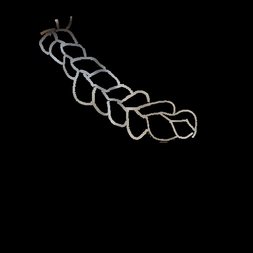 |  |  |  |  |  |  |  |
| braid_2562_1 |  | 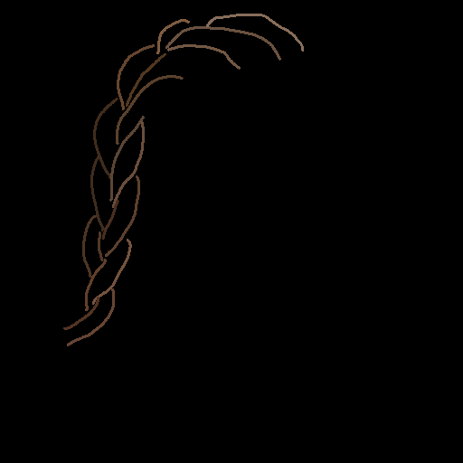 |  |  |  |  |  |  |  |
| CM_1067 |  |  |  |  | 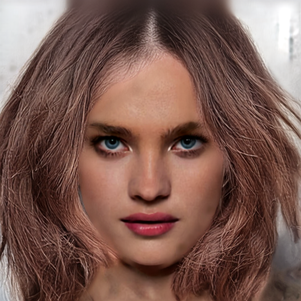 |  | 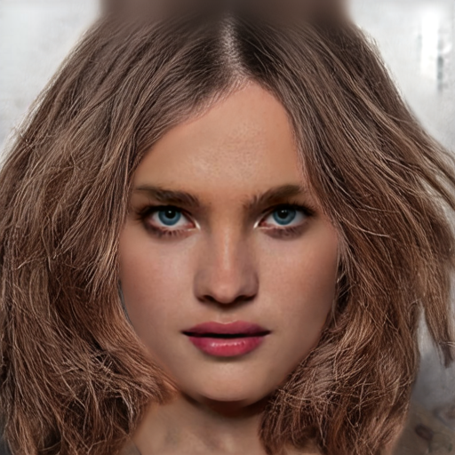 | 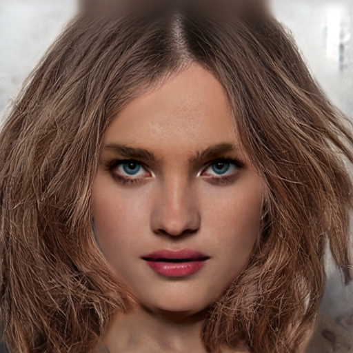 | 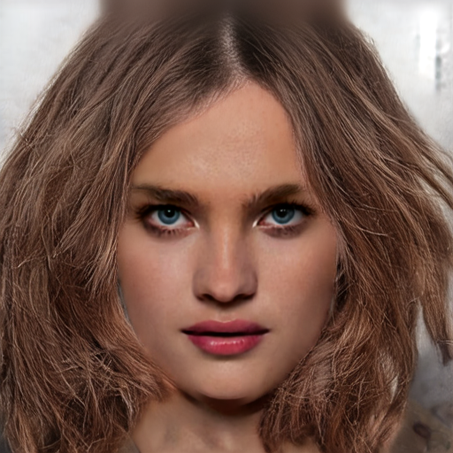 |
| CM_1082 |  |  | 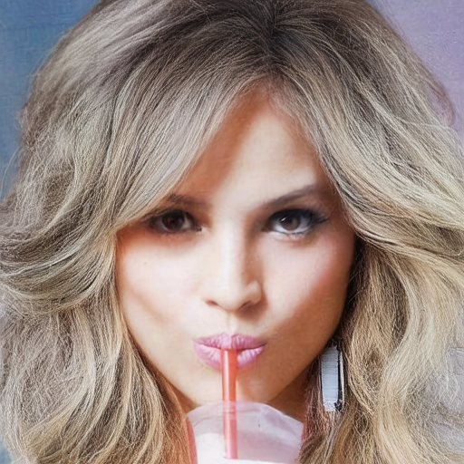 | 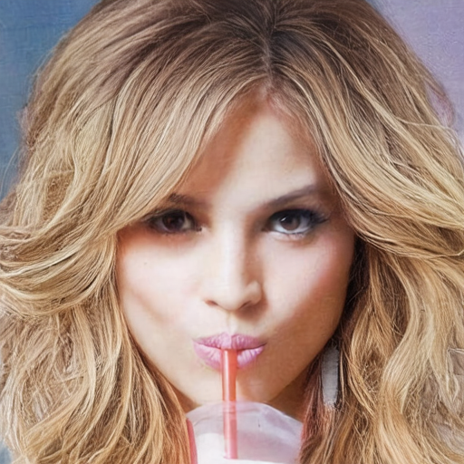 | 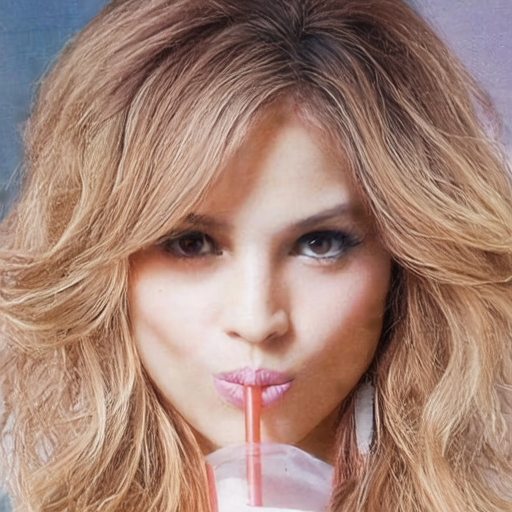 | 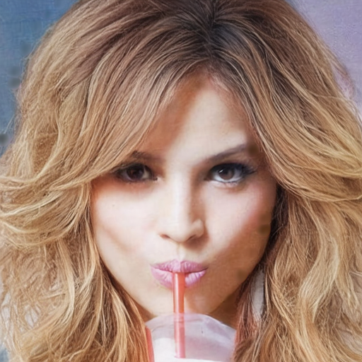 | 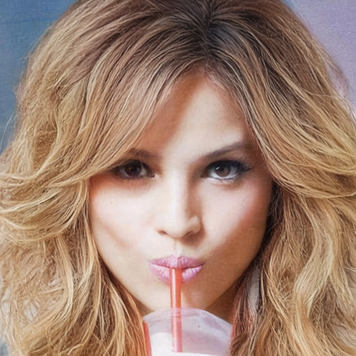 | 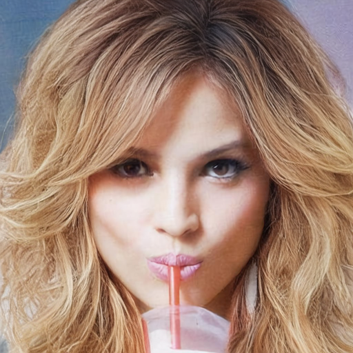 | 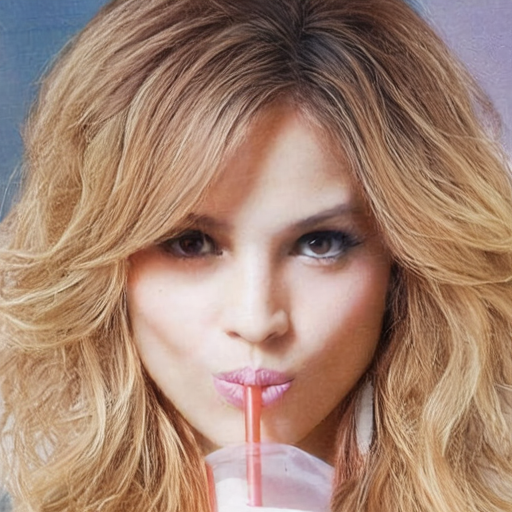 |
| CM_1077 (1) |  | 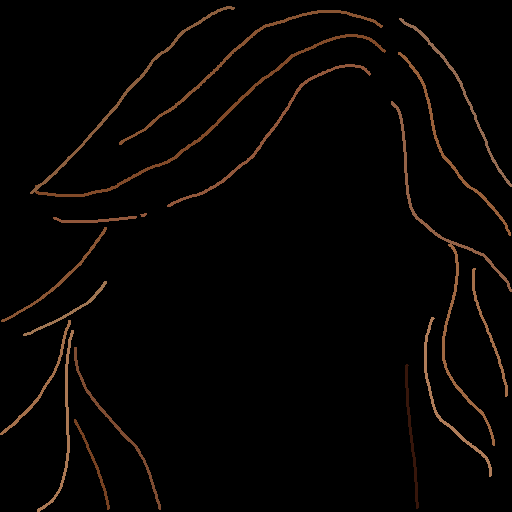 |  |  |  |  |  |  |  |

> `CM_1101 (1)`은 `data/unbraid_new/sketch_gt/`에 대응 파일 없음(데이터셋 내 사실상 결측) — GT 사진과 결과물만 채움

### Colorful sketch

| 파일명 | img | sketch | phase1 ep10 | phase1 ep20 | phase1 ep30 | phase1 ep40 | phase2 ep10 | phase2 ep20 | phase2 ep35 |
|---|---|---|---|---|---|---|---|---|---|
| braid_4156 |  |  | 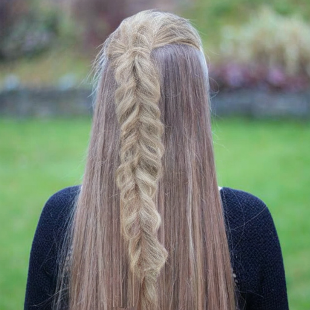 |  |  |  |  |  |  |
| CM_1068 |  |  |  |  |  |  |  |  |  |
| CM_1172 |  |  | 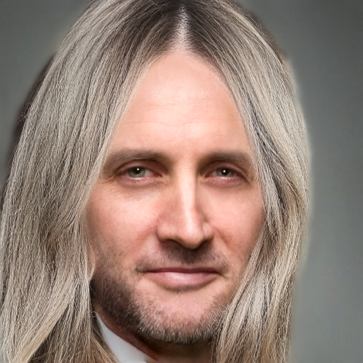 | 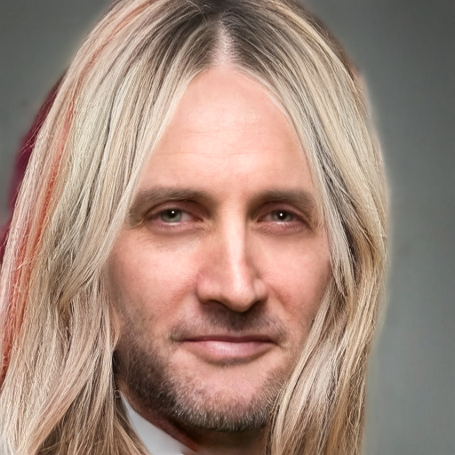 | 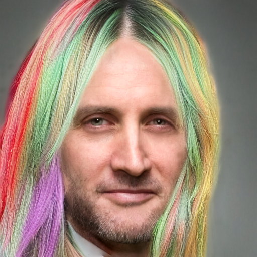 |  | 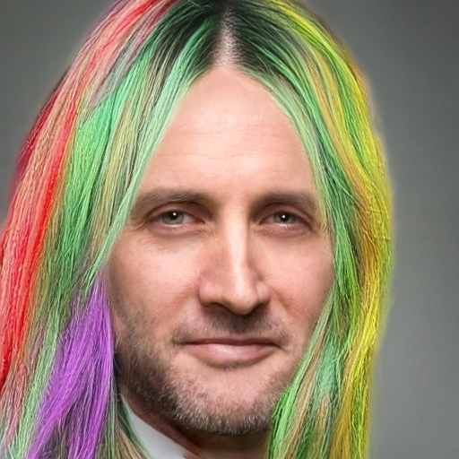 | 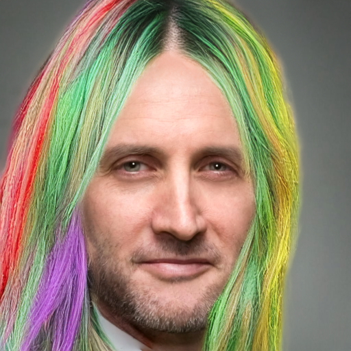 | 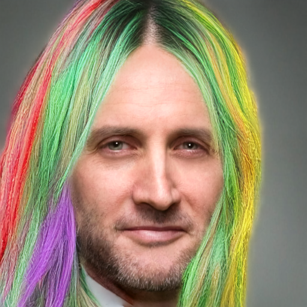 |
| braid_2625 |  |  |  |  |  |  |  |  |  |
| wavy_749 |  | 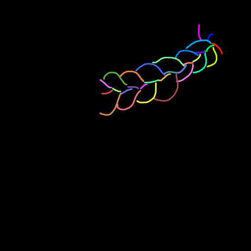 |  |  |  |  |  |  |  |
| braid_4276 |  |  | 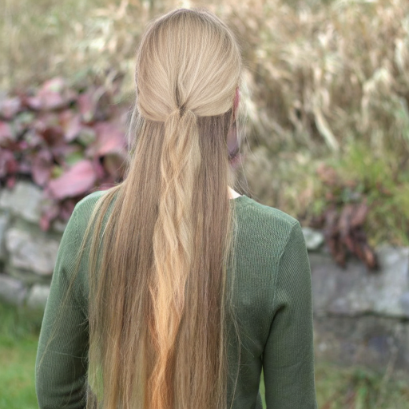 |  |  |  |  |  |  |

## 1. edge loss 도메인 미분리 — braid 강조·unbraid 푸석함

**내용**
phase2 8:8 replay 배치엔 unbraid 샘플도 절반 섞여 있는데, braid 전용이어야 할 edge loss(스트로크 위 대비를 항상 최대로 미는 one-way loss)가 도메인 구분 없이 그대로 걸림. 같은 압력인데도 결과는 도메인별로 다르게 나타남:
- **braid**: 스트로크가 실제 땋은 머리 경계와 대체로 일치 → edge loss가 그 경계를 더 강하게 밀어붙여 땋은 형태가 이전보다 뚜렷해짐
- **unbraid**: 스트로크가 실제 머리카락 가닥 경계와 대응하지만, 푸석함으로 바뀜

w_edge 인상(0.05→0.086) 실험에서 braid는 개선되고 unbraid의 dE·lpips는 악화되는 패턴으로 실측 확인 — unbraid 성능저하의 유력 원인.

| | phase1 ep40 | phase2 ep35 |
|---|---|---|
| **CM_1068 (unbraid)** |  |  |
| **CM_1067 (unbraid)** | 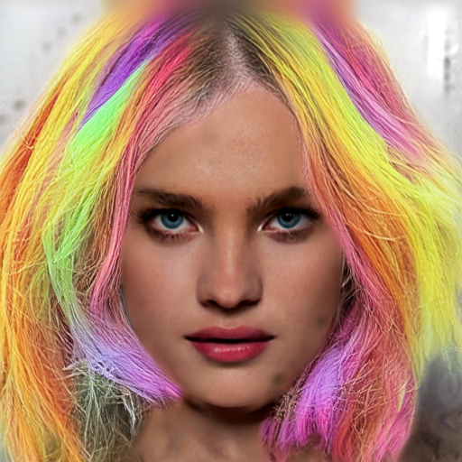 | 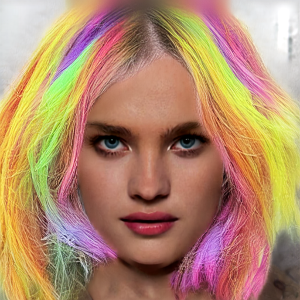 |
| **CM_1172 (unbraid)** |  |  |
| **braid_4156 (braid)** |  |  |
| **braid_4276 (braid)** |  |  |
| **wavy_753 (braid)** |  |  |

> 전부 컬러(무지개) 스케치 입력 기준. unbraid: CM_1068, CM_1067, CM_1172 / braid: braid_4156, braid_4276, wavy_753 — phase1(edge loss 적용 전) 대비 phase2(edge loss 적용 후) ep35에서 braid 쪽 형태가 뚜렷해지고 unbraid 쪽이 푸석해지는지 확인용

**원인분석**
phase2 edge loss 적용 braid/unbraid 구분 없음 — unbraid 샘플에도 동일한 edge loss 압력이 걸리는 것이 근본 원인. 이 압력이 braid에선 "형태 강조"로, unbraid에선 "푸석함"으로 다르게 발현되는 이유는 두 도메인의 실제 구조(땋은 경계의 유무)가 다르기 때문.

> 원리: 이 loss는 예측 이미지를 그레이스케일로 바꾼 뒤, 스트로크가 그어진 자리에 "밝기 경계(명암 대비)"가 얼마나 뚜렷한지만 검사함 — 그레이스케일로 바꾸는 순간 색상(hue·채도) 정보는 이미 사라지므로, 이 loss는 색을 애초에 보지 못함. 즉 여기서 나오는 신호는 오직 "스트로크 위치에 얼마나 또렷한 경계선이 그려지는가"뿐이고, 이는 braid의 땋은 머리 가닥 경계 표현에만 대응됨
> 참고: unbraid의 이 푸석함은 3절(phase1부터 있는 matte_bias발 전반적 푸석함)과는 별개의 추가 요인 — 3절 원인은 edge loss 없는 phase1에서도 이미 나타나지만, 이 절의 원인은 edge loss가 도입되는 phase2 구간에서만 추가로 얹힘

**해결방안**
edge loss에 `is_braid` 마스크를 추가해 braid 서브셋 행만으로 평균 계산하도록 수정. 수정 후 braid 과잉 강조와 unbraid 푸석함이 동시에 완화되는지가 1차 확인 지표. R_edge도 재측정해 목표 밴드(≈0.006)에서 벗어나면 그때 w_edge 재조정.

## 2. mcs2 대비 색 반영 저하

**내용**
mcs2 대비 여전히 색 반영이 약함 — 스트로크로 지정한 색을 제대로 못 따라감. 자연색(GT색) 스케치에서도 색이 확연히 흐리고, 다색(무지개) 스케치에서는 같은 약점이 더 뚜렷하게 드러남(스트로크별 지정색 구분 자체가 흐려짐). R_lpips 실측(phase1 1.016 / phase2 0.931, 목표 밴드 [0.8, 1.2])으로 scale-sync 정상 작동을 확인, loss 밸런스는 mcs2와 같게 맞췄기에 원인에서 배제.

| | sketch | 현재학습 (phase2 ep20) | mcs2 |
|---|---|---|---|
| **CM_1067** |  | 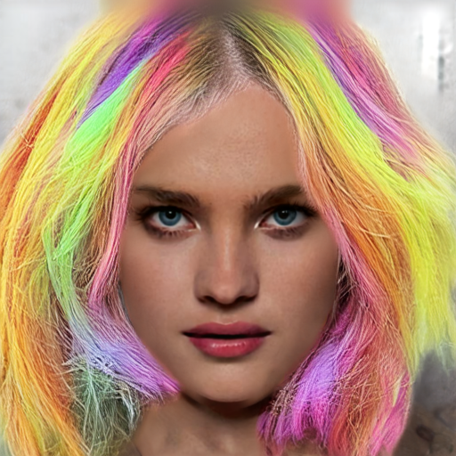 |  |
| **CM_1121** | 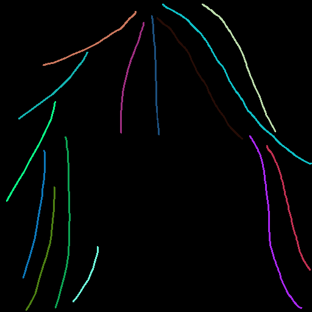 | 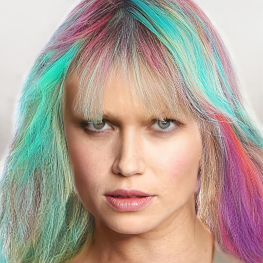 | 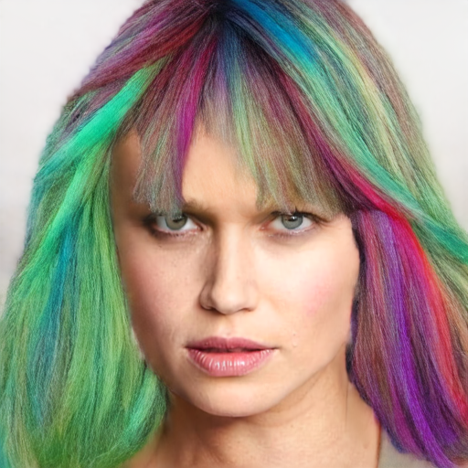 |
| **CM_1151** | 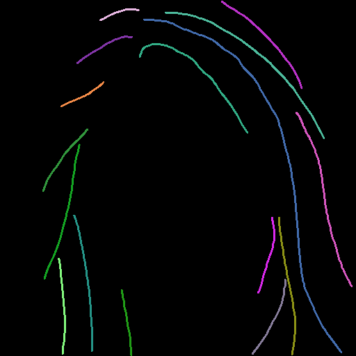 |  |  |
| **wavy_749** |  |  |  |

> 전부 컬러(무지개) 스케치 입력 기준. CM_1067·wavy_749의 mcs2 렌더는 `outputs/figure/hair-dit_mcs2/color/`. **CM_1121·CM_1151은 mcs2의 "phase2 ep20" 시점 렌더가 따로 없어서(mcs2는 epoch별 저장이 안 남아있음) `outputs/sup/bld/bld_on/mcs2/`(BLD-on 설정) 렌더로 대체함 — 다른 두 이미지와 정확히 같은 조건(BLD 설정 등)인지 확인 안 됨, 참고용으로만 볼 것.**

**원인분석**
32ch 아키텍처에서 mcs2에 없던 두 신호가 새로 추가됨(논문 §3.3):
- **§3.3.1의 학습형 hair-region bias** — `B_matte = E_matte(m)`, `z_cond = z_sketch + λ·B_matte` (Eq.2-3, 코드상 `matte_cnn`/`matte_scale`). 마지막 conv가 zero-init이라 0에서 시작해 학습으로 커져야 함
- **§3.3.2의 raw matte anchor** — `M_raw = Conv1x1(PixelUnshuffle(m))` (Eq.4-6, 코드상 `raw_matte_anchor`). mcs2엔 없던, 위치정보만 전달하는 별도 경로

phase1 체크포인트에서 λ와 `B_matte` 마지막 conv weight norm을 직접 추출:

| epoch | λ (Eq.3 residual scale) | `B_matte` 마지막 conv weight norm |
|---|---|---|
| 10 | 1.009 | 0.230 |
| 20 | 1.014 | 0.327 |
| 30 | 1.016 | 0.349 |
| 40 | 1.017 | 0.350 |
| (zero-init 없이 새로 초기화한 랜덤 기준값) | — | ≈2.31 |

epoch30→40 사이 거의 변화 없음(+0.4%, 이미 수렴) — 40epoch 학습 후에도 랜덤 초기값의 15% 수준밖에 안 됨, 학습 부족이 아니라 낮은 값에서 멈춘 것. §3.3.2의 raw matte anchor가 위치정보를 이미 커버해 §3.3.1의 `B_matte`가 커질 유인이 약해진 것으로 추정(미확정).

**mcs2와 구조 비교** (`configs/mcs2_phase1.yaml` 확인: `ctrl_cond = cat([sketch_lat + matte_feat, matte_raw], dim=1)`, 17ch): mcs2는 (1) raw matte를 지금의 `M_raw`(16채널 pixel-unshuffle+1x1conv anchor)가 아니라 1채널 그대로 이어붙였고, (2) matte_feat(현재의 `B_matte`에 해당)도 zero-init이 아니라 처음부터 정상 스케일로 학습에 참여했음(구 MatteCNN, git blame으로 확인된 사실). 즉 mcs2는 지금처럼 "0에서 커져야 하는 신호"도, "위치정보를 전담하는 16채널 경로"도 없는 상태에서 색을 잘 반영했던 것.

`zero_raw_matte=True` ablation은 이 중 (1)번 축(raw anchor 유무)만 mcs2와 가깝게 만드는 것이고, (2)번(zero-init 여부)은 여전히 다름 — 그래도 raw anchor를 꺼도 색이 회복되지 않는다면, 위치정보 경합보다 **zero-init 자체가 `B_matte`를 낮은 값에 가두는 원인**일 가능성도 함께 봐야 함(추가 후보, 이번 ablation으로 같이 드러남).

**해결방안**
`zero_raw_matte=True`(§3.3.2 raw matte anchor를 끄고 §3.3.1 `B_matte`만 사용) vs 기본값(둘 다 사용)으로 짧은 phase1(예: 10 epoch) ablation 진행. 판정 기준은 `B_matte` norm 증가 여부가 아니라 재학습 후 실제 생성물(단일색+다색)의 색·질감 개선 여부 (측정 근거는 부록 C).

## 3. 질감 푸석함 — phase1부터 발생

**내용**
이전 학습(0720)은 phase2에서만 푸석함이 나타났는데, 이번(0725)은 phase1부터 나타남

| | phase1 ep20 | phase1 ep40 | phase2 ep10 | phase2 ep30 |
|---|---|---|---|---|
| **CM_1067 — 현재학습** |  |  |  | 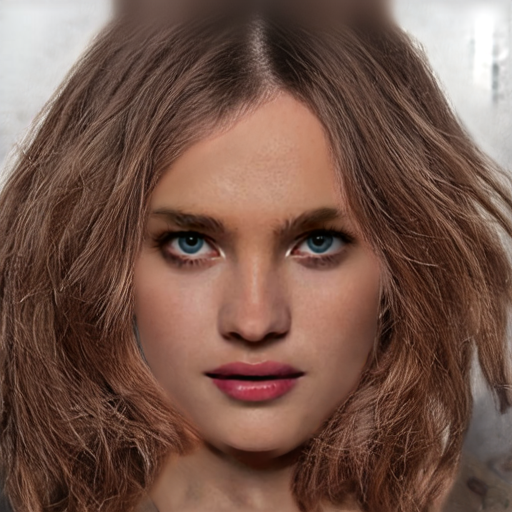 |
| **CM_1067 — 이전학습** |  |  | 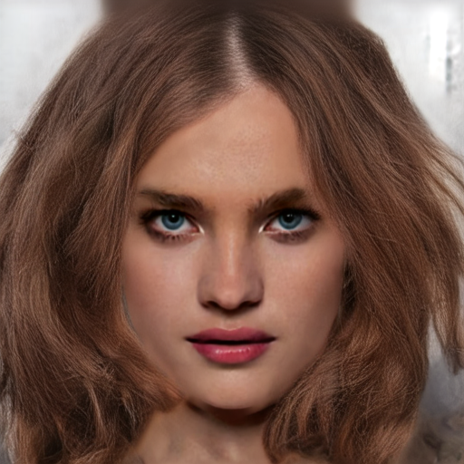 | 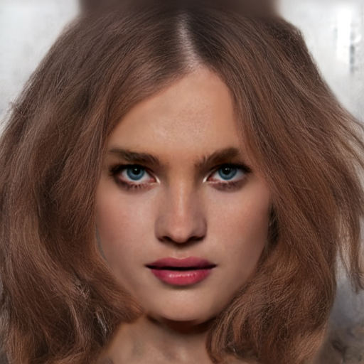 |
| **CM_1082 — 현재학습** |  |  |  |  |
| **CM_1082 — 이전학습** | 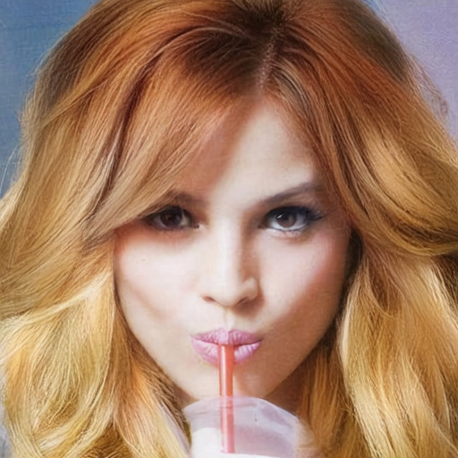 | 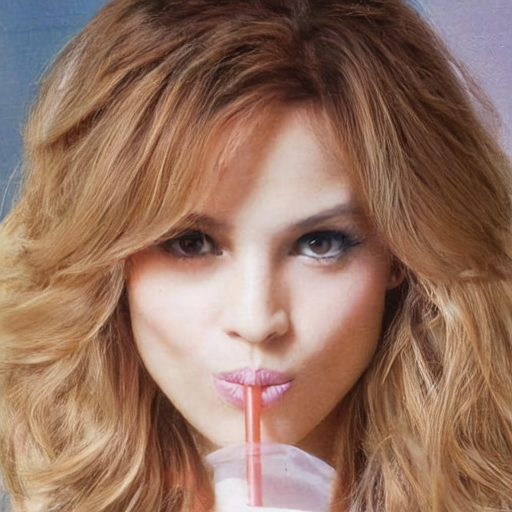 | 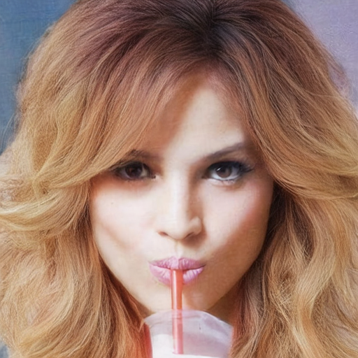 | 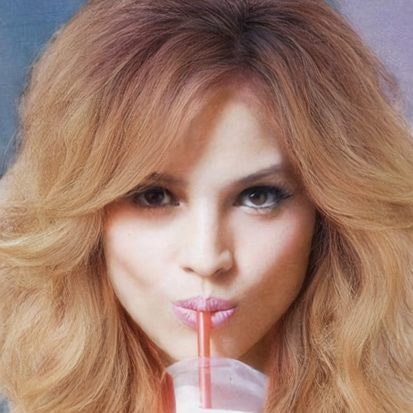 |
| **CM_1068 — 현재학습** |  |  |  |  |
| **CM_1068 — 이전학습** |  |  |  |  |

> 이전학습(0720, `outputs/results/joint_*`)은 phase1 epoch10/30, phase2 epoch5/10/15/20만 남아있어 열 제목과 epoch이 정확히 일치하지 않음 — 이전학습 행은 순서대로 phase1 ep10 / phase1 ep30 / phase2 ep10 / phase2 ep20 렌더를 채움 (phase2 ep10 열만 현재학습과 동일 epoch 직접 비교 가능)

**원인분석**
scale-sync가 LPIPS 영향력을 정상 복원(R_lpips≈1.0)한 것 자체가 조건. 이전 학습은 flow 정규화 버그로 LPIPS gradient가 1.8%로 눌려있어 매끈했을 뿐, 지금은 LPIPS가 정상 작동하는데 §3.3.1의 `B_matte`(2절과 동일 원인)가 약해 그 디테일 압력이 자연스러운 머릿결로 못 가고 고주파 노이즈로 새어나온 것으로 추정 — 2절 색 회귀와 같은 뿌리. (1절의 edge loss 누수로 인한 unbraid 푸석함과는 별개의 더 근본적인 원인 — edge loss가 아예 적용되지 않는 phase1에서도 나타남)

**해결방안**
2절 ablation에서 색과 질감이 함께 개선되는지 교차검증 — 색만 좋아지고 질감은 그대로면 두 증상이 분리된 원인이라는 반증.

## 해결방안 요약

1. 서버의 EMA 이관 fix·중복저장 fix를 로컬 `trainer.py`에 반영(git 동기화)
2. edge loss braid-only 마스킹 구현 (`dataset.py`+`trainer.py`+`losses.py`, `gradnorm_probe.py` 호출부 확인)
3. w_edge 0.05 유지, 마스킹 수정 후 R_edge 재측정 → 필요시만 재조정
4. §3.3.1/§3.3.2 ablation(`zero_raw_matte=True` vs 기본값) 실행, 색·질감 동시 판정
5. phase1 데이터 구성(unbraid 단독 vs braid 혼합) 재검토
6. v2 phase2 실행(phase1 재사용 여부는 ablation 이후 결정) → unbraid dE/lpips, braid lpips/edge-IoU를 1차 run과 비교

---
