# [2026-07-26] 학습 결과 및 분석


## 요약

이슈 1. 동일한 loss 밸런스인데도 mcs2 대비 색 학습 저조
- 원인: 무지개 stroke 색이 학습 분포 밖(학습 시 stroke는 항상 GT 머리색으로 학습)인 상태에서, timestep 정규화 이후 정상 작동하게 된 SD3.5 prior가 출력을 자연 머리색 쪽으로 끌어당기는데, inference에 이를 상쇄할 guidance(CFG)가 없음
- 해결: (재학습 불필요, 연구 옵션) stroke 영역별 목표색과의 차이를 매 스텝 gradient로 되먹여 방향성 있게 조향하는 색 목표 guidance — CFG(방향성 없는 증폭)와 달리 stroke별로 정확히 그 색을 향해 밀 수 있음 / (근본, 재학습) `StrokeColorSampler` 색 분포를 인공색까지 확장하는 hue-shift 증강으로 무지개색을 in-distribution화

이슈 2. 이전 학습보다 질감이 푸석해짐 — 이번엔 phase1 단계부터 발생 (이전 학습은 phase2부터 발생)
- 원인: flow loss가 matte를 제곱(m²)으로 가중해 경계·잔머리(soft matte) 영역의 flow 감독이 붕괴 — 정상 복원된 LPIPS와의 국소 불균형이 그 영역에 고주파 frizz를 만듦
- 해결: flow의 matte 가중을 mcs2와 같은 선형(m)으로 복원 (전체 loss 밸런스는 유지)

## 결과 사진

> seed42, `data/paper`(6장)+`data/unbraid_new`(6장) 샘플 기준. phase1 epoch10/20/30/40, phase2 epoch10/20/35 비교.

### gt sketch

| 파일명 | img | sketch | phase1 ep10 | phase1 ep20 | phase1 ep30 | phase1 ep40 | phase2 ep10 | phase2 ep20 | phase2 ep35 |
|---|---|---|---|---|---|---|---|---|---|
| wavy_753 |  |  |  |  |  |  |  |  |  |
| braid_2562_1 |  |  |  |  |  |  |  |  |  |
| CM_1067 |  |  |  |  |  |  |  |  |  |
| CM_1082 |  |  |  |  |  |  |  |  |  |
| CM_1077 (1) |  |  |  |  |  |  |  |  |  |


### Colorful sketch

| 파일명 | img | sketch | phase1 ep10 | phase1 ep20 | phase1 ep30 | phase1 ep40 | phase2 ep10 | phase2 ep20 | phase2 ep35 |
|---|---|---|---|---|---|---|---|---|---|
| braid_4156 |  |  |  |  |  |  |  |  |  |
| CM_1068 |  |  |  |  |  |  |  |  |  |
| CM_1172 |  |  |  |  |  |  |  |  |  |
| braid_2625 |  |  |  |  |  |  |  |  |  |
| wavy_749 |  |  |  |  |  |  |  |  |  |
| braid_4276 |  |  |  |  |  |  |  |  |  |

## 1. mcs2 대비 색 반영 저하

**내용**
mcs2 대비 여전히 색 반영이 약함 — stroke로 지정한 색을 제대로 못 따라감. 자연색(GT색) 스케치에서도 색이 확연히 흐리고, 다색(무지개) 스케치에서는 같은 약점이 더 뚜렷하게 드러남(stroke별 지정색 구분 자체가 흐려짐).

| | sketch | phase1 ep10 | phase1 ep20 | phase1 ep30 | phase1 ep40 | phase2 ep10 | phase2 ep20 | phase2 ep35 | mcs2 |
|---|---|---|---|---|---|---|---|---|---|
| **CM_1067** |  | 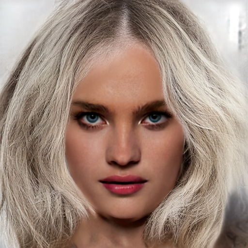 | 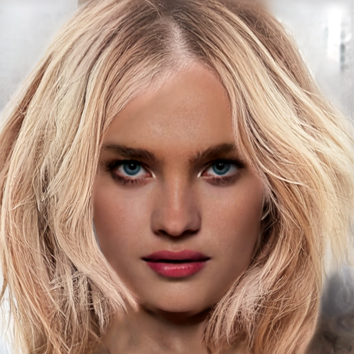 |  |  |  |  |  |  |
| **CM_1121** |  | 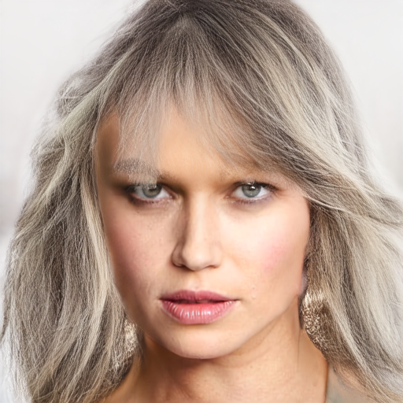 | 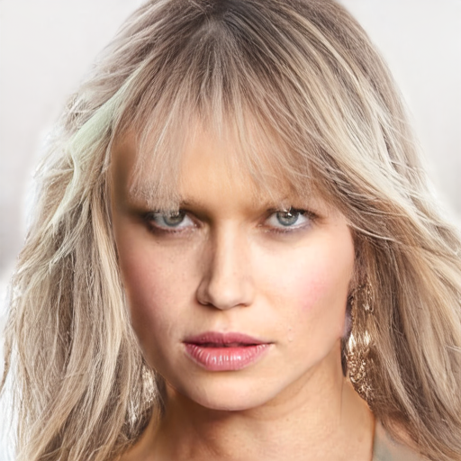 | 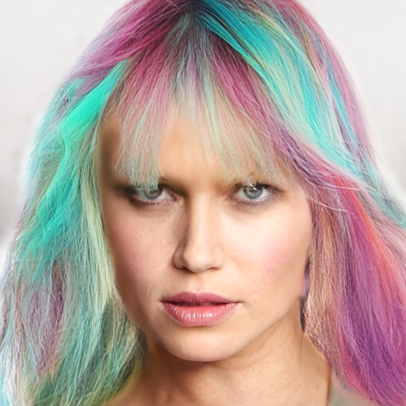 | 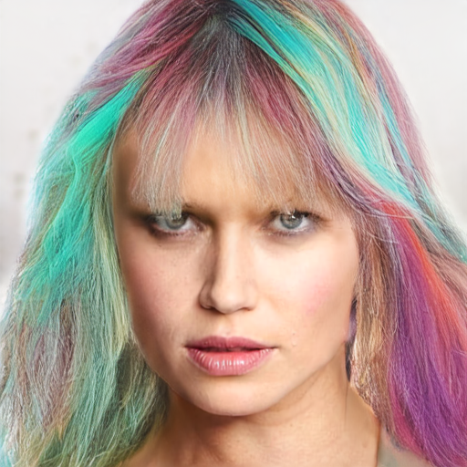 | 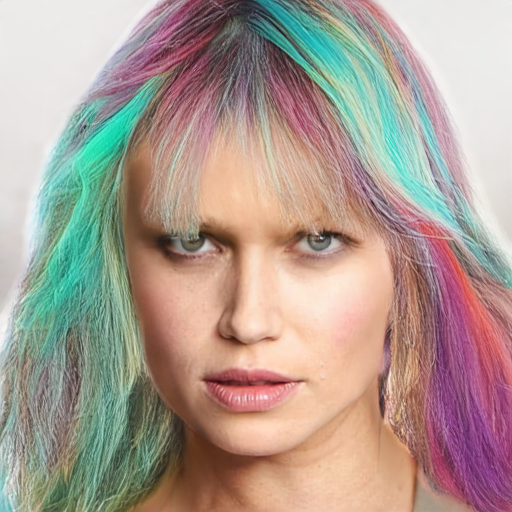 |  |  |  |
| **CM_1151** |  | 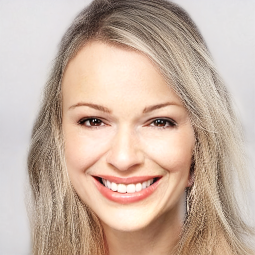 | 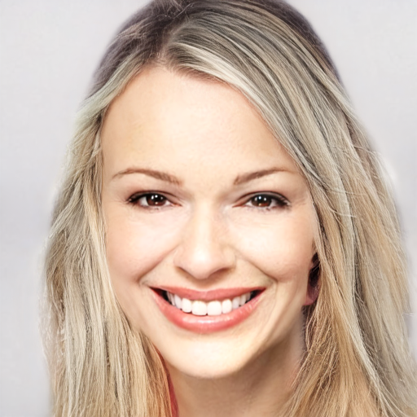 | 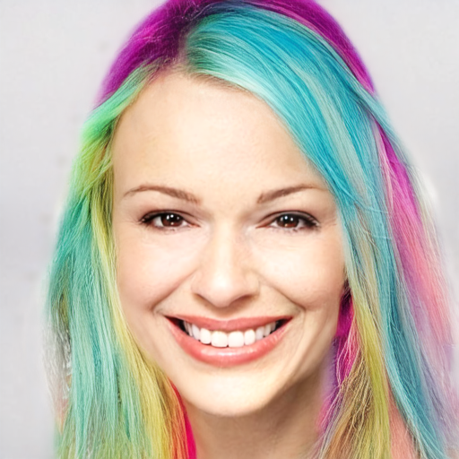 |  |  |  |  |  |
| **wavy_749** |  |  |  |  |  |  |  |  |  |

**원인분석**

**(1) 데모 무지개색은 학습 분포 밖(OOD).** 학습 파이프라인(`StrokeColorSampler`)은 매 iteration stroke를 GT 이미지의 실제 머리 픽셀 색으로 재착색함 — 모델이 배우는 "stroke 색 ↔ 머리색" 대응은 자연 머리색(갈색/검정/금발…) 범위뿐이고, 무지개색 재현은 순수 외삽임. 실제로 stroke를 자연색으로 바꿔주면(`--recolor_from_gt`) 현재 모델도 색을 정확히 따라감 — 색 대응 능력 자체는 살아 있고, 무너지는 건 분포 밖 외삽뿐임.

**(2) mcs2가 그 외삽을 "잘했던" 이유 — prior가 꺼져 있었음.** mcs2는 frozen DiT에 timestep으로 raw σ(0~1)를 그대로 넘겨(7/15 수정 전), 사전학습된 시간 조건화(prior)가 사실상 무력화된 상태였음. ControlNet의 스케치 색 신호가 경쟁자 없이 출력을 지배했기 때문에 분포 밖 색도 저항 없이 통과했음. 7/15 timestep 정규화(σ×1000) 이후에는 SD3.5 prior가 정상 작동하며 "머리카락은 자연색"이라는 통계로 출력을 끌어당기는데, **inference 경로에는 CFG/guidance가 전혀 없어(단일 conditional pass) 이를 이길 장치가 없음** SD3.5는 원래 CFG 4~7을 전제로 설계된 모델임. 그 결과가 채도 저하와 stroke 간 색 번짐임.  
=> 밑에서 CFG inference 실험 진행

**(3) loss 구조상 색을 방어할 항이 없음.** 색 학습의 사실상 유일한 동력은 flow(latent MSE)이고, LPIPS는 색 시프트에 둔감(질감·구조 위주)하며 색 전용 loss는 없음 — prior의 색 견인을 학습 신호가 상쇄해주지 못함.

**정량 확인** — stroke 지정색 vs 그 stroke 담당 영역의 렌더 평균색 사이 CIEDE2000 ΔE(명도 50 고정, 색조·채도만) 측정 (phase2 ep35 렌더 기준):

| 이미지 | mcs2 ΔE | 현재 ΔE |
|---|---|---|
| braid_2562_1 | 18.08 | 18.73 |
| braid_2625 | 13.51 | 16.37 |
| braid_3276 | 19.20 | 22.20 |
| CM_1067 | 11.78 | 16.23 |
| CM_1068 | 13.85 | 16.50 |
| CM_1172 | 11.47 | 12.69 |
| wavy_749 | 18.40 | 23.16 |
| **평균** | **15.18** | **17.98** |

7장 전부에서 mcs2가 더 정확함(평균 15.2 vs 18.0). 동시에 mcs2도 ΔE 11~19로 완벽과는 거리가 있음 — 무지개 외삽의 본질적 한계는 mcs2에도 있었고, 차이는 정도 문제임.

**인과 검증 (재학습 없이)** — inference에 CFG를 추가하면(`v = v_uncond + g·(v_cond − v_uncond)`, uncond는 ControlNet residual 없는 순수 prior 패스) 일부 이미지에서 채도와 stroke 색 분리가 회복됨 — guidance가 색에 영향을 주는 레버라는 증거. 단 아래처럼 이미지마다 방향이 다름. `data/paper/` 9장 전체(phase2 ep35 + 매 스텝 BLD + pixel blend 0.75 합성, g=1.0은 기존 파이프라인과 동일 조건, 픽셀 단위 일치 확인) 중 대표 사례:

| | sketch | g=1.0 (기존) | g=1.5 | g=2.0 |
|---|---|---|---|---|
| **braid_3276** (개선) | 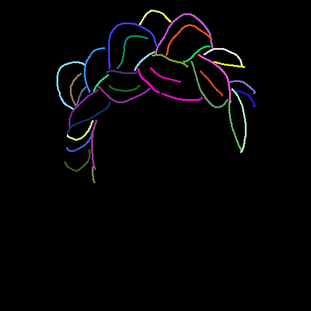 | 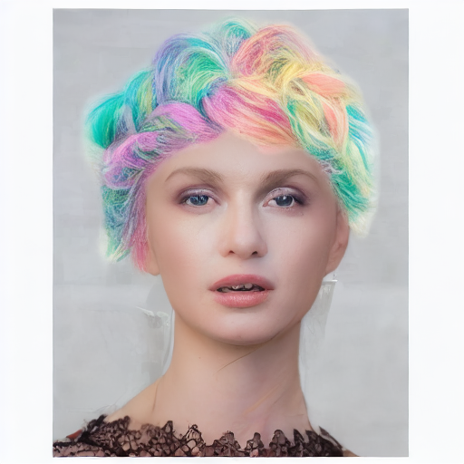 |  | 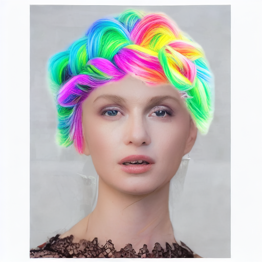 |
| **CM_1067** (소폭 개선 후 정체) |  |  |  |  |
| **braid_2625** (ΔE 기준 악화) |  |  |  |  |
| **wavy_749** (정체, 일부 stroke 악화) |  |  |  |  |
| **CM_1082** (자연색, 이미 정확) |  | 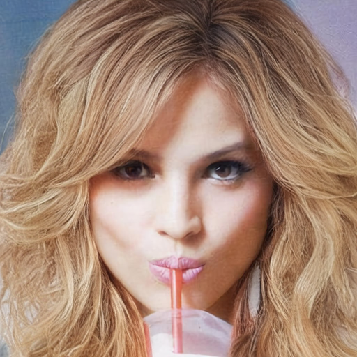 | 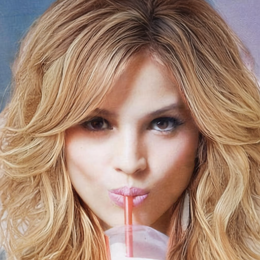 | 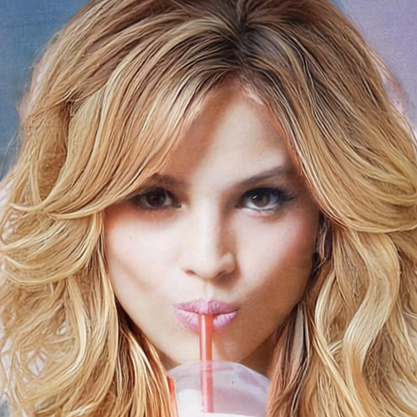 |

braid_2625는 g=2.0에서 육안으로는 더 쨍해 보이지만, stroke색-vs-렌더 ΔE는 오히려 7.05→9.36→10.64로
악화됨 — "선명해 보인다"와 "색이 정확하다"는 다른 축

| 이미지 | g=1.0 | g=1.5 | g=2.0 | 방향 |
|---|---|---|---|---|
| braid_2562_1 | 13.61 | 11.56 | 10.84 | 개선 |
| braid_3276 | 15.35 | 13.18 | 11.74 | 개선 |
| CM_1067 | 10.26 | 9.24 | 9.28 | 소폭 개선 후 정체 |
| CM_1068 | 10.73 | 9.22 | 9.57 | 소폭 개선 후 정체 |
| CM_1172 | 8.06 | 5.82 | 7.76 | 비단조 |
| braid_2625 | 7.05 | 9.36 | 10.64 | **악화** |
| wavy_749 | 15.05 | 14.84 | 14.97 | 정체 |
| wavy_753 | 8.86 | 8.58 | 8.51 | 정체(표면상) |
| CM_1082 (자연색) | 0.97 | 1.03 | 1.13 | 이미 완벽 |
| **평균** | **9.99** | **9.20** | **9.38** | **사실상 정체** |

9장 평균은 g를 올려도 거의 안 움직임(9.99→9.38) — 개선 2장, 악화 1장(braid_2625), 정체 6장으로
갈림. 특히 wavy_749의 파란 stroke(rgb 76,104,255)는 dE 34.1→38.5로 **guidance를 올릴수록 더
틀어짐** — 이미 잘못 학습된 색을 guidance가 교정하는 게 아니라 더 확신 있게 밀어붙이는 것. 즉
guidance는 색 반영 저하에 영향을 주는 레버이긴 하나, "일괄 개선 장치"가 아니라 **이미지마다 방향이
갈리는 증폭기**로 봐야 함.

**해결방안**
1. **색 목표 gradient guidance (재학습 불필요, 연구 옵션)** — CFG가 "방향성 없는 증폭"이었던 것과 달리, 매 스텝 `x0_pred = x_t − σ·v`에서 stroke 영역별 평균색과 요청색의 차이를 loss로 잡고 그 gradient로 샘플링을 조향(stroke별로 정확히 그 색을 향해 미는 방향성 있는 guidance). 임의의 미분가능 목표로 diffusion 샘플링을 조향하는 것은 Universal Guidance(Bansal et al. 2023), FreeDoM(Yu et al. ICCV 2023)에서 확립된 방식. 한계: 매 스텝 VAE decode gradient가 필요해 비용이 크고(latent→RGB 선형 근사로 절감 가능) guidance weight 튜닝이 까다로움 - 구현 난도 높음
2. **근본 (재학습)** — `StrokeColorSampler`의 색 분포를 인공색까지 확장: matte 내부 hue를 전역 시프트한 target을 만들고 stroke도 같은 변환색으로 칠해 대응쌍으로 학습(hue-shift 색 증강). 무지개색을 in-distribution으로 만들어 prior와의 충돌을 학습 단계에서 해소 — guidance보다 신뢰할 수 있는, 정확 재현으로 가는 유일한 경로. 색 전용 보조 loss(matte 내 평균 Lab ΔE)는 증강 효과를 본 후 필요 시 추가.


## 2. 질감 푸석함 — phase1부터 발생

**내용**
이전 학습(0720)은 phase2에서만 푸석함이 나타났는데, 이번(0725)은 phase1부터 나타남

| | phase1 ep20 | phase1 ep40 | phase2 ep10 | phase2 ep30 |
|---|---|---|---|---|
| **CM_1067 — 현재학습** |  |  |  |  |
| **CM_1067 — 이전학습** |  |  |  |  |
| **CM_1082 — 현재학습** |  |  |  |  |
| **CM_1082 — 이전학습** |  |  |  |  |
| **CM_1068 — 현재학습** |  |  |  |  |
| **CM_1068 — 이전학습** |  |  |  |  |

**원인분석**
이전 학습(0720)이 매끈했던 것은 flow 정규화 버그로 LPIPS gradient가 1.8%로 눌려 있었기 때문이고, 이번 학습은 scale-sync로 LPIPS 영향력이 정상 복원(R_lpips≈1.0)된 상태 — 여기까지가 전제.

**scale-sync는 flow 항의 "전체" 스케일을 mcs2와 동일하게 복원하지만, 공간 가중까지 복원하지는 못함.** 수식으로: Eq.12 loss를 `s = numel/Σm`로 나누면

```
Σ(m²·d²)/Σm × Σm/N = Σ(m²·d²)/N
```

clamp 미발동(실측 s_raw 33~65, clamp 범위 [20,120]) 조건에서 mcs2의 구 정규화 `Σ(m·d²)/N`과 전체 크기가 같아짐. 남는 유일한 차이는 **matte 가중의 지수** — mcs2는 m(선형, matte를 제곱 밖에서 가중), 현재는 m²(Eq.12가 matte를 제곱 안쪽에 곱함).

이 차이가 정확히 푸석함이 나타나는 위치에서 작동함. soft matte 값이 0.2~0.8인 경계·잔머리 픽셀에서 flow 감독은 제곱으로 붕괴하는데(m=0.4→0.16, m=0.2→0.04), LPIPS 마스킹은 선형(`pred·matte`) 그대로라 그 영역의 지각 압력은 유지됨 → 경계·잔머리에서만 "지각 loss ≫ 왜곡 loss"인 국소 불균형이 생기고, perception-distortion tradeoff대로 고주파 frizz로 발현됨. 관찰과의 정합: (a) 푸석함이 경계·잔머리에 집중되고 머리 내부 굵은 가닥은 상대적으로 온전, (b) LPIPS가 활성화되는 phase1 30% 지점(≈epoch 13) 이후 누적 악화, (c) mcs2가 매끈했던 이유도 동일 논리로 설명됨(m 선형 가중이라 잔머리에서도 flow가 LPIPS와 같은 비율로 살아 있었음).

참고 1: phase1 ep10 시점의 거침은 위와 별개의 학습량 문제 — 이번 phase1은 187 step/epoch(unbraid 3000장)로 이전 학습(6000장, 375 step/epoch)의 절반이라, 같은 epoch 라벨이라도 학습 진행도가 절반임.
참고 2: edge loss와는 무관 — phase1엔 edge loss가 아예 없음

**해결방안**

flow loss 분자의 matte 가중을 m² → m(mcs2와 동일한 선형)으로 복원 — 정규화(`/Σm`)와 scale-sync는 유지해 전체 loss 밸런스(R_lpips≈1.0)는 보존하고, soft 경계의 국소 가중만 되돌림(LPIPS 마스킹과 지수를 일치시키는 것이 원칙). 짧은 phase1(10 epoch) ablation으로 경계·잔머리 frizz 완화 여부를 판정. 1절의 색 증강 재학습과는 원인 분리를 위해 반드시 별도 런으로 진행.


## 추가 내용
### phase2 braid+unbraid replay — 의도대로 동작(braid 개선, unbraid 유지)

**내용**
phase2 8:8 replay 배치엔 unbraid 샘플도 절반 섞여 있는데, braid 전용으로 설계된 edge loss(stroke 위 대비를 항상 최대로 미는 one-way loss)가 코드상 도메인 구분 없이 unbraid 샘플에도 걸리는 건 사실. w_edge 인상(0.05→0.086) 실험에서도 phase2가 진행될수록 unbraid의 LPIPS·색상 지표가 소폭 나빠지는 경향은 확인됨.

다만 실제 이미지로 다시 확인해보면:
- **braid**: stroke가 실제 땋은 머리 경계와 대체로 일치 → phase2에서 땋은 형태가 이전보다 뚜렷하게 개선됨
- **unbraid**: 지표상 소폭 나빠지는 경향과 달리, 육안으로는 phase1 대비 사실상 차이가 거의 없음 — 눈에 띄는 열화가 아님

즉 phase2의 braid+unbraid replay 방식은 finetuning 목적(braid 성능 향상, unbraid 유지)대로 잘 동작하고 있는 것으로 재해석.

| | CM_1068 (unbraid) | CM_1067 (unbraid) | CM_1172 (unbraid) | braid_4156 (braid) | braid_4276 (braid) | wavy_753 (braid) |
|---|---|---|---|---|---|---|
| **phase1 ep40** |  |  |  |  |  |  |
| **phase2 ep35** |  |  |  |  |  |  |

> 전부 컬러(무지개) 스케치 입력 기준. unbraid: CM_1068, CM_1067, CM_1172 / braid: braid_4156, braid_4276, wavy_753 — phase1 대비 phase2 ep35에서 braid는 형태 개선이 뚜렷하고, unbraid는 육안상 거의 유지되는지 확인용

