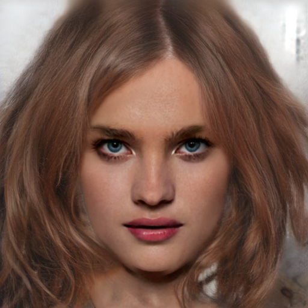
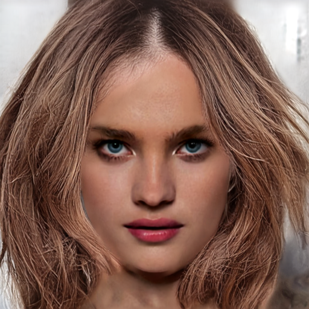
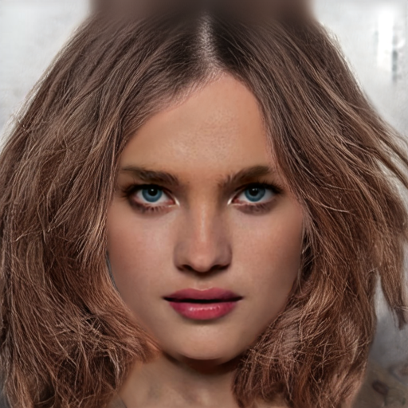

# [2026-07-29] 재학습 계획 v2 — LPIPS 실효 가중치를 run2 수준으로 되돌려 머릿결 방향 노이지 원인 확정

## 0. 요약

| | 내용 |
|---|---|
| **관측** | 세 런의 명목 `w_lpips`는 모두 0.1인데 **실효 가중치 `R`만 55배 차이**(run2 ≈0.018 → run3 1.016), `R`이 오른 run3에서 머릿결 방향이 어긋남 |
| **반증** | run3 ep10은 LPIPS가 켜지기 전인데 이미 어긋나 있음 → `R`만으로는 설명 안 됨(§2-3) |
| **이번 런** | **Run A** = unbraid phase1 + `R ≈ 0.02` + flow matte 가중 `m²→m` 복원 |
| **비용** | 15 epoch ≈ 2.1h / 20 epoch ≈ 3.0h + val 오버헤드 |
    
**용어 — 명목 가중치와 실효 가중치**  
| 용어 | 정의 | 값 |
|---|---|---|
| **명목 가중치 `w_lpips`** | config `loss_weights.lpips`에 적는 숫자 | 세 런 모두 **0.1** |
| **실효 가중치 `R`** | `‖∇(w_lpips·L_lpips)‖ / ‖∇flow_term‖` — LPIPS가 flow 대비 실제로 끌어당기는 세기. 100스텝마다 로깅(`losses.py:288-295`) | mcs2 ≈0.9 / run2 ≈**0.018** / run3 **1.016** |

- 실측 근거: run2의 0.018은 θ 기준(flow 1.45e-1 vs LPIPS 2.63e-3), run3의 1.016은 `logs/phase1.log`의
  v_pred 기준(105회, 0.81~1.25).
- run2에서 LPIPS가 "안 걸린" 것은 가중치를 낮춰서가 아니라 flow 항의 정규화 분모가 바뀌어 flow gradient가
  팽창했기 때문임 → 결정 대상은 `w_lpips` 숫자가 아니라 **`R`**.
- `R`은 `w_lpips`에 선형: `w_lpips = 0.1 × (목표 R / 1.016)`.

---

## 1. 상황

### 1-1. 세 런 비교

| | mcs2 (run1) | run2 | run3 (현재) |
|---|---|---|---|
| phase1 데이터 | unbraid 3000, 187 step/ep | unbraid+braid 6000장, 375 step/ep | unbraid 3000, 187 step/ep |
| phase2 데이터 | braid 1000 | phase1과 동일 | replay(unbraid+braid 1000+1000) |
| LR (phase1 / phase2) | 1e-4 / 2e-5 | 1e-4 / 1e-4 | 1e-4 / 5e-6 |
| flow 항 | `Σ(m·d²)/N` | `Σ(m²·d²)/Σm` (scale-sync 없음) | `Σ(m²·d²)/Σm ÷ s` (scale-sync) |
| 명목 `w_lpips` | 0.1 | 0.1 | 0.1 |
| **실효 `R`** | **≈0.9** | **≈0.018** (flow가 55× 압도) | **1.016** |
| LPIPS 활성 | 30% 이후 | `Epoch 13/40`부터 (`run2_log.log:9109`) | step 2244(≈ep12)부터 |
| timestep → DiT | raw σ (prior 무력화) | σ×1000 (prior 정상) | σ×1000 |
| **결과(머릿결)** | 정렬 + 선명 | **정렬** + 흐릿 | **어긋남** |

- **run2** 변경점: 논문 반영해 flow loss·matte 주입 구조 수정(`[0713]training.md`).
  문제점: phase2 진행할수록 색 재현·질감 저하(색 원인은 `[0726]` 별도).
- **run3** 변경점: run2 문제 개선 목적(`[0723]retrain_plan.md`).
  문제점: mcs2 대비 색 학습 저조 + phase1부터 내내 푸석함 → matte=1 내부에서도 안 없어져
  **"머릿결 방향 노이지"**로 재정의.

### 1-2. 지표도 같은 방향

run3 LPIPS 활성(epoch 13) 후 `lpips_unbraid`가 epoch22 최저점(0.3566)에서
epoch39까지 +10.6% 악화(0.3945)되는 동안 `edge_iou_braid`는 +27.5% 증가.

### 1-3. 이미지 재확인

<table>
<tr>
<th>입력 sketch_gt</th>
<th>mcs2 (phase2 이후) 정렬 + 선명</th>
<th>run2 phase1 ep10 3,750 step · 정렬 + 가닥 유지</th>
<th>run2 phase1 ep30 11,250 step · 매끈하지만 <b>가닥 소실</b></th>
</tr>
<tr>
<td></td>
<td></td>
<td></td>
<td></td>
</tr>
</table>

**(b) run3 phase1 ep10은 LPIPS가 켜지기 전인데 이미 어긋나 있음.** LPIPS 활성은 step 2244(≈ep12)인데
ep10은 1,870 step으로 LPIPS를 한 번도 받지 않은 시점이고, 결이 이미 고주파로 교차함. 스텝 수를 맞춘
대조(run2 ep10 = 3,750 step vs run3 ep20 = 3,740 step)에서도 run3가 더 노이지함.(단 run epoch 20은 lpips가 켜진상태라 동일 상황은 아님)

<table>
<tr>
<th>run2 phase1 ep10 3,750 step · <b>LPIPS off</b></th>
<th>run3 phase1 ep10 1,870 step · <b>LPIPS off</b></th>
<th>run3 phase1 ep20 3,740 step (스텝 대조)</th>
<th>run3 phase1 ep40 7,480 step</th>
</tr>
<tr>
<td></td>
<td></td>
<td></td>
<td></td>
</tr>
</table>

→ **`R`만으로는 run3의 어긋남이 전부 설명되지 않음.** LPIPS-off 구간에서 run2와 run3에 남는 차이는
(i) 데이터 구성(unbraid+braid 6000장 vs unbraid 단독), (ii) 같은 epoch 라벨의 실제 스텝 수(2배)뿐임
(matte 가중 m²·마지막 블록 residual·timestep ×1000은 run2·run3 공통). 따라서 이번 런의 목적은
"run2 재현"이 아니라 **`R`이 방향 어긋남의 원인인지 변수 1개로 확정**임.

---

## 2. 결정

### 2-1. 결정 요약

| # | 결정할 것 | 선택 |
|---|---|---|
| §2-2 | 실효 가중치 `R`을 얼마로 둘지 | **`R ≈ 0.02`** (run2 수준) = `w_lpips: 0.002` |
| §2-3 | 그 `R`을 어떤 수단으로 만들지 | `w_lpips`를 직접 낮춤 (`scale_sync`는 켠 채로) |
| §2-4 | flow matte 가중 `m²→m` 복원을 같은 런에 합칠지 | 합침 |
| §2-5 | 색 반영 loss를 이번 런에 넣을지 | 넣지 않음 |
| §2-6 | 학습 범위 | phase1·unbraid만 |

### 2-2. 실효 가중치 `R`을 얼마로 둘지

| | 목표 `R` | 대응 `w_lpips` | 성격 |
|---|---|---|---|
| **① (선택)** | **≈0.02** | **0.002** | run2 phase1과 동급 — 머릿결이 정렬됐던 유일한 실측 조건의 재현 |
| ② | 0.2~0.5 | 0.02~0.05 | 외부 제안 범위. run2보다 10~25배 강한 **중간 지점**이라 재현이 아니라 "완화" |
| ③ | 1.0 (현행) | 0.1 | run3와 동일 = 대조군 |

처음부터 ②로 가면 정렬이 안 돌아왔을 때 "`R`이 아직 높아서"인지 "`R`이 원인이 아니라서"인지 구분 불가.
②는 재현 성공 후 "정렬이 유지되는 최대 `R`" 이분탐색에서 다룰 값.

### 2-3. 그 `R`을 어떤 수단으로 만들지

| | 수단 | 실제 `R` | 부수 변화 |
|---|---|---|---|
| **A (선택)** | `w_lpips: 0.002`, `scale_sync: true` 유지 | ≈0.02 (의도한 값에 정확히) | **없음** — loss 절대 스케일·grad clip 거동이 run3와 동일해 로그 곡선을 직접 비교 가능 |
| B | `w_lpips: 0.1` 유지, `scale_sync: false` (run2 코드 상태 그대로) | ≈0.027 (의도보다 1.5배 높음) | flow 항이 37배 커져 **grad clip(1.0) 발동 빈도가 함께 변함** → 변수 2개 |

B의 `R`이 0.02가 아닌 이유: `R ∝ 1/s`, `s = 16/헤어면적`인데 unbraid 단독은 `s≈37`(실측 평균 37.0)이라 unbraid+braid 6000장으로 돌던 run2(`s≈54`)보다 LPIPS가 1.5배 세게 걸림 — **B는 "run2 코드 재현"이지 "조건 재현"이 아님.**

### 2-4. flow matte 가중 `m²→m` 복원을 같은 런에 합칠지

**선택: 합침.** matte=1 머리 내부에서는 두 식이 대수적으로 같아 교란이 되지 않음.

| 픽셀 | 현재 `Σ(m·d)²` | 복원 `Σ(m·d²)` | v_pred에 대한 per-pixel gradient |
|---|---|---|---|
| **m=1 (내부)** | `d²` | `d²` | **완전 동일** (`2d/(Σm·s)`) |
| 0<m<1 (경계·잔머리) | `m²d²` | `m·d²` | 복원 시 감독이 `1/m`배 강해짐 |

- 판정 대상은 **matte=1 내부에서도 남는** 어긋남이라 이 변경은 무영향 —
  `[0728]` §4-4도 m² 가설을 "관찰을 원리적으로 설명 못 함"으로 배제해 뒀음.
- 성격은 **가설 검증이 아니라 정합성 수정** — LPIPS 마스킹은 선형인데
  flow만 제곱 가중이던 불일치를 되돌림(`[0727]` §4-3).
- 부수 효과로 **flow 항이 mcs2와 대수적으로 동일해짐** — clamp 미발동 시
  `Σ(m·d²)/Σm ÷ s = Σ(m·d²)/numel`(`[0727]` §2-2). 즉 Run A = **mcs2의 flow 감독 + run2의 LPIPS 밸런스**.

**유의점**  

1. **`R`이 소폭 내려감** — soft 경계에서 flow 항이 `Σm(1−m)d²`만큼 커짐. -> `R_lpips` 실측이 기대 밴드를 벗어나면 `w_lpips`만 재조정  
2. **경계·잔머리는 두 변경이 섞임** — 인과 주장은 내부(matte=1) 정렬에만, 경계는 관찰 기록만.  

### 3-5. 색 반영 loss를 이번 런에 넣을지

**선택: 넣지 않음.**  
  
**이유 : 항을 추가하면 실효 가중치를 3항 기준으로 다시 잡아야 함** — §3-2의 `R` 설정이 무의미해짐.  
  
`dE_unbraid`가 매 epoch 이미 측정되므로 **"`R`을 낮추면 색이 같이 움직이는지"는 무료로 관찰됨**
(run3에서는 색이 개선되는 동안 질감이 악화 — 두 축이 독립일 가능성).  

### 3-6. 학습 범위

**선택: phase1·unbraid만.**  

run3 phase1이 동일 조건으로 이미 렌더돼 있어 대조군 비용이 0(§4-1).
unbraid+braid 6000장으로 돌리면 run3와의 차이가 2개(데이터, `R`)가 되어 원인 분리가 안 되고 스텝도 2배(375/epoch).
Run A 실패 시 그때 unbraid+braid 6000장 재현으로 이동.

---