# [2026-07-26] 학습 결과 및 분석

## 요약

결과1. 
결과2. 
여젼히 노이지함. 남은 차이는 데이터셋 차이 뿐

## 결과 사진

> seed42, `data/paper`+`data/unbraid_new` 샘플 기준. epoch5/10/15/20/25/30/35/40 비교.

### gt sketch

| 파일명 | img | sketch | epoch5 | epoch10 | epoch15 | epoch20 | epoch25 | epoch30 | epoch35 | epoch40 |
|---|---|---|---|---|---|---|---|---|---|---|
| CM_1067 | 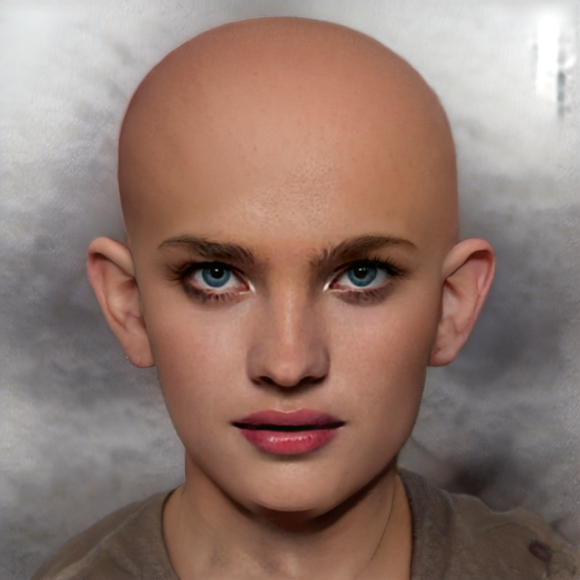 |  | 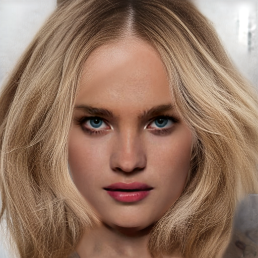 | 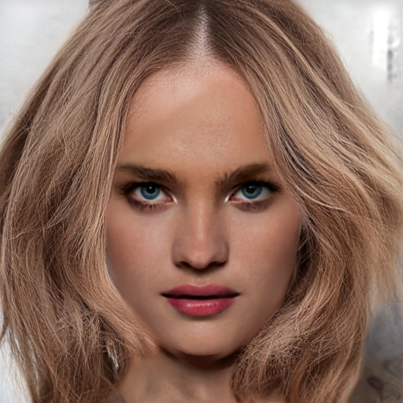 | 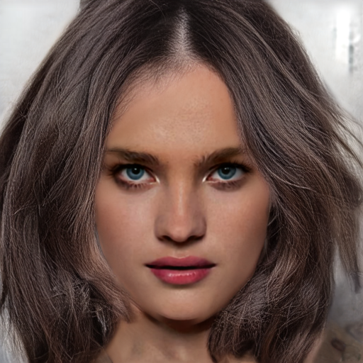 | 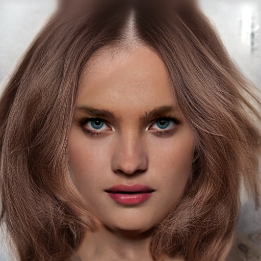 | 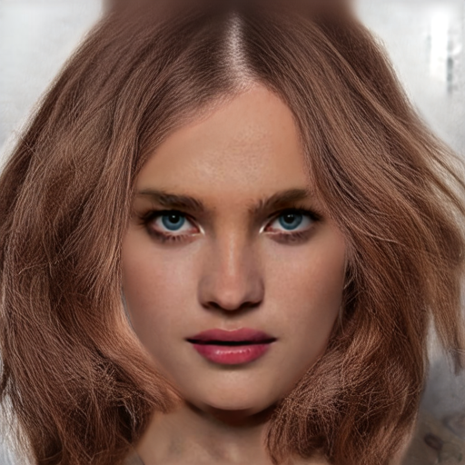 | 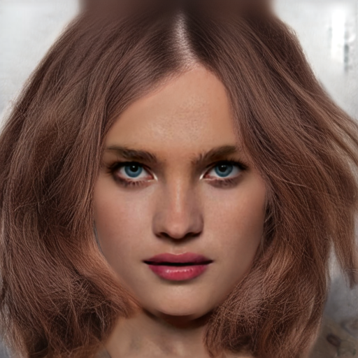 | 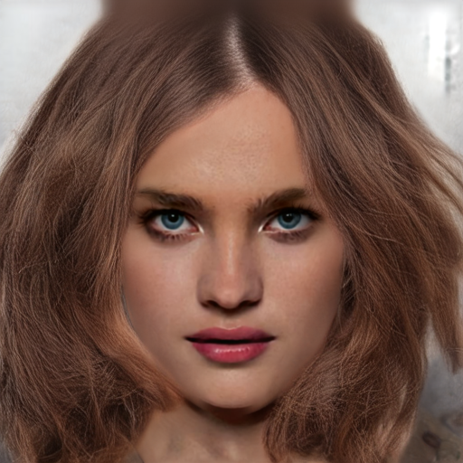 | 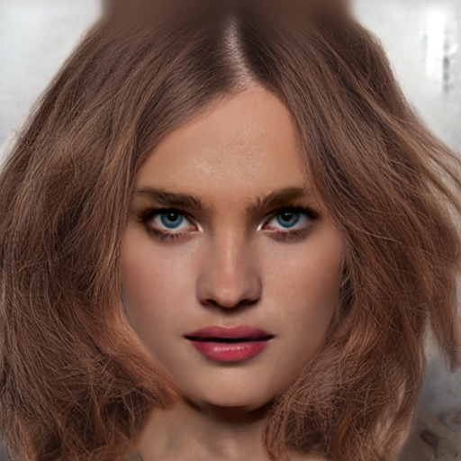 |
| CM_1082 |  |  | 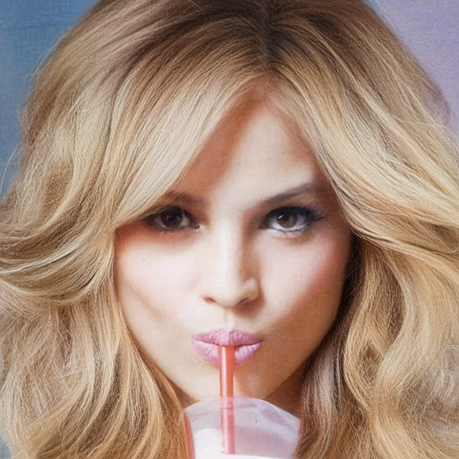 | 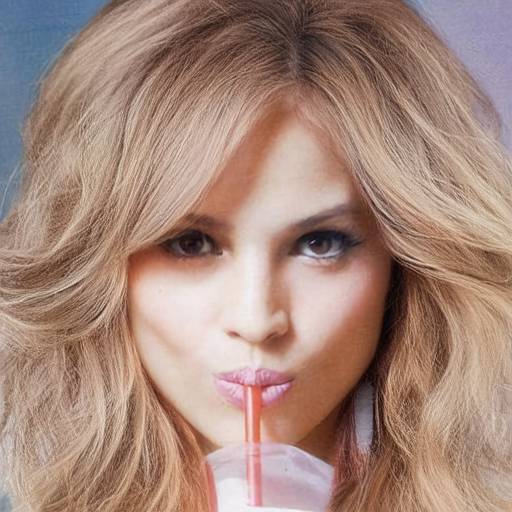 | 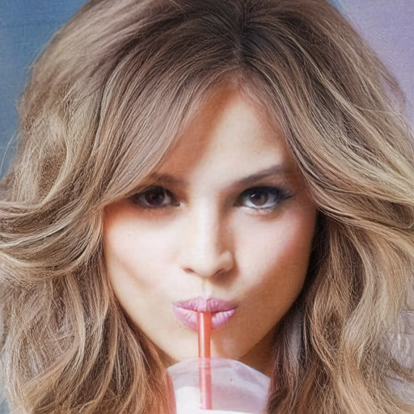 | 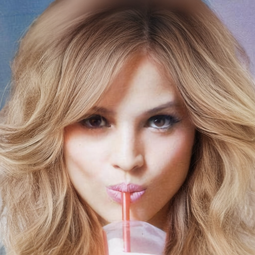 | 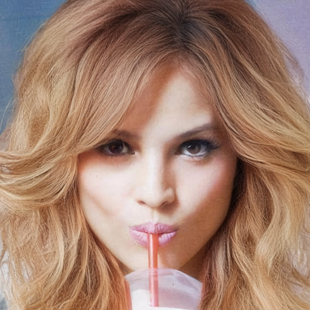 | 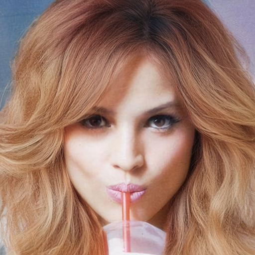 |  | 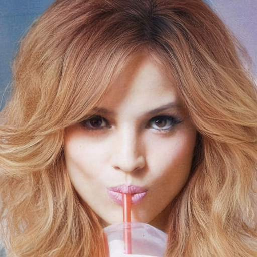 |
| CM_1068 |  | 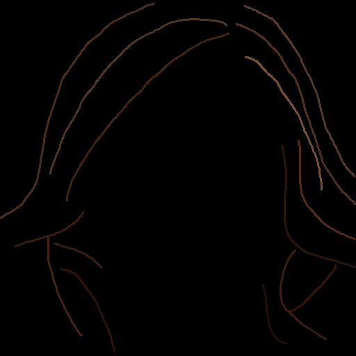 |  |  |  |  |  |  |  |  |
| CM_1172 |  |  | 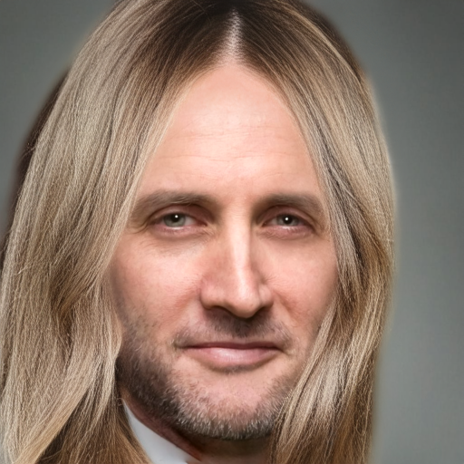 |  |  |  |  |  |  |  |

### Colorful sketch

| 파일명 | img | sketch | epoch5 | epoch10 | epoch15 | epoch20 | epoch25 | epoch30 | epoch35 | epoch40 |
|---|---|---|---|---|---|---|---|---|---|---|
| CM_1067 |  |  | 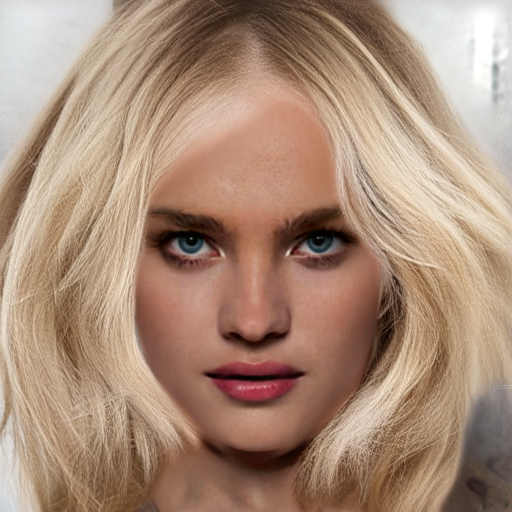 | 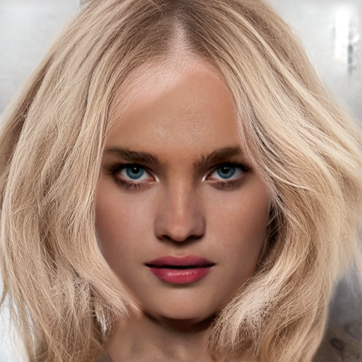 | 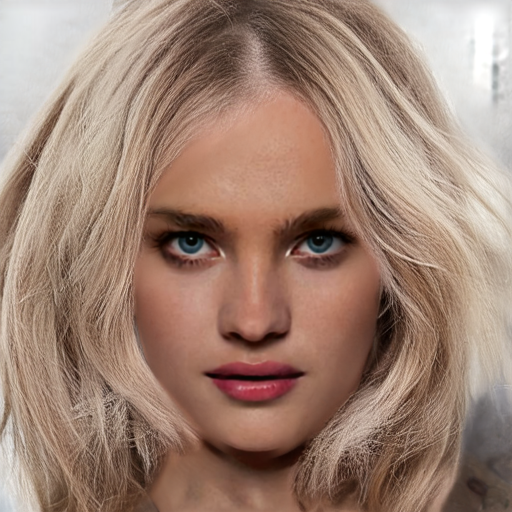 |  |  |  |  |  |
| CM_1068 |  |  |  |  |  |  |  |  |  |  |
| CM_1172 |  | 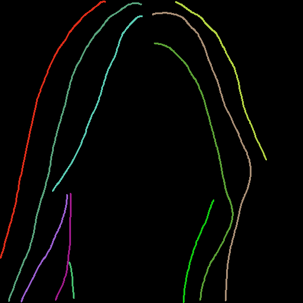 | 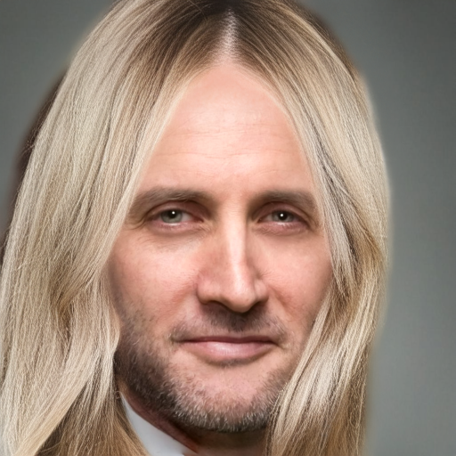 | 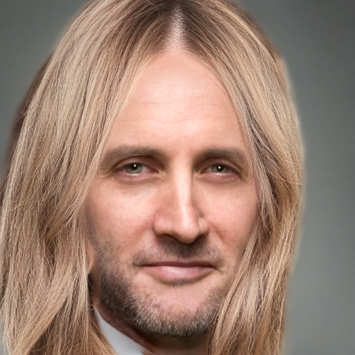 | 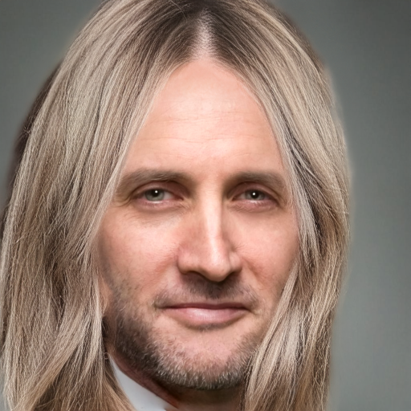 |  |  |  |  |  |
| braid_2625 |  | 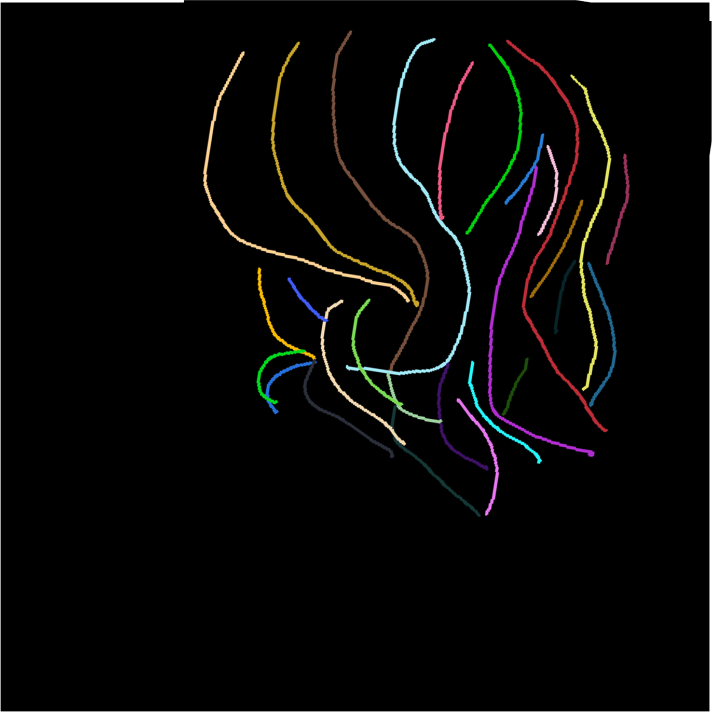 |  |  |  |  |  |  |  |  |
| CM_1084_1 | 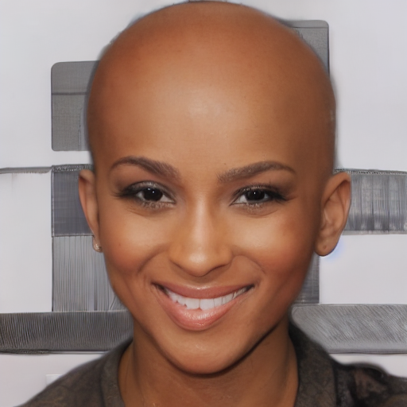 |  | 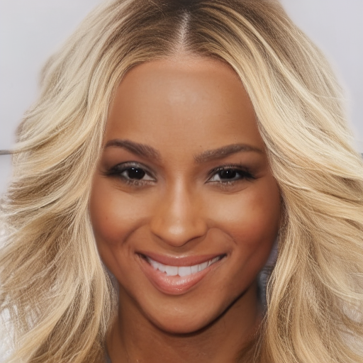 | 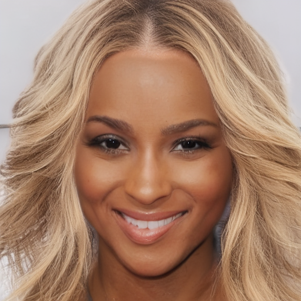 | 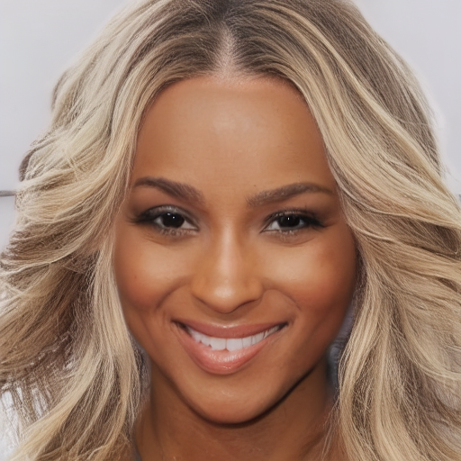 |  |  |  |  |  |

## 내용정리

## 1. 이슈 1

**내용**

(증거 이미지 표)

**원인분석**

**해결방안**
1. 
2. 
3. 
...

## 2. 이슈 2

**내용**
이전 학습(0720)은 phase2에서만 푸석함이 나타났는데, 이번(0725)은 phase1부터 나타남

(증거 이미지 표)

**원인분석**

**해결방안**

