# Seed에 따른 헤어 방향성 비교

## 0. 요약
1. 기존에 보고했던 run2의 phase1에서 방향 노이즈 안나오는 건 seed고정이 안된 것이었음 seed42로 고정하니 방향 노이즈 나옴
2. mcs2의 결과 다른 seed(1, 2, 3)에 대해 실험해봤을 때에도 이미지가 잘 나옴
3. run2p1, run4에서 seed에 따라 방향성 불일치 정도가 달라짐

## 1. 목적

Sparse한 hair stroke 조건에서 stroke 사이의 머리카락 방향은 모델의 prior에 의해 결정될 수 있으며, 이 과정이 random seed의 영향을 받는지 확인

---

## 2. 비교 대상

| | mcs2 (run1) | run2 (0720) | run4 (0730, 현재실험) |
|---|---|---|---|
| 아키텍처 | 17ch, matte_feat 비-zero-init | 32ch, B_matte zero-init | 32ch, B_matte zero-init (run2와 동일) |
| timestep → DiT | raw σ (0~1, prior 무력화) | σ×1000 (prior 정상) | σ×1000 |
| phase1 데이터 | unbraid 3000, 187 step/ep | unbraid+braid 6000장, 375 step/ep | unbraid 3000, 187 step/ep |
| phase2 데이터 | braid 1000 | phase1과 동일(both) | **없음 — phase1만 학습** |
| LR (phase1) | 1e-4 | 1e-4 | 1e-4 |
| flow 항 | `Σ(m·d²)/N` | `Σ(m²·d²)/Σm` (scale-sync 없음) | `Σ(m·d²)/Σm ÷ s` (scale-sync + matte 선형 가중 `m²→m` 복원) |
| **lpips 실효 세기 `R`** | **≈0.9** | **≈0.018** (flow가 55× 압도) | **≈0.022** (실측 0.018~0.028) |
| 본 실험 체크포인트 | phase2 epoch 40 | phase1 epoch 30 | phase1 epoch 30 |

---

## 3. 실험 조건

### 3.1 입력 이미지

| ID | img (face) | matte | sketch (gt) |
|---|---|---|---|
| CM_1067 |  | 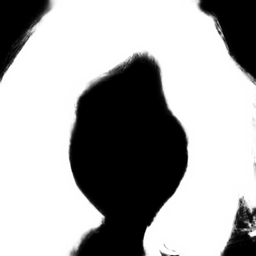 |  |
| CM_1082 |  | 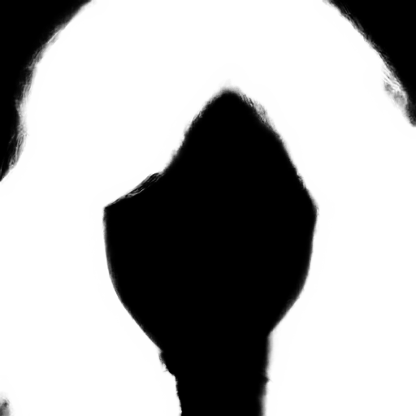 |  |

### 3.2 Inference

`seed = 42 / 1 / 2 / 3`, seed 외 조건은 전부 고정

---

## 4. 정성 비교

### 4.1 Image 1 (CM_1067)

** run2p1의  기존 보고 결과(매끄럽게 나옴)는 seed 42가 아닌 랜덤 시드로 돌린 것임을 확인. run2 phase1 epoch 10, 30 모두 seed 42에서 헤어 아랫쪽에 노이즈 생성됨.

| 모델 | Seed 42 | Seed 1 | Seed 2 | Seed 3 |
|---|---|---|---|---|
| **mcs2** |  |  |  |  |
| **run2p1** | 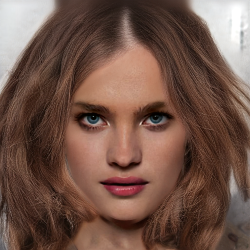 | 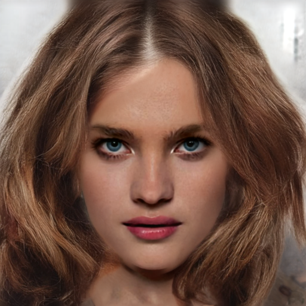 | 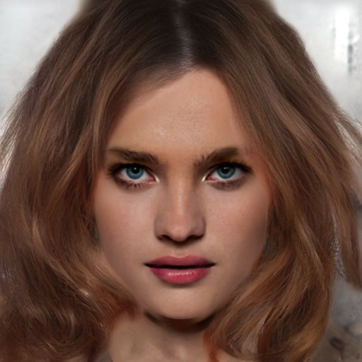 | 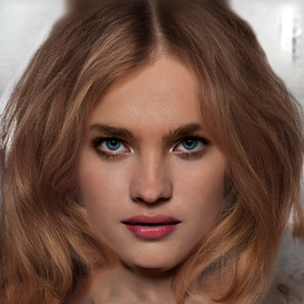 |
| **run4** |  |  |  |  |

### 4.2 Image 2 (CM_1082)

다른 seed에서도 노이즈 발생

| 모델 | Seed 42 | Seed 1 | Seed 2 | Seed 3 |
|---|---|---|---|---|
| **mcs2** |  |  |  |  |
| **run2p1** | 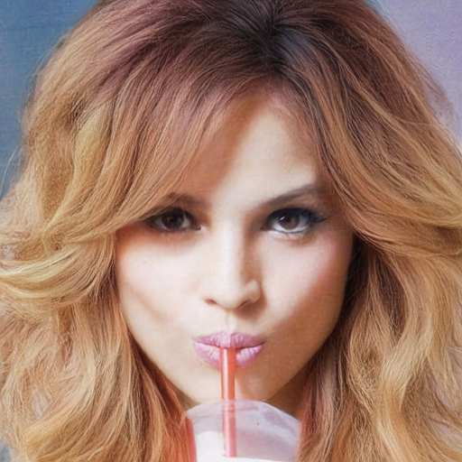 | 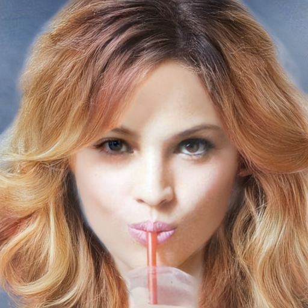 | 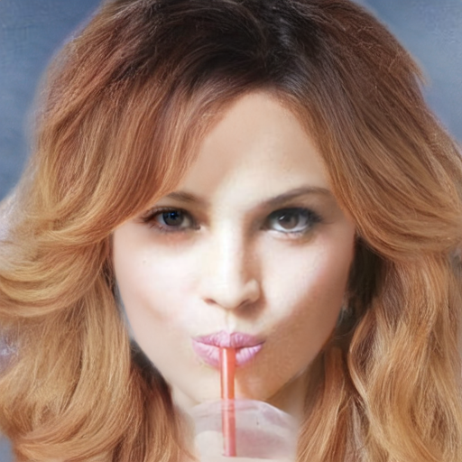 | 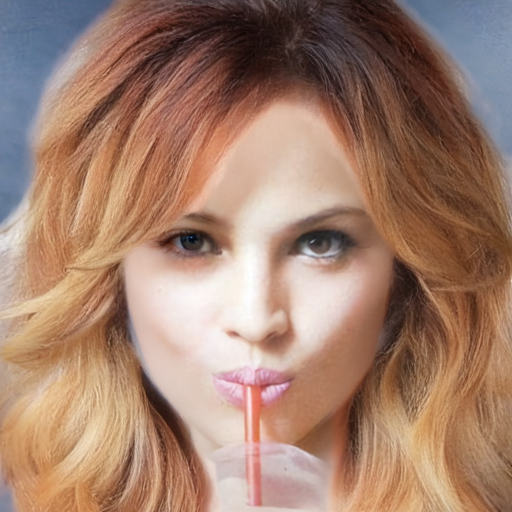 |
| **run4** |  |  |  |  |

### 4.3 run2p1 epoch별 (seed 42)

§4.1의 "epoch 10, 30 모두 하단에 노이즈, 기존 보고 결과(매끄럽게 나옴)는 seed 42가 아닌 랜덤 시드로 돌린 것" 근거. 두 epoch 모두 동일 조건으로 렌더함.

| 이미지 | epoch 10 | epoch 30 |
|---|---|---|
| seed42 | 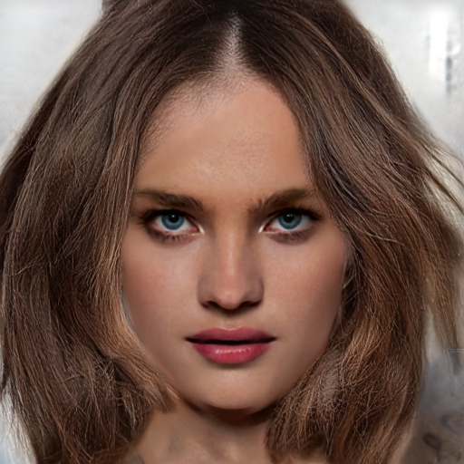 |  |
| report 이미지 |  |  |

---

## 5. 정량 평가 — 방향 오차 (structure tensor)

§4의 판정이 전부 육안이므로, 같은 이미지를 방향 지표로 다시 잰다. 구현·파라미터는
`reports/2026-08-04-orientation-metric-implementation-guide.md` 를 그대로 따랐다.
코드: [`scripts/eval/orientation_metric.py`](../scripts/eval/orientation_metric.py)

### 5.1 방법

국소 gradient 공분산(structure tensor)의 주고유벡터에 수직인 방향을 머릿결 방향 θ 로 잡고,
GT 와 생성 결과의 θ 를 double-angle 로 비교해 평균 각도차를 낸다. 두 가지로 집계한다.

| 지표 | 정의 | 무엇을 잡나 |
|---|---|---|
| **GT 오차** | 생성 결과 vs GT 의 평균 각도차 [deg] | 결이 GT 방향과 얼마나 어긋났나 |
| **seed 불일치** | 같은 run 안에서 seed 쌍 6개의 평균 각도차 [deg] | 결 방향이 seed 따라 얼마나 달라지나 |

파라미터: `σ_d=1.0`, `σ_i=3`, `erode_px=6`. `σ_i` 는 지침 §3 캘리브레이션(3/5/8 중 mcs2 와
run4 seed42 의 오차가 가장 크게 벌어지는 값)으로 정했다 — gap 이 각각 +1.00 / +0.76 / +0.32°
이므로 3. GT 는 hair 가 있는 원본을 썼다(bald 쓰면 안 됨).
각도차는 coherence 로 가중해 GT 가 흐릿한 픽셀을 배제했고, matte 는 실루엣 gradient 오염을
막으려 6px 침식했다.

**지표 검증 (지침 §5, 표 만들기 전에 수행)** — 세 항목 모두 통과.

| 검증 | 기대 | 실측 |
|---|---|---|
| GT vs GT | ~0° | **0.00°** (두 이미지) |
| GT vs GT 를 90° 회전 | ~90° | **90.00°** (두 이미지) |
| 방향=색상 / coherence=채도 시각화 | 결 방향 따라 색 띠 | 일치 — [outputs/0803/orientation/](../outputs/0803/orientation/) |

### 5.2 결과

**CM_1067**

| 모델 | seed42 | seed1 | seed2 | seed3 | **GT 오차 평균±std** | coherence | **seed 불일치** |
|---|---|---|---|---|---|---|---|
| **mcs2** | 15.93 | 15.64 | 16.13 | 15.24 | **15.73 ± 0.38** | 0.748 | **10.12 ± 0.17** |
| **run2p1** | 16.20 | 15.92 | 16.44 | 15.65 | 16.05 ± 0.34 | 0.754 | 13.10 ± 0.26 |
| **run4** | 16.56 | 16.51 | 17.17 | 16.16 | 16.60 ± 0.42 | 0.751 | 14.41 ± 0.41 |

**CM_1082**

| 모델 | seed42 | seed1 | seed2 | seed3 | **GT 오차 평균±std** | coherence | **seed 불일치** |
|---|---|---|---|---|---|---|---|
| **mcs2** | 14.51 | 14.88 | 15.20 | 15.21 | **14.95 ± 0.33** | 0.796 | **9.72 ± 0.43** |
| **run2p1** | 15.89 | 16.43 | 16.81 | 16.43 | 16.39 ± 0.38 | 0.755 | 13.70 ± 0.82 |
| **run4** | 16.12 | 16.64 | 17.70 | 16.59 | 16.76 ± 0.67 | 0.758 | 14.34 ± 0.58 |

* **GT 오차 평균**: 두 이미지 모두 mcs2 < run2p1 < run4. 이 순위는 `σ_i` 3/4/5/6/8 ×
  `erode_px` 4/6/8 의 15개 조합 전부에서 동일해 파라미터에 의존하지 않는다.
* **seed 불일치**: mcs2 가 32ch 계열보다 30~40% 낮다(9.7~10.1° vs 13.1~14.4°). 두 이미지에서
  일관되고 seed 쌍 6개의 흔들림도 작다(±0.17~0.82). §0-2·§0-3 의 육안 결론이 그대로 재현된다.
* **coherence 는 세 run 이 거의 같다**(0.748~0.796). 결의 선명도 차이가 아니라 **방향 차이**임을
  뒷받침한다.

### 5.3 지표의 한계 (해석 시 주의)

* **절대값을 모델 정확도로 읽으면 안 된다.** GT 는 실사진이라 웨이브·레이어 겹침 때문에 국소
  방향이 stroke 를 따라 일방적으로 흐르지 않는다. GT 자신의 스케일 간 방향 흔들림만 재도
  CM_1067 10.24° / CM_1082 9.91° 로, **측정 오차의 62~64% 가 GT 자체의 복잡도**다. run 간
  상대 비교로만 읽어야 한다.
* **seed std 는 감도가 낮다.** run4 는 std 로 잡히지만(CM_1082 0.67 vs mcs2 0.33) run2p1 은
  mcs2 와 구분되지 않는다. std 는 seed 별 오차 **크기**의 변동만 재기 때문에, 두 seed 가 서로
  반대 방향으로 틀려도 같은 값이 나온다. §4.1 의 run2p1 seed42 하단 노이즈처럼 국소적인
  결함은 hair 전체 평균에 희석되기도 한다. seed 불일치 지표는 방향 차이를 직접 재서 이
  사각지대를 메우며, 실제로 run2p1 을 mcs2 와 분리해낸다.
* 이미지 2장 × seed 4개라 표본이 작다. **단일 seed 판정은 하지 않는다.**
* 판정용 지표이며 loss 로 학습에 넣지 않는다.

---

## 6. 분석

* 동일한 입력과 체크포인트에서도 seed에 따라 stroke 사이에 생성되는 머리카락 방향이 달라짐. 단, 영향의 크기는 체크포인트별·이미지별로 다름.
* stroke가 없는 중간 영역은 입력이 방향을 지정하지 못해 초기 noise와 모델 prior가 방향을 결정함 — seed 의존성이 여기서 나옴.
* mcs2는 네 seed 모두 가닥 방향이 일관돼, 특정 seed에서만 좋은 결과가 나온 것으로 보기 어려움.
* run4의 LPIPS 조정은 푸석거림을 개선했지만 방향성 문제는 seed에 따라 여전히 나타남.

---

## 7. 부록 — run4 seed 실험

run4 phase1 epoch 30 seed별 이미지

### 7.1 seed별 (gt sketch)

| 이미지 | input sketch | Seed 42 | Seed 1 | Seed 2 | Seed 3 |
|---|---|---|---|---|---|
| CM_1027 |  | 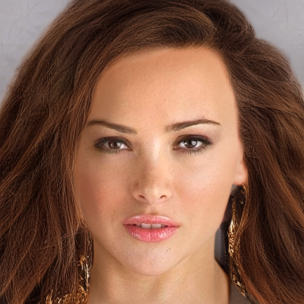 | 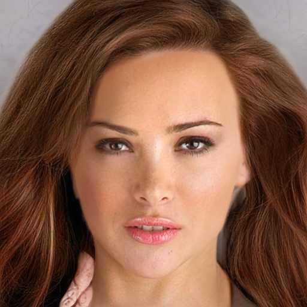 | 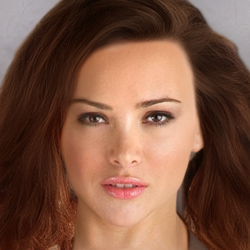 | 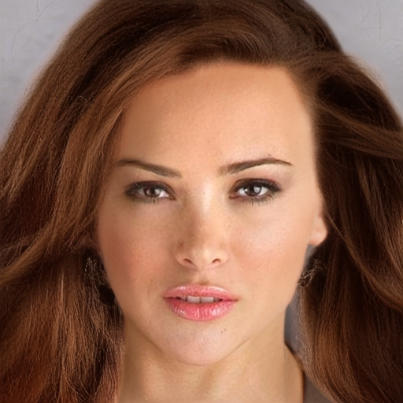 |
| CM_1033 | 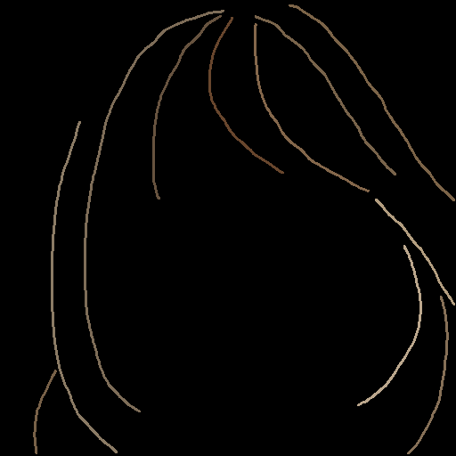 | 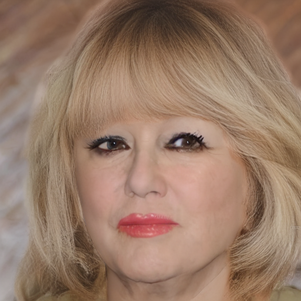 | 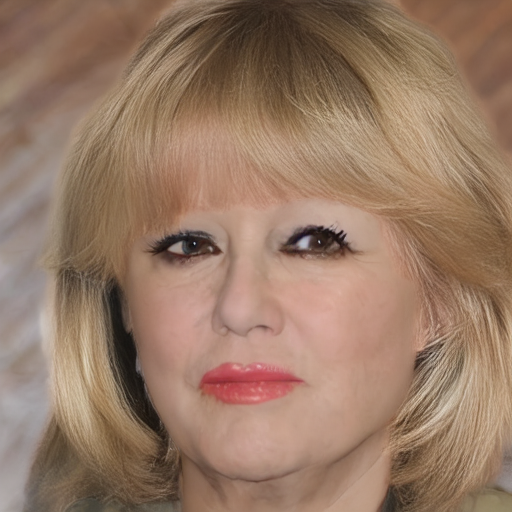 |  |  |
| CM_1084 | 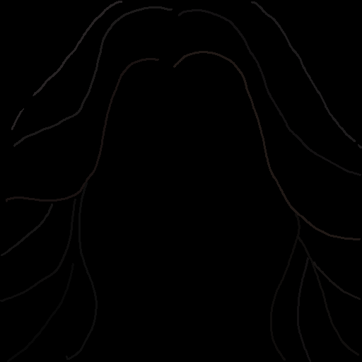 | 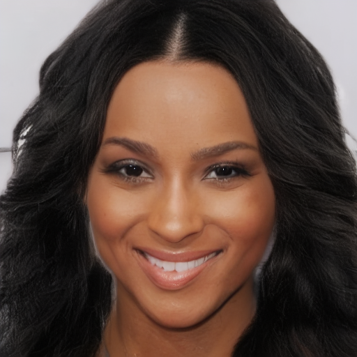 | 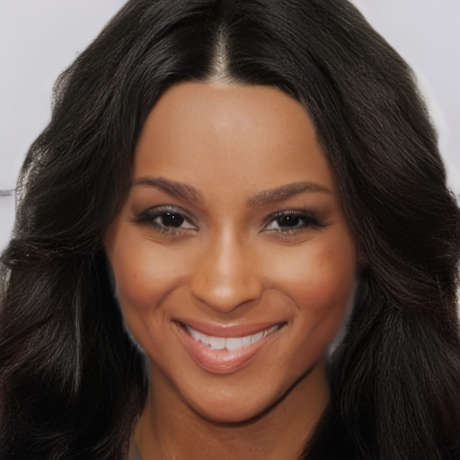 | 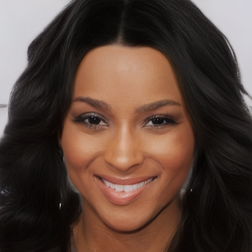 | 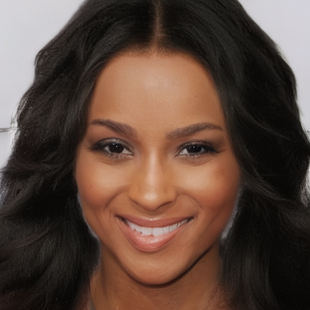 |

### 7.2 seed별 (colorful sketch)

| 이미지 | input sketch | Seed 42 | Seed 1 | Seed 2 | Seed 3 |
|---|---|---|---|---|---|
| CM_1067 |  |  | 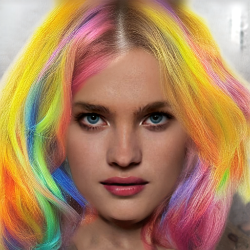 | 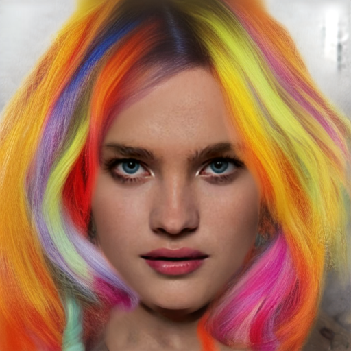 | 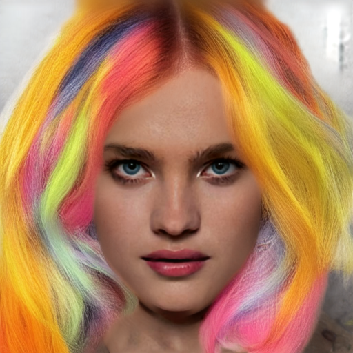 |
| CM_1068 |  |  |  |  |  |
| CM_1172 |  |  |  |  | 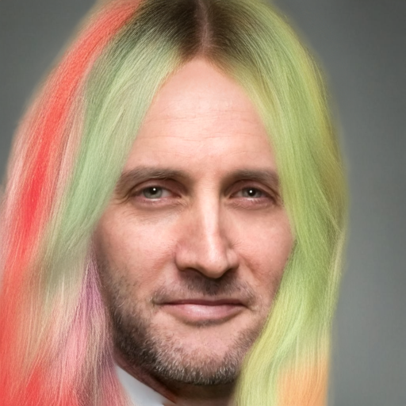 |
| CM_1027 |  | 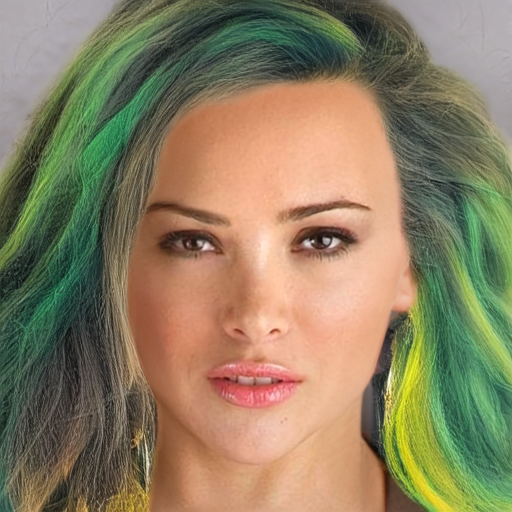 | 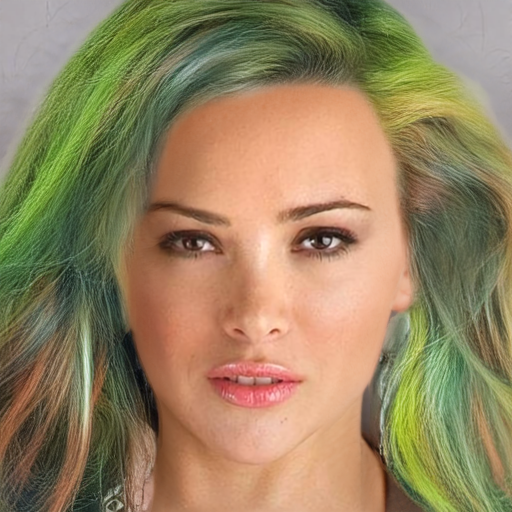 | 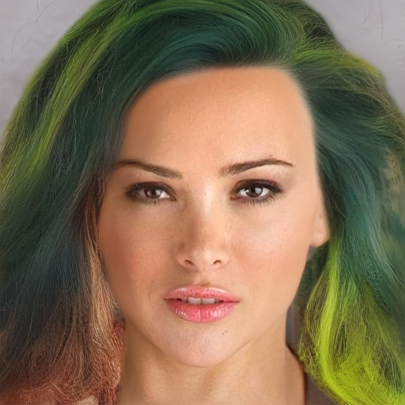 | 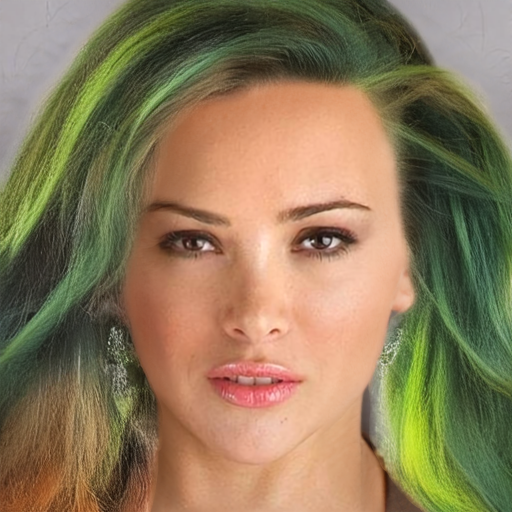 |
