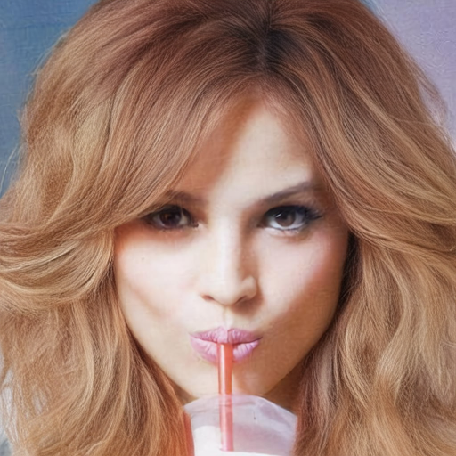
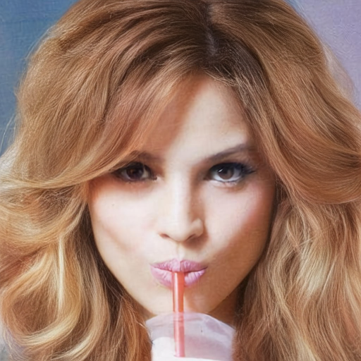
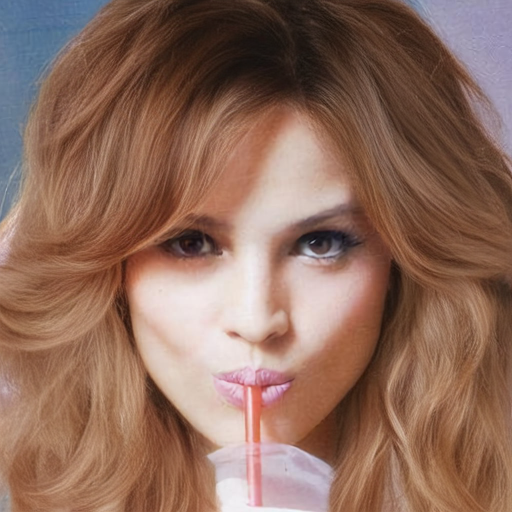
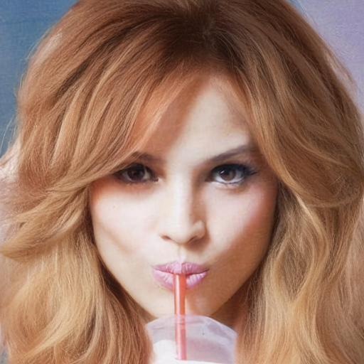

# Seed에 따른 Hair Directionality 비교

## 0. 요약
1. run2의 phase1에서 방향 노이즈 안나오는 건 seed고정이 안된 것이었음 seed42로 고정하니 방향 노이즈 나옴
2. mcs2의 결과 다른 seed(1, 2, 3)에 대해 실험해봤을 때에도 이미지가 잘 나옴
3. run2p1, run4에서 seed에 따라 방향성 불일치 정도가 달라짐(현재로서는 seed 42에서만 방향 불일치 확인)

## 1. 목적

Sparse한 hair stroke 조건에서 stroke 사이의 머리카락 방향은 모델의 prior에 의해 결정될 수 있으며, 이 과정이 random seed의 영향을 받는지 확인한다.

특히 다음 가설을 검증한다.

1. hair directionality 문제는 특정 random seed에서만 두드러질 수 있다.
2. mcs2의 기존 결과가 상대적으로 좋은 seed에서 생성된 결과일 가능성이 있다.
3. run2p1, run4에서도 seed에 따라 방향성 불일치 정도가 달라질 수 있다.

---

## 2. 비교 대상

다음 세 체크포인트를 비교한다.

| | mcs2 (run1) | run2 (0720) | run4 (0730, 현재실험) |
|---|---|---|---|
| 코드 시점 | `0033de3` (7/15 이전) | `9f8c9da` 부근 (7/18) | `b3550a3` (7/30) |
| 아키텍처 | 17ch, matte_feat 비-zero-init | 32ch, B_matte zero-init | 32ch, B_matte zero-init (run2와 동일) |
| timestep → DiT | raw σ (0~1, prior 무력화) | σ×1000 (prior 정상) | σ×1000 |
| phase1 데이터 | unbraid 3000, 187 step/ep | unbraid+braid 6000장, 375 step/ep | unbraid 3000, 187 step/ep |
| phase2 데이터 | braid 1000 | phase1과 동일(both) | **없음 — phase1만 학습** |
| LR (phase1) | 1e-4 | 1e-4 | 1e-4 |
| flow 항 | `Σ(m·d²)/N` | `Σ(m²·d²)/Σm` (scale-sync 없음) | `Σ(m·d²)/Σm ÷ s` (scale-sync + matte 선형 가중 `m²→m` 복원) |
| 설정 `w_lpips` | 0.1 | 0.1 | **0.002** |
| **lpips 실효 세기 `R`** | **≈0.9** | **≈0.018** (flow가 55× 압도) | **≈0.022** (실측 0.018~0.028) |
| LPIPS 활성 | 30% 이후 | `Epoch 13/40`부터 | step 2244 = ep13부터 |
| 본 실험에 사용한 체크포인트 | phase2 최종 | phase1 epoch30 | phase1 epoch30 |
| 기존 관찰(머릿결) | 정렬 + 선명 | phase1 정렬 / phase2 미세 노이즈 | frizz 해결, 방향 노이즈 미세 잔존 |

---

## 3. 실험 조건

### 3.1 입력 이미지

방향성 문제가 명확하게 관찰되는 `data/paper/`의 이미지 2장을 사용한다.

| ID | 파일명 | img (face) | matte | sketch (gt) | sketch (colorful) | 특징 |
|---|---|---|---|---|---|---|
| **Image 1** | CM_1067 |  |  |  |  | 갈색 중단발. matte 내부 대비 stroke 밀도가 낮아 stroke 사이 방향이 prior로 결정되는 영역이 넓음 — 방향성 불일치가 가장 명확 |
| **Image 2** | CM_1082 |  |  |  |  | 금발 웨이브 볼륨. stroke가 좌우 외곽·하단 가닥에만 분포하고 **중앙 대부분이 비어 있어** sparse 조건이 더 극단적 |

- inference 입력은 `--sketch`(sketch_gt) / `--matte`(matt) / `--face`(img) 세 가지다. §4의 mcs2·run2p1·run4 표는 모두 **sketch_gt** 입력이고, §4.3의 참고 표만 colorful **sketch** 입력이다.
- `ori_image`는 `data/paper/`에 없다(`data/unbraid_new/ori_image`에만 존재하며 CM_1067·CM_1082는 포함돼 있지 않음). 원본 사진 역할은 위 `img` 열이 대신한다.

### 3.2 Random seed

각 체크포인트 및 이미지에 대해 다음 4개 seed로 inference를 수행한다.

```text
seed = 42, 1, 2, 3
```

모든 비교에서 seed 이외의 inference 조건은 동일하게 유지한다.

```text
num_steps:         28
bld_mode:          full
bld_soft_steps:    24
pixel_blend:       on
pixel_blend_alpha: 0.75
checkpoint:        mcs2 = phase2 최종 / run2p1 = phase1 epoch30 / run4 = phase1 epoch30
```

> run4의 seed 42 렌더(`outputs/0803/seed_run4/42/`)는 `outputs/0730/epoch30/`과 **바이트 단위로 동일**하다 —
> `[0730]results.md`의 epoch30 결과와 같은 조건임이 확인된다. colorful 쪽도 `outputs/0730/epoch30_color/`와 동일.

### 3.3 전체 실험 수

계획은 `3 checkpoints × 2 images × 4 seeds = 24`였으나, **현재 렌더된 것은 22개**다.

| 모델 | 출력 경로 | seed 42 | seed 1 | seed 2 | seed 3 |
|---|---|:-:|:-:|:-:|:-:|
| mcs2 | `outputs/0803/seed_mcs2/{seed}/` | O | O | O | O |
| run2p1 | `outputs/0803/seed_run2/{seed}/` | O | O | O | **X (미생성)** |
| run4 | `outputs/0803/seed_run4/{seed}/` | O | O | O | O |
| run4 (colorful, 참고) | `outputs/0803/seed_run4_color/{seed}/` | O | O | O | O |

**run2p1의 seed 3만 비어 있다** — §5 표를 채우기 전에 추가 생성 필요.

---

## 4. 정성 비교

## 4.1 Image 1 (CM_1067)

입력:  → 각 모델 seed별 결과

### mcs2

| Seed 42 | Seed 1 | Seed 2 | Seed 3 |
|---|---|---|---|
|  |  |  |  |

**관찰**

* Seed 42:
* Seed 1:
* Seed 2:
* Seed 3:
* Seed에 따른 방향성 변화:

### run2p1

| Seed 42 | Seed 1 | Seed 2 | Seed 3 |
|---|---|---|---|
|  |  |  | *(미생성)* |

**관찰**

* Seed 42:
* Seed 1:
* Seed 2:
* Seed 3:
* Seed에 따른 방향성 변화:

### run4

| Seed 42 | Seed 1 | Seed 2 | Seed 3 |
|---|---|---|---|
|  |  |  |  |

**관찰**

* Seed 42:
* Seed 1:
* Seed 2:
* Seed 3:
* Seed에 따른 방향성 변화:

---

## 4.2 Image 2 (CM_1082)

입력:  → 각 모델 seed별 결과

### mcs2

| Seed 42 | Seed 1 | Seed 2 | Seed 3 |
|---|---|---|---|
|  |  |  |  |

**관찰**

* Seed 42:
* Seed 1:
* Seed 2:
* Seed 3:
* Seed에 따른 방향성 변화:

### run2p1

| Seed 42 | Seed 1 | Seed 2 | Seed 3 |
|---|---|---|---|
|  |  |  | *(미생성)* |

**관찰**

* Seed 42:
* Seed 1:
* Seed 2:
* Seed 3:
* Seed에 따른 방향성 변화:

### run4

| Seed 42 | Seed 1 | Seed 2 | Seed 3 |
|---|---|---|---|
|  |  |  |  |

**관찰**

* Seed 42:
* Seed 1:
* Seed 2:
* Seed 3:
* Seed에 따른 방향성 변화:

---

## 4.3 참고 — run4 colorful sketch 입력

같은 run4 epoch30 체크포인트에 colorful sketch(`data/paper/sketch/`)를 넣은 seed 스윕. 방향성 판정은 §4.1~4.2(gt sketch)로 하고, 여기서는 **색 반영이 seed에 따라 흔들리는지**만 참고로 본다.

| 이미지 | Seed 42 | Seed 1 | Seed 2 | Seed 3 |
|---|---|---|---|---|
| CM_1067 |  |  |  |  |
| CM_1082 |  |  |  |  |

**관찰**

* 색 반영의 seed 의존성:

### 4.4 이번 배치의 나머지 출력 (seed 실험 대상 아님)

| 경로 | 내용 |
|---|---|
| `outputs/0803/seed_run2_epoch5/42/` | run2p1의 다른 epoch 체크포인트, seed 42만. ⚠️ 폴더명은 epoch5인데 렌더 직전 받은 체크포인트는 `joint_phase1_0/epoch_10_infer.pth`뿐이라 **실제 epoch 확인 필요** |
| `outputs/0803/seed_run4/{10,20,30,40}/` | seed가 아니라 **`bld_soft_steps` 스윕**(10/20/30/40). `num_steps=28`이라 30·40은 조건이 발동하지 않아 두 폴더 출력이 바이트 단위로 동일하다 |

---

## 5. Seed별 결과 요약

방향성 불일치 정도를 정성적으로 다음과 같이 구분한다.

```text
0: 방향성 불일치가 거의 보이지 않음
1: 일부 영역에서 약하게 관찰됨
2: 명확하게 관찰됨
3: 결과 품질에 큰 영향을 줄 정도로 심함
```

| Model  | Image             | Seed 42 | Seed 1 | Seed 2 | Seed 3 |
| ------ | ----------------- | ------: | -----: | -----: | -----: |
| mcs2   | Image 1 (CM_1067) |         |        |        |        |
| mcs2   | Image 2 (CM_1082) |         |        |        |        |
| run2p1 | Image 1 (CM_1067) |         |        |        | *미생성* |
| run2p1 | Image 2 (CM_1082) |         |        |        | *미생성* |
| run4   | Image 1 (CM_1067) |         |        |        |        |
| run4   | Image 2 (CM_1082) |         |        |        |        |

위 점수는 현재 정성 평가이며, 이후 별도 지침에 따라 정량 평가로 대체하거나 보완할 예정이다.

---

## 6. 분석

### 6.1 Seed 영향

* 동일한 입력과 체크포인트에서도 seed에 따라 stroke 사이에 생성되는 머리카락 방향이 달라졌다.
* 이는 sparse한 stroke만으로는 중간 영역의 방향성이 충분히 제한되지 않으며, 해당 영역이 초기 noise와 모델 prior의 영향을 받기 때문으로 해석할 수 있다.
* 다만 seed 영향의 크기는 체크포인트별로 차이가 있었다.

### 6.2 mcs2의 lucky seed 가능성

* mcs2가 모든 seed에서 일관되게 좋은 결과를 보이는지 확인한다.
* seed 42에서만 상대적으로 좋은 결과를 보이고 다른 seed에서 방향성 문제가 증가한다면, 기존 mcs2 결과가 lucky seed였을 가능성이 있다.
* 반대로 여러 seed에서 안정적인 결과를 보인다면, mcs2의 성능 차이는 seed 이외의 학습 방식이나 데이터 처리 차이에서 발생했을 가능성이 높다.

### 6.3 run2p1과 run4 비교

* run2p1에서 과거 방향성 문제가 보고되지 않았던 것이 모델 자체의 안정성 때문인지, 당시 사용한 이미지 및 seed 조합 때문인지 구분한다.
* run4의 LPIPS 조정은 푸석거림 개선에는 영향을 주었으나, 방향성 문제는 별개의 요인일 가능성이 있다.
* run4에서도 특정 seed에서만 방향성 문제가 발생한다면, LPIPS보다는 sparse stroke 조건과 prior 의존성이 주요 원인으로 판단된다.

---

## 7. 결론

현재 결과를 통해 다음을 확인하였다.

1. 푸석거림 및 고주파 뻣뻣함 문제는 LPIPS 가중치 조정 후 개선되었다.
2. Hair directionality는 동일 체크포인트에서도 random seed에 따라 달라질 수 있다.
3. 특히 sparse stroke 사이 영역은 입력 조건보다 모델 prior 및 초기 noise의 영향을 상대적으로 크게 받는 것으로 보인다.
4. mcs2가 seed 전반에서 안정적인지, 특정 seed에서만 좋은 결과를 생성하는지는 본 비교 결과를 통해 판단해야 한다.
5. 이후 hair directionality 불일치를 수치화할 수 있는 정량 평가를 추가할 예정이다.

---

## 8. 추가 확인 사항

* [ ] SHS 논문에서 hair stroke를 dense하게 구성하는 전처리 또는 augmentation이 사용되었는지 확인
* [ ] mcs2 초기 학습 코드 및 데이터 전처리 과정에서 stroke densification이 적용되었는지 확인
* [ ] Hair directionality 정량 평가 방법 적용
* [ ] 필요 시 seed 수와 평가 이미지 수 확대
