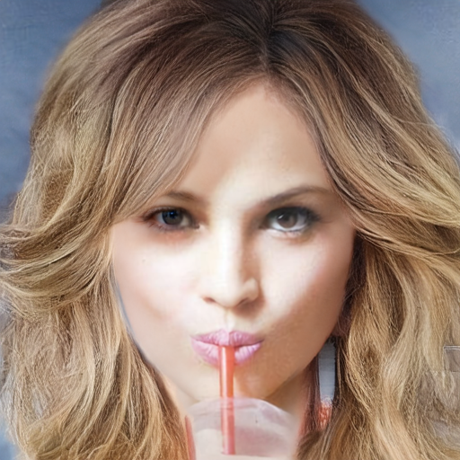

# Seed에 따른 Hair Directionality 비교

## 0. 요약
1. run2의 phase1에서 방향 노이즈 안나오는 건 seed고정이 안된 것이었음 seed42로 고정하니 방향 노이즈 나옴
2. mcs2의 결과 다른 seed(1, 2, 3)에 대해 실험해봤을 때에도 이미지가 잘 나옴
3. run2p1, run4에서 seed에 따라 방향성 불일치 정도가 달라짐

## 1. 목적

Sparse한 hair stroke 조건에서 stroke 사이의 머리카락 방향은 모델의 prior에 의해 결정될 수 있으며, 이 과정이 random seed의 영향을 받는지 확인함.

---

## 2. 비교 대상

| | mcs2 (run1) | run2 (0720) | run4 (0730, 현재실험) |
|---|---|---|---|
| 아키텍처 | 17ch, matte_feat 비-zero-init | 32ch, B_matte zero-init | 32ch, B_matte zero-init (run2와 동일) |
| timestep → DiT | raw σ (0~1, prior 무력화) | σ×1000 (prior 정상) | σ×1000 |
| phase1 데이터 | unbraid 3000, 187 step/ep | unbraid+braid 6000장, 375 step/ep | unbraid 3000, 187 step/ep |
| phase2 데이터 | braid 1000 | phase1과 동일(both) | **없음 — phase1만 학습** |
| LR (phase1) | 1e-4 | 1e-4 | 1e-4 |
| flow 항 | `Σ(m·d²)/N` | `Σ(m²·d²)/Σm` (scale-sync 없음) | `Σ(m·d²)/Σm ÷ s` (scale-sync + matte 선형 가중 `m²→m` 복원) |
| **lpips 실효 세기 `R`** | **≈0.9** | **≈0.018** (flow가 55× 압도) | **≈0.022** (실측 0.018~0.028) |
| 본 실험 체크포인트 | phase2 epoch 40 | phase1 epoch 30 | phase1 epoch 30 |

---

## 3. 실험 조건

### 3.1 입력 이미지

| ID | img (face) | matte | sketch (gt) |
|---|---|---|---|
| CM_1067 |  |  |  |
| CM_1082 |  |  |  |

### 3.2 Inference

`seed = 42 / 1 / 2 / 3`, seed 외 조건은 전부 고정

---

## 4. 정성 비교

### 4.1 Image 1 (CM_1067)

** run2p1의  기존 보고 결과(매끄럽게 나옴)는 seed 42가 아닌 랜덤 시드로 돌린 것임을 확인. run2 phase1 epoch 10, 30 모두 seed 42에서 헤어 아랫쪽에 노이즈 생성됨.

| 모델 | Seed 42 | Seed 1 | Seed 2 | Seed 3 |
|---|---|---|---|---|
| **mcs2** |  |  |  |  |
| **run2p1** |  |  |  |  |
| **run4** |  |  |  |  |

### 4.2 Image 2 (CM_1082)

다른 seed에서도 노이즈 발생

| 모델 | Seed 42 | Seed 1 | Seed 2 | Seed 3 |
|---|---|---|---|---|
| **mcs2** |  |  |  |  |
| **run2p1** |  |  |  |  |
| **run4** |  |  |  |  |

### 4.3 run2p1 epoch별 (seed 42)

§4.1의 "epoch 10, 30 모두 하단에 노이즈" 근거. 두 epoch 모두 동일 조건으로 렌더함.

| 이미지 | epoch 10 | epoch 30 |
|---|---|---|
| CM_1067 |  |  |
| CM_1082 |  |  |

---

## 5. 분석

* 동일한 입력과 체크포인트에서도 seed에 따라 stroke 사이에 생성되는 머리카락 방향이 달라짐. 단, 영향의 크기는 체크포인트별·이미지별로 다름.
* stroke가 없는 중간 영역은 입력이 방향을 지정하지 못해 초기 noise와 모델 prior가 방향을 결정함 — seed 의존성이 여기서 나옴.
* mcs2는 네 seed 모두 가닥 방향이 일관돼, 특정 seed에서만 좋은 결과가 나온 것으로 보기 어려움.
* run4의 LPIPS 조정은 푸석거림을 개선했지만 방향성 문제는 seed에 따라 여전히 나타남.
