# [2026-08-04] Stroke Densification 추론 검증 결과 (옵션 A′)

**대상**: JSH (장서현) — HairDiT 축 ②
**성격**: 실행 결과 기록. 재학습 없음 / GPU는 추론에만 사용
**선행 지침**: `2026-08-04-stroke-densification-inference-test-guide.md` (절차), `2026-08-04-orientation-metric-implementation-guide.md` (판정 지표)

---

## 0. 결론 먼저

> **"stroke 밀도를 올리면 방향의 seed 종속성이 줄어드는가?" → 예.**

run4(0730 체크포인트, phase1 epoch30)에 densified sketch 만 입력해 재학습 없이 추론한 결과,
**seed 간 방향 불일치가 baseline 대비 21~26% 감소**했고 GT 방향 오차도 함께 줄었다(§5 판정
기준의 "std 감소 + mean 감소" 조건 충족). 단, K(밀도)에 따라 선형으로 계속 좋아지진 않고
**L1(약한 densification)에서 이미 개선분 대부분을 얻고 이후 포화**되는 양상이며, mcs2 수준
(seed 완전 강건)까지는 못 미친다. 

---

## 1. 전처리 — §3 검증 중 발견한 이슈와 처리

가이드 코드 그대로 CM_1067·CM_1082 에 K=25/15/11(L1/L2/L3) 적용.

### 1.1 밀도 실측

| level | K | CM_1067 density | CM_1082 density |
|---|---|---|---|
| 원본 | - | 0.0689 | 0.0737 |
| L1_mild | 25 | 0.1194 | 0.1270 |
| L2_mid | 15 | 0.1638 | 0.1613 |
| L3_strong | 11 | 0.1719 | 0.1720 |

원본 밀도가 가이드가 가정한 0.03~0.05 보다 높게(0.069~0.074) 나왔다 — 이 데이터셋 sketch가
가이드 작성 시 참고한 수치보다 원래 조금 더 촘촘한 것으로 보인다. K에 따라 단조 증가하는
경향 자체는 가이드 기대와 일치.

### 1.2 §3 시각화 검증 체크리스트
- **평행성(#1), 색 전파(#4)**: 통과. 추가(초록) stroke가 주변 원본과 평행하고 색도 자연스럽게
  이어짐.
- **matte 경계 유착(#2)**: 바깥쪽 실루엣을 따라 얇게 흐르는 stroke 발견. `matte_erode`를
  8→12로 올려도 사라지지 않아 원인을 조사한 결과, **원본 sketch의 가장 바깥쪽 stroke 자체가
  실루엣보다 40~60px 안쪽에 그려져 있어** 그 사이 전체가 실루엣과 나란한 폭넓은 진짜 간극임을
  확인. 경계 유착 버그가 아니라 SHS 알고리즘이 "stroke 없는 넓은 영역을 채운다"는 설계대로
  동작한 것으로 판단. `boundary_exclude` 파라미터(간극 후보에서 실루엣 인접 띠를 추가로
  제외)를 구현해 15/25/35px로 테스트했으나 유착선이 안쪽으로 이동만 하고 사라지지 않았고
  밀도만 감소해, **기본값(`boundary_exclude=0`) 유지**로 결정.
- **잔가지(#3)**: CM_1082 densified 결과에 20×30px 정도의 작은 loop 흠집 1개 발견.
  `prune_iter`는 끝점 기반 가지치기라 닫힌 loop 는 못 없앰(3→5로 올려도 잔존). 전체 hair
  영역의 1% 미만인 국소 결함이라 **무시하고 진행** — 방향 지표는 coherence 가중 + matte 6px
  침식을 쓰므로 이 정도 크기의 국소 결함이 측정치를 흔들 가능성은 낮다고 판단.

---

## 2. 결과 이미지

기존 seed 실험과 동일 조건(체크포인트 run4 phase1 epoch30, 20-step)에서 sketch 입력만 교체. baseline·mcs2 참조는
기존 렌더 재사용, L1/L2/L3 24장만 신규 추론.

### 2.1 입력 sketch — 원본 대비 densified

| | 원본 | L1_mild (K=25) | L2_mid (K=15) | L3_strong (K=11) |
|---|---|---|---|---|
| CM_1067 |  | 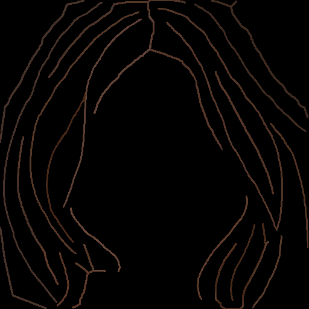 | 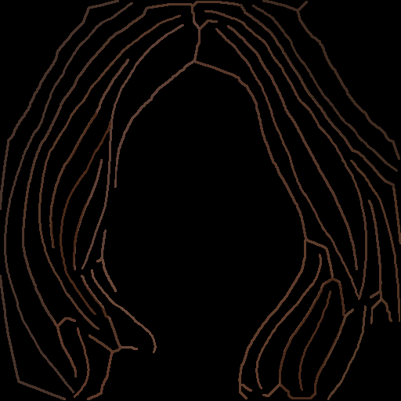 | 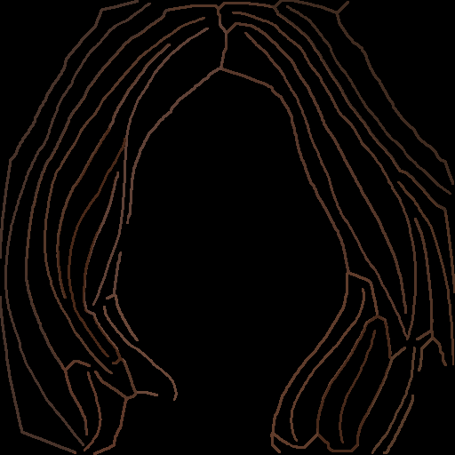 |
| CM_1082 |  | 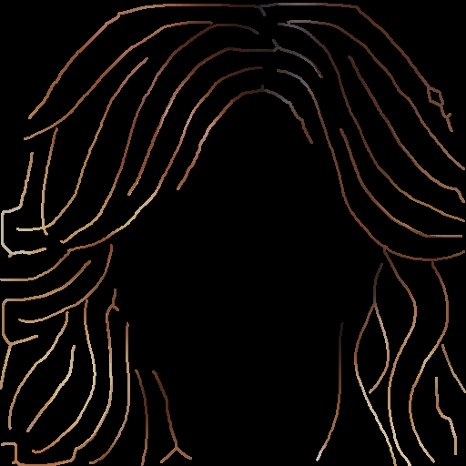 | 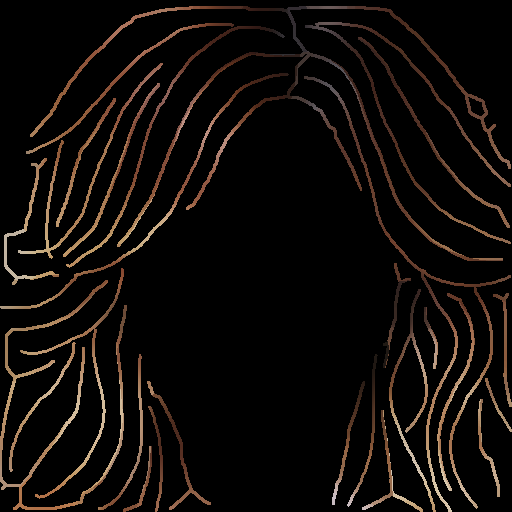 | 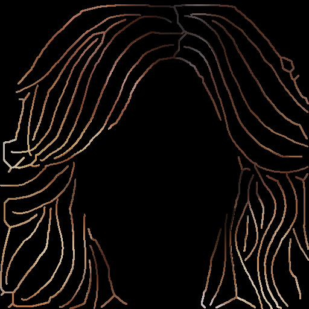 |

### 2.2 생성 결과 — CM_1067 (조건 × seed)

| run | seed42 | seed1 | seed2 | seed3 |
|---|---|---|---|---|
| baseline (원본) | 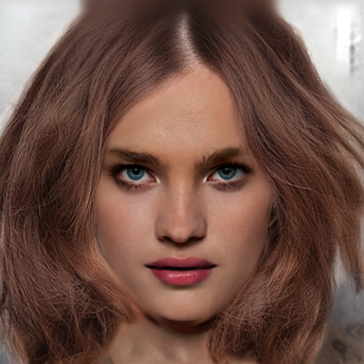 |  | 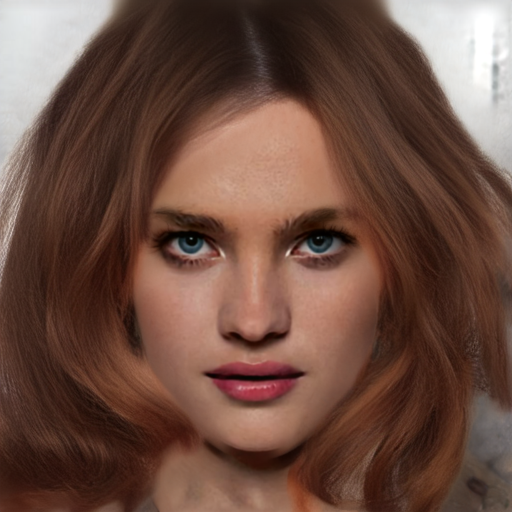 | 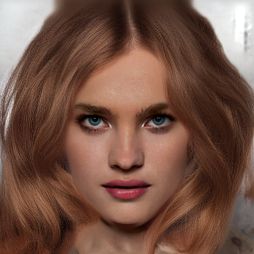 |
| L1_mild | 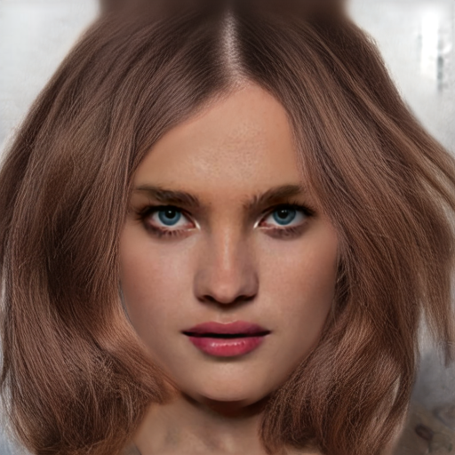 | 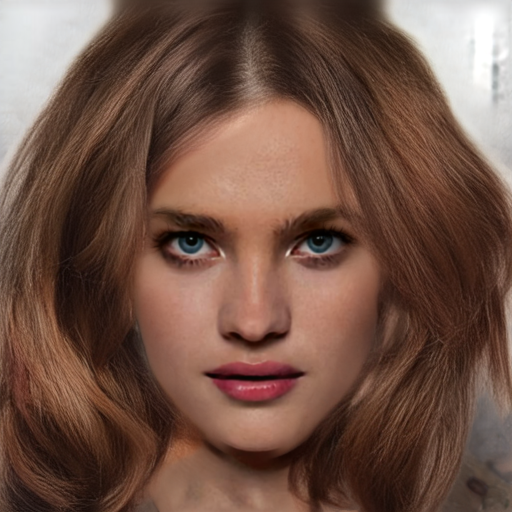 | 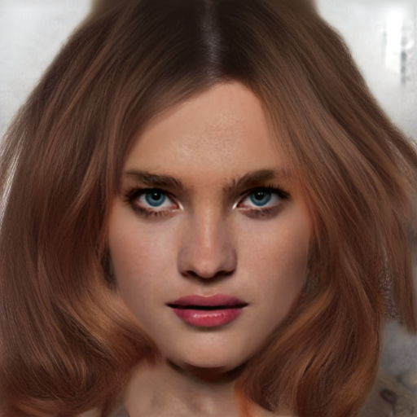 |  |
| L2_mid | 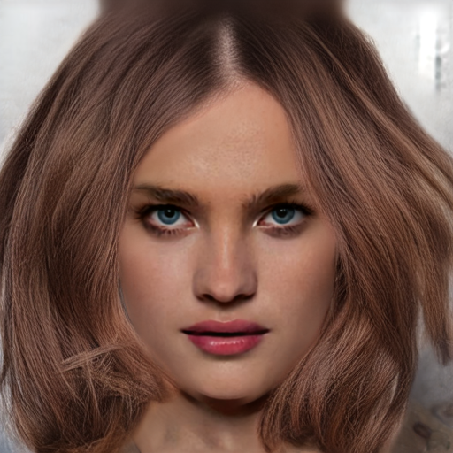 |  |  |  |
| L3_strong | 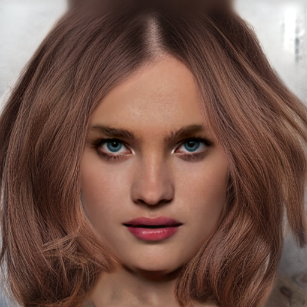 | 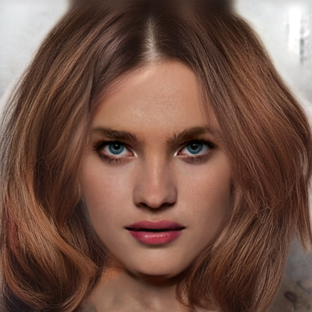 |  | 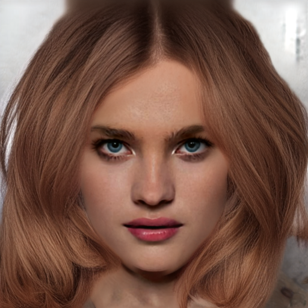 |
| (참조) mcs2 |  |  | 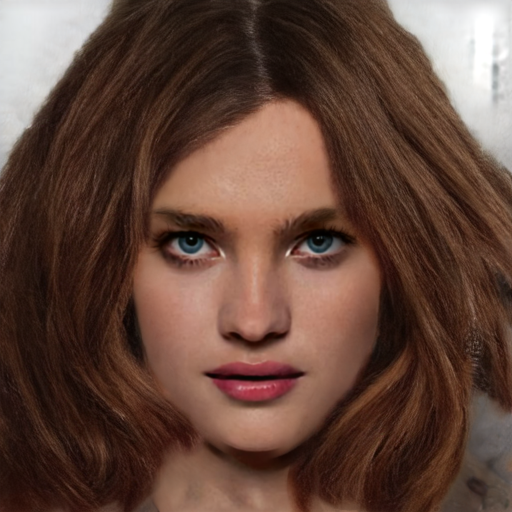 |  |

### 2.3 생성 결과 — CM_1082 (조건 × seed)

| run | seed42 | seed1 | seed2 | seed3 |
|---|---|---|---|---|
| baseline (원본) |  | 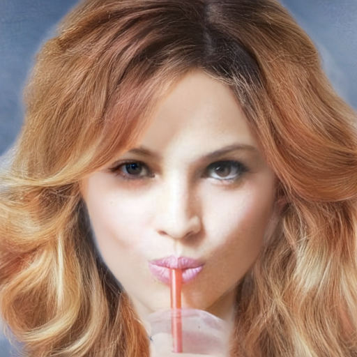 | 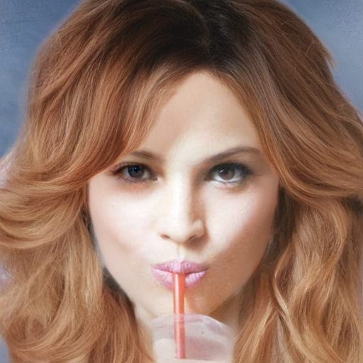 |  |
| L1_mild | 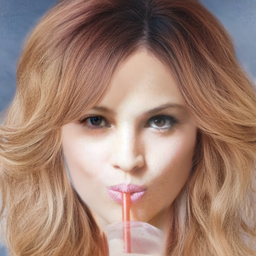 | 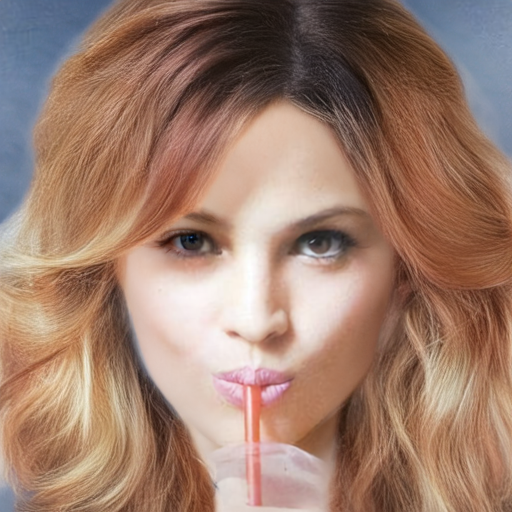 | 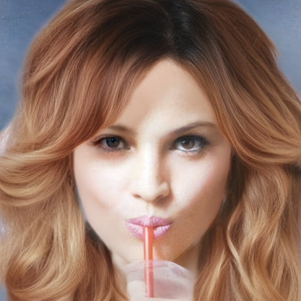 | 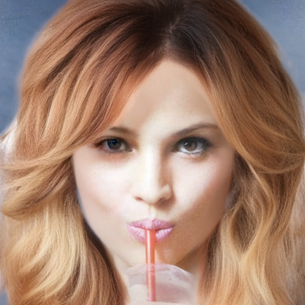 |
| L2_mid | 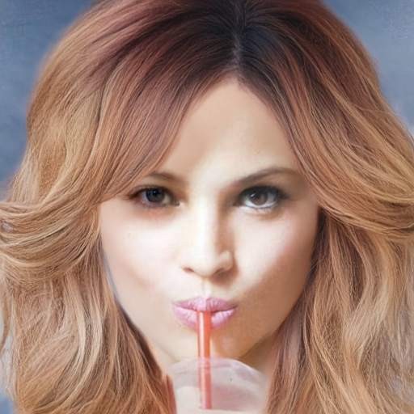 | 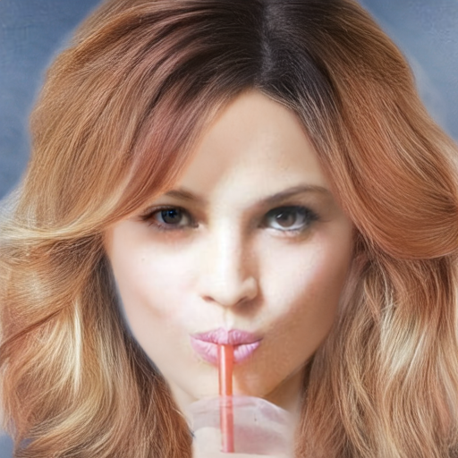 | 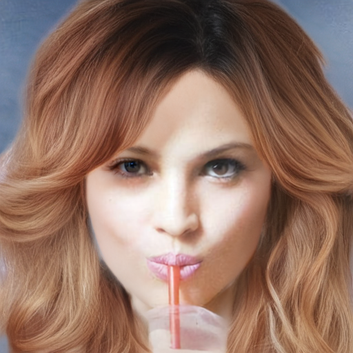 | 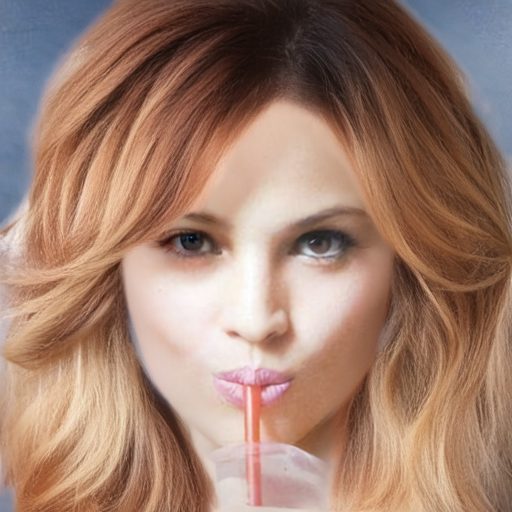 |
| L3_strong | 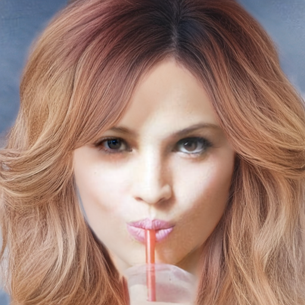 | 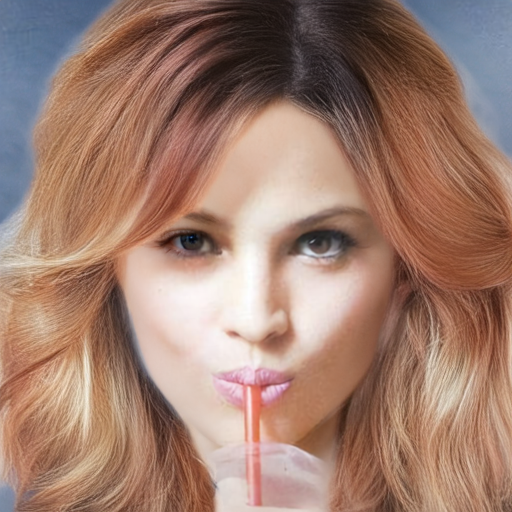 | 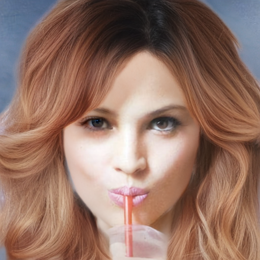 | 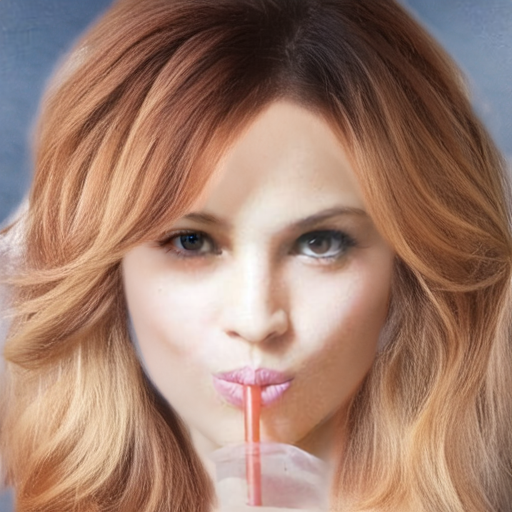 |
| (참조) mcs2 |  |  |  |  |

---

## 3. 판정 — 방향 지표

방향 지표는 기존에 캘리브레이션된 파라미터(`sigma_i=3`, `erode_px=6`, GT=`data/test/ori_image`)
를 그대로 재사용했다.

### 3.1 CM_1067

| run | seed42 | seed1 | seed2 | seed3 | GT 오차 mean±std | coherence | **seed 불일치** |
|---|---|---|---|---|---|---|---|
| baseline (원본) | 16.56 | 16.51 | 17.17 | 16.16 | 16.60±0.42 | 0.751 | **14.41±0.41** |
| L1_mild (K=25) | 15.04 | 15.53 | 16.15 | 15.77 | 15.62±0.46 | 0.787 | **11.36±0.53** |
| L2_mid (K=15) | 15.27 | 15.39 | 16.13 | 15.05 | 15.46±0.47 | 0.808 | **10.62±0.34** |
| L3_strong (K=11) | 15.30 | 15.27 | 16.19 | 14.92 | 15.42±0.54 | 0.809 | **10.75±0.37** |
| (참조) mcs2 원본 | 15.93 | 15.64 | 16.13 | 15.24 | 15.73±0.38 | 0.748 | **10.12±0.17** |

### 3.2 CM_1082

| run | seed42 | seed1 | seed2 | seed3 | GT 오차 mean±std | coherence | **seed 불일치** |
|---|---|---|---|---|---|---|---|
| baseline (원본) | 16.12 | 16.64 | 17.70 | 16.59 | 16.76±0.67 | 0.758 | **14.34±0.58** |
| L1_mild (K=25) | 14.86 | 15.72 | 16.36 | 15.84 | 15.69±0.62 | 0.790 | **12.60±0.43** |
| L2_mid (K=15) | 14.78 | 14.89 | 15.94 | 15.60 | 15.30±0.56 | 0.807 | **11.39±0.39** |
| L3_strong (K=11) | 14.83 | 14.94 | 16.23 | 15.83 | 15.46±0.68 | 0.806 | **11.31±0.43** |
| (참조) mcs2 원본 | 14.51 | 14.88 | 15.20 | 15.21 | 14.95±0.33 | 0.796 | **9.72±0.43** |

### 3.3 방향 시각화 (방향=색상/coherence=채도)

CM_1067은 seed42, CM_1082는 seed1 — 표(§3.1·3.2)에서 조건 간 수치 차이가 가장 크게 벌어지는
seed로 각각 골랐다.

 

각 패널 상단부터 GT / baseline / L1_mild / L2_mid / L3_strong / mcs2.   CM_1067은 baseline에 하단 우측 얼룩(자홍색 반점)이 두드러지고 L1~L3로 갈수록 그 얼룩이 옅어지며 파랑-초록 띠가 매끈해진다 — coherence 수치 상승(0.751→0.809)과 일치, 하지만, 하단 좌측 하단 노이즈는 사라지지 않음
CM_1082(seed1)는 baseline에서 왼쪽 hair 전반이 자홍색-청록색이 섞여 얼룩덜룩한 반면 L1~L3로
갈수록 그 잡티가 줄고 왼쪽 대각선의 자홍색 띠(GT에도 있는 실제 결)가 더 선명하고 하나로
이어진다 — seed42보다 조건 간 차이가 육안으로 뚜렷하다.

---

## 4. 독립 분석 — 가이드 §5 판정 기준 대입

가이드 §5 판정표: "std 감소 + mean 감소 → 진단 확증", "K에 따른 단조 추세 → 가장 강한 증거".
표를 그대로 읽지 않고 세 가지 지표를 따로 뜯어봄.

1. **GT 오차 mean**: 두 이미지 모두 baseline(16.60/16.76) > L1(15.62/15.69) > L2(15.46/15.30)
   ≈ L3(15.42/15.46) — densification 조건 전부가 baseline보다 낮다. **mean 증가(OOD 신호) 없음.**
2. **GT 오차 std**(표의 "±" 값): baseline(0.42/0.67) 대비 L1~L3(0.46~0.54 / 0.56~0.68)가
   뚜렷이 줄지 않고 오히려 CM_1067은 소폭 늘었다. `orientation-metric-implementation-guide.md`
   §5.3에서 이미 지적된 대로 **이 std는 감도가 낮은 지표**다(두 seed가 반대 방향으로 틀려도
   크기 변동만 봐서 같은 값이 나옴) — 그래서 만든 것이 아래 3번.
3. **seed 불일치**(seed 쌍끼리 직접 각도차): baseline 14.41/14.34 → L1 11.36/12.60 →
   L2 10.62/11.39 → L3 10.75/11.31로 **densification 즉시 21~26% 감소**하고 이후 L1→L2→L3
   구간은 변화가 작다(오차범위 ±0.3~0.5 안에 거의 겹침). mcs2 참조(10.12/9.72)에 CM_1067은
   근접(gap 0.5), CM_1082는 여전히 격차(gap ~1.6)가 남는다.

**종합**: "mean 감소 + (민감한 지표인) seed 불일치 감소"로 가이드의 진단 확증 조건을 충족한다.
다만 기대했던 "K에 따른 깨끗한 단조 dose-response"는 아니고, **약한 densification(L1)만으로
개선분 대부분을 얻고 그 이상은 포화**되는 threshold 형태다 — stroke 밀도가 일정 수준만
넘으면 prior 의존 영역이 이미 충분히 좁아지는 것으로 보인다.

---

## 5. 이미지별 온도차

CM_1067은 densification 효과가 뚜렷(불일치 14.41→10.62, coherence 0.751→0.809, 육안으로도
확인됨)한 반면 CM_1082는 개선폭이 작고(14.34→11.31) 육안 시각화로는 조건 간 차이가 잘 안
보인다. 표본이 이미지 2장뿐이라 이 차이가 이미지 고유 특성(머리 길이·웨이브 정도) 때문인지
우연인지 지금 데이터로는 판단할 근거가 부족하다.

---

## 6. 한계 (가이드 §6 재확인)

| # | 한계 | 이번 결과에서 관찰된 내용 |
|---|---|---|
| 1 | OOD | run4는 이번 실측 밀도(0.069~0.074)보다 낮은 분포로 학습됐다는 전제는 여전히 유효하나, L3까지도 GT 오차 mean이 늘지 않아 이번 실험에서 OOD로 인한 화질 저하 신호는 관측되지 않음 |
| 2 | braid 미적용 | 이번 검증도 unbraid만 대상(CM_1067, CM_1082 모두 unbraid) — braid 미검증은 그대로 |
| 3 | 학습 데이터 적용은 별건 | 이번은 추론 전용. densified sketch로 재학습했을 때도 동일 효과가 재현되는지는 별도 검증 필요 |
| 4 (신규) | 표본 크기 | 이미지 2장 × seed 4개 그대로 — CM_1067/CM_1082 온도차(§5)를 볼 때 이미지를 더 늘리지 않으면 "일반적으로 densification이 효과 있다"고 말하기엔 근거가 약함 |

---

## 7. 다음 단계 — 결정 필요

가이드 §5 판정표대로면 "진단 확증 → densified sketch로 재학습 진행(8/6~7)"이 다음 수순이다.
다만:

- 재학습 시 L1(약한 densification)로 갈지 L2/L3 정도의 밀도로 갈지 — §4의 포화 양상을 보면
  L1 이상은 추가 이득이 크지 않아 보이지만, 표본이 2장뿐이라 이 근거만으로 강도를 확정하기는
  이르다.
- 표본이 이미지 2장뿐이라 재학습 들어가기 전에 표본을 늘려 재현성을 한 번 더 볼지, 아니면
  바로 8/6~7 재학습에 들어갈지는 일정(8/8 게이트)과 맞물린 선택이다.

이 두 가지는 제가 임의로 정하지 않고 다음에 여쭤보고 진행하겠습니다.
