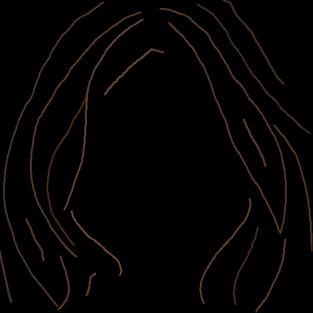
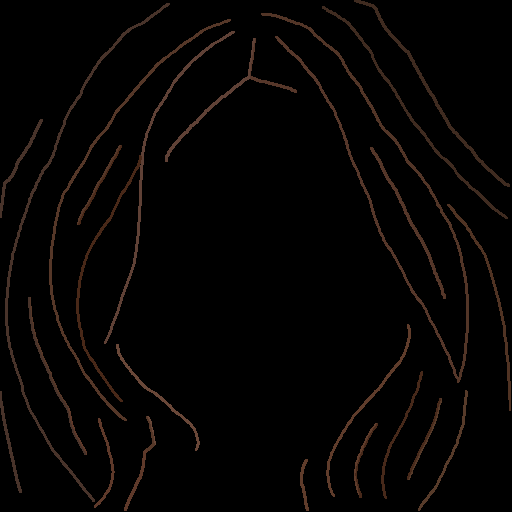
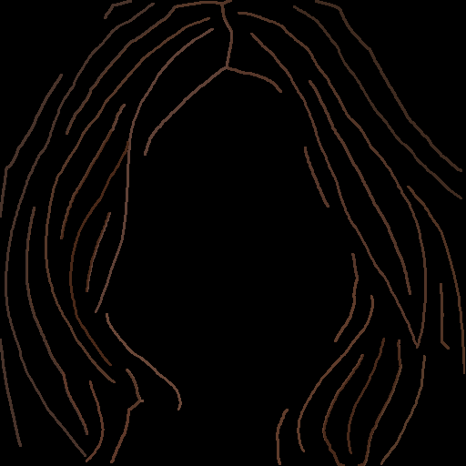
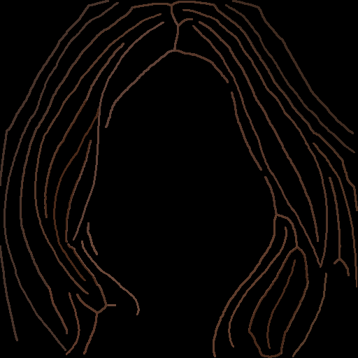
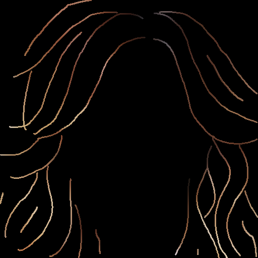
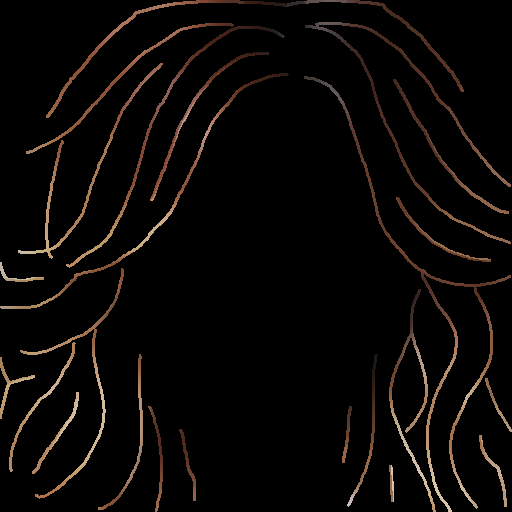
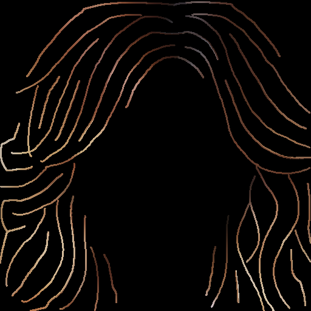
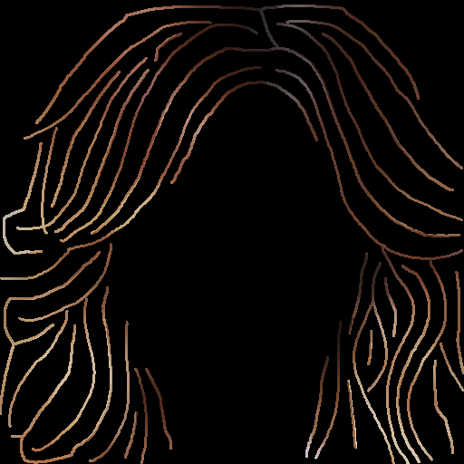

# [2026-08-04] Stroke Densification 추론 검증 결과 — SHS 공식 코드 반영판 (옵션 A′)

**대상**: JSH (장서현) — HairDiT 축 ②
**성격**: 실행 결과 기록. 재학습 없음 / GPU는 추론에만 사용
**선행**: `[0804]densified_sketch.md` (1차, 자체 구현 K=25/15/11), `20260804shssourcediffparametercorrection.md` (PI 코드 정정 지시)

---

## 0. 결론 먼저

> **"stroke 밀도를 올리면 방향의 seed 종속성이 줄어드는가?" → 예, 그리고 밀도에 거의 선형적으로 비례해서.**

run4(0730 체크포인트, phase1 epoch30)에 densified sketch만 입력해 재학습 없이 추론한 결과,
**seed 간 방향 불일치가 baseline 대비 최대 22~27% 감소**했고 GT 방향 오차도 함께 감소. 처음
자체 구현(K=25/15/11) 3점만으로는 "약한 densification에서 이미 개선분 대부분을 얻고 포화"되는
것처럼 보였으나, PI 지적(§1.3)으로 SHS가 공개한 공식 auto-completion 코드로 교체하고 threshold를
6~27까지 8단계로 촘촘히 sweep한 결과 **baseline부터 밀도 0.14 부근까지 거의 매끈한 단조 감소
곡선**이 확인됨 — 이전의 "포화" 판정은 표본이 3점뿐이었던 데서 온 착시였음. 우리 자체 구현
(L1/L2/L3)과 SHS 공식 코드(threshold sweep) 점들이 밀도축에서 서로 끼어들며 같은 곡선 위에
놓여, **구현 방식 차이가 결과에 미치는 영향은 무해함**도 함께 확인됨. 다만 mcs2 수준(seed
완전 강건)에는 아직 미달.

---

## 1. 전처리

### 1.1 자체 구현(1차) — 밀도 실측

가이드 코드 그대로 CM_1067·CM_1082 에 K=25/15/11(L1/L2/L3) 적용.

| level | K | CM_1067 density | CM_1082 density |
|---|---|---|---|
| 원본 | - | 0.0689 | 0.0737 |
| L1_mild | 25 | 0.1194 | 0.1270 |
| L2_mid | 15 | 0.1638 | 0.1613 |
| L3_strong | 11 | 0.1719 | 0.1720 |

원본 밀도가 가이드가 가정한 0.03~0.05 보다 높게(0.069~0.074) 나옴 — 이 데이터셋 sketch가
가이드 작성 시 참고한 수치보다 원래 조금 더 촘촘한 것으로 보임. K에 따라 단조 증가하는
경향 자체는 가이드 기대와 일치.

### 1.2 §3 시각화 검증 체크리스트
- **평행성(#1), 색 전파(#4)**: 통과. 추가(초록) stroke가 주변 원본과 평행하고 색도 자연스럽게
  이어짐.
- **matte 경계 유착(#2)**: 바깥쪽 실루엣을 따라 얇게 흐르는 stroke 발견. `matte_erode`를
  8→12로 올려도 사라지지 않아 원인을 조사한 결과, **원본 sketch의 가장 바깥쪽 stroke 자체가
  실루엣보다 40~60px 안쪽에 그려져 있어** 그 사이 전체가 실루엣과 나란한 폭넓은 진짜 간극임을
  확인. 경계 유착 버그가 아니라 SHS 알고리즘이 "stroke 없는 넓은 영역을 채운다"는 설계대로
  동작한 것으로 판단. `boundary_exclude` 파라미터(간극 후보에서 실루엣 인접 띠를 추가로
  제외)를 구현해 15/25/35px로 테스트했으나 유착선이 안쪽으로 이동만 하고 사라지지 않았고
  밀도만 감소해, **기본값(`boundary_exclude=0`) 유지**로 결정.
- **잔가지(#3)**: CM_1082 densified 결과에 20×30px 정도의 작은 loop 흠집 1개 발견.
  `prune_iter`는 끝점 기반 가지치기라 닫힌 loop 는 못 없앰(3→5로 올려도 잔존). 전체 hair
  영역의 1% 미만인 국소 결함이라 **무시하고 진행** — 방향 지표는 coherence 가중 + matte 6px
  침식을 쓰므로 이 정도 크기의 국소 결함이 측정치를 흔들 가능성은 낮다고 판단.

### 1.3 PI 피드백 반영 — SHS 공식 코드로 교체

**배경**: 위 §1.1/1.2의 자체 구현은 SHS 논문 §5.3 서술만 보고 재구현한 것이라, 실제 SHS가
공개한 `autocompletion/unbraid_completion.py`와 파라미터 의미가 다름(`20260804shssource
diffparametercorrection.md`). 우리 `K`(dilation, L∞ 반경)와 SHS의 `threshold`(EDT, L2 거리)는
같은 숫자라도 강도가 다르고, 최초 분석은 "SHS 기본값(threshold=15)이 우리 L1(K=25)보다도
약할 것"으로 예측.

**교체 원칙(PI 지시)**: SHS가 공개한 `getSketchCompletion()`을 그대로 쓰고, 하드코딩된
`threshold = 15` 한 줄만 함수 인자로 빼는 것 외에는 절대 수정하지 않음(`unbraid_completion.py`).
SHS 코드는 이진 마스크만 반환하므로(색 없음), 우리 sketch의 색이 헤어 색을 인코딩하는 부분에
한해 기존 색 전파(`_propagate_color`) + blend(원본 우선)만 추가.

**첫 sweep(threshold=15/12/9/6)에서 발견한 것**: PI 예측과 달리 SHS 기본값(threshold=15)의
밀도(0.1224/0.1289)가 우리 L1(0.1194/0.1270)과 거의 같음 — 오히려 살짝 높음. 원인을 ablation으로
진단(threshold=15 고정, CM_1067, `small_cc`만 변경):

| small_cc | 의미 | new_density |
|---|---|---|
| 240 | SHS 코드 그대로(고정값) | 0.1224 |
| 675 | 우리 L2(K=15)의 `3·K²` 상당 | 0.1173 |
| 1875 | 우리 L1(K=25)의 `3·K²` 상당 | 0.1067 |

→ 버그가 아니라, SHS의 `small_cc=240`(고정)이 우리 `3K²` 기준(K=25에서 1875)보다 7.8배
관대해 작은 조각을 더 많이 살려주는 효과가 "L2 거리 임계가 우리보다 약하다"는 효과를 상쇄한
것 — PI가 정정 리포트 §2-2에서 이미 예견한 "두 효과가 상쇄하므로 계산이 아니라 측정해야
한다"가 실측으로 확인됨. `small_cc`는 지시대로 SHS 값(240) 그대로 유지.

**sweep 확장**: L1보다 뚜렷이 약한 지점을 확보하기 위해 threshold를 18/21/24/27까지 넓힘
(threshold가 클수록 gap 조건이 엄격해져 밀도가 낮아지는 방향). `small_cc`·`matte>230`·
`skeletonize(method='lee')` 등 SHS 코드 내부는 전혀 건드리지 않고 threshold 값만 바꿈.

| threshold | CM_1067 밀도 | CM_1082 밀도 |
|---|---|---|
| 27 | 0.0804 | 0.0834 |
| 24 | 0.0888 | 0.0924 |
| 21 | 0.0976 | 0.1023 |
| 18 | 0.1099 | 0.1181 |
| **15(SHS 기본)** | 0.1224 | 0.1289 |
| 12 | 0.1400 | 0.1425 |
| 9 | 0.1547 | 0.1528 |
| 6 | 0.1621 | 0.1625 |

(baseline을 SHS 코드의 matte 이진화 기준(`>230`)으로 재계산하면 0.0679/0.0728 — §1.1의
`matte>127` 기준 0.0689/0.0737과 약 1.5% 차이. matte 이진화 기준 차이에서 오는 것으로, 이후
§3 병합 표에서는 각 구현이 실제로 쓴 값을 그대로 표기함.)

§1.2와 동일한 체크리스트로 시각화 검증도 전 지점에서 통과 — 평행성·색 전파 정상, 실루엣
인접 얇은 stroke는 §1.2와 같은 이유(원본 stroke가 실루엣보다 안쪽에 위치)로 재확인.

---

## 2. 결과 이미지

기존 seed 실험과 동일 조건(체크포인트 run4 phase1 epoch30, 20-step)에서 sketch 입력만 교체. baseline·mcs2 참조는
기존 렌더 재사용.

### 2.1 입력 sketch — 원본 대비 densified (자체 구현)

| | 원본 | L1_mild (K=25) | L2_mid (K=15) | L3_strong (K=11) |
|---|---|---|---|---|
| CM_1067 |  |  |  |  |
| CM_1082 |  |  |  |  |

### 2.2 입력 sketch — SHS 공식 코드 threshold sweep (밀도순)

| | T27(.080/.083) | T21(.098/.102) | T15기본(.122/.129) | T9(.155/.153) |
|---|---|---|---|---|
| CM_1067 |  |  |  |  |
| CM_1082 |  |  |  |  |

### 2.3 생성 결과 — CM_1067 (자체 구현 조건 × seed)

seed42에서 여전히 좌측 하단 노이즈 발생, 우측 하단 노이즈는 완화

| run | seed42 | seed1 | seed2 | seed3 |
|---|---|---|---|---|
| baseline (원본) |  |  |  |  |
| L1_mild |  |  |  |  |
| L2_mid |  |  |  |  |
| L3_strong |  |  |  |  |
| (참조) mcs2 |  |  |  |  |

### 2.4 생성 결과 — CM_1082 (자체 구현 조건 × seed)

seed42, seed1 상단 머릿결 노이즈 완화

| run | seed42 | seed1 | seed2 | seed3 |
|---|---|---|---|---|
| baseline (원본) |  |  |  |  |
| L1_mild |  |  |  |  |
| L2_mid |  |  |  |  |
| L3_strong |  |  |  |  |
| (참조) mcs2 |  |  |  |  |

---

## 3. 판정 — 방향 지표 (자체 구현 + SHS 공식 코드 병합, 밀도순)

방향 지표는 기존에 캘리브레이션된 파라미터(`sigma_i=3`, `erode_px=6`, GT=`data/test/ori_image`)를 그대로 재사용.
아래 표는 §1.1의 K 기반 조건과 §1.3의 SHS threshold 기반 조건을 밀도 오름차순으로 병합한 것.

### 3.1 CM_1067

| run (밀도) | seed42 | seed1 | seed2 | seed3 | GT 오차 mean±std | coherence | **seed 불일치** |
|---|---|---|---|---|---|---|---|
| baseline (.068) | 16.56 | 16.51 | 17.17 | 16.16 | 16.60±0.42 | 0.751 | **14.41±0.41** |
| SHS_T27 (.080) | 15.68 | 16.04 | 16.87 | 15.93 | 16.13±0.51 | 0.761 | **13.27±0.46** |
| SHS_T24 (.089) | 15.49 | 15.80 | 16.79 | 15.73 | 15.95±0.57 | 0.771 | **12.85±0.61** |
| SHS_T21 (.098) | 15.08 | 15.82 | 16.50 | 15.52 | 15.73±0.60 | 0.775 | **12.51±0.55** |
| SHS_T18 (.110) | 14.72 | 15.67 | 16.31 | 15.30 | 15.50±0.67 | 0.784 | **11.75±0.50** |
| L1_mild (.119) | 15.04 | 15.53 | 16.15 | 15.77 | 15.62±0.46 | 0.787 | **11.36±0.53** |
| SHS_T15기본 (.122) | 14.60 | 15.68 | 15.97 | 15.40 | 15.41±0.59 | 0.795 | **11.17±0.49** |
| SHS_T12 (.140) | 14.75 | 15.69 | 15.89 | 15.22 | 15.39±0.51 | 0.804 | **10.55±0.40** |
| L2_mid (.164) | 15.27 | 15.39 | 16.13 | 15.05 | 15.46±0.47 | 0.808 | **10.62±0.34** |
| SHS_T9 (.155) | 14.94 | 15.66 | 16.09 | 15.03 | 15.43±0.54 | 0.805 | **10.55±0.37** |
| SHS_T6 (.162) | 15.32 | 15.47 | 16.07 | 15.14 | 15.50±0.40 | 0.801 | **11.01±0.29** |
| L3_strong (.172) | 15.30 | 15.27 | 16.19 | 14.92 | 15.42±0.54 | 0.809 | **10.75±0.37** |
| (참조) mcs2 | 15.93 | 15.64 | 16.13 | 15.24 | 15.73±0.38 | 0.748 | **10.12±0.17** |

### 3.2 CM_1082

| run (밀도) | seed42 | seed1 | seed2 | seed3 | GT 오차 mean±std | coherence | **seed 불일치** |
|---|---|---|---|---|---|---|---|
| baseline (.073) | 16.12 | 16.64 | 17.70 | 16.59 | 16.76±0.67 | 0.758 | **14.34±0.58** |
| SHS_T27 (.083) | 15.60 | 16.20 | 17.14 | 16.26 | 16.30±0.63 | 0.770 | **13.61±0.49** |
| SHS_T24 (.092) | 15.34 | 16.02 | 16.96 | 16.11 | 16.11±0.66 | 0.772 | **13.35±0.39** |
| SHS_T21 (.102) | 15.07 | 15.74 | 16.72 | 15.79 | 15.83±0.68 | 0.776 | **12.94±0.34** |
| SHS_T18 (.118) | 14.92 | 15.39 | 16.32 | 15.78 | 15.60±0.59 | 0.786 | **12.49±0.47** |
| L1_mild (.127) | 14.86 | 15.72 | 16.36 | 15.84 | 15.69±0.62 | 0.790 | **12.60±0.43** |
| SHS_T15기본 (.129) | 14.61 | 15.33 | 16.20 | 15.65 | 15.44±0.66 | 0.797 | **11.98±0.48** |
| SHS_T12 (.142) | 14.48 | 15.01 | 15.98 | 15.37 | 15.21±0.63 | 0.806 | **11.47±0.49** |
| L2_mid (.161) | 14.78 | 14.89 | 15.94 | 15.60 | 15.30±0.56 | 0.807 | **11.39±0.39** |
| SHS_T9 (.153) | 14.46 | 14.98 | 16.04 | 15.40 | 15.22±0.66 | 0.810 | **11.16±0.45** |
| SHS_T6 (.163) | 14.53 | 15.00 | 16.21 | 15.44 | 15.30±0.72 | 0.805 | **11.17±0.47** |
| L3_strong (.172) | 14.83 | 14.94 | 16.23 | 15.83 | 15.46±0.68 | 0.806 | **11.31±0.43** |
| (참조) mcs2 | 14.51 | 14.88 | 15.20 | 15.21 | 14.95±0.33 | 0.796 | **9.72±0.43** |

### 3.3 독립 분석

가이드 §5 판정표: "std 감소 + mean 감소 → 진단 확증", "K(밀도)에 따른 단조 추세 → 가장 강한 증거".

1. **GT 오차 mean**: 두 이미지 모두 densification 조건 전부가 baseline보다 낮음. **mean 증가
   (OOD 신호) 없음.**
2. **GT 오차 std**(표의 "±" 값): 조건 간 큰 추세 없이 0.4~0.7 사이에서 흔들림 — 이전에 이미
   확인한 대로 이 std는 감도가 낮은 지표라 아래 3번을 판정에 사용.
3. **seed 불일치**: 위 §3.1·3.2 표에서 baseline → SHS_T27 → T24 → T21 → T18 → L1 → SHS_T15
   → SHS_T12 구간이 **두 이미지 모두 거의 완벽하게 단조 감소**(잡음 ±0.1~0.3 수준). 밀도
   0.14 부근(SHS_T12/L2) 이후부터 10.5~11.3 사이에서 완만하게 등락 — 진짜 포화 지점은
   여기부터.

**종합**: 처음엔 L1/L2/L3 3점만 봐서 "약한 densification만으로 개선분 대부분을 얻고 포화"되는
것처럼 보였으나, §1.3에서 SHS 공식 코드로 8단계 sweep을 추가해 병합한 결과 baseline~밀도 0.14
구간에서 거의 완벽한 단조 dose-response가 나타남 — **이전의 "포화" 판정은 표본 부족 때문이었고,
밀도가 늘수록 seed 불일치가 계속 줄어드는 것이 맞음.** 또한 자체 구현(K계열)과 SHS 공식 코드
(threshold계열) 점들이 밀도축에서 서로 끼어들며 같은 곡선 위에 놓여, **구현 방식 차이가
결과를 오염시키지 않았음**도 함께 확인됨.

### 3.4 방향 시각화 (방향=색상/coherence=채도)

CM_1067은 seed42, CM_1082는 seed1 — 표(§3.1·3.2)에서 조건 간 수치 차이가 가장 크게 벌어지는
seed로 각각 선택. (자체 구현 L1/L2/L3 + mcs2 참조 대상, §1.3 SHS 계열 추가 전 생성)

 

각 패널 상단부터 GT / baseline / L1_mild / L2_mid / L3_strong / mcs2. CM_1067은 baseline에
하단 우측 얼룩(자홍색 반점)이 두드러지고 L1~L3로 갈수록 그 얼룩이 옅어지며 파랑-초록 띠가
매끈해짐 — coherence 수치 상승(0.751→0.809)과 일치, 하지만 하단 좌측 노이즈는 사라지지 않음.
CM_1082(seed1)는 baseline에서 왼쪽 hair 전반이 자홍색-청록색이 섞여 얼룩덜룩한 반면 L1~L3로
갈수록 그 잡티가 줄고 왼쪽 대각선의 자홍색 띠(GT에도 있는 실제 결)가 더 선명하고 하나로
이어짐 — seed42보다 조건 간 차이가 육안으로 뚜렷함.

---

## 4. 이미지별 온도차

전체 sweep(자체 구현 3점 + SHS 공식 8점) 기준 최고 개선치: CM_1067은 baseline 14.41 → 최저
10.55(SHS_T12/T9 동률), **26.8% 감소**. CM_1082는 baseline 14.34 → 최저 11.16(SHS_T9),
**22.2% 감소**. CM_1067이 여전히 더 크게 개선되지만, 표본을 3점에서 11점(자체+SHS)으로
촘촘히 하자 CM_1082도 이전 최선(L3, 11.31)보다 더 낮은 지점(11.16)을 찾아내 격차가 다소
좁혀짐. mcs2 참조와의 잔여 격차는 CM_1067 0.43(10.55→10.12)로 거의 붙은 반면, CM_1082는
1.44(11.16→9.72)로 여전히 남아 있음 — 표본이 이미지 2장뿐이라 이 잔여 격차가 이미지 고유
특성(머리 길이·웨이브 정도) 때문인지 우연인지는 지금 데이터로 단정 불가.

---
